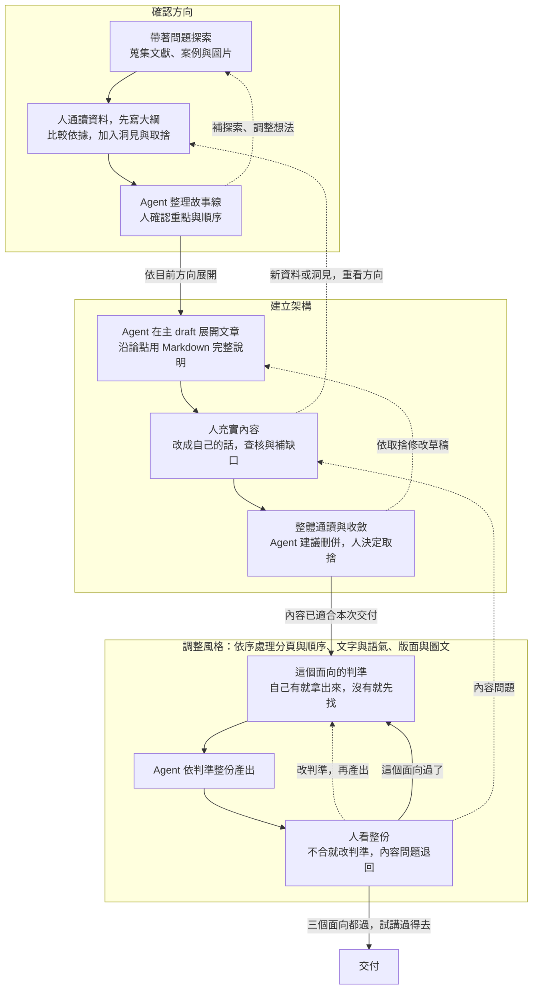

# Agent 時代的知識工作 — 第二週教案：先體驗 agent

## 本週目的與安排

本週核心是讓 agent 把你的想法做成成果。前半段講 agent 能協助什麼、如何合作，再用這份投影片本身的製作過程說明內容怎麼走過確認方向、建立架構、調整風格三個迴圈，以及判斷在哪裡發生；示範段由講師以「向新進同仁介紹 GDMS」走完整條線；練習段學員自選題目，走同一套八步，做出一份 10 到 12 頁、可編輯、每一頁都答得出為什麼的簡報。

| 段落 | 時間 | 安排 |
|---|---|---|
| 前半段 | 30 分 | 研究專案情境 → 能力互補與四種協助 → 請教與交辦 → 三個迴圈與三種產出 → 保存過程 → 這份投影片怎麼做出來的 |
| 示範 | 30 分 | 題目「向新進同仁介紹 GDMS」。開頭先讓 agent 憑一句話做第一版，再走八步，只展開一條論點，收尾兩版並排 |
| 練習 | 120 分 | 學員自選題目，預設題同示範題；開頭先讓 agent 做第一版，走八步，自由發揮、不收成品，最後與第一版並排回看 |

三段用同一個動作：先看 agent 憑一句話做出什麼，再看加入判斷之後變成什麼。成品為 10 到 12 頁可編輯 PPTX。搜尋材料在 `kb/`，採用內容與棄案分別保存於主 draft 和棄案 draft。不以視覺華麗程度評分，不要求 GitHub push 或課後作業。

## 前半段：agent 能幫什麼（30 分）

### 開場：與 agent 一起推進一個研究專案（3 分）

假設你正在做一個研究專案。手上有幾篇論文、一批資料和之前試過的方法，也有一些尚未想清楚的問題。你一邊讀材料、做分析，一邊調整想法；過程中還需要整理資料、製作小工具，或向同事說明目前的發現。

Agent 可以參與這些工作。把目前的材料、想法與問題放進專案，讓它依需要協助查找、整理、試作或檢查；討論後採用哪些建議、發現什麼問題，也一起保存，下次從這裡接著做。要讓 agent 幫上忙，先得知道目前卡在哪裡、希望它協助哪一段。

### 一、AI 如何配合自己的能力與需要（7 分）

同樣在做研究，有人熟悉分析方法但不熟工具，有人能很快做出程式，卻不清楚結果該怎麼解讀。可以用「領域知識 × 駕馭 agent 的能力」理解 AI 放大器，乘號是兩種能力配合的比喻。


圖片：Julo，[Wikimedia Commons](https://commons.wikimedia.org/wiki/File:Lupa.na.encyklopedii.jpg)，公有領域，未修改。

- **領域知識：理解方法與結果的因果關係。** 知道一件事為什麼做得成，才看得出目前缺什麼、該調整哪個環節，再把材料、方法與預期結果向 agent 說清楚。
- **駕馭 agent 的能力：熟悉模型與工具。** 知道不同模型擅長什麼、有哪些功能與限制，例如何時分工給 sub-agent，才能選擇合適的做法。

例如想做資料展示，知道要回答什麼問題、需要哪些資料、怎樣呈現才不會誤導，是領域判斷；知道可以請 agent 做互動網頁、如何試用與回報問題，是工具熟悉度。卡的是哪一邊，就決定需要哪種協助：

- **缺知識與方向：** 請 agent 解釋、提供關鍵字與做法，再查閱或試做。
- **有想法，但不熟悉工具操作：** 描述想法、請 agent 實作，再試用與修改。
- **簡單、重複的雜工：** 把規則與完成條件說清楚，交給 agent 處理後檢查。
- **需要協助檢查：** 請它找遺漏與盲點，再依材料和工作目的決定是否修改。

同一件工作可能需要幾種協助。選定之後，下一步是把需要向 agent 說清楚。

### 二、請教與交辦，保留自己的判斷（5 分）

還不知道該用什麼方法，先請教；已經知道要做什麼，就把要求交代清楚，請它動手。

**請教時，像在和不同領域的導師討論。** 帶著自己的專業、經驗與問題，說目前怎麼想、為什麼，再從它的觀點繼續追問。例如：「我要向新進同仁介紹 GDMS，他們最先需要知道什麼？」建議要經資料或實作確認，自己的觀察與取捨也要加入。

**交辦時，把方向與重要限制講清楚。** 說明給誰用、做成什麼、範圍在哪，以及長度、格式或必須保留的內容。例如：「把確認的內容做成十頁左右可編輯的 PowerPoint，16:9，先試做一頁。」區分必要條件與偏好，具體做法讓 agent 提出。

請教與交辦可以來回切換：討論後有了方向就試做，成果出現新問題再回頭討論。採用什麼、如何修改，仍由自己決定。最省事的交辦是只給一句話、不給材料、不請教，示範開頭就會先這樣做一次。

### 三、確認方向、建立架構、調整風格：三個迴圈（4 分）

內容不是一次寫成的，會走三個迴圈：先確認方向，再建立架構，最後調整風格。第三圈不是一次繞完，成品有幾個表達面向就繞幾次：先分頁與順序，再文字與語氣，最後版面與圖文。每個面向的做法相同：拿出或先找這個面向的判準，讓 agent 依判準整份產出，人看整份再改判準。順序由便宜到貴：分頁與語氣都還在 Markdown 上改，版面已經是成品。



讀圖時抓四件事：

- **人先通讀、自己列綱。** 加入自己的洞見與取捨，再讓 agent 沿方向整理；真的卡住，可請它試串後逐段確認理由。
- **新材料可以改變方向。** 回到受影響的論點或段落修正，不必整圈重做。
- **接近交付時逐步收斂。** 先處理正確性與理解問題，延伸想法留下一版；內容盡量在 Markdown 修定後再排版。
- **第三圈每個面向的入口都是判準。** 自己沒有判斷力的面向，先請 agent 整理別人的做法，自己挑出要用的，寫成判準再產出；有判斷力的面向直接拿出自己的規則檔。判準用過確定有效就補進 `AGENTS.md`，下次這一格就變短。看整份成品時發現的多半是內容問題，退回第二圈改，不在成品上修。

這門課三個面向各找過一次判準，都留在 repo 裡：分頁與順序，是 Alley 的主張句標題、Duarte 的一頁一重點、顧問業的 ghost deck，幾種分法各有一套，本課選了綜合的一種，見[原則筆記](../kb/tools/slide-design-principles-argument-to-slides.md)；文字與語氣，是盡量用自己說過的原話，加上[文案語氣規則](../skills/chinese-copy-style.md)，很多人詬病的 AI 語氣就是這個面向沒有判準，維基百科的 [AI 寫作特徵清單](https://en.wikipedia.org/wiki/Wikipedia:Signs_of_AI_writing)與兩家廠商自己的寫作指引可以當對照，見[廠商語氣指引筆記](../kb/tools/vendor-writing-style-guidance.md)；版面與圖文，是[視覺設計規則](07-visual-design-rules.md)。

第三圈管的是成品像不像自己的。三個迴圈和軟體開發的需求探索、建立架構、寫程式是同一個結構，做過第一門課的人可以對照。

投影片分四頁：先一頁全圖，只看得出三塊與兩條回頭箭頭；再各圈一頁放大，其他兩圈淡化，標題各用一句主張；第三圈那頁標出三個面向的順序。全圖在第五節開頭再出現一次，三段歷程各對一圈。

走完會留下三樣東西：`kb/` 保存搜尋到的材料與來源，判準也在這裡起草；`drafts/` 保存採用的論點、文章與分頁草稿，棄案另放一份並記理由；PPT 是對外表達的成品。三者都找得到，這份簡報才接得下去。

### 四、保存過程，才能接著做（1 分）

討論到值得留下的內容，就請 agent 整理成 Markdown，自己打開確認；下次指定讀取，再接著做。保留資料、想法、建議、取捨及未定事項，也保存來源與圖片，讓結論能回到依據。接下來用你們正在看的這份投影片，看這張圖與這三類檔案實際走過一遍是什麼樣子。

### 五、這份投影片是怎麼做出來的（10 分）

這份投影片就是照第三節那張圖做的。三段各對應一圈，每段的判斷都留有紀錄。

**第一段是確認方向：方向改了三次，材料進來才定下來。** 9 月 2 日這週的主題是「文件專案化與模型能力」，重點在說服訂閱；9 月 4 日改成「公部門用 AI 的阻礙與規範」；9 月 6 日才改成「先體驗 agent」。方向定了，材料進來又改細節：客服 AI 的研究找來了又移出，因為不好講；簡報形式的比較從實作題目退成起點，最後整段移出；臺大兩個教學案例退到延伸閱讀。連第三節那張迴圈圖，也是從「簡報內容逐漸成熟的流程」改了五次才定型。畫面放三個日期各一句方向，加移出材料的清單。

**第二段是建立架構：講稿在兩輪試跑之間來回修。** 後半段的操作步驟先請 agent 扮演學員從空資料夾走一遍，第一輪學員照字面操作，第二輪學員口語、繞路、會講錯。兩輪的卡點表回頭改講稿，例如「以備課試跑確認可用的路徑」這句兩輪都看不懂，改成「先做一頁，確認這台機器真的做得出來」。今天總時數定為 60 分，講稿才有尺可量，從三萬多位元組收到一半。畫面放卡點表的一角，或收斂前後的字數。

**第三段是調整風格：先讓 agent 排一版，然後看到一個錯修一個，六版沒有方向。** agent 照講稿一次排出 23 頁。第一眼覺得可以，細看每頁都有一句像口號的標題，沒有增加資訊。於是一次修一件：刪金句、精簡成書面文、一頁一個概念、內文要有呈現方式、實作頁要能跟著做。文案改了六版，每版解一個問題，每版又冒出新問題。畫面放第一版的一頁，加六版各修什麼的清單。

**然後換了方法：先讓 agent 找投影片的原則，再套用。** 查到的是 Alley 的主張加證據、Duarte 的三秒看懂、Mayer 的冗餘與一致原則、顧問業的只讀標題連成故事。五個來源指向同一件事：標題是一句主張，畫面是證據，解釋交給口述。把原則整理成一份筆記，先排出只有標題的 ghost deck，連讀通過，再一次建出現在這版。畫面放原則筆記的表格，加同一頁的改前改後。

投影片分五頁：總覽一頁放三圈全圖並標三段的日期；三圈各一頁，每頁一組改前改後；第三圈再多一頁，講先找原則之後又用原話重排 ghost deck，這頁同時示範第三圈的分頁面向與語氣面向，證據是一句生成的標題句對照講師自己的原句。

這段要講出一件事：一次修一個錯，是因為每次只有一個判斷；先找原則，判斷變成一組，一次套用。這就是第三圈的入口。通則是：同一類問題修了兩三次還在冒，就停下來，請 agent 找這件事的做法，寫成判準再做；用過確定有效就補進 `AGENTS.md`，下次不必再找。排版與圖示交給了 agent，主張與順序是自己排的。練習時會遇到同樣的事：題目會改方向，草稿會來回，分頁、語氣、排版三個面向各先拿出判準，是練習第五到七步。這三段留下的檔案，就是前兩節說的三樣東西：原則筆記在 `kb/`，文案與講稿在 `drafts/`，成品是這份 PPT。接下來直接看整條線怎麼走。

## 示範：講師以 GDMS 介紹走完整條線（30 分）

題目是「向新進同仁介紹 GDMS」，受眾是剛到署內、還沒用過這個系統的人。講師另開空專案，全程投影。學員不動手，但記兩件事：自己工作上會加哪個條件，以及看到哪一步最想先試。示範只展開一條論點，完整的介紹留給練習時選預設題的人自己做。八步與練習段相同。

| 分鐘 | 步驟 | 示範內容 |
|---|---|---|
| 0–2 | 開始前 | 一頁投影片：資料設定、repo 公開與否、PPTX 製作路徑、沒有預覽軟體時怎麼看畫面。同時把一句「幫我做一份向新進同仁介紹 GDMS 的簡報」貼給 agent，讓它在背景做第一版。 |
| 2–4 | 一、初始化 | 建 `AGENTS.md` 與 `kb/第一次討論.md`，打開看，再請 agent 讀取。 |
| 4–7 | 二、材料 | kb 裡的 GDMS 公開頁面筆記課前查好，現場請 agent 讀取，講師補一個受眾條件，例如新進同仁最常被問到什麼。明講搜尋這一步練習時自己做。 |
| 7–10 | 三、方向 | 講師先說這次想講的方向：新進同仁最先需要知道的是哪一件事、為什麼。agent 試串，改一處，棄一項並記理由。 |
| 10–14 | 四、文章與查證 | agent 展開一段；挑一句它對 GDMS 功能或數字的斷言，對照平台說明頁查證，前後版本並列。 |
| 14–16 | 五、分頁 | 展示課前找好的分頁原則，指出這次要用的幾條；排 ghost deck 連讀標題；再讓 agent 依模板配證據與口述。 |
| 16–18 | 六、語氣 | 拿出文案語氣規則，請 agent 逐頁改寫並標出沒有原話依據的句子；講師指出一句不像自己講話的，改掉。 |
| 18–25 | 七、排版 | 拿出視覺設計規則，交分頁文案，agent 整份產出並匯出 PDF；整份看，版面問題改規則重建，內容問題指出回文案改。做不完用預備版。 |
| 25–30 | 八、試講與回看 | 講師自己講第一頁 60 秒。把開頭那份一句話版和八步版並排，逐頁問哪一頁答得出為什麼；一句話版裡在座的人一眼看出不對的地方，就是判斷沒有進去的位置。補一條要求進 `AGENTS.md`。宣布練習規則。 |

各步的做法與例子與練習段相同，見下一節；示範時照做即可，不另寫一套。一句話版課前先跑一次存起來，現場那份做不完就用課前的。

## 練習：題目自選，走八步（120 分）

### 題目、成品與開始前

**題目。** 預設題是示範題「向新進同仁介紹 GDMS」，材料連結講師提供。自選題要符合三個條件：有明確的受眾與用途，例如給誰看、看完要做什麼決定；材料公開或可虛構，不碰署內非公開資料；兩小時內找得到依據。適合的類型例如向同仁介紹一個系統、工具或做法，比較某個業務流程的幾種改法，向不熟的同事說明一項研究或分析的進度。開始前先想清楚三件事：這件事是什麼？給誰看、看完要做什麼決定？目前卡在哪裡？講師請兩三位說出來，幫大家對照。

**成品。** 一份 10 到 12 頁、可編輯的 PPTX，每一頁對應 draft 裡的一段內容，被問到都答得出為什麼。

**開始前確認兩件事。** 所用 agent 工具的資料使用設定，例如對話是否用於訓練；練習專案若放上 GitHub，是公開還是私有。關閉訓練用途不代表資料不上雲，private repo 也在雲端。數發部手冊提醒避免將個人訊息與機密資料提供給公開或 API 串接的生成式 AI 服務，[第 81 頁，4.3.6](https://www-api.moda.gov.tw/File/Get/moda/zh-tw/WwHCroVhwWy52dw#page=81)。舊簡報也要檢查備註與附件，拿不準的材料改用講師範例。PPTX 製作路徑與預覽方式講師已在示範時告知，不必自己摸索。

**先讓 agent 做第一版。** 把題目一句話貼給 agent，請它直接做一份簡報，讓它在背景跑；另開一個視窗，繼續下面的八步。這一版最後回看時要用。

### 一、初始化專案與保存習慣

開空專案，說明題目、受眾與用途，先建立 `kb/` 保存找到的材料與討論。請 agent 把保存方式與位置寫入 `AGENTS.md`，打開兩個檔案確認；嫌長就請它刪到只留保存位置與共用要求。之後明確請它讀取 `AGENTS.md`，再接續下一節。

```text
練習專案/
├── AGENTS.md             保存方式與共用要求
└── kb/
    └── 第一次討論.md     題目、受眾、用途、想法與未定事項
```

檔名可調整，現場要看到實際寫入、打開與再次讀取。後續需要圖片時建 `assets/`，整理文章、棄案與分頁時建 `drafts/`，簡報成果放 `output/`，製作用的程式碼也留在專案裡。資料夾名稱本身不會讓 agent 自動使用內容。

### 二、聊背景與限制，探索材料

先說受眾與使用情境，再依回應補充需求，建立架構保存到筆記。一開始講不出條件是正常的：先請 agent 查資料，看過材料之後，工作上的條件會逐漸想起來，例如受眾最常問什麼、哪些步驟最容易出錯、要不要送審或列印。想到一項就補進筆記。

請 agent 找到的每一份材料都實際打開看，整理內容、適用範圍與限制，附來源與查閱日期。區分作者說明、自己實際看見或測試的功能、仍待確認的項目。查找足以支撐目前的論點就先形成草稿，避免一直擴大清單。材料不只在這一步找：之後任何一步卡住都可以再找一輪，例如排版前先找投影片的原則，就是同一個動作。

> **預設題的材料。** 講師提供 GDMS 公開頁面與說明文件的連結，交給 agent 讀取，只用公開內容；系統內需要帳號才看得到的畫面與資料不提供給工具。agent 對系統功能、資料範圍與數字的描述，一律對照說明頁確認，沒查到的標待確認。

### 三、確認方向，整理進主 draft

人先通讀材料與筆記，依受眾需要排出優先順序，先找出這次想講的方向和理由，再請 agent 沿這個方向整理故事線。真的想不到時，可讓它先試串，自己逐段說明認同或修改的理由。

第一次說出的方向常不完整。試跑時的例子（題目為簡報形式比較）：學員把圖片式講成「好看但不能改」，看過故事線才改成「一次性、不再修改的內容才選圖片」，這種修正就是論點形成的過程。讀到一項資料，可能支持目前想法、只支持一部分、或出現不同結果；依此保留依據、縮小主張，或修改論點。

連讀故事線，確認理解順序、重複與跳接，把採用的主張、依據與大綱整理進主 draft，文章在下一節於同一份檔案展開。棄用或暫緩的論點另存一份 draft，記下證據不足、超出範圍或不適合受眾等理由，不為湊數新增。

### 四、起草文章，挑一句查證

請 agent 在主 draft 沿目前的大綱與論點寫一段 Markdown，看過寫法再展開文章。人補入自己的理解、經驗與例子，例如自己第一次用這個系統卡在哪裡；對照既有來源查核，有缺口再補材料。

Agent 起草時常出現這樣的結尾：「這個系統功能完整，適合所有使用者。」這句話缺條件。回到受眾的需要，說明他們最先需要的是什麼，再用查到的功能與限制支持。

接著從自己的 draft 挑一句對功能或事實下了斷言的句子，請 agent 對照來源檢查，前後版本都留在 draft 裡。試跑時的例子（題目為簡報形式比較）：

| 修改前 | 對照來源 | 修改後 |
|---|---|---|
| HTML 簡報改完可以直接存檔，同事接手後也能在瀏覽器裡繼續改。 | 範例的說明：預設只把草稿存在瀏覽器本機，寫回 HTML 檔需另備 server，repo 未附。 | HTML 簡報可以在瀏覽器裡改文字與位置；改完預設只存在該台電腦的瀏覽器，要交接得先匯出或存檔。此為作者說明，未實測。 |

查文件仍未實測的功能，修正後照樣標「未實測」。整體通讀，請 agent 建議刪重、合併與重排，人決定取捨；文章不像自己講話就請它改短。論點有變就更新主 draft 對應段落，移出的內容及理由補到棄案 draft。

### 五、分頁與順序：先找分頁的原則，排 ghost deck，再逐頁配證據與口述

第三圈的第一個面向。先拿判準：請 agent 整理「投影片該怎麼分頁」的原則，附來源，自己挑出這次要用的幾條。這門課挑到的是：標題是一句主張、畫面是證據、解釋交給口述、先排只有標題的 ghost deck。課程的[原則筆記](../kb/tools/slide-design-principles-argument-to-slides.md)可以對照，但先讓 agent 自己找一輪再比對，比直接抄更知道哪幾條是自己要的。

然後從文章整理 10 到 12 頁，分兩步。先排 ghost deck：每頁只寫一句標題，標題是完整的主張句，不是主題短語；把標題依序連讀一遍，能講完整個故事、沒有跳接，才往下。再逐頁配內容：每頁寫這句主張要用什麼證據支撐，真實畫面、對照表、流程圖或步驟卡，以及口述兩三句重點與過渡。全部用 Markdown 存成分頁文案，之後的修改都在這份檔案上做。

頁面安排可依這個模板，再按題目調整：

| 頁 | 內容 |
|---|---|
| 1–2 | 受眾需要什麼，這次用什麼條件或角度看 |
| 3–7 | 主體：各功能、各步驟或各發現，一項一頁，附真實畫面 |
| 8–9 | 套入受眾的情境，說明取捨 |
| 10 | 建議與理由 |
| 11 | 這份簡報自己是怎麼做的 |
| 12 | 來源與備註，可併入各頁備註 |

三條判斷標準：只讀標題能講完故事；每一頁都要對應 draft 裡的一段，對不上的頁刪掉，agent 自行補的議程頁、回顧頁、提醒頁多半屬於這類；第一頁不能省，留一小段開場，聽眾才知道在講什麼。畫面只放支撐該頁主張的東西，解釋交給口述；畫面保留短來源與署名，完整連結、版本及授權留備註。

### 六、修改語氣：把每一頁改成自己會說的話

第三圈的第二個面向，還在 Markdown 上做，便宜。判準兩條：能用自己說過的原話就用原話，討論紀錄與 kb 筆記裡都找得到；其餘依一份寫下來的文案語氣規則改，例如不用金句口號、動詞用工整的書面詞、一句一件事。沒有自己的規則，可以請 agent 先整理「AI 寫作有哪些特徵」的清單當對照，再挑幾條寫成自己的規則。現成的來源有三份：維基百科的 AI 寫作特徵清單、OpenAI 給 GPT-6 Astra 的寫作規則與禁用詞清單、Anthropic 給 Claude 的「mannered prose」反模式定義，整理見[廠商語氣指引筆記](../kb/tools/vendor-writing-style-guidance.md)。兩家廠商自己都承認模型有固定腔調，並教使用者怎麼壓掉，這件事可以講給學員聽。

做法：把分頁文案整份交給 agent，請它依規則逐頁改寫，並標出哪些句子它沒有原話依據；人讀一遍，讀起來不像自己講話的句子指出來，再改。看畫面時最常見的問題，標題像口號，在這一步就解決，不會帶進排版。

### 七、版面與圖文：先找排版的原則，整份產出、整份看，內容問題回文案改

第三圈的第三個面向。排版的判準這門課已經找過一輪，就是[視覺設計規則](07-visual-design-rules.md)；學員可以請 agent 再找一輪比對，或直接沿用，不理解的條目先拿掉。判準用過確定有效，補進 `AGENTS.md`，下次進到排版直接拿出來，這一步就消失了。

第一次走這條製作路徑時，先請 agent 做一頁可編輯 PPTX，確認這台機器真的做得出來；路徑確認之後，每次都請 agent 依分頁文案整份產出。agent 排版是寫程式，整份重建的成本和做一頁差不多，所以迭代單位是整份：整份重建，匯出 PDF 整份看。沒有指定版型時，至少交代字體與頁面比例。例如：「照這份分頁文案做成可編輯的 PowerPoint，16:9，版面照這份規則，做完匯出 PDF 給我看。」

交辦時把視覺設計規則一併交給 agent，從第一版就給。內容仍然來自分頁文案，版面規則讓它照做。

沒有直接預覽的軟體時，請 agent 用 PowerPoint 或 Keynote 匯出 PDF 或圖片再看。看畫面時把問題分兩類。版面問題，例如整頁太空、字級太小、圖片高度不一、卡片下方空白，直接指出來，改規則或腳本再整份重建，不手改 PPTX。內容問題，例如標題讀起來像口號、頁與頁之間跳接、一頁塞了兩個主張，這些不在投影片上修，回第五、六步改分頁文案，論點有變就回第四步改 draft，再重建。第一次看畫面找到的問題，多半是後者。

修改版另存，不覆蓋首次輸出，回看時要並排。檢查只做兩件事：每頁備註有口述與完整來源；請 agent 用程式逐頁確認文字都是文字框，不是圖片。

### 八、試講與回看

有兩件事 agent 無法代做：親自在 PowerPoint 點選文字、改一個字，確認真的能編輯；自己找時間真的講一遍、計時。這是一個確認，不用兩人一組。講到卡住、講不順的那一頁，內容還不是自己的判斷，回到 draft 補材料或刪掉。

交付前確認：

- 文字、圖片、頁碼與來源可讀，引用支持本頁主張，示意與實證分得清楚。
- 開頭說的需求，每一項都出現在成品裡。試跑時學員開頭說長官在意圖表好不好看，做出來的頁面卻沒有處理這一項，自己與 agent 都沒發現。
- `kb/` 的來源材料、主 draft、棄案 draft、分頁草稿及 PPTX 的最新版本能找到。

做完之後留下的東西不只一份 PPTX：

| 給誰 | 內容 |
|---|---|
| 交給同事 | 可編輯的 PPTX |
| 自己備講與日後回查 | 主 draft 的文章與查證紀錄、分頁草稿的逐頁重點與口述 |
| 有人質疑依據時 | `kb/` 的來源筆記、棄案 draft 與理由 |
| 還沒做完的 | 移出交付範圍的素材、試講與聽者回饋 |

最後把開頭那份一句話做出的第一版和自己做的並排，逐頁問同一個問題：這一頁為什麼這樣寫。再回答三問：補上了什麼內容、哪一項採用或刪除是自己的判斷、哪些搜尋、整理或排版工作交給了 agent。將一項值得沿用的要求補進 `AGENTS.md`，例如「查到範例做法時，先確認在這台機器上跑得通」。講師收集下次想處理的工作。

### 講師的節奏參考

練習自由發揮，不收成品、不設檢查點；下表只給講師抓節奏與決定何時介入，不投影給學員。

| 分鐘 | 步驟 | 多數人應到的進度 | 講師介入 |
|---|---|---|---|
| 0–5 | 開始前 | 確認資料設定；把題目貼給 agent 做第一版，另開視窗。 | 巡一圈確認工具能開。 |
| 5–10 | 一、初始化 | `AGENTS.md`、`kb/第一次討論.md` 寫好題目、受眾、用途，讓 agent 讀過。 | 第 10 分鐘掃一輪，寫不出受眾與用途的改用預設題。 |
| 10–30 | 二、材料 | 請 agent 找材料，每份實際打開，補自己的條件，整理進 kb。 | 第 30 分鐘停止搜尋，缺的標待補。預設題的人只用公開頁面。 |
| 30–45 | 三、方向 | 自己先說想講的方向，agent 試串，至少改一處，有棄案記理由。 | 多數人應有故事線；沒有的用頁面模板直接往下。 |
| 45–60 | 四、文章與查證 | agent 展開文章，人補自己的例子，挑一句斷言請 agent 對照來源。 | 第 50 分鐘全場再示範一次查證。自選題的人重點顧這裡。 |
| 60–70 | 五、分頁 | 先請 agent 找分頁的原則、挑出要用的；排 ghost deck 連讀，再依模板逐頁配證據與口述。 | 提醒先讓 agent 自己找，再對照課程筆記。落後的人只排 ghost deck，直接進第六步。 |
| 70–80 | 六、語氣 | 拿出語氣規則，請 agent 逐頁改寫並標無原話的句子；自己讀一遍改掉不像自己的。 | 沒有規則的人先請 agent 整理 AI 寫作特徵清單當對照。 |
| 80–100 | 七、排版 | 第一次先做一頁確認路徑；之後交文案與規則整份產出，匯出整份看，分版面問題與內容問題處理。 | 多數人應已整份產出並看過畫面。太空的人引導提具體修改；標題像口號的人帶回第五步。 |
| 100–110 | 八、試講 | 自己講一遍，至少講最沒把握的一頁，計時。 | 巡一圈，問大家哪頁講不順。 |
| 110–120 | 回看 | 第一版與自己版並排；回答三問；補一條要求進 `AGENTS.md`。 | 收集下次想處理的工作。 |

落後的人做到哪算哪：有一頁 PPTX、能試講一頁，就已走完一條論點到試講。

## 課後參考

- 投影片設計原則的來源與整理：[從結構化論點到一頁一重點](../kb/tools/slide-design-principles-argument-to-slides.md)。
- 組織證據、處理反對意見與排練：[TEDx 講者指南，第 4–7 頁](https://storage.ted.com/tedx/manuals/tedx_speaker_guide.pdf#page=4)。
- 早期故事板就預想圖表與照片：[Reynolds, Preparation Tips](https://www.garrreynolds.com/preparation-tips)。
- 文字對比與閱讀順序檢查：[Microsoft 支援文件，讓 PowerPoint 簡報無障礙](https://support.microsoft.com/zh-tw/accessibility/powerpoint/make-your-powerpoint-presentations-accessible-to-people-with-disabilities)。
- 原文、標註與筆記如何連在一起：[Zotero PDF 閱讀器](https://www.zotero.org/support/pdf_reader)；臺大數學系圖書室的書目與筆記管理介紹，[洪翠錨整理，2026-08-14](https://www.math.ntu.edu.tw/~mathlib/News_Content_n_204689_s_264943.html)。
- 教師先擬題目、AI 檢查、教師確認的往返，以及先讀教材再用 AI 比較觀點：[臺大教發中心 AI 教學札記](https://www.dlc.ntu.edu.tw/ai-teaching-notes/)，蔡亞倫與劉欣怡兩則。
- 需求具體化的提問方式：[數發部手冊第 25 頁](https://www-api.moda.gov.tw/File/Get/moda/zh-tw/WwHCroVhwWy52dw#page=25)。

## 講師準備與製作備註

### 講師準備

- **時數**：前半段 30 分、示範 30 分、練習 120 分。前半段五節的分鐘數已標在標題。
- **前半段第五節的畫面**：三個日期的方向各一句，取自工作紀錄 9 月 2、4、6 日的定案；移出材料的清單；兩輪試跑的卡點表一角；收斂前後的字數；agent 一次排出的第一版投影片一頁，畫面在 `tmp/week2-slides-render/`；文案六版各修什麼的清單，取自工作紀錄 9 月 7 日「依總時數 60 分鐘收斂」一節；原則筆記的表格；ghost deck 的標題清單。工作紀錄本身是備講材料，不上畫面。
- **示範的材料**：課前確認 GDMS 哪些頁面與文件是公開的、可以交給工具讀；只用公開內容做 kb 筆記。一句話版課前先跑一次存 `tmp/`，現場另跑一次，做不完就用課前那份。講師想講的方向與要棄的項目課前想好，現場才不會空轉。
- **開始前要告知的事**：資料使用設定與 repo 公開與否怎麼確認；本次製作 PPTX 的路徑；沒有預覽軟體時怎麼看畫面。學員自己查會花掉第二、六節的時間。
- **示範只走一條論點**：不把 GDMS 的完整介紹講完，避免用預設題的人照抄；練習要求條件必須是自己受眾的，查證的那句也要自己挑。練習時投影機留著示範專案的畫面，供對照資料夾結構與檔名，但不發檔。
- **最需要介入的節**：第二節，自選題的人容易搜尋過頭，預設題的人要守住只用公開頁面；第四節，挑一句查證的動作學員不會主動做，第 50 分鐘全場再示範一次；第五節，學員會想直接抄課程的原則筆記，要先讓 agent 自己找一輪再比對；第六節，學員會覺得語氣不重要想跳過，提醒看畫面時最刺眼的就是口號句；第七節，學員看到畫面會想直接在 PPTX 上改字，要帶回分頁文案改再重建。
- **交辦十到十二頁的副作用**：agent 很可能自行補議程、回顧、提醒這類沒有內容的頁面；第五節「每頁對應 draft 一段」這條判斷標準就是為此而設。
- **演示環境**：課程備課與現場示範分開專案；確認工具如何讀取 `AGENTS.md` 及帳號資料設定。每步先保存、打開、確認，再繼續，不要求固定提示模板。
- **後續範圍**：第四週承接思考與蒸餾；長期知識庫、版本管理、模型配置與簡報設計深入內容依需求安排，不預配第五週以後。

### 試跑判準與紀錄

以獨立練習資料夾走一次八步，記錄各步耗時、卡點、人的修改與檔案位置。試跑後才判定能否示範，必要時縮減範圍或調整輸出路徑。

- **材料能取得**：預設題的公開頁面能讀，關鍵主張有來源；agent 對系統的描述能對照說明頁確認。
- **看得見人的取捨**：初步故事線經討論至少有一處有理由的調整，並保存前後版本；沒有實際棄案就不補造。
- **成品能使用**：完成可編輯 PPTX，逐頁檢查畫面、來源與主要文字可編輯性，再實際試講一頁；不能只看檔案是否存在。
- **節奏可示範**：確認哪些步驟適合現場做，哪些公開材料需預存以備查找失敗；失敗與未完成項如實記錄。

2026-09-07 已由 agent 模擬學員跑過兩輪，題目為簡報形式比較：第一輪照字面操作，第二輪口語、繞路、會講錯，各做出 4 頁與 5 頁可編輯 PPTX，紀錄在 `tmp/week2-student-run/` 與 `tmp/week2-student-run-2/`。第三、四、七、八節的例子與講師介入點取自這兩輪；agent 端 44 分鐘，換成真人約放大兩倍，練習的 120 分鐘時間表依此配置。GDMS 題目的一句話版與八步試跑、10 到 12 頁的版本、講師親自試跑，皆待進行。

### 來源與草稿狀態

- 本稿依使用者手稿與討論、既有教案及[圖文與中英文來源選用紀錄](../kb/arguments/week2-paragraph-evidence-and-visuals.md)整理。2026-09-07 晚間依使用者決定改寫前半段第五節與示範段：前半段改用這份投影片本身的製作過程說明三個迴圈與「先找原則再套用」，示範題改為「向新進同仁介紹 GDMS」，一句話對照組移到示範與練習的開頭。收斂前的版本存於 `tmp/week2-lesson-plan-before-convergence-2026-09-07.md`。正式教材與投影片尚未依本版同步。
- 開場沿用[課程首頁「知識如何變成交付成果」](../index.qmd)的專案概念。放大鏡圖用於引入比喻。第五節的歷程取自[工作紀錄](../工作紀錄.md)各次定案；投影片原則見[原則筆記](../kb/tools/slide-design-principles-argument-to-slides.md)，逐頁文案見[投影片文案稿](08-week2-slide-copy.md)；[視覺設計規則](07-visual-design-rules.md)整理自對照組試做時 agent 所讀的簡報製作 skill，非逐字。
- 業務簡報四種方式的對照組、簡報三種形式與 NESA 素材已移出主線，來源與去向見[移出主題與後續用途](06-week2-deferred-topics.md)的 2026-09-07 晚間一節；授權細節查[素材來源表](../assets/week2-enrichment/README.md)與[NESA 範例來源表](../assets/week2-nesa-examples/README.md)。
