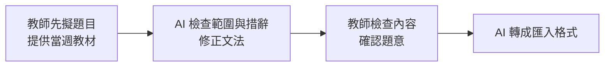
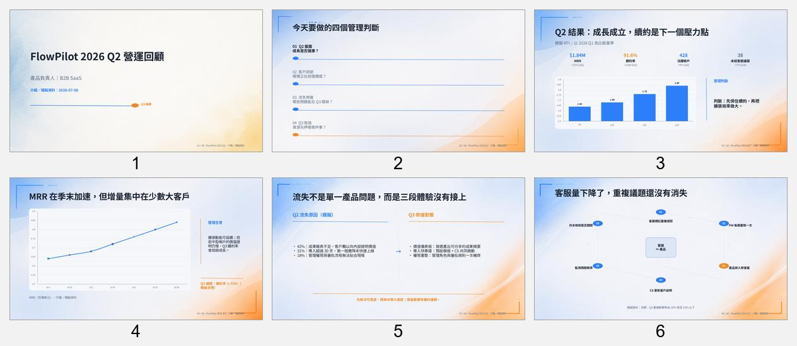
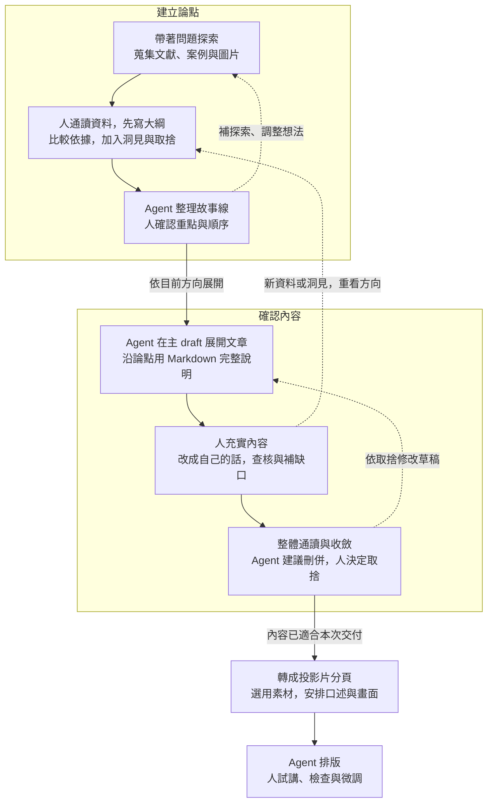
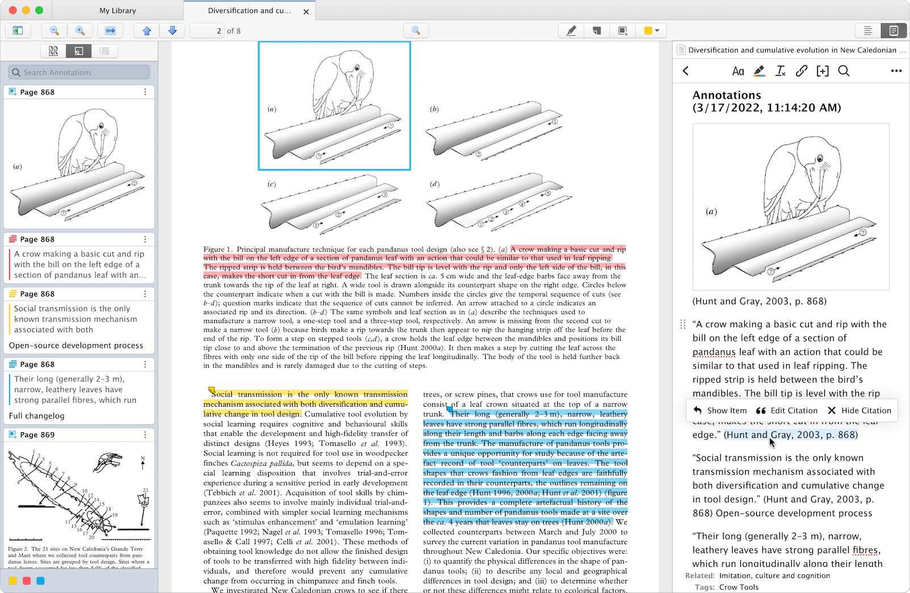
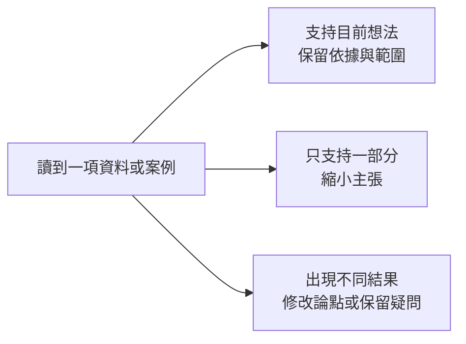

# Agent 時代的知識工作 — 第二週教案：先體驗 agent

## 本週目的與安排

本週核心是讓 agent 把你的想法做成成果。先從一個持續累積材料、推進想法的研究專案切入，再以向同事介紹「agent 製作業務簡報的方式」為練習，看討論如何接到搜尋、保存材料、整理 draft 與製作 PPT。人決定方向、採用哪些內容與如何修改，agent 接續執行，把想講的內容做成自己能說明、能接續編輯的成果。

| 段落 | 安排 |
|---|---|
| 開場 | 研究專案情境：材料、想法與成果持續累積，agent 如何參與其中 |
| 前半段 | 能力互補與四種協助 → 請教與交辦 → 用簡報示範產出物與兩個迴圈 → 保存過程 |
| 後半段 | 講師另開演示專案，做一段、學員跟一段；從背景與材料走到可編輯簡報 |
| 收尾 | 回看同一份成果，說明內容如何補齊、自己的取捨，以及交給 agent 的製作工作 |

預計製作三到五頁，至少完整走過一條論點到文章段落、分頁、排版與試講；其餘依時間擴展。搜尋材料在 `kb/`，採用內容與棄案分別保存於主 draft 和另一份 draft，投影片也能找到並接續使用。不以視覺華麗程度評分，不要求 GitHub push 或課後作業。實作主題為「用 agent 做業務簡報，該選哪種方式？」。

## 開場：與 agent 一起推進一個研究專案

假設你正在做一個研究專案。手上有幾篇論文、一批資料和之前試過的方法，也有一些尚未想清楚的問題。你一邊讀材料、做分析，一邊調整想法；過程中還需要整理資料、製作小工具，或向同事說明目前的發現。

Agent 可以參與這些工作。你把目前的材料、想法與問題放進專案，讓它依需要協助查找、整理、試作或檢查。討論後採用哪些建議、發現什麼問題，也一起保存，下次就能從這裡接著做。

隨著研究推進，累積的內容可以做成研究筆記、分析工具、報告或簡報。要讓 agent 幫上忙，先得知道目前卡在哪裡、希望它協助哪一段。這就和自己的能力及需要有關。

## 前半段：概念與流程

### 一、AI 如何配合自己的能力與需要

同樣在做研究，有人熟悉分析方法，但不熟工具；有人能很快做出程式，卻還不清楚結果該怎麼解讀。可以用「領域知識 × 駕馭 agent 的能力」理解 AI 放大器，乘號是兩種能力配合的比喻。


圖片：Julo，[Wikimedia Commons](https://commons.wikimedia.org/wiki/File:Lupa.na.encyklopedii.jpg)，公有領域，未修改。

- **領域知識：理解方法與結果的因果關係。** 知道一件事為什麼做得成，能看出目前缺什麼、該調整哪個環節，再把需要的材料、方法與結果向 agent 說清楚，透過檢查與回饋接近預期成果。
- **駕馭 agent 的能力：熟悉模型與工具。** 了解不同模型擅長什麼、能做到什麼程度，以及有哪些可用功能與限制。例如知道何時用 sub-agent 分工，或確認工具支援哪些遠端操作，便能選擇合適的做法。

例如想做資料展示，知道要回答什麼問題、需要哪些資料，以及怎樣呈現才不會誤導，是領域判斷；知道可請 agent 製作互動網頁、如何試用與回報操作問題，則涉及工具熟悉度。兩者配合，才能把想法轉成具體可執行的要求。

Agent 可以協助補足不熟悉的部分，也可以接手既有工作中的一些環節。先從目前的需要選一個切入點：

- **缺知識與方向：** 請 agent 解釋、提供關鍵字與做法，再查閱或試做。
- **有想法，但不熟悉工具操作：** 例如想做互動網頁或資料展示，卻不熟程式與開發工具，可以用 vibe coding 的方式，描述想法、請 agent 實作，再試用與修改。
- **簡單、重複的雜工：** 例如批次改檔名、整理欄位或轉換格式，把規則與完成條件說清楚，交給 agent 處理後檢查。
- **需要協助檢查：** 請它找遺漏與盲點，再依材料和工作目的決定是否修改。

同一件工作可能需要幾種協助。請學員說一件想完成的事，指出目前卡在哪裡，以及想先試哪種協助。選定之後，下一步就是把這個需要向 agent 說清楚。

### 二、請教與交辦，保留自己的判斷

沿著剛才選的工作，先看自己有沒有方向。還不知道該用什麼方法，可以先請教；已經知道要做什麼，就把要求交代清楚，請它動手。

**請教時，像在和不同領域的導師討論。** 帶著自己的專業、經驗與問題，說目前怎麼想、為什麼，再從它提供的觀點繼續追問。背景可逐步補充，建議要經資料或實作確認，自己的觀察與取捨也要加入。

**交辦時，把方向與重要限制講清楚。** 說明給誰用、做成什麼、範圍在哪，以及長度、格式或必須保留的內容。區分必要條件與偏好，具體做法讓 agent 提出。

請教與交辦可以來回切換：討論後有了方向就試做，看到成果出現新問題，再回頭討論。原本順手的流程可以沿用，只在需要協助的環節加入 agent；採用什麼、如何修改，仍由自己決定。

> 「他人幫助，但我主導」

——孫以瀚，2026-05-11 講座，[第 61 頁標題](https://ethics.moe.edu.tw/files/resource/lecture/20260511/20260511_lecture_20260508.pdf#page=61)。同頁指出人的貢獻包括形成問題、篩選與判斷、後續執行，屬講者個人觀點。

這種合作可以在具體流程中看見。臺大土木系蔡亞倫先擬題目，再讓 AI 協助檢查與格式整理，中間由自己確認內容：



依 [臺大教發中心，蔡亞倫教學札記](https://www.dlc.ntu.edu.tw/ai-teaching-notes/)整理，屬教師實踐案例。它呈現了同一件工作中，人提出內容、agent 執行、人再確認的往返。接下來就用研究專案裡的一項交付，實際看這個過程。

### 三、用做簡報練習：kb、draft 與 PPT

把開場的專案工作方式用在一個小題目：團隊準備用 agent 製作業務簡報，希望你向同事介紹有哪些方式、各自的優缺點，以及怎麼選。這次就為這個題目蒐集材料、形成建議，做成三到五頁簡報。

先認識圖片、HTML、PPTX 三大類，三張總覽圖各是一種形式的六頁縮圖：




由上而下為圖片式、HTML、PPTX。來源：[slidefirm/NESA-SLIDE](https://github.com/slidefirm/NESA-SLIDE) README 的 demo 縮圖，MIT 授權，未修改；三份範例檔與下載位置見[素材來源表](../assets/week2-nesa-examples/README.md)。乍看都像簡報，差別在做好之後能改什麼、改了存在哪。

看圖之後附上 repo 連結，學員自行到原站看範例。原站把 HTML 再分兩型，共列四種成品，本課合併為 HTML 一類。接著依需求查其他工具或製作路徑，確認功能與限制。NESA 只提供分類與範例，本次不教它的安裝或操作，也不用它製作成果。

先短暫預覽同一份簡報的三個狀態：

| 狀態 | 要看到的變化 |
|---|---|
| 初步主張與少量材料 | 指出缺少的來源、圖表或具體例子。 |
| 有依據的 draft | Agent 協助查找與整理，人決定採用什麼、如何解讀。 |
| 可編輯 PPT | Agent 依確認內容安排圖文，人檢查與修改。 |

先呈現內容如何補齊，再展示排版工作如何交辦；樸素的版面不算失敗。後半另開空專案實際走一遍，過程會留下這些產出：

| 產出物 | 保存什麼、如何使用 |
|---|---|
| `kb/`：搜尋與探索材料 | 保存文獻、案例、來源、摘要與探索筆記，連到圖片原檔。例如三種簡報形式的範例、工具文件與比較依據，供後續取用與查核。 |
| `drafts/`：整理後的文章與草稿 | 把採用的論點、依據、故事線與自己的觀點整理進文章，逐步修改。棄用或暫緩的論點另放一份 draft，保留理由；需要分頁草稿時也放在這裡。 |
| PPT：對外表達的投影片 | 從 draft 安排口述與畫面，製作可編輯投影片，保留必要來源，經試講後修改。 |

以這門課為例，搜尋材料在 `kb/`，採用的論點已整理進這份主 draft，移出內容在 [另一份 draft](06-week2-deferred-topics.md)。建立論點是整理內容的工作，不必再維護一份獨立論點檔；文章本身就保存目前的主張、依據與順序。

### 四、建立論點與確認內容的兩個迴圈

「建立論點」處理想講什麼、如何組織；「確認內容」把草稿充實、收斂成自己能說明的內容。文獻、案例與圖片在建立論點時一起探索，文章階段補缺口，分頁時再決定選用。



讀圖時抓三件事：

- **人先通讀、自己列綱。** 加入自己的洞見與取捨，再讓 agent 沿方向整理；真的卡住，可請它試串後逐段確認理由。
- **新材料可以改變方向。** 回到受影響的論點或段落修正，不必整圈重做。
- **接近交付時逐步收斂。** 先處理正確性與理解問題，延伸想法留下一版；內容盡量在 Markdown 修定後再排版。

Reynolds 建議早期故事板就預想圖表與照片，再找適合素材，可作為提早考慮畫面的參考。[作者原文，第 1 節](https://www.garrreynolds.com/preparation-tips)。本次以一條論點示範往返，不再增加另一套流程。

### 五、保存過程，才能接著做

討論到值得留下的內容，就請 agent 整理成 Markdown，自己打開確認；下次指定讀取，再接著做。保留資料、想法、建議、取捨及未定事項，也保存來源與圖片，讓結論能回到依據。



畫面指出原文、標註、筆記如何連在一起。來源：[Zotero 官方文件](https://www.zotero.org/support/pdf_reader)，[CC BY-SA 4.0](https://www.zotero.org/support/licensing)，原圖未修改。臺大數學系圖書室也介紹了書目、PDF、筆記與圖片管理，[洪翠錨整理，2026-08-14](https://www.math.ntu.edu.tw/~mathlib/News_Content_n_204689_s_264943.html)。

今天用檔案與 Markdown 練習這個保存習慣，不要求安裝 Zotero。Agent 隨著搜尋與討論，把值得留下的材料整理進 `kb/`；人檢查來源與用途，再選進 draft。收斂依靠取捨，資料增加本身不代表內容已經成熟。資料夾隨需要形成，下一段直接建立第一則筆記。

## 後半段：比較 agent 製作簡報的方式，做成三到五頁

**情境：** 團隊要用 agent 製作目前業務的介紹簡報，你負責向同事說明可選方式，並提出有理由的建議。

**本次成果：** 一份比較圖片、HTML、PPTX 的簡報，包含適用情境、優缺點、代表工具或製作路徑及選擇理由。三種方式都要理解，但只製作一份可編輯 PPTX，不要求各做一套。

這裡要建立的論點，是「在什麼需求下，為什麼選這種方式」。先提出比較標準，再讓來源、範例與實際檢查修正自己的判斷；最終建議不預先指定。

### 開始前

講師另開演示專案，做一段、學員跟一段，每步打開成果確認後再繼續。使用公開、虛構或確認適合提供給工具的材料；舊簡報也要檢查備註與附件。關閉訓練用途不代表資料不上雲，private repo 也在雲端。

數發部手冊提醒，避免將個人訊息與機密資料提供給公開或 API 串接的生成式 AI 服務。[第 81 頁，4.3.6](https://www-api.moda.gov.tw/File/Get/moda/zh-tw/WwHCroVhwWy52dw#page=81)。拿不準的材料改用講師範例。開始前各自確認兩件事：所用 agent 工具的資料使用設定，例如對話是否用於訓練；練習專案若放上 GitHub，是公開還是私有。

講師同時告知本次製作 PPTX 的路徑，例如 python-pptx 或 pptxgenjs，以及沒有直接預覽軟體時怎麼看畫面。學員不必自己摸索這兩件事。

### 一、初始化專案與保存習慣

開空專案，說明要向同事比較 agent 製作簡報的方式，先建立 `kb/` 保存找到的材料與討論。請 agent 把保存方式與位置寫入 `AGENTS.md`，打開兩個檔案確認；嫌長就請它刪到只留保存位置與共用要求。之後明確請它讀取 `AGENTS.md`，並接續下一節的討論。

```text
練習專案/
├── AGENTS.md             保存方式與共用要求
└── kb/
    └── 第一次討論.md     背景、想法、來源與未定事項
```

檔名可調整，現場要看到實際寫入、打開與再次讀取。後續需要圖片時建 `assets/`，需要整理文章、棄案與分頁時建 `drafts/`，簡報成果放 `output/`，製作用的程式碼也留在專案裡。資料夾名稱本身不會讓 agent 自動使用內容。

### 二、聊背景與限制，一起探索材料

先說受眾與使用情境，例如：「同事想用 agent 做業務簡報，但不清楚有哪些方式。我想比較圖片、HTML 和 PPTX，讓他們知道怎麼選，做成三到五頁。」再依回應補充需求，確認內容保存到筆記。

一開始講不出比較條件是正常的。可以先請 agent 查資料，看過範例之後，工作上的條件會逐漸想起來：內容是否經常改、誰要接手、在哪裡播放、要不要送審或列印、需不需要互動，以及圖表與視覺效果的要求。想到一項就補進筆記。需求具體化可參考 [數發部手冊第 25 頁](https://www-api.moda.gov.tw/File/Get/moda/zh-tw/WwHCroVhwWy52dw#page=25)；本次直接用團隊情境討論。

回到前半段的三張總覽圖，給出 [NESA-SLIDE](https://github.com/slidefirm/NESA-SLIDE) 的連結。學員把連結交給 agent，請它看原站的分類與範例，每類實際打開一份（圖片式 PDF、HTML demo、PPTX 檔），確認能改什麼、改了存在哪、交給同事要用什麼軟體。只看範例，不查它的安裝方式與 skill；PPTX 範例存於 Git LFS，agent 抓不到時改由講師提供備份。

再按缺口查找代表工具的官方文件，例如講師告知的 PPTX 製作路徑。整理可編輯範圍、播放與交接方式、製作條件及限制，附來源與查閱日期。區分作者說明、自己實際看見或測試的功能、仍待確認的項目；只讀程式碼而未在瀏覽器操作的功能算待確認。同一工具可能支援多種形式。

圖片優先選能顯示形式差異的真實範例，保留來源與使用條件；文字規格直接整理成比較表。資料整理進 `kb/`，需要保存的圖放 `assets/`。查找足以支撐目前比較後就先形成草稿，避免一直擴大工具清單。

### 三、建立論點，整理進主 draft

人先通讀材料與筆記，依團隊需要排出比較條件的優先順序，提出各種形式適合什麼情境、為什麼，再請 agent 沿這些判斷整理故事線。真的想不到時，可讓它先試串，自己逐段說明認同或修改的理由。第一次說出的立場常不完整，例如把圖片式講成「好看但不能改」，看過故事線才改成「一次性、不再修改的內容才選圖片」，這種修正就是論點形成的過程。



把候選圖像放在相關想法旁，記下用途；支持不足就縮小主張或補查。例如來源說某個 HTML 範例可編輯，先確認可改哪些內容，不直接推成所有 HTML 簡報都具備相同功能。

這和臺大護理系劉欣怡的做法相同：讓學生先讀教材，再用 AI 比較支持與反對觀點，最後判斷自己的立場。[〈與 AI 共學〉](https://www.dlc.ntu.edu.tw/ai-teaching-notes/)，屬教師經驗。這裡只是印證剛才的步驟，不另開一套流程。

連讀故事線，確認理解順序、重複與跳接，把採用的主張、依據與大綱整理進主 draft。文章在下一節於同一份檔案展開。棄用或暫緩的論點另存一份 draft，記下證據不足、超出範圍或不適合受眾等理由，不為湊數新增；例如業務簡報沒有台下互動，又沒實測過三種形式的互動功能，「互動性」這項比較就可以移出。組織證據與處理合理反對意見可課後參考 [TEDx 指南，第 4–5 頁](https://storage.ted.com/tedx/manuals/tedx_speaker_guide.pdf#page=4)。

### 四、起草文章，加入自己的內容再收斂

請 agent 在主 draft 沿目前的大綱與論點寫一段 Markdown，看過寫法再展開文章。人補入自己的理解、經驗與例子，例如季報開會前長官臨時改字換圖的經驗，可以放進「內容常改」那段；對照既有來源查核，有缺口再補材料。文字內容直接引用或整理，合適的圖表、照片與示意放在相關段落。

Agent 起草時常出現這樣的結尾：「這種方式比較好，適合所有業務簡報。」這句話缺選擇條件。回到同事的需要，說明優先考量的是修改、交接、播放還是視覺，再用查到的功能與限制支持建議。

接著由學員從自己的 draft 挑一句對工具功能下了斷言的句子，請 agent 對照官方文件或範例檢查，前後版本都留在 draft 裡。試跑時的例子：

| 修改前 | 對照來源 | 修改後 |
|---|---|---|
| HTML 簡報改完可以直接存檔，同事接手後也能在瀏覽器裡繼續改。 | 範例的 skill 說明：預設只把草稿存在瀏覽器本機，寫回 HTML 檔需另備 server，repo 未附。 | HTML 簡報可以在瀏覽器裡改文字與位置；改完預設只存在該台電腦的瀏覽器，要交接得先匯出或存檔。此為作者說明，未實測。 |

查文件仍未實測的功能，修正後照樣標「未實測」；「可匯出 PPTX」也不直接等同每個物件都可編輯。

整體通讀，請 agent 建議刪重、合併與重排，人決定取捨；文章不像自己講話就請它改短。論點有變就更新主 draft 對應段落，移出的內容及理由補到棄案 draft；文章保留完整脈絡，供備講與輔助閱讀。尚未取得的素材註記用途、查找方向及待核對事項。

### 五、分頁，安排口述與畫面

從文章整理三到五頁分頁草稿，逐頁決定重點、口述、畫面與節奏。口述寫兩三句重點與過渡，不是逐字稿，細節上台再展開；節奏寫成「停留約 60 秒，講完第三點換頁」這樣一行。先挑一頁深入修改，再通讀整份順序。

可先試四頁安排，依形成的論點調整：

1. 同事的業務簡報需要什麼，這次用哪些條件比較。
2. 圖片、HTML、PPTX 的差異與優缺點，搭配真實範例。
3. 套入使用情境，說明怎麼選與有哪些取捨。
4. 對應的代表工具或製作路徑，以及這次建議與理由。

第一頁常被想省略，直接進比較表；留一小段開場，聽眾才知道在比什麼標準。若比較頁太擠，可拆成第五頁；不用為每個工具各開一頁。

選圖與引用依用途處理：

| 這一頁需要什麼 | 呈現方式 |
|---|---|
| 介紹來源，留下出處印象 | 展示真實論文首頁、封面或網站，辨識作者、機構與版本。來源是網站或 repo 時，每頁短來源加備註即可，不必另做來源頁 |
| 讓聽眾讀懂文字內容 | 直接排短引文或摘要；逐字引用加引號，改寫標「整理自」 |
| 理解證據、情境或關係 | 使用研究圖表、照片、操作畫面與流程圖；自繪或生成概念圖標示意 |

選一項最影響決策的差異，用範例畫面或可讀的對照表呈現，口述補使用條件與限制。成品畫面展示差異，不用大量規格截圖代替說明。

Penn State 的 [Assertion-Evidence 方法](https://www.assertion-evidence.com/)以明確訊息配合視覺證據；[TEDx 指南，第 5–6 頁](https://storage.ted.com/tedx/manuals/tedx_speaker_guide.pdf#page=5)也強調圖表集中表達重點，皆可課後參考。

畫面保留必要短來源與署名，完整連結、版本及授權留備註與素材紀錄。分頁草稿另存，若發現論點問題，回到相應內容修改。

### 六、先做一頁 PPTX，再展開與修改

確認要輸出的文字與順序，用講師告知的路徑請 agent 先做一頁可編輯 PPTX，確認這台機器真的做得出來，再展開其餘頁面。沒有指定版型時，至少交代字體與頁面比例，其他做法讓它提出。例如：「把剛才確認的內容做成五頁以內、可以編輯的 PowerPoint，16:9，先試做一頁，說明排法的原因。」

打開第一頁看畫面。沒有直接預覽的軟體時，請 agent 用 PowerPoint 或 Keynote 匯出 PDF 或圖片，再打開來看。首次輸出常見的問題是整頁太空：標題和說明句之間一大塊空白，三個關鍵字散在下方，字偏小，看不出重點。提出具體修改，例如標題加大、關鍵字做成並排的色塊、往上靠近標題；改好之後把首次輸出與修改版並排，指出哪裡變得清楚。

再展開其餘頁面，逐頁看一次；字級太小、圖片高度不一、卡片下方空白，這類版面問題直接指出來改。修改版另存，不覆蓋首次輸出。

檢查時本次只做兩件事：圖片有替代文字、每頁備註有口述與完整來源；請 agent 用程式逐頁確認文字都是文字框，不是圖片。文字對比與閱讀順序可以在 PowerPoint 的協助工具檢查程式看，做法見 [Microsoft 中文支援文件](https://support.microsoft.com/zh-tw/accessibility/powerpoint/make-your-powerpoint-presentations-accessible-to-people-with-disabilities)。

### 七、試講、驗收與回看修改

有三件事 agent 無法代做：親自在 PowerPoint 點選文字、改一個字，確認真的能編輯；實際講一頁、計時、看投影；請聽者重述重點或指出不清楚處。這三件事由學員自己完成，兩人一組各講一頁即可。依 [TEDx 排練建議，第 7 頁](https://storage.ted.com/tedx/manuals/tedx_speaker_guide.pdf#page=7)安排實講與回饋。單獨練習時，可先請 agent 估算每頁口述字數與時間。

依問題回到主 draft 的論點與文章，或分頁草稿修改；單純版面問題改該頁，再試講受影響的部分。交付前確認：

- 文字、圖片、頁碼與來源可讀，引用支持本頁主張，示意與實證分得清楚。
- 待補素材已完成、替換或移出交付範圍。
- `kb/` 的來源材料、主 draft、棄案 draft、分頁草稿及 PPTX 的最新版本能找到。
- 一開始說在意的條件，每一項都出現在比較裡。試跑時學員開頭說長官在意圖表好不好看，五頁裡卻沒有處理這一項，自己與 agent 都沒發現。

做完之後，這次留下的東西不只一份 PPTX：

| 給誰 | 內容 |
|---|---|
| 交給同事 | 可編輯的 PPTX |
| 自己備講與日後回查 | 主 draft 的文章與查證紀錄、分頁草稿的逐頁重點與口述 |
| 有人質疑依據時 | `kb/` 的來源筆記、棄案 draft 與理由 |
| 還沒做完的 | 移出交付範圍的素材、試講與聽者回饋 |

回到開場的專案工作方式，再看這次向同事提出選擇建議的前後成果：補上了什麼內容、哪一項採用或刪除是自己的判斷，以及哪些搜尋、整理或排版工作交給了 agent。用實際版本指出變化，不預設每個步驟都已省時。

最後回到本週核心，讓 agent 把你的想法做成成果。這次留下可回查的材料、自己的 draft 與可編輯投影片，這些內容會繼續留在專案裡，供後續分析、寫作或再次說明使用。將一項值得沿用的要求補進 `AGENTS.md`，例如「查到範例做法時，先確認在這台機器上跑得通，不假設一定可用」。講師收集下次想處理的工作，練習在課堂完成。

## 講師準備與製作備註

### 講師準備

- **課前準備**：確認總時數與配比，準備三個簡報預覽狀態，並親自試跑一次輸出路徑。投影片放三張總覽圖與 repo 連結；總覽圖與三個範例檔留存於 `assets/week2-nesa-examples/`，作為投影片素材與 agent 抓不到檔案時的備援。時間不足就縮減頁數與素材量，保留一條論點到試講的完整體驗。
- **開場要告知的事**：資料使用設定與 repo 公開與否怎麼確認；本次製作 PPTX 的路徑；沒有預覽軟體時怎麼看畫面。這三件事學員自己查會花掉第二、六節的時間。
- **最需要介入的節**：第二節，學員容易從 NESA 連結走到安裝與 skill，或一直擴大工具清單；第四節，挑一句話查證的動作學員不會主動做，示範一次；第六節，首次輸出太空時引導提出具體修改，而不是重做。
- **演示環境**：課程備課與現場演示分開專案；確認工具如何讀取 `AGENTS.md` 及帳號資料設定。每步先保存、打開、確認，再繼續，不要求固定提示模板。
- **簡報預覽**：放在介紹實作例子時，三個狀態須來自同題材的實際預作；預覽檔由試跑取得，與故障時才啟用的備援分開。
- **實際畫面**：準備展示筆記讀寫、kb 材料與主 draft 的連結、首次 PPTX 與修改版。備援成果標明為預備版本，只在工具異常時使用。
- **後續範圍**：第四週承接思考與蒸餾；長期知識庫、版本管理、模型配置與簡報設計深入內容依需求安排，不預配第五週以後。

### 試跑判準與紀錄

以獨立練習資料夾走一次七步，先試四頁，記錄各步耗時、卡點、人的修改與檔案位置。試跑後才判定能否 demo，必要時縮減比較範圍或調整輸出路徑。

- **材料能取得**：從 repo 連結能打開三類範例並看出差異，關鍵比較有來源；不需安裝 NESA，PPTX 範例抓不到時有備援。
- **看得見人的取捨**：初步比較經討論至少有一處有理由的調整，並保存前後版本；沒有實際棄案就不補造。
- **成品能使用**：完成三到五頁 PPTX，逐頁檢查畫面、來源與主要文字可編輯性，再實際試講一頁；不能只看檔案是否存在。
- **節奏可示範**：確認哪些步驟適合現場做，哪些公開材料需預存以備查找失敗；失敗與未完成項如實記錄。

2026-09-07 已由 agent 模擬學員跑過兩輪：第一輪學員照字面操作，第二輪學員口語、繞路、會講錯，各做出 4 頁與 5 頁可編輯 PPTX，紀錄在 `tmp/week2-student-run/` 與 `tmp/week2-student-run-2/`。第四、六、七節的例子與講師準備的介入點取自這兩輪。講師親自試跑仍待進行，總時數與配比待定。

### 來源與草稿狀態

- 本稿依使用者手稿與討論、既有教案及 [圖文與中英文來源選用紀錄](../kb/week2-paragraph-evidence-and-visuals.md)整理，2026-09-07 整體順稿；尚未同步正式教材或 PPTX。
- 開場畫面沿用 [課程首頁「知識如何變成交付成果」](../index.qmd)的專案概念，先呈現工作情境與關係，檔名和資料夾結構留到後半段說明。
- 前半段的材料判斷圖與蔡亞倫流程圖為本課自繪；第四節的待修正句與查核例子取自試跑；放大鏡圖用於引入比喻，畫面不疊長文。
- 授權細節與未採用素材查 [素材來源表](../assets/week2-enrichment/README.md)與 [NESA 範例來源表](../assets/week2-nesa-examples/README.md)。HBS／BCG、雙鑽石、Forte 等留 [選材紀錄](../kb/week2-paragraph-evidence-and-visuals.md)備講，不另加進主流程。舊內容去向見 [移出主題與後續用途](06-week2-deferred-topics.md)。
