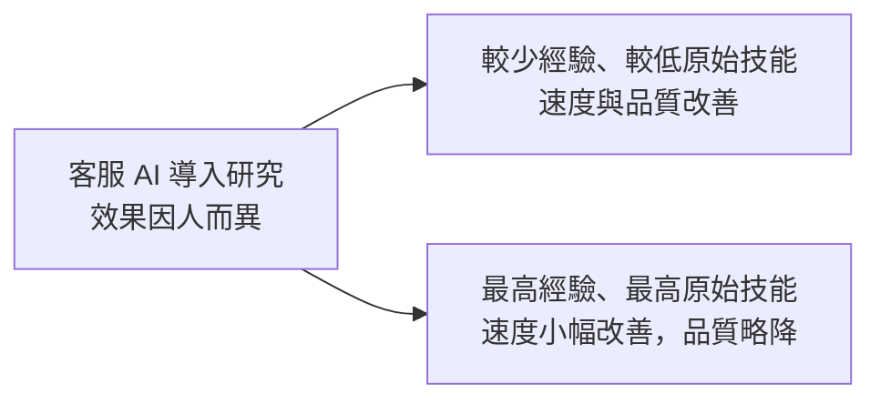
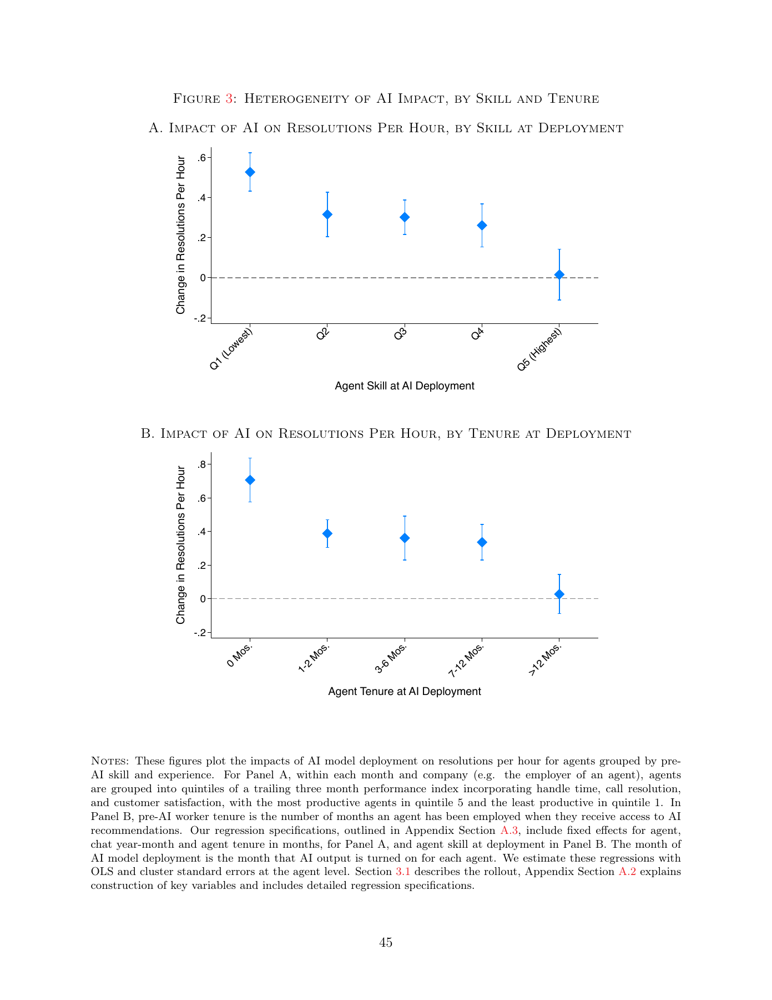
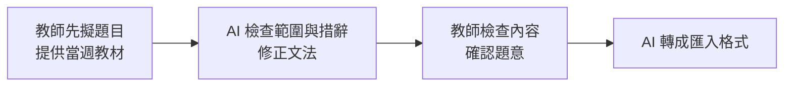
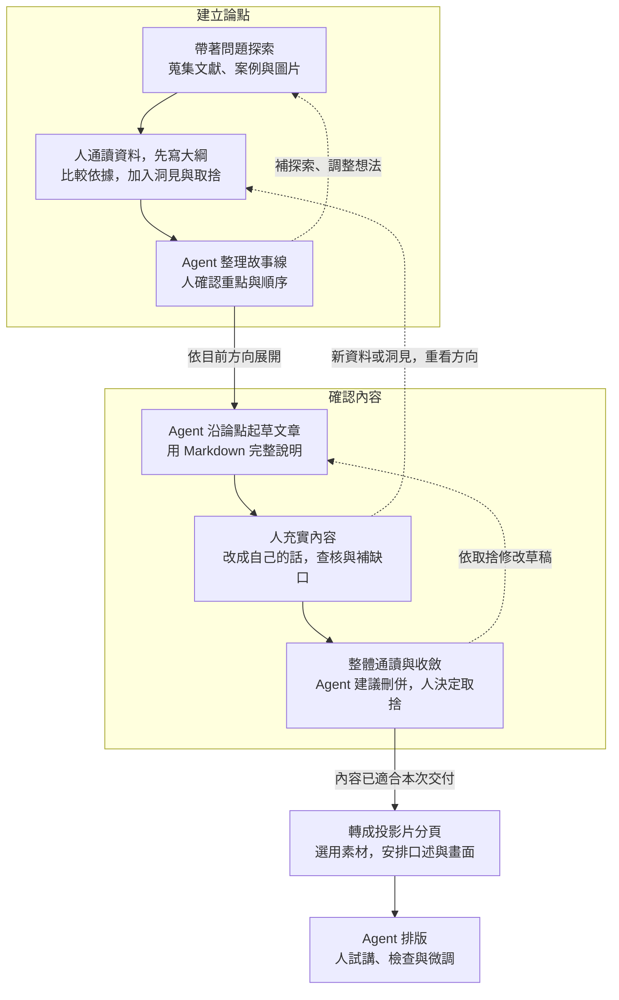
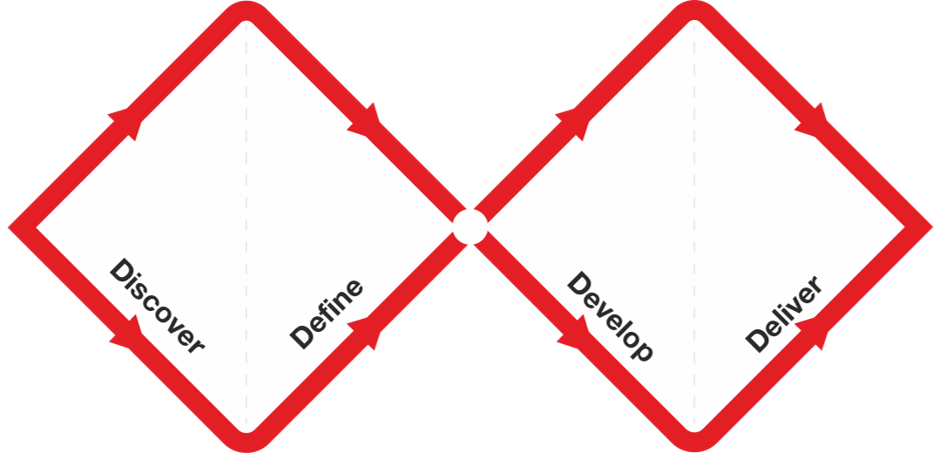
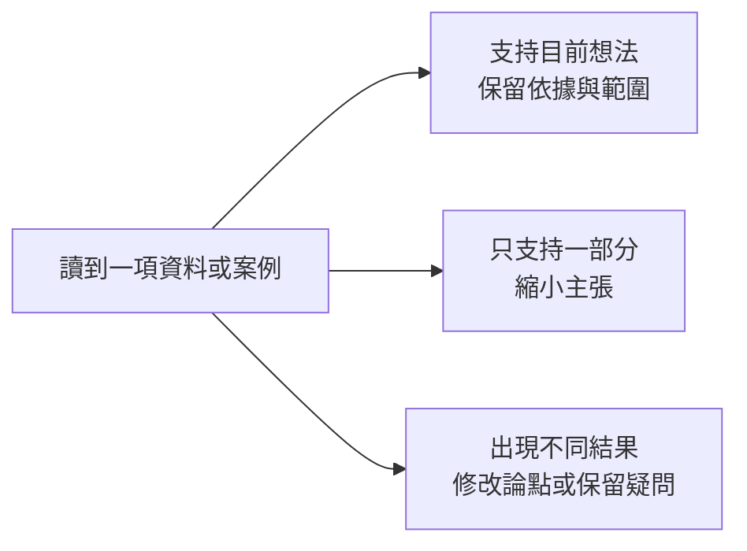
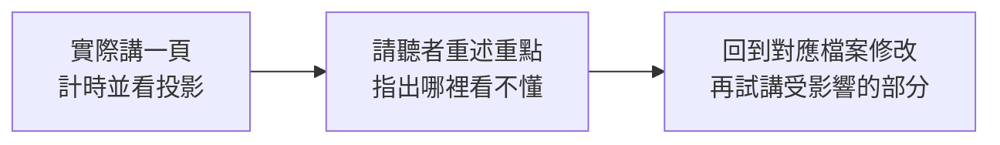

# Agent 時代的知識工作 — 第二週教案：先體驗 agent

> 第二週主教案，保存完整講稿、實作步驟與講師備註；尚未發布。2026-09-07 依使用者確認的收斂方向重整。
> 來源：使用者六頁投影片手稿與後續討論、舊教材 `lessons/01-presentation-and-the-knowledge-work-loop.qmd`、`kb/presentation-process-before-and-after.md`、`kb/purposeful-reading-and-agent-assisted-practice.md` 與 `工作紀錄.md`。舊內容去向見 [第二週移出主題與後續用途](06-week2-deferred-topics.md)。

> 2026-09-07 圖文整合草案：新增來源為 [AI 放大器的文獻與圖片蒐集測試](../kb/ai-amplifier-evidence-and-visuals.md)及 `工作紀錄.md` 的「文獻與圖片提早到建立論點階段」討論。段落中的「畫面草案」為備課用：有視覺資訊的圖片直接嵌入；文字內容改用引文或摘要，自繪示意圖標明性質；待找圖片寫明用途、來源方向與完成條件。尚未同步正式教材或 PPTX。

> 本次逐段補充另見 [圖文與中英文來源選用紀錄](../kb/week2-paragraph-evidence-and-visuals.md)。以下畫面可供挑選，並不代表每張都要增加一頁；「優先」建議進入主線，「備選」供試講後取捨。圖文呈現依 [教材圖文與引用判準](../skills/teaching-visuals-and-citations.md)：來源首頁或封面用來認識出處，文字內容直接引用或整理，圖表與操作畫面依用途保留。圖片的取得、修改與授權集中在 [素材來源表](../assets/week2-enrichment/README.md)。

## 本週目的與安排

理解領域知識與駕馭 agent 的能力如何相輔相成，從自己需要補足的地方開始練習。以製作一份簡報為實作任務，主題另行選定，經過請教、取捨、起草與修改，把自己的想法做成能說明、能接續編輯的成果。

| 段落 | 安排 |
|---|---|
| 前半段 | AI 放大器 → 從需要切入 → 請教與交辦 → 三種產出物 → 兩個迴圈與小步迭代 → 外部化保存 |
| 後半段 | 講師在獨立專案現場製作演示簡報，學員跟做；從空專案建立保存習慣，再經背景與探索，形成論點、文章與投影片 |
| 收尾 | 回看當場保存的版本，說明自己的觀點、取捨與修改 |

預計製作三到五頁可編輯簡報，至少將一條論點走到文章段落、投影片分頁、排版與試講。保存討論、素材、工作要求，以及論點、文章與投影片的當前版本，能找到並請 agent 接續使用；其餘內容依時間擴展。不以視覺華麗程度評分，不要求 GitHub push 或課後作業。

> **畫面取捨：** 本週安排以簡短路線與最後會取得的成果說明即可；成果預覽沿用後面的「三種產出物」文字對照，不另找裝飾照片。三到五頁指學員實作成果，並非本教案所有畫面的頁數。

## 前半段：概念與流程

上次介紹了 agent 是什麼，這次我們實際試試看，也讓大家有個方向，知道接下來可以怎麼學。先看它如何和自己的能力配合，再用做簡報的流程，理解哪些地方可以請它協助，以及自己要參與什麼。

### 一、AI 是放大器

可以用「領域知識 × 駕馭 agent 的能力」來理解 AI 放大器。這個乘號是兩種能力互相配合的比喻，並非經研究驗證的計算公式。領域知識幫助我們判斷方向與結果是否合用；駕馭 agent 的能力，則幫助我們提供材料、說明要求，透過嘗試與回饋把想法做出來。

兩邊需要相輔相成。熟悉工作但還不熟悉工具，可以從既有流程的一段開始練習；熟悉工具但不了解主題，就需要補知識，累積判斷的依據。也可以邊學邊做，透過查閱、試用與比較，逐漸知道下一步要補什麼。

交付出去的內容，自己要能判斷與說明。Agent 可以協助產出和檢查，最後仍由自己確認資料、意思與表達是否適合這次工作。

> **台灣觀點，口述補充：** 孫以瀚在 2026-05-11 的研究寫作講座，將形成問題、篩選與判斷、後續執行列為人的貢獻。這可用來補充本段的「自己要能判斷與說明」；屬講者的實務觀點，不是效益研究。[講座原稿，PDF 第 61 頁](https://ethics.moe.edu.tw/files/resource/lecture/20260511/20260511_lecture_20260508.pdf#page=61)。下方「怎麼和 agent 合作」以短引文與摘要呈現，本段不重複展開。

#### 畫面草案｜已取得的概念照片


圖片來源：Julo，2007，[Wikimedia Commons](https://commons.wikimedia.org/wiki/File:Lupa.na.encyklopedii.jpg)，作者釋出至公有領域；本檔未修改。這張照片用於引入「放大」的比喻，不作 AI 效益的證據。

畫面可採左側一句主題、右側照片，口述說明兩種能力如何配合。照片偏暗且文字密集，先保留為候選，不在照片上疊長文。若之後改用抽象生成圖，候選方向為「人運用工具把草圖展開成作品」，標示概念示意，不放虛構統計；目前尚未生成。

### 二、從自己需要補足的地方開始

先看想完成什麼，再看目前需要哪一種協助。

- **缺知識與方向：** 從資料或討論開始，請 agent 解釋、提供關鍵字與可能做法，再查閱或試做。例如想學一種陌生的簡報方法，先了解它適合什麼情境。
- **缺具體操作：** 已經知道要什麼，就請 agent 協助做出來。例如內容有了，請它排版；原本會做的格式整理與語句潤飾，也可以挑一段交辦。
- **需要協助檢查：** 請 agent 從另一個角度找遺漏、疑問與盲點，再回到材料與工作目的，決定是否修改。

同一件工作可能需要幾種協助，也可能試過才發現真正缺的是另一部分。今天先選一個具體需要，開始做，再調整。

#### 畫面草案｜讓研究補充放大器的比喻

> **來源介紹，備選：** 研究首次出場時，可短暫展示論文首頁，讓聽眾辨識標題、作者與版本，接著以摘要或圖表講結果。目前引用的是 arXiv v2，不能把它的首頁標成期刊版。尚未另製來源介紹圖，也不要求聽眾閱讀首頁內文。

一項研究追蹤 5,172 位客服人員導入 AI 助理的情形，每小時解決問題數平均增加 15%，較少經驗、較低原始技能者的改善較多。這提醒我們，AI 也可能協助補足經驗，不能由放大器的比喻推論「原本越強，受益一定越多」。來源：Brynjolfsson、Li、Raymond，[*Generative AI at Work*，2024 年 v2 摘要](https://arxiv.org/abs/2304.11771v2)。這是客服工作的結果，不能直接當成署內工作或目前各種 agent 的預期效益。

下面先用自繪摘要示意內容；框的大小與位置不代表效果量，也不是論文原圖。



**優先：已取得的研究原圖。** Figure 3 位於 PDF 第 46 頁、印刷頁碼 45；以下保留完整頁面、座標與圖說。正式排版時先試投影可讀性。



來源：Brynjolfsson、Li、Raymond，[*Generative AI at Work*，v2](https://arxiv.org/pdf/2304.11771v2#page=46)，[CC BY-NC-ND 4.0](https://creativecommons.org/licenses/by-nc-nd/4.0/)。由 PDF 整頁轉成圖片，未修改圖表。圖中的 agent 指客服人員；A 圖依導入前工作表現分組，B 圖依年資分組。縱軸是每小時解決問題數的變化，不能把 0.5 直接讀成提升 50%。

講師可在前面的自繪摘要與研究原圖中擇一呈現。看圖時只帶聽眾比較分組差異與估計不確定性，不逐一朗讀數字；品質變化的敘述來自摘要，不能只憑本圖推論。

> **備選台灣案例：** 臺大土木系蔡亞倫在〈AI + EMI + 翻轉教學 = AIME!〉分享，自己先擬題目，再讓 AI 檢查範圍、文法及用詞，人工確認後才轉成匯入格式。這個例子可以接「從需要切入」，屬個人教學實踐，沒有對照實驗。[臺大教發中心原文，蔡亞倫段落及圖 3](https://www.dlc.ntu.edu.tw/ai-teaching-notes/)。若本次想減少英文研究，可選此案例；圖 3 的公開再利用授權未明，先保留原文連結，不當成已取得的圖片。

### 三、怎麼和 agent 合作

**請教時，像在和不同領域的導師討論。** 帶著自己的專業、經驗與問題，從它提供的關鍵字和觀點繼續追問，再用資料與實作確認是否適用。背景不必一次講完，可以依回應補充。

已有自己的想法，就先說目前怎麼想、為什麼這樣想，再請它補充。把建議和原想法比較，自己決定哪些值得保留、哪些理由讓自己改變看法。自己的觀察與取捨在這裡加入，成果才能表達自己的理解與立場。

**交辦時，把方向與重要限制講清楚。** 說明給誰用、做成什麼、範圍在哪，以及格式、長度或必須保留的內容。區分必要條件與偏好，具體做法讓 agent 提出；太籠統容易偏離期待，規定太細也可能限制其他合適的方法。

還不清楚方向時先請教，有了方向再交辦；看到成果有新問題，也可以回頭討論。用自己的話來回溝通，有值得保留的內容再整理保存。

如果已經累積出自己的工作流程，不用急著全部切換成 agent。哪些步驟用原本的方法更順手，就繼續沿用；遇到需要協助的環節，再試著加入 agent，依實際效果調整。

> **備講來源：** HBS／BCG 的 758 位顧問研究指出，AI 的能力邊界不均勻，應考慮不同任務中的人機配置。[研究機構摘要，2023](https://aiinstitute.hbs.edu/navigating-the-jagged-technological-frontier/)。可用於補充「從既有流程挑一段試用」的理由。本次只讀機構摘要，尚未完成全文核對；暫不將其效益百分比做成圖表。

#### 圖文補充｜先看別人怎麼保留人的判斷

**優先：用短引文與摘要呈現觀點。**

> 「他人幫助，但我主導」

——孫以瀚，2026-05-11 講座，第 61 頁標題。

整理自同頁：人的貢獻包括形成問題、篩選與判斷，以及後續執行。請 AI 提出方法後，仍需自己讀懂並判斷是否適用。

來源：孫以瀚，〈運用生成式 AI 輔助撰寫研究計畫及論文：心態、技巧、學倫〉，教育部臺灣學術倫理教育資源中心提供，[PDF 第 61 頁](https://ethics.moe.edu.tw/files/resource/lecture/20260511/20260511_lecture_20260508.pdf#page=61)。以上為講者個人觀點；原頁圖片保留作查核，畫面直接排引文、摘要與署名。

**備選：將臺大教學案例整理成分工圖。** 若要說明交辦，改用下圖；這是依蔡亞倫原文自繪的摘要，不是原作者的圖。



資料來源：[臺大教發中心，蔡亞倫教學札記](https://www.dlc.ntu.edu.tw/ai-teaching-notes/)。用來討論「哪部分需要我的專業，哪部分可以交辦」，不展開工具設定。前面的請教心態保留短對話即可，不必為每一句原則再放一張照片。

### 四、論點、文章與投影片

這個流程會留下三種產出物，各有用途：

| 產出物 | 保存什麼、如何使用 |
|---|---|
| 論點 | 想傳達的主張、依據與組織方式，連到候選文獻、案例與圖片；一併整理棄案及放棄理由，供之後回看或重新評估 |
| 文章 | 用連續文字把論點與脈絡說完整，可作備講與輔助閱讀材料 |
| 投影片 | 將內容安排成口述與畫面，包含分頁草稿及排版成果，安排停留、揭示重點與換頁的節奏 |

#### 圖文補充｜用同一個想法看三種產出物

| 產出物 | 同一個想法的內容示例 |
|---|---|
| 論點 | AI 也可能協助補足經驗。依據是客服研究；限制是效果依情境而異，棄用「人人同等受益」的說法。 |
| 文章 | 先交代客服研究的情境與結果，再說明適用範圍，最後連到自己的工作，保留引用與修改理由。 |
| 投影片 | 畫面放一句重點與研究圖，口述補情境、限制與例子；頁腳放短來源，備註留完整連結。 |

**優先：可編輯的內容對照。** 本表可取代前面的用途表，正式排版時直接安排文字；三種產出物與本例為本課整理，不使用文字卡片圖片。

外部參考是 Garr Reynolds 對簡報與閱讀材料的區分，以及 TEDx 將大綱、講稿、投影片分階段處理的做法；兩者都不是本課三分法的原始來源。[Reynolds：Prepare with the end in mind](https://www.garrreynolds.com/preparation-tips)、[TEDx Speaker Guide，第 3–6 頁](https://storage.ted.com/tedx/manuals/tedx_speaker_guide.pdf#page=3)。

### 五、想法如何逐漸變成一份簡報

做簡報時有兩個相互往返的迴圈：「建立論點」處理想講什麼與如何組織；「確認內容」把草稿充實、收斂成自己能說明的內容。先依目前方向展開，後面出現的新資料或洞見，也可能讓我們回頭修改論點與方向。

建立論點時，就一起探索文獻、案例與圖片。資料可以支持或修正想法，圖片也可能幫助我們找到說明方式。先收少量候選並記下用途，文章階段補缺口，分頁時再決定實際使用哪些素材。



讀這張圖時，留意三件事：

- **人先通讀、自己列綱。** 把探索過的材料想一遍，加入自己的洞見與取捨，再讓 agent 沿方向整理。粗略條列即可；真的卡住，可以請 AI 試串，再逐段確認理由。
- **兩個迴圈可以往返。** 新資料或內容中的問題，可能推翻原先論點，回到大綱調整。每次只改受影響的部分，不必整圈重做。
- **接近交付時逐漸收斂。** 前期容許探索與重排，後期縮小改動範圍，優先修正正確性與理解問題；其他延伸想法先保存，留待下一版。

方向尚未清楚時，先在對話中討論做法；內容變動時，盡量在 Markdown 修改一段論點、文章或分頁草稿，確認後再排版，減少美編完成後才整批返工。試講發現問題，仍回到相應的內容或論點修正。

#### 圖文補充｜先粗畫想法，再挑選畫面

Garr Reynolds 建議在準備初期先用紙筆或白板列出想法，也把可能使用的圖表與照片畫進故事板，之後再找合適圖片。這能補充本課「在論點階段就考慮畫面」的安排；不用把他的紙筆偏好變成所有人的固定步驟。[作者原文，第 1 節](https://www.garrreynolds.com/preparation-tips)。

> **待拍實作畫面，優先於裝飾圖：** 演示時把三個粗略想法排在白板或便條紙上，旁邊各寫「研究圖／案例／不用圖」，拍下挑選前後。同一張畫面可解釋探索、列綱與選圖。尚未拍攝，不以生成圖假冒現場；作者原文的 `analogtools.jpg` 可作構圖參考，其再利用授權尚未確認。

<details>
<summary>備選外部流程圖：Design Council 雙鑽石（不列入本週必講）</summary>



來源：[Design Council，The Double Diamond](https://www.designcouncil.org.uk/resources/the-double-diamond/)，[CC BY 4.0](https://creativecommons.org/licenses/by/4.0/)，原圖未修改。可在有人追問發散與收斂時使用；它是設計與創新流程，與本課兩個迴圈不是逐項對應。本週已有主流程圖，通常保留作備講，避免讓學員多記一套架構。

</details>

### 六、把過程保存下來，才能接著做

和 agent 說明，希望把資料、想法、結論與修改理由外部化存成檔案。討論到有值得留下的內容，就請它整理成 Markdown，自己打開確認；之後再請它讀取接著做。

資料夾結構可以隨需要形成。開始只有原稿和想法，本次先用 `kb/` 保存討論與素材，要形成文章與投影片時再建立草稿位置。`kb/` 是保存知識與素材的常見方式；`drafts/` 等名稱依專案選擇，文獻很多也可能增加 `references/`。

取得圖片時，另存原檔與來源說明，例如放在 `assets/`。筆記連到圖片，記錄作者、來源頁、授權與是否修改；文獻則保留日期或版本，以及支持哪個想法的原文位置。之後重用素材時，仍能回頭檢查。

已有熟悉的整理方式，就請 agent 先照著做，也可以提供範例。從少量檔案開始，遇到新的整理需要再調整。

#### 圖文補充｜別人的工具如何把原文與筆記留在一起


**優先：外部工具的真實示範畫面。** 指出原文、標註、筆記三個位置，說明保存的不只有檔案，還有返回出處的路徑。來源：[Zotero：PDF Reader and Note Editor](https://www.zotero.org/support/pdf_reader)，官方文件圖片，依[文件授權 CC BY-SA 4.0](https://www.zotero.org/support/licensing)保存，未修改。畫面內的研究圖僅是工具示範，不取出作課程論據。

台灣也有相同的資料管理實例：臺大數學系圖書室介紹將書目、PDF、筆記與圖片一併管理。[洪翠錨整理，2026-08-14](https://www.math.ntu.edu.tw/~mathlib/News_Content_n_204689_s_264943.html)。此處不要求安裝 Zotero；本次用檔案與 Markdown 練習相同的保存習慣。

> **備講來源：** Tiago Forte 把可獨立保存、再次利用的小份成果稱為 Intermediate Packets。[作者原文「Create smaller, reusable units of work」](https://fortelabs.com/blog/basboverview/)。可以補充為何每次先完成一小段，不展開完整 PARA 或第二大腦方法。

## 後半段：把流程實際做成檔案

本次現場製作一份簡報，實作主題另行選定。從背景與材料開始，經過探索、建立論點、起草文章與分頁，最後排版、試講，走完前面的兩個迴圈。

### 開始前

使用公開、虛構或確認適合提供給工具的材料；不要拿機密、個資或未公開公務資料測試。舊簡報的內頁、備註與附件也要確認，拿不準就用講師範例。關閉模型訓練用途不代表資料不上雲，GitHub private repo 也在雲端；本次不要求 push。

> **來源與畫面取捨：** 數發部手冊第 81 頁的 4.3.6 提醒避免向公開或 API 串接的生成式 AI 服務提供個人訊息與機密資料。[官方手冊](https://www-api.moda.gov.tw/File/Get/moda/zh-tw/WwHCroVhwWy52dw#page=81)。這段以來源連結和現場材料檢查為主，不另加鎖頭或駭客照片。工具設定畫面需依實際帳號現場確認，不能用舊截圖保證資料處理方式。

講師另開演示專案，當場做一段，學員跟做一段。每一步保存值得留下的結果，打開檢查後再繼續；在重要取捨處記下理由，留下前後版本。檔名與位置依當下需要決定，對話用自己的說法。

下面是本次示範可能形成的檔案；已有整理方式可以沿用。

| 保存的內容 | 本次示範位置 |
|---|---|
| 素材、來源、自己的觀點與待查事項 | `kb/` |
| 已取得的圖片與作者、來源、授權說明 | `assets/` |
| 共用的工作要求與保存方式 | `AGENTS.md` |
| 論點與棄案、文章、投影片分頁草稿 | `drafts/`，分別保存 |
| 可編輯簡報成果 | `output/` |

資料夾名稱本身不會讓 agent 自動使用檔案；操作時指定要讀哪些內容，再檢查它如何使用。

### 一、初始化專案與保存習慣

開一個空的演示／練習專案，先簡述這個專案大致要做什麼，建立 `kb/`，請 agent 將後續討論持續寫進去。把這個保存習慣與實際位置整理到 `AGENTS.md`，打開確認，再請 agent 依此工作。

保存內容包含探索過程、自己的想法、agent 建議、取捨與未定事項，之後可以再整理，讓脈絡能接續。已有熟悉的整理方式，也可以先請 agent 沿用。

#### 畫面安排｜展示檔案真的增加了什麼

**優先現場操作：** 建立一則筆記後，打開它與 `AGENTS.md`，指出內容保存在哪裡，再請 agent 讀取接續。可用下列目錄示意作備援；這是練習範例，並非已執行的操作截圖。

```text
練習專案/
├── AGENTS.md             保存方式與共用要求
└── kb/
    └── 第一次討論.md     背景、想法、來源與未定事項
```

後面的 `assets/`、`drafts/` 與 `output/` 隨需要再出現。檔名屬本課示範，不必找外部作者替命名背書；只需讓學員看見寫入、打開、再次讀取的前後差異。

### 二、聊背景與限制，探索主題

接著交代受眾、演講時間、簡報長度與其他必要限制，討論希望觀眾知道什麼。先說自己的大方向，再請 AI 拓展、提出可能調整之處，繼續聊天補齊；確認的背景與要求隨進度保存，適用整個專案的內容補進 `AGENTS.md`。

例如：「我目前想先講大家會遇到的問題，再用一兩個例子說明，你覺得這個安排還缺什麼？」具體背景、時間與長度依選定主題和現場安排補充。

提供與主題相關的材料或連結，請 agent 協助閱讀與查找，記下來源與日期或版本。人對照原文，把自己的經驗放進討論，確認摘要、觀點與待查事項有分清楚，挑一兩個相關例子深入看。

從這時就請 agent 一起找研究、真實案例與圖片，並說明各自可以幫助理解什麼。例如：「這個想法有哪些研究可以參考？也看看不同結果，有沒有適合說明的圖？」原始資料圖用來呈現證據；照片、概念圖或生成圖片則依用途標明，不把有圖片當成有佐證。

#### 圖文補充｜台灣手冊如何把需求說具體

整理自數發部手冊：將工作痛點轉成具體問題時，交代清楚目標、適當範圍、可行動性，以及可量化或可觀察的預期目標。

| 需求較籠統 | 加入具體工作情境 |
|---|---|
| 如何改善政府服務？ | 如何用 AI 或其他數位工具，提高文件檢核效率？ |
| 如何提升公務員工作效率？ | 如何在合適情境中，用 AI 協助公文撰寫？ |
| 如何讓 AI 取代日常業務？ | 如何與 AI 協作，加快會議紀錄的產出？ |

**優先：挑一組對照直接排成文字。** 本表改寫自原文，並非逐字引文；讓學員比較後，用自己的工作改說一次。來源：數位發展部《公部門人工智慧應用參考手冊》V1.0，修訂頁記載 2026-01-28，[第 25 頁](https://www-api.moda.gov.tw/File/Get/moda/zh-tw/WwHCroVhwWy52dw#page=25)。原頁文字截圖保留作查核。

手冊處理的是機關導入 AI 的場景評估，這裡借用問題具體化的方法，沒有把整套採購或導入程序帶入個人簡報練習。

> **找圖片時一起做的示範：** 開啟一個 Wikimedia Commons 圖片說明頁，讓學員看作者、原始檔與授權位置。[Commons 再利用說明](https://commons.wikimedia.org/wiki/Commons:Reusing_content_outside_Wikimedia)。本稿已有放大鏡照片可用，無須為此再蒐集一組不相干的圖片。

### 三、建立論點，保存故事線與棄案

先通讀這次探索的材料、筆記與自己的觀點，暫時不用 AI 代寫，自己列出想講的重點、取捨與大致順序。直接寫幾個條列即可，保存這份初步大綱。

比較材料支持到哪裡、有哪些不同結果，再決定主張應如何表達。候選圖片也放在相關想法旁邊，說明是證據、具體例子或概念比喻；沒有合適圖片時，可以先畫簡單示意圖或寫下要找什麼。資料不足時縮小或修改主張，保留原因。

> **備課例子：** 前半段的客服研究可以用來示範這個取捨：原先以為「原本越強，受益越多」，讀過材料後改成「AI 也可能協助補足經驗，效果因人與任務而異」。這是本次素材測試的反思；現場實作主題仍另行選定。

請 agent 讀取大綱、素材與工作要求，沿自己的方向提出故事線，先在對話中確認安排。真的想不到時，就請它先試串，自己逐段對照材料，說明認同與要修改的地方。

連讀各段，指出重複、跳太快或和自己意思不同的地方；也可以請它從聽眾角度提出疑問，再自行決定怎麼改。

保存目前採用的論點、依據與故事線，並整理棄案及理由，例如證據不足、超出範圍或不適合本次受眾；不必為了湊數新增棄案。本次可建立 `drafts/`，和起點比較，確認自己的觀點及採用材料有保留。

#### 圖文補充｜先閱讀，再比較不同立場

**優先口述台灣案例：** 臺大護理系劉欣怡描述，讓學生先讀教材，再用 AI 整理支持與反對觀點，最後由學生判斷與說明自己的立場。[〈與 AI 共學〉原文](https://www.dlc.ntu.edu.tw/ai-teaching-notes/)。這是教師觀察，不宣稱此流程必然提升學習成效。數發部手冊的 4.2.17 亦提及諮詢 AI 前先形成自身觀點；兩者用途不同，一個是教學案例，一個是使用原則。[手冊第 79 頁](https://www-api.moda.gov.tw/File/Get/moda/zh-tw/WwHCroVhwWy52dw#page=79)。

下圖為課程自行整理的材料判斷方式，讓學員在自己的素材上練習，並非上述來源的原圖。



故事線的組織可參考 TEDx 將證據依理解所需的先後排序，並處理合理反對意見的建議。[Speaker Guide，第 4–5 頁](https://storage.ted.com/tedx/manuals/tedx_speaker_guide.pdf#page=4)。本段已有材料比較圖，不再添加沒有具體用途的靈感照片。

### 四、起草文章，充實後整體收斂

請 agent 沿論點與故事線先起草一段 Markdown，看過寫法再展開文章。以連續文字把論點、前後關係與必要說明寫完整。

補入自己對主題的理解、經驗與實際範例，直接編輯或請 agent 改寫。沿用論點階段的素材，針對缺口補查；引用資料、圖片或案例時保留來源，未完成處標記待補，確認自己能說明內容。

在文章草稿的相關段落嵌入有用途的圖片或簡單示意圖，先檢查圖文是否表達相同意思。介紹出處可用真實首頁或封面；要傳達文字內容時，直接排短引文或標明「整理自」的摘要，不以整頁文字截圖代替。還沒取得的素材，以「待找圖片」註記寫明要說明什麼、從哪裡找及需要核對的內容。這些備課註記在交付前處理，不直接留給聽眾。

通讀文章，請 agent 建議刪重、合併與重排，由自己決定取捨。新資料補進素材筆記，論點有變就更新論點紀錄，留下棄案與理由。保存文章，供備講或作為聽眾的輔助閱讀材料。

#### 圖文補充｜直接看一句話如何改得更有依據

**待修正草稿（課程自擬）：** 使用 AI 能提升所有人的工作效率。

**補入資料與限制後（整理自研究）：** 一項客服研究發現，導入 AI 助理後，每小時解決問題數平均增加 15%，較少經驗者受益較多；其他工作情境是否適用，仍需另外確認。

資料來源：[*Generative AI at Work*，2024 v2 摘要](https://arxiv.org/abs/2304.11771v2)。前句刻意過度概括，並非學員或研究作者的原話；後句為研究摘要的改寫。兩段直接排成可編輯文字，讓學員看出新增的情境、依據與限制，再用實作主題的一句話練習。

### 五、轉成投影片分頁，安排口述與畫面

從文章整理三到五頁分頁草稿，逐頁安排要傳達什麼、口述什麼、畫面呈現什麼，以及停留與換頁的節奏。文章保留完整脈絡，分頁依現場表達重新組織內容。

從前面累積的素材中選用，確認每張圖能幫助解釋本頁重點。研究數字核對原文與適用範圍，圖片保留來源與授權；生成圖標示示意。先分清畫面是在介紹來源、傳達文字內容，還是呈現圖表或操作關係；文字內容直接排版，逐字引用加引號，摘要註明整理自。必要的短來源放在畫面，完整連結與說明保存在備註和素材筆記；授權要求的署名資訊一併保留。

#### 畫面草案｜一段內容如何安排圖文

以下為「從自己需要補足的地方開始」的候選版面，屬文字排版草圖，尚未製作投影片。研究圖已取得完整頁面，正式排版時需先確認能否清楚顯示；也可以選用前半段的自繪摘要。

```text
┌────────────────────────────────────────────┐
│ AI 也可能協助補足經驗                       │
│                                            │
│  [研究 Figure 3，已取得]   較少經驗者也受益  │
│  保留原圖座標與圖例       先找自己的需要     │
│                                            │
│  情境：客服 AI 助理；不直接推估其他工作效益  │
│  來源：Brynjolfsson、Li、Raymond，2024 v2    │
└────────────────────────────────────────────┘
```

口述補上研究情境與限制；畫面保留一句要點、能支持它的圖及短來源。若原圖在投影時無法清楚閱讀，就改用摘要示意與來源連結，不勉強縮小。

#### 外部方法｜用一句主張帶出視覺證據

Penn State 的 Assertion-Evidence 方法主張，以明確訊息建立簡報，再用視覺證據支撐。這與本頁的「主張＋研究圖」相近。[方法原站](https://www.assertion-evidence.com/)。它主要面向科學與工程簡報；概念引入或操作轉場，不必硬套成研究證據頁。

> **外部版面備選：** [作者提供的教學投影片](https://www.assertion-evidence.com/teaching.html)可用來比較訊息標題與證據畫面。這次已確認原站方法及教材入口，尚未逐頁檢查教學檔，也未取得可直接再利用的版面截圖；先保留為參考連結，不以自繪版面冒充作者範例。

TEDx 指南也建議一張圖表集中表達一個重點，畫面需要幫助觀眾理解。[Speaker Guide，第 5–6 頁](https://storage.ted.com/tedx/manuals/tedx_speaker_guide.pdf#page=5)。可以多用照片、圖表與示意圖，但每張都要說得出在這裡的作用。

挑一頁深入修改，確認口述和畫面互相配合，再通讀整份分頁草稿，檢查順序、重複與時間。分頁草稿另存，保留文章作為輔助；若發現論點問題，仍回到前面調整。

### 六、輸出 PPTX，運用排版技巧

先確認本次要輸出的文字與順序，待定主張先補清楚或移出輸出範圍。請 agent 製作可編輯 PPTX，交代頁數、範圍與必要格式；有指定版型就提供，其他做法讓它提出。

例如：「把剛才確認的內容做成五頁以內、可以編輯的 PowerPoint。先提出這一頁適合怎麼排，說明原因，再試做一頁。」

先看一頁版面，檢查內容關係有沒有表達出來、重點與留白是否清楚，再決定是否展開。說明採用這個版型的原因，依成果提出具體修改。

#### 畫面安排｜比較同一頁的兩次輸出

**優先現場畫面：** 並排顯示首次輸出與修改後的一頁，使用同一份內容，比較圖能否看懂、字是否擁擠、來源是否看得見。這張圖需由實際操作取得，目前不製作假的軟體截圖。

排版檢查可借用 Microsoft 中文支援文件對文字對比、閱讀順序與圖片替代文字的建議；工具檢查可協助找問題，不能代替內容查核。[Microsoft：讓 PowerPoint 簡報可供不同使用者存取](https://support.microsoft.com/zh-tw/accessibility/powerpoint/make-your-powerpoint-presentations-accessible-to-people-with-disabilities)。本週只看本次遇到的問題，不增加完整無障礙功能教學。

### 七、試講、檢查與交付

打開 PPTX，試著選取文字修改，並實際講一頁，找出看不清楚、講不順或意思不對的地方。方向或內容有問題就回到相應的 Markdown 修改，再更新投影片；單純版面問題就改該頁。值得沿用的要求補進 `AGENTS.md`。

逐頁查看圖片、座標、圖例與來源是否清楚，引用是否真正支持本頁文字。待找素材應完成、替換或移出交付範圍；確認研究圖、概念示意與生成圖不會被混淆。

回到資料夾，確認論點與棄案、文章、投影片及相關來源的位置和最新版本。文章可供備講或輔助閱讀，投影片用於現場表達；確認本次交付範圍，標明仍待處理的內容。

用保存的討論與版本回看變化，請學員指出一項採納或刪除的內容、一處自己補充的觀點，以及一項值得沿用的修改要求。至少完整走過一條論點到文章段落、分頁、排版與試講，其餘依時間擴展。講師收集下一次想處理的工作，本次練習在課堂完成。

#### 圖文補充｜把試講變成可看見的修改

TEDx 的排練建議包括實際對人講、聽取回饋、計時，以及接近正式演講的環境練習。[Speaker Guide，第 7 頁](https://storage.ted.com/tedx/manuals/tedx_speaker_guide.pdf#page=7)。下圖是本課縮成一頁試講的操作示意；「請聽者重述」為本課補充，不是 TEDx 原文步驟。



**優先：成果與回饋並排。** 收尾用自己的前後版本，指出一處有理由的修改。來源檢查可開原文驗證，無須用成功握手或舞台照片代替實際成果。

## 講師備註

### 現場演示與準備

- 本稿採三種畫面註記：**已取得圖片**依用途選用並附來源，文字內容直接引用或整理；**自繪示意**以流程／關係圖或文字版面草圖表達；**待找圖片**寫明用途、來源方向及核對事項。這些是講師的備課工具，不要求學員另填固定表格。
- 本次主線優先使用放大鏡照片、客服研究 Figure 3、台灣講座短引文與摘要、三種產出物文字對照、Zotero 示範畫面、數發部提問文字對照與文章修改例子。研究摘要圖與原圖擇一，台灣案例依時間挑選。雙鑽石、槓桿與 METR 留作備選，完整取捨見 [逐段選用紀錄](../kb/week2-paragraph-evidence-and-visuals.md)。
- 來源類型要說清楚：研究結果、講者觀點、機關參考原則、軟體文件與本課自繪示意各有用途。投影片上保留作者或機構、年份與短來源，完整資料放備註；不因來源知名就將全文主張一併採納。

- 正式課程簡報負責講概念與帶領實作。演示使用獨立工作資料夾與對話，在後半現場產生故事線、草稿及簡報，完整保存素材、提問、建議、人的取捨與版本，避免混入整門課的設計紀錄。
- 實作主題待選定。課前準備相關公開材料並測試輸出環境；故事線、草稿與演示簡報仍在課堂當場產生。
- 排版以分頁內容與交付需求為依據，工具及技巧依備課測試選擇。先試一頁、檢查與修改，再展開其餘頁面。
- 備援成果只在工具異常時使用，清楚說明哪些為預備版本、哪些在現場完成。查找失敗可改讀已備材料；輸出失敗可用一頁預覽搭配備援 PPTX 檢查，記下尚未完成的步驟。
- 依實際工具與帳號確認資料控制及訓練用途設定，準備設定畫面與適用說明；不將不同工具的設定互相套用。
- 確認所用工具如何讀取 `AGENTS.md`，課堂可明確請它讀取，再從產出檢查要求是否被使用。
- 總時數與配比仍待定。時間不足先縮減頁數與素材量，保留一條論點到文章段落、分頁、可編輯輸出及試講的完整體驗。

### 講解與帶領重點

- 放大器的乘號表達兩種能力互相配合，不當成計分公式；「Agent 能力」指人運用與駕馭 agent 的能力。
- 在需要切入段口頭收集學員想完成什麼、需要何種協助，不要求固定分類或另填問卷。
- 請教與交辦用短的來回呈現；交辦時指出方向與限制已清楚，具體做法留給 agent。例句供理解，不要求複製模板，也不保證放寬做法必然更好。
- 流程圖先說明「建立論點」與「確認內容」兩個迴圈，再指出人先列綱、充實草稿與決定收斂取捨的位置；不再並列多套流程。先前七步、外部流程比較與本課程修改史保留在知識庫。
- 每次只處理能看完、能判斷的一部分。檔案用途在需要保存時說明，結構逐步形成；新增位置影響後續工作時，再更新共用要求。
- 討論持續保存在 `kb/`，保留探索脈絡、取捨及未定事項；再從中整理重要版本。素材新增、故事線改變或共用要求改變時，更新對應內容，避免每次小修都重寫所有檔案。

### 編輯範圍與後續主題

本週保留放大器、協作心態、內容演變與基本檔案操作。第四週承接思考與蒸餾的深入方法；長期知識庫維護、版本管理、模型配置與簡報設計深入內容依需求安排，不預配第五週以後的週次。

舊 lesson 取捨與來源集中於 [第二週移出主題與後續用途](06-week2-deferred-topics.md)，舊 lesson 原文保留在 Git 歷史。2026-09-07 的文章版與既有 PPTX 為先前版本；本次文獻與圖片整合只修改本 draft，尚未同步或發布。
