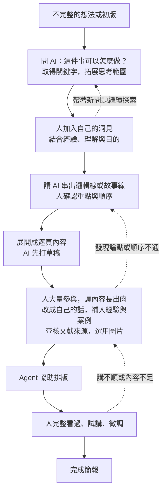

# Agent 時代的知識工作 — 第二週教案：先體驗 agent

> 2026-09-07 整合舊 lesson 與使用者六頁投影片手稿，供本次逐段編輯。這是第二週唯一主 draft：保存教學設計、完整講稿與操作指引；正式教材要等內容逐項確認後再寫入 `lessons/`。

> 來源：使用者於 2026-09-07 提供的六頁投影片逐字稿與「AI 放大器」補充說明、舊教材 `lessons/01-presentation-and-the-knowledge-work-loop.qmd`、2026-09-06 第二週講稿重整決策（`工作紀錄.md`），以及 `kb/presentation-process-before-and-after.md`、原稿引用的 `kb/purposeful-reading-and-agent-assisted-practice.md`。舊教材各段的處理與後續用途見 `06-week2-deferred-topics.md`；本次為 agent 提出的編排初稿，尚未發布。

## 本週目的

學員理解 AI 放大器需要領域知識與駕馭 agent 的能力相輔相成，並從自己想完成的工作，辨認目前需要補足的部分：知識與方向、具體操作，或另一個檢查角度。

用熟悉主題或既有簡報，練習請 agent 補充想法、完成一段操作與協助檢查，再由自己選擇和修改。前半段說明內容演變與人的判斷，後半段用同一任務把資料、想法、要求與決策外部化，實際操作檔案的保存與修改。`AGENTS.md`、`kb/`、`drafts/` 作為本次示範，結構依需求逐步建立，也可以沿用學員熟悉的整理方式。

## 課程流程

| 段落 | 內容 |
|---|---|
| 前半段 | AI 放大器、學習切入點、內容演變流程與交付責任；用演示簡報的版本差異說明流程 |
| 後半段 | 講師操作一段、學員跟做一段：沿用或建立工作資料夾 → 按需保存素材 → 交代規則 → 故事線與逐頁草稿 → 人充實內容 → 排版、試講與修改 |
| 收尾 | 對照流程圖與實際檔案，分享自己的取捨與下一步需要 |

時間以前半段理解流程、後半段親自操作為原則。總時數與分鐘配置尚未定；必要時縮減頁數與素材量，仍保留一則素材、一份規則、一段草稿到成品的操作。不加課後作業。

## 前半段大綱：先講概念，再用簡報示範

> 2026-09-07 依使用者修正：正式授課簡報用來說明概念與帶領課程；演示簡報另備原稿與修改版。先完成概念說明，再切換到演示，不以授課簡報的製作故事穿插開場。

| 段落 | 內容 | 使用材料 |
|---|---|---|
| 開場 | 上次認識 agent，這次找到怎麼學、從哪裡開始試 | 正式授課簡報 |
| AI 是放大器 | 領域知識與駕馭 agent 的能力相輔相成 | 正式授課簡報 |
| 從自身需要切入 | 補知識與方向、完成具體操作、請 agent 協助檢查 | 正式授課簡報 |
| 想法如何逐漸變成一份簡報 | 以演變圖呈現探索、洞見、故事線、逐頁草稿、充實內容、排版與試講 | 正式授課簡報 |
| 交付需要負責 | 從既有流程挑一段交辦，自己檢查、修改與決定採用 | 正式授課簡報 |
| 用版本差異理解流程 | 指出演示原稿、內容修改版與排版版的差異，說明哪一步由誰參與 | 獨立演示簡報的備援版本 |
| 銜接後半段 | 說明接下來會把這個流程實際做成檔案 | 正式授課簡報的操作指引 |

### 演示材料準備

- 正式授課簡報保留完整、清楚的教學順序，課堂修改操作在演示副本進行。
- 演示使用同一主題的三到五頁，固定受眾與目的，保留原稿、人的洞見與故事線、逐頁草稿、充實內容、排版與檢查後的版本，讓差異可比較。具體主題仍待選定。
- 可以從既有備課材料抽出一小段，另存成演示簡報；演示時只交代該段的任務與修改，不需回顧整堂課如何備課。
- 先前七步流程與外部方法的比較保留為可選素材，授課主線改用本次演變圖。若採用，就放在演示的「補充與取捨」階段；不另安排三套方法介紹或三種用途改寫的第二條故事線。
- 示範操作與備援成果須另行準備；目前完成的是教案安排，尚未製作演示 PPTX。

## 材料與成果

- 選熟悉主題或可以提供給工具的既有簡報；講師準備公開或虛構材料備援，學員不需額外準備作業。
- 舊稿另存副本。先保留原有重點，再保存收斂後內容與幾頁排版成果，供前後比較。
- 開始前說明訓練用途設定、雲端傳輸與 GitHub push；關閉訓練不等於不上雲，private repo 仍在雲端。設定細節依實際工具與帳號於備課時確認。
- 測試不用機密、個資與未公開公務資料。課堂示範 `AGENTS.md`、`kb/` 與 `drafts/` 如何隨任務需要建立，學員也可沿用既有整理方式，保存必要中間成果；不要求 GitHub push 或課後作業。
- 產出以可編輯 PPTX 為主，準備預覽與成品備援，避免工具問題耗去整段體驗。

## 本週完成的判斷

學員能指出規則、素材、草稿與輸出各放在哪裡，並請 agent 依這些檔案接續修改；有親自選擇建議、加入觀點、檢查並修改成果，能指出值得保留與仍需改善之處。不要求一定採納 agent 建議，也不以整份簡報完成或視覺華麗程度評分。

## 完整講稿與操作

以下是目前第二週的完整講稿。前半段說明概念、流程與練習資料注意事項，後半段將同一流程實際操作成檔案；兩段都保留在本檔，避免講稿與教案分散成不同版本。

### 前半段：先理解放大器，再看怎麼用

#### 一、先玩玩看 agent 吧

上次介紹了 agent 是什麼。這次我們實際試試看，也讓大家有個方向，知道接下來可以怎麼學 agent。

先說明它可以怎麼和自己的能力配合，再用一份簡報示範：哪些地方可以請它補充，哪些操作可以交給它，完成後又要怎麼檢查和修改。

#### 二、AI 是放大器：領域知識與駕馭 agent 的能力

可以用「領域知識 × 駕馭 agent 的能力」來理解 AI 放大器。領域知識幫助我們知道這件事要往哪個方向做、什麼結果才算合用；駕馭 agent 的能力，則幫助我們提供材料、說明要求，並透過嘗試與回饋，把想法做出來。

這兩邊需要相輔相成。很懂自己的工作，但還不熟悉 agent，可以從熟悉流程中的一段開始練習交辦與修改。很熟悉工具，卻不了解正在處理的主題，就需要補充知識，才比較能判斷產出是否適用。

也不必等到完全學會才開始使用。想學新的事情，可以請 agent 協助閱讀、解釋與製作範例，自己再透過查閱、試用與比較累積理解。學到的知識讓要求更清楚，實作中的問題也會讓自己知道接下來要補什麼。

講師帶法：沿用投影片的乘號表達兩種能力互相配合，不將它解釋成計分公式。這裡的「Agent 能力」指人運用與駕馭 agent 的能力。

#### 三、從自己需要補足的地方開始

先看這次想完成什麼，再看自己缺的是哪一部分，就比較知道要怎麼學、請 agent 幫什麼忙。

**缺知識與方向。** 想學新東西，或還不知道該怎麼做，可以從一本書、一份資料或討論開始，請 agent 協助解釋、整理可能的做法，再做一個小範例來試。遇到不理解的地方繼續查閱與提問，讓自己逐漸知道為什麼要這樣做。

**缺把事情做出來的具體操作。** 已經知道要什麼，但不熟悉操作，可以請 agent 協助製作，再根據成果提出修改。例如懂得要表達的內容，卻不擅長排版與視覺設計，就先試著把這個短板補到工作需要的程度。原本會做、但需要反覆操作的工作，例如格式整理與語句潤飾，也可以從既有流程中挑出來試。

**需要有人一起檢查。** 已有想法或成果，可以請 agent 換一個角度閱讀，找出遺漏、表達不清楚或需要再確認的地方。它提出的疑問是供自己檢查的線索，最後仍要回到材料與工作目的，決定要不要修改。

同一件工作可能同時需要這幾種協助，也可能在實作後才發現真正缺的是另一部分。今天先選一個具體需要，試過之後再調整。

講師帶法：口頭收集「目前想完成什麼、哪一部分需要協助」。學新事、補足短板、減少重複操作與找人看盲點都可以，不要求學員固定選一類，也不另加問卷或回家作業。

#### 四、想法如何逐漸變成一份簡報

剛才談的是自己需要什麼協助。放到做簡報這件事，可以看看內容如何在我們和 AI 的來回討論中，逐漸變得完整。

一開始的想法不完整很正常。可以先問 AI 這件事有哪些做法，取得一些關鍵字，再循著資料與討論擴大思考範圍。過程中把自己的經驗、理解和目的加進去，逐漸形成想講的觀點。

有了這些洞見，再請 AI 協助整理出邏輯線或故事線。自己看過重點與順序後，就可以展開成一頁一頁的內容，先讓它打草稿。

接下來需要人花比較多心力：把草稿改成自己會說的話，加入真實經驗、例子與必要的說明，補上查核過的文獻或適合的圖片。這一段會讓內容長出實質的東西，也可能讓我們發現前面的論點或順序還要調整。

內容逐漸完整後，請 agent 協助排版。最後自己從頭看過、實際講一遍，再依講不順、解釋不足或時間不合適的地方微調。圖上的虛線就是這些需要回頭修改的地方。

講師帶法：先沿實線講一次，再指出「加入自己的洞見」與「充實逐頁草稿」兩處人的投入。AI 可以在各階段提供檢查意見，人持續判斷與修改。本圖是使用者提出的協作流程，回返箭頭由 agent 補充；先前七步與外部方法比較保留在知識庫，不在授課時並列多套流程。

#### 五、交付出去的東西是要負責的

用幾句話就產出一整份簡報，看起來很厲害。但產出的內容是不是你要講的、資料是否正確、聽眾能不能理解，仍然需要自己確認。最後交付出去的人，要能說明裡面的內容與取捨。

如果一次產生太多內容，自己還沒看完，就很難知道哪裡需要修改。可以從原有工作流程中挑一小段，先請 agent 試做，檢查合不合用，再決定要不要交給它更多工作。

例如原本就知道要講什麼，可以先請它整理版面或潤飾語句。每次只改一段，比較原稿與修改版，看看是否保留原意、是否真的更清楚。方向不適合就說明原因，重點被改掉就請它修回來。

講師帶法：這裡先說明交辦與檢查的原則，接著在演示簡報中實際做一次。

#### 六、切換到演示簡報，依流程看修改

接下來打開一份演示用的簡報。先看它要給誰聽、希望對方理解什麼，以及目前有哪些內容。原稿先留下，接著只挑其中一段請 agent 協助。

第一段先補內容。請 AI 提供可能的角度或關鍵字，再加入自己的經驗與洞見，請它協助串成故事線。確認後展開逐頁草稿，選一頁改成自己的說法，補入真實例子或來源，和原稿比較哪裡變得更完整。

第二段再做排版。把已充實的內容交給 agent，打開結果，實際講一頁，找出需要改善的地方並提出具體要求。比較修改前後，再決定留下哪一版。

講師帶法：前半段用準備好的版本展示原稿 → 探索與人的洞見 → 故事線 → 逐頁草稿與人的充實 → 排版與試講，說明變化與取捨。建立資料夾、寫入素材、讀取規則和改稿的操作留到後半段，講師做一段、學員跟做一段；兩段共用獨立演示材料。

#### 開始實作前：先選好練習資料

今天請用公開材料、虛構內容，或確認適合提供給所用工具的材料。不要拿機密、個資或未公開的公務資料來測試。拿自己的舊簡報練習前，也要看過內頁、備註和附件；拿不準就改用講師提供的範例。

使用的工具若有「將內容用於模型訓練」設定，先依該工具與帳號的說明關閉。關閉訓練用途，不表示資料沒有傳到雲端，也不等於所有資料都可以提供給它。

另外，push 到 GitHub 就是把資料上傳到雲端，private repository 也一樣。本次體驗只需要在練習資料夾保存檔案，不要求 push。不要把「存在專案裡」當成不會外傳的保證。

講師備課：確認本次實際使用工具的資料控制選項與適用範圍，準備設定畫面；若帳號沒有相同開關，依官方說明解釋，不套用別家設定。這段只講本次練習必要的注意事項。

### 後半段：把流程實際做成檔案

#### 課前準備與成果

講師準備一個獨立的演示工作資料夾，以及每個階段的備援成果。材料用同一個公開或虛構主題；學員可以沿用範例，也可以挑自己的適當材料。正式授課簡報維持完整，操作在演示與學員各自的資料夾進行。

本次先完成一則素材筆記、一份簡短規則、故事線與逐頁草稿，以及三到五頁可編輯簡報；至少深入修改與試講其中一頁。檔案與資料夾隨這次任務逐步建立；學員可以使用自己的名稱與分類，完成重點在於內容有保存、能找到並接續修改。

#### 先聊背景、討論建議，再把結果存下來

可以像和同事討論工作一樣，先聊自己要做什麼、手上有什麼、目前哪裡還不確定，再問 agent 有什麼建議。背景不必一次講得完整；看到它的回應，再補充、修正或追問，慢慢把想法說清楚。

聊到有值得保留的內容，就請它整理成 Markdown，存進工作資料夾，再一起看有沒有漏掉或改變意思。下一段討論可以接著這些檔案進行。

**聊背景 → 問建議 → 補充與修正 → 整理成 Markdown → 打開確認，再接著做。**

講師帶法：示範幾次短的來回，讓學員看到自己如何回應 agent。下列操作段落描述要做的事與要看的結果，對話中的句子只是例子，學員用自己的說法即可。資料不足時，先補充背景；方向不合時，說明哪裡不合。檔名、位置與格式可以在要保存時一起決定。

#### 外部化保存，結構跟著工作長出來

討論過的資料、想法、結論與修改理由，需要能在之後找回來。和 agent 說明希望把這些內容保存成檔案，之後遇到值得留下的內容，就請它整理保存；下次要用時，再請它讀取接著做。

資料夾可以隨專案需要逐漸建立。開始可能只有原稿和幾則想法，查到的材料多了，就需要一個地方保存；要把想法串成簡報時，再建立草稿。`kb/` 是保存知識與素材的一種常見做法，`drafts/`、`output/` 等名稱則是這次示範採用的選擇。

如果文獻很多，可以和 agent 討論是否增加 `references/`，保存論文、書目或來源索引，筆記再連回原文。這些結構來自實際整理需要，也會在使用中調整；先有少量材料時，可以用一份筆記保存，不必預先開出所有分類。

如果你已經有熟悉的整理方式，就請 agent 先照著原有資料夾與命名方式做。也可以提供一份範例，請它在練習資料夾沿用同樣的結構與寫法，之後遇到新的需要再一起調整。

講師帶法：一開始只展示工作資料夾與現有材料。每次需要保存時，再說明為什麼放這裡、是否需要新資料夾，讓學員看到結構如何形成。`references/` 作為文獻較多時的例子，不加成每位學員的必做步驟。

#### 從流程圖對照到實際工具

前半段看到想法怎麼長成簡報，接下來把每一步留下來。資料放在哪裡、要求寫在哪裡、草稿改到哪裡，都可以在資料夾裡找到，讓自己和 agent 接著使用。

以下是示範過程中可能逐漸形成的對應。沿用自己整理方式的學員，可以和 agent 討論這次的內容放在哪裡。

| 流程中的需要 | 本次示範的存放方式 | 課堂動作 |
|---|---|---|
| 保存已有材料與查到的線索 | `kb/` | 建立一則有來源的素材筆記，分開摘要、自己的洞見與待查事項 |
| 讓 agent 知道目的與要求 | `AGENTS.md` | 寫下受眾、目的、用語、檔案位置與檢查標準；實際請 agent 讀取後工作 |
| 將洞見串成邏輯線或故事線 | `drafts/故事線.md` | 從素材選出重點，加入自己的觀點，再決定順序 |
| 逐頁起草、改成自己的話 | `drafts/逐頁草稿.md` | 補入經驗、例子、文獻與圖片來源，保留待補事項 |
| 排版、檢查與試講 | `output/` 中的 PPTX | 打開成品、修改與另存，內容有問題時回到草稿 |

`AGENTS.md` 是整段工作的共用要求，會隨修改經驗補充；`kb/` 保存素材，不代表其中每項都要放進簡報；`drafts/` 是這次選擇與組織後的草稿。資料夾名稱本身不會讓 agent 自動取得或使用檔案，操作時明確指定要讀什麼，再檢查它實際如何使用。

#### 一、打開工作資料夾，先聊這次想做的事

講師先開啟或指定獨立練習資料夾，把適合練習的原稿副本交給 agent，像平常討論工作一樣說明背景。從空白開始的人，也可以先聊自己的零碎想法。

例如要向新同仁介紹工作，可以先說：「我想讓新同仁知道這項工作怎麼進行，但現在想到的內容有點散。」接著問它會建議從哪裡開始，看完建議再補充聽眾的情況、手上材料與自己在意的事情。

已有熟悉整理方式，就打開資料夾或筆記範例，請 agent 先看，接著照原有方式保存。先確認 agent 正在使用的工作資料夾，以及它是否能讀寫材料；環境有問題時，用講師準備的材料排除。

討論到方向稍微清楚，就請它把目前背景、原有想法與還沒決定的事整理成 Markdown 存下來。打開看一次，確認原本的意思有留下來，作為這次工作的起點。

#### 二、順著問題找資料，把有用的內容留下來

順著剛才的討論，問 AI 還有哪些值得了解的角度或關鍵字。看到有興趣的方向就繼續問、找資料；覺得太遠或用不到，就說明原因，再把討論拉回這次需要。

講師用一份實際讀到的材料示範，和 agent 討論它對這次簡報有什麼幫助。自己想到的經驗或觀點也直接補進對話，讓它協助比較與整理。當場無法查找時，就用講師準備的公開材料。

有了值得留下的內容，再請 agent 整理筆記並建議放哪裡。本次可以在這裡介紹 `kb/`，保存資料、來源、自己的洞見與待查問題。已經有筆記格式就沿用，沒有也可以讓 agent 先整理一版，再依閱讀需要修改。

打開筆記，對照原文與對話，確認來源有保留、自己的觀點沒有被改掉、尚未確認的事情仍清楚標示。AI 提出的解讀可以留下討論，但要和已確認的主張分清楚。

#### 三、把聊清楚的工作方式整理進 AGENTS.md

聊過一段後，通常會知道這份簡報要給誰看、想傳達什麼、自己喜歡怎麼整理，以及哪些地方需要注意。這時請 agent 回顧剛才的討論，把已確認、後面會反覆用到的要求整理出來。

講師在這個時候介紹 `AGENTS.md`，請 agent 把這些要求存進去。內容可以包括外部化保存的習慣、沿用的整理方式、實際材料位置，以及這次討論形成的用語與檢查標準。讓 agent 先根據對話整理，人再看哪些值得保留，不用先列一長串規則才開始工作。

打開檔案，確認它沒有把一次性的建議或尚未決定的事寫成固定規則。需要調整的地方直接說明，請它修改；後續做草稿時，再請它讀取這份檔案並檢查產出。

講師備課：不同工具的自動讀取行為依實際環境確認；課堂可以明確請 agent 讀取檔案。重點是已聊清楚的要求能保存、能接續使用。

#### 四、請 agent 試著把想法串起來

素材與自己的洞見漸漸累積後，請 agent 看看能不能整理出一條邏輯線或故事線。提醒它使用剛才保存的材料與要求，先討論順序，看看哪種講法更適合這次聽眾。

把各段重點連起來讀，想像自己真的講給人聽。如果覺得某段太早、少了解釋或和自己的想法不同，就直接說出來。例如：「這裡要先讓他知道平常怎麼做，才聽得懂後面的問題。」也可以請 agent 從聽眾的角度提出疑問，再一起修改。

順序確認後，請它把故事線整理成 Markdown 存下來，也留下幾句取捨理由。本次示範可在這裡建立 `drafts/`，已有草稿位置就沿用；需要時請 agent 更新 `AGENTS.md` 的位置說明。

打開故事線，確認採用的材料、人的觀點與排列方式都清楚。未採用的資料仍留在素材筆記中，以後可能有別的用途。

#### 五、逐頁起草，再把內容改成自己的話

故事線有了，就請 agent 沿著它先展開幾頁內容。這一步可以先拿到草稿，再逐頁看哪裡需要補充，不必預先把每個欄位或句子規定好。

講師挑一頁，直接說明自己真正想講的意思，補入真實經驗或案例，請 agent 協助改寫；也可以自己動手編輯。讀起來太空泛、太像 AI 的地方，就具體指出哪句沒有說到重點。需要文獻或圖片時，再一起找適合的材料並確認來源。

修改後再讀一次，看是否成為自己能說明的內容。請 agent 保存已確認的逐頁草稿，保留還需要補充的地方；若新增有用資料就整理回素材筆記，若故事線有變動也一起更新。

這次深入修改一頁即可，其餘沿用已有材料。讓學員實際體驗一段內容如何在自己的回饋下長完整。

#### 六、請 agent 排版，實際講一次再微調

內容大致清楚後，和 agent 說明想做成幾頁、需要可編輯的 PowerPoint，以及自己對呈現方式的想法。若還不知道什麼版面合適，也可以先問它建議，試一版再看。

請它讀取確認後的草稿與工作要求，產出簡報並另存，保留原稿。本次示範可在這裡建立 `output/`；實際存放方式和命名依專案決定。

打開檔案，試著選取文字、改一個字，再實際講一頁。發現哪裡看不清楚、講不順或意思不對，就用自己的話說明，例如：「這頁我要講的是前後差異，但現在兩邊看起來太像了。」請 agent 修改，再比較一次。

如果動到內容，就請它同步更新逐頁草稿，之後重新排版才會沿用修正。如果出現值得持續使用的要求，就請它補進 `AGENTS.md`。最後自己確認檔案內容與版面，選擇合用的版本。

工具無法輸出 PPTX 時，先完成可預覽的一頁，搭配講師備援檔理解差異；前面保存的資料、要求和草稿仍可接著使用。

#### 收尾：對照流程與檔案

回到自己的資料夾看一次：資料與洞見、工作要求、故事線與逐頁內容、可以打開的成果，各存在哪裡？本次示範逐漸形成了 `kb/`、`AGENTS.md`、`drafts/` 與 `output/`；學員的結構可以不同，只要自己與 agent 能找到、理解並接續使用。

回想剛才如何聊背景、看建議、補充修改，最後把結果存下來。請學員指出一項採納或刪除的內容、一處自己補充的觀點，以及一項修改後值得保留的要求。這些取捨讓簡報逐漸符合自己的目的，也讓下次可以從留下的檔案接續。

今天完成一輪即可。後續第四週再深入討論怎麼發想、整理材料與檢查蒸餾失真；不加回家作業、不要求 GitHub push。講師現場收集下一次想處理的工作。

## 編輯範圍與後續主題

舊 lesson 適合本週的內容已放入對應講稿：簡報流程（已依使用者後續描述改為想法逐漸成熟的演變圖）、受眾與目的、核心訊息、重點順序、檢查與回退、可編輯性，以及收尾的知識工作循環。

其餘內容與逐項取捨集中至 [第二週移出主題與後續用途](06-week2-deferred-topics.md)。第四週承接思考與蒸餾；專案化的基本檔案操作已納入本週；長期知識庫維護、版本管理、模型配置與簡報設計深入內容依需求安排，不預配第五週以後的週次。原 lesson 保留作為來源，本檔不再重複保存整段候選原文。
