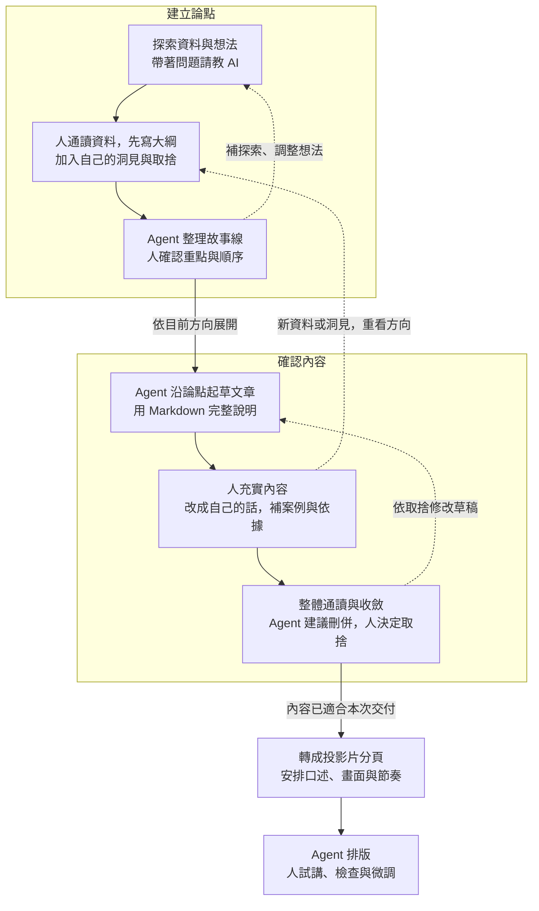

# Agent 時代的知識工作 — 第二週教案：先體驗 agent

> 第二週主教案，保存完整講稿、實作步驟與講師備註；尚未發布。2026-09-07 依使用者確認的收斂方向重整。
> 來源：使用者六頁投影片手稿與後續討論、舊教材 `lessons/01-presentation-and-the-knowledge-work-loop.qmd`、`kb/presentation-process-before-and-after.md`、`kb/purposeful-reading-and-agent-assisted-practice.md` 與 `工作紀錄.md`。舊內容去向見 [第二週移出主題與後續用途](06-week2-deferred-topics.md)。

> 逐頁投影片內容另見 [第二週分頁草稿](07-week2-slide-by-slide-draft.md)，將本教案拆成畫面文字、口述與演示切換。

## 本週目的與安排

理解領域知識與駕馭 agent 的能力如何相輔相成，從自己需要補足的地方開始練習。以介紹 NESA-SLIDE repo 的簡報為實作主題，經過請教、取捨、起草與修改，把自己的想法做成能說明、能接續編輯的成果。

| 段落 | 安排 |
|---|---|
| 前半段 | AI 放大器 → 從需要切入 → 請教與交辦 → 三種產出物 → 兩個迴圈與小步迭代 → 外部化保存 |
| 後半段 | 講師在獨立專案現場製作演示簡報，學員跟做；從空專案建立保存習慣，再經背景與探索，形成論點、文章與投影片 |
| 收尾 | 回看當場保存的版本，說明自己的觀點、取捨與修改 |

預計製作三到五頁可編輯簡報，至少將一條論點走到文章段落、投影片分頁、排版與試講。保存討論、素材、工作要求，以及論點、文章與投影片的當前版本，能找到並請 agent 接續使用；其餘內容依時間擴展。不以視覺華麗程度評分，不要求 GitHub push 或課後作業。

## 前半段：概念與流程

上次介紹了 agent 是什麼，這次我們實際試試看，也讓大家有個方向，知道接下來可以怎麼學。先看它如何和自己的能力配合，再用做簡報的流程，理解哪些地方可以請它協助，以及自己要參與什麼。

### 一、AI 是放大器

可以用「領域知識 × 駕馭 agent 的能力」來理解 AI 放大器。領域知識幫助我們判斷方向與結果是否合用；駕馭 agent 的能力，則幫助我們提供材料、說明要求，透過嘗試與回饋把想法做出來。

兩邊需要相輔相成。熟悉工作但還不熟悉工具，可以從既有流程的一段開始練習；熟悉工具但不了解主題，就需要補知識，累積判斷的依據。也可以邊學邊做，透過查閱、試用與比較，逐漸知道下一步要補什麼。

交付出去的內容，自己要能判斷與說明。Agent 可以協助產出和檢查，最後仍由自己確認資料、意思與表達是否適合這次工作。

### 二、從自己需要補足的地方開始

先看想完成什麼，再看目前需要哪一種協助。

- **缺知識與方向：** 從資料或討論開始，請 agent 解釋、提供關鍵字與可能做法，再查閱或試做。例如想學一種陌生的簡報方法，先了解它適合什麼情境。
- **缺具體操作：** 已經知道要什麼，就請 agent 協助做出來。例如內容有了，請它排版；原本會做的格式整理與語句潤飾，也可以挑一段交辦。
- **需要協助檢查：** 請 agent 從另一個角度找遺漏、疑問與盲點，再回到材料與工作目的，決定是否修改。

同一件工作可能需要幾種協助，也可能試過才發現真正缺的是另一部分。今天先選一個具體需要，開始做，再調整。

### 三、怎麼和 agent 合作

**請教時，像在和不同領域的導師討論。** 帶著自己的專業、經驗與問題，從它提供的關鍵字和觀點繼續追問，再用資料與實作確認是否適用。背景不必一次講完，可以依回應補充。

已有自己的想法，就先說目前怎麼想、為什麼這樣想，再請它補充。把建議和原想法比較，自己決定哪些值得保留、哪些理由讓自己改變看法。自己的觀察與取捨在這裡加入，成果才能表達自己的理解與立場。

**交辦時，把方向與重要限制講清楚。** 說明給誰用、做成什麼、範圍在哪，以及格式、長度或必須保留的內容。區分必要條件與偏好，具體做法讓 agent 提出；太籠統容易偏離期待，規定太細也可能限制其他合適的方法。

還不清楚方向時先請教，有了方向再交辦；看到成果有新問題，也可以回頭討論。用自己的話來回溝通，有值得保留的內容再整理保存。

如果已經累積出自己的工作流程，不用急著全部切換成 agent。哪些步驟用原本的方法更順手，就繼續沿用；遇到需要協助的環節，再試著加入 agent，依實際效果調整。

### 四、論點、文章與投影片

這個流程會留下三種產出物，各有用途：

| 產出物 | 保存什麼、如何使用 |
|---|---|
| 論點 | 想傳達的主張、依據與組織方式；一併整理棄案及放棄理由，供之後回看或重新評估 |
| 文章 | 用連續文字把論點與脈絡說完整，可作備講與輔助閱讀材料 |
| 投影片 | 將內容安排成口述與畫面，包含分頁草稿及排版成果，安排停留、揭示重點與換頁的節奏 |

### 五、想法如何逐漸變成一份簡報

做簡報時有兩個相互往返的迴圈：「建立論點」處理想講什麼與如何組織；「確認內容」把草稿充實、收斂成自己能說明的內容。先依目前方向展開，後面出現的新資料或洞見，也可能讓我們回頭修改論點與方向。

讀這張圖時，留意三件事：

- **人先通讀、自己列綱。** 把探索過的材料想一遍，加入自己的洞見與取捨，再讓 agent 沿方向整理。粗略條列即可；真的卡住，可以請 AI 試串，再逐段確認理由。
- **兩個迴圈可以往返。** 新資料或內容中的問題，可能推翻原先論點，回到大綱調整。每次只改受影響的部分，不必整圈重做。
- **接近交付時逐漸收斂。** 前期容許探索與重排，後期縮小改動範圍，優先修正正確性與理解問題；其他延伸想法先保存，留待下一版。

方向尚未清楚時，先在對話中討論做法；內容變動時，盡量在 Markdown 修改一段論點、文章或分頁草稿，確認後再排版，減少美編完成後才整批返工。試講發現問題，仍回到相應的內容或論點修正。

### 六、把過程保存下來，才能接著做

和 agent 說明，希望把資料、想法、結論與修改理由外部化存成檔案。討論到有值得留下的內容，就請它整理成 Markdown，自己打開確認；之後再請它讀取接著做。

資料夾結構可以隨需要形成。開始只有原稿和想法，本次先用 `kb/` 保存討論與素材，要形成文章與投影片時再建立草稿位置。`kb/` 是保存知識與素材的常見方式；`drafts/` 等名稱依專案選擇，文獻很多也可能增加 `references/`。

已有熟悉的整理方式，就請 agent 先照著做，也可以提供範例。從少量檔案開始，遇到新的整理需要再調整。

## 後半段：把流程實際做成檔案

本次現場製作一份介紹 [NESA-SLIDE](https://github.com/slidefirm/NESA-SLIDE) 的簡報。從閱讀 repo、理解它的簡報製作與排版方式開始，整理成自己的介紹，再把讀到的做法用在這份簡報上。讓介紹的內容和實際排版互相對照，走完前面的兩個迴圈。

### 開始前

使用公開、虛構或確認適合提供給工具的材料；不要拿機密、個資或未公開公務資料測試。舊簡報的內頁、備註與附件也要確認，拿不準就用講師範例。關閉模型訓練用途不代表資料不上雲，GitHub private repo 也在雲端；本次不要求 push。

講師另開演示專案，當場做一段，學員跟做一段。每一步保存值得留下的結果，打開檢查後再繼續；在重要取捨處記下理由，留下前後版本。檔名與位置依當下需要決定，對話用自己的說法。

下面是本次示範可能形成的檔案；已有整理方式可以沿用。

| 保存的內容 | 本次示範位置 |
|---|---|
| 素材、來源、自己的觀點與待查事項 | `kb/` |
| 共用的工作要求與保存方式 | `AGENTS.md` |
| 論點與棄案、文章、投影片分頁草稿 | `drafts/`，分別保存 |
| 可編輯簡報成果 | `output/` |

資料夾名稱本身不會讓 agent 自動使用檔案；操作時指定要讀哪些內容，再檢查它如何使用。

### 一、初始化專案與保存習慣

開一個空的演示／練習專案，先簡述要介紹 NESA-SLIDE，建立 `kb/`，請 agent 將後續討論持續寫進去。把這個保存習慣與實際位置整理到 `AGENTS.md`，打開確認，再請 agent 依此工作。

保存內容包含探索過程、自己的想法、agent 建議、取捨與未定事項，之後可以再整理，讓脈絡能接續。已有熟悉的整理方式，也可以先請 agent 沿用。

### 二、聊背景與限制，探索主題

接著交代受眾、演講時間、簡報長度與其他必要限制，討論希望觀眾知道什麼。先說自己的大方向，再請 AI 拓展、提出可能調整之處，繼續聊天補齊；確認的背景與要求隨進度保存，適用整個專案的內容補進 `AGENTS.md`。

例如：「我想向同仁介紹 NESA-SLIDE，也想讓他們看懂簡報怎麼安排版面。我想先看它解決什麼問題，再挑一兩個這次用得到的例子，你覺得還缺什麼？」時間與長度依現場安排補充。

提供 repo 連結，請 agent 從 README 找到相關設計說明、版型或 demo，記下來源與版本。人對照原文，把自己的簡報經驗放進討論，確認摘要、觀點與待查事項有分清楚。先選能支持本次排版取捨的例子深入看。

### 三、建立論點，保存故事線與棄案

先通讀這次探索的材料、筆記與自己的觀點，暫時不用 AI 代寫，自己列出想講的重點、取捨與大致順序。直接寫幾個條列即可，保存這份初步大綱。

請 agent 讀取大綱、素材與工作要求，沿自己的方向提出故事線，先在對話中確認安排。真的想不到時，就請它先試串，自己逐段對照材料，說明認同與要修改的地方。

連讀各段，指出重複、跳太快或和自己意思不同的地方；也可以請它從聽眾角度提出疑問，再自行決定怎麼改。

保存目前採用的論點、依據與故事線，並整理棄案及理由，例如證據不足、超出範圍或不適合本次受眾；不必為了湊數新增棄案。本次可建立 `drafts/`，和起點比較，確認自己的觀點及採用材料有保留。

### 四、起草文章，充實後整體收斂

請 agent 沿論點與故事線先起草一段 Markdown，看過寫法再展開文章。以連續文字把論點、前後關係與必要說明寫完整。

補入自己對 repo 做法的理解與實際範例，直接編輯或請 agent 改寫。引用說明、圖片或 demo 時保留來源，未完成處標記待補；確認自己能說明內容。

通讀文章，請 agent 建議刪重、合併與重排，由自己決定取捨。新資料補進素材筆記，論點有變就更新論點紀錄，留下棄案與理由。保存文章，供備講或作為聽眾的輔助閱讀材料。

### 五、轉成投影片分頁，安排口述與畫面

從文章整理三到五頁分頁草稿，逐頁安排要傳達什麼、口述什麼、畫面呈現什麼，以及停留與換頁的節奏。文章保留完整脈絡，分頁依現場表達重新組織內容。

挑一頁深入修改，確認口述和畫面互相配合，再通讀整份分頁草稿，檢查順序、重複與時間。分頁草稿另存，保留文章作為輔助；若發現論點問題，仍回到前面調整。

### 六、輸出 PPTX，運用排版技巧

先確認本次要輸出的文字與順序，待定主張先補清楚或移出輸出範圍。請 agent 製作可編輯 PPTX，交代頁數、範圍與必要格式；有指定版型就提供，其他做法讓它提出。

例如：「把剛才介紹 NESA-SLIDE 的內容做成五頁以內、可以編輯的 PowerPoint。參考我們選出的版型與設計說明，先提出這一頁適合怎麼排，說明原因，再試做一頁。」

先看一頁版面，對照剛才介紹的做法：內容關係有沒有表達出來、重點與留白是否清楚，再決定是否展開。說明採用這個版型的原因，檢查成果是否真的運用了介紹過的方法。

### 七、試講、檢查與交付

打開 PPTX，試著選取文字修改，並實際講一頁，找出看不清楚、講不順或意思不對的地方。方向或內容有問題就回到相應的 Markdown 修改，再更新投影片；單純版面問題就改該頁。值得沿用的要求補進 `AGENTS.md`。

回到資料夾，確認論點與棄案、文章、投影片及相關來源的位置和最新版本。文章可供備講或輔助閱讀，投影片用於現場表達；確認本次交付範圍，標明仍待處理的內容。

用保存的討論與版本回看變化，請學員指出一項採納或刪除的內容、一處自己補充的觀點，以及一項值得沿用的修改要求。至少完整走過一條論點到文章段落、分頁、排版與試講，其餘依時間擴展。講師收集下一次想處理的工作，本次練習在課堂完成。

## 講師備註

### 現場演示與準備

- 正式課程簡報負責講概念與帶領實作。演示使用獨立工作資料夾與對話，在後半現場產生故事線、草稿及簡報，完整保存素材、提問、建議、人的取捨與版本，避免混入整門課的設計紀錄。
- 實作主題已定為介紹 NESA-SLIDE repo。課前確認當時版本、可用的 README、設計說明、版型與 demo，準備公開材料備援並測試輸出環境；故事線、草稿與演示簡報仍在課堂當場產生。
- 排版教學隨介紹內容進行：理解 repo 做法、選出適合的範例，再套用到正在製作的簡報並檢查。實際需要哪些 NESA skills 與工具依備課測試決定，不把完整安裝流程先加成學員必做項目。
- 備援成果只在工具異常時使用，清楚說明哪些為預備版本、哪些在現場完成。查找失敗可改讀已備材料；輸出失敗可用一頁預覽搭配備援 PPTX 檢查，記下尚未完成的步驟。
- 依實際工具與帳號確認資料控制及訓練用途設定，準備設定畫面與適用說明；不將不同工具的設定互相套用。
- 確認所用工具如何讀取 `AGENTS.md`，課堂可明確請它讀取，再從產出檢查要求是否被使用。
- 總時數與配比仍待定。時間不足先縮減頁數與素材量，保留一條論點到文章段落、分頁、可編輯輸出及試講的完整體驗。

### 講解與帶領重點

- 放大器的乘號表達兩種能力互相配合，不當成計分公式；「Agent 能力」指人運用與駕馭 agent 的能力。
- 在需要切入段口頭收集學員想完成什麼、需要何種協助，不要求固定分類或另填問卷。
- 請教與交辦用短的來回呈現；交辦時指出方向與限制已清楚，具體做法留給 agent。例句供理解，不要求複製模板，也不保證放寬做法必然更好。
- 流程圖先說明「建立論點」與「確認內容」兩個迴圈，再指出人先列綱、充實草稿與決定收斂取捨的位置；不再並列多套流程。先前七步、外部流程比較與本課程修改史保留在知識庫。
- 每次只處理能看完、能判斷的一部分。檔案用途在需要保存時說明，結構逐步形成；新增位置影響後續工作時，再更新共用要求。
- 討論持續保存在 `kb/`，保留探索脈絡、取捨及未定事項；再從中整理重要版本。素材新增、故事線改變或共用要求改變時，更新對應內容，避免每次小修都重寫所有檔案。

### 編輯範圍與後續主題

本週保留放大器、協作心態、內容演變與基本檔案操作。第四週承接思考與蒸餾的深入方法；長期知識庫維護、版本管理、模型配置與簡報設計深入內容依需求安排，不預配第五週以後的週次。

舊 lesson 取捨與來源集中於 [第二週移出主題與後續用途](06-week2-deferred-topics.md)，原 lesson 保留作為來源。正式教材、網站與 PPTX 尚未隨本次重整更新。
