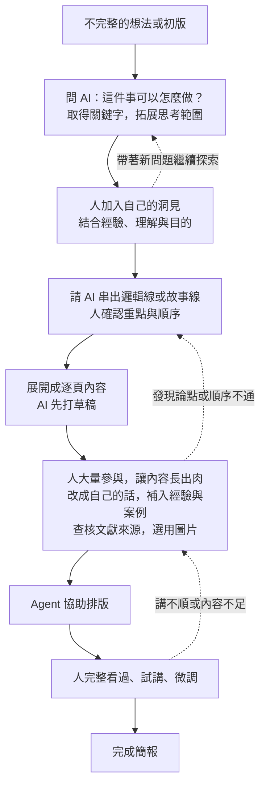

# Agent 時代的知識工作 — 第二週教案：先體驗 agent

> 2026-09-07 整合舊 lesson 與使用者六頁投影片手稿，供本次逐段編輯。這是第二週唯一主 draft：保存教學設計、完整講稿與操作指引；正式教材要等內容逐項確認後再寫入 `lessons/`。

> 來源：使用者於 2026-09-07 提供的六頁投影片逐字稿與「AI 放大器」補充說明、舊教材 `lessons/01-presentation-and-the-knowledge-work-loop.qmd`、2026-09-06 第二週講稿重整決策（`工作紀錄.md`），以及 `kb/presentation-process-before-and-after.md`、原稿引用的 `kb/purposeful-reading-and-agent-assisted-practice.md`。舊教材各段的處理與後續用途見 `06-week2-deferred-topics.md`；本次為 agent 提出的編排初稿，尚未發布。

## 本週目的

學員理解 AI 放大器需要領域知識與駕馭 agent 的能力相輔相成，並從自己想完成的工作，辨認目前需要補足的部分：知識與方向、具體操作，或另一個檢查角度。

用熟悉主題或既有簡報，練習請 agent 補充想法、完成一段操作與協助檢查，再由自己選擇和修改。前半段說明放大器、請教與交辦、自己的洞見、內容演變與外部化保存，後半段用同一任務把資料、想法、要求與決策外部化，實際操作檔案的保存與修改。`AGENTS.md`、`kb/`、`drafts/` 作為本次示範，結構依需求逐步建立，也可以沿用學員熟悉的整理方式。

## 課程流程

| 段落 | 內容 |
|---|---|
| 前半段 | AI 放大器、學習切入點、請教與交辦、自己的洞見、內容演變、外部化與資料夾用途、交付責任；用流程圖說明人的參與 |
| 後半段 | 講師在獨立演示專案中現場做出簡報，保留完整過程；學員跟做：沿用或建立工作資料夾 → 按需保存素材 → 交代規則 → 故事線與逐頁草稿 → 人充實內容 → 排版、試講與修改 |
| 收尾 | 對照流程圖與實際檔案，分享自己的取捨與下一步需要 |

時間以前半段理解流程、後半段親自操作為原則。總時數與分鐘配置尚未定；必要時縮減頁數與素材量，仍保留一則素材、一份規則、一段草稿到成品的操作。不加課後作業。

## 前半段大綱：概念與流程

> 2026-09-07 依使用者釐清：前半段講概念與流程，演示簡報在後半段實作時現場產生。演示使用獨立專案與對話，以保存完整操作過程，避免混入整門課的設計紀錄。

| 段落 | 內容 | 使用材料 |
|---|---|---|
| 開場 | 上次認識 agent，這次找到怎麼學、從哪裡開始試 | 正式授課簡報 |
| AI 是放大器 | 領域知識與駕馭 agent 的能力相輔相成 | 正式授課簡報 |
| 從自身需要切入 | 補知識與方向、完成具體操作、請 agent 協助檢查 | 正式授課簡報 |
| 請教與交辦 | 請教先以自己的想法為起點，加入洞見；交辦說清楚方向與限制，保留做法空間 | 正式授課簡報 |
| 想法如何逐漸變成一份簡報 | 以演變圖呈現探索、洞見、故事線、逐頁草稿、充實內容、排版與試講 | 正式授課簡報 |
| 外部化與資料夾用途 | 討論結果存成 Markdown；沿用既有方式或按需形成 kb、AGENTS.md、drafts 等結構 | 正式授課簡報 |
| 交付需要負責 | 從既有流程挑一段交辦，自己檢查、修改與決定採用 | 正式授課簡報 |
| 銜接後半段 | 說明接下來會把這個流程實際做成檔案 | 正式授課簡報的操作指引 |

### 現場演示準備與紀錄

- 正式課程簡報用來講概念與帶領實作。演示另開獨立工作資料夾與對話，在後半段從材料或想法開始，現場討論、整理、起草、排版與修改，逐步做出簡報。
- 分開專案是為了完整保存這次演示的脈絡。素材、提問、agent 建議、人的取捨、草稿與成品，都能對應回同一次操作，避免混入整門課的課綱、備課與其他主題討論。
- 課前選定一個公開或虛構主題，準備可用的原始材料並確認工具環境。可以用既有簡報作原始材料，但故事線、逐頁草稿與修改成果在實作時產生。具體主題仍待選定。
- 保留演示對話，以及每次確認後的 Markdown 與修改版本。請 agent 隨進度記下採用／不採用的理由與待處理問題；保存方式按專案需要決定，例如累積成一份工作紀錄。
- 先前流程比較可作原始素材候選，課堂仍實際進行請教、取捨與改稿。工具異常時才使用備援成果，並說明是預備版本，區分當場完成與尚未完成的步驟。

## 材料與成果

- 選熟悉主題或可以提供給工具的既有簡報；講師準備公開或虛構材料備援，學員不需額外準備作業。
- 舊稿另存副本。先保留原有重點，再保存收斂後內容與幾頁排版成果，供前後比較。
- 開始前說明訓練用途設定、雲端傳輸與 GitHub push；關閉訓練不等於不上雲，private repo 仍在雲端。設定細節依實際工具與帳號於備課時確認。
- 測試不用機密、個資與未公開公務資料。課堂示範 `AGENTS.md`、`kb/` 與 `drafts/` 如何隨任務需要建立，學員也可沿用既有整理方式，保存必要中間成果；不要求 GitHub push 或課後作業。
- 產出以可編輯 PPTX 為主，準備預覽與成品備援，避免工具問題耗去整段體驗。

### 實作準備與完成範圍

講師準備獨立的演示工作資料夾、對話與原始材料。後半段現場產生中間檔案與簡報，學員可以沿用同一素材，也可以挑自己的適當材料；操作各自在獨立資料夾進行。備援成果僅供工具異常時使用。

本次先完成一則素材筆記、一份簡短規則、故事線與逐頁草稿，以及三到五頁可編輯簡報；至少深入修改與試講其中一頁。檔案與資料夾隨這次任務逐步建立；學員可以使用自己的名稱與分類，完成重點在於內容有保存、能找到並接續修改。

## 本週完成的判斷

學員能指出規則、素材、草稿與輸出各放在哪裡，並請 agent 依這些檔案接續修改；有親自選擇建議、加入觀點、檢查並修改成果，能指出值得保留與仍需改善之處。不要求一定採納 agent 建議，也不以整份簡報完成或視覺華麗程度評分。

## 完整講稿與操作

以下是目前第二週的完整講稿。前半段說明概念、流程與練習資料注意事項，後半段將同一流程實際操作成檔案；兩段都保留在本檔，避免講稿與教案分散成不同版本。

### 前半段：先理解放大器，再看怎麼用

#### 一、先玩玩看 agent 吧

上次介紹了 agent 是什麼。這次我們實際試試看，也讓大家有個方向，知道接下來可以怎麼學 agent。

先說明它可以怎麼和自己的能力配合，再用一份簡報示範：哪些地方可以請它補充，哪些操作可以交給它，完成後又要怎麼檢查和修改。

#### 二、AI 是放大器：領域知識與駕馭 agent 的能力

可以用「領域知識 × 駕馭 agent 的能力」來理解 AI 放大器。領域知識幫助我們知道這件事要往哪個方向做、什麼結果才算合用；駕馭 agent 的能力，則幫助我們提供材料、說明要求，並透過嘗試與回饋，把想法做出來。

這兩邊需要相輔相成。很懂自己的工作，但還不熟悉 agent，可以從熟悉流程中的一段開始練習交辦與修改。很熟悉工具，卻不了解正在處理的主題，就需要補充知識，才比較能判斷產出是否適用。

也不必等到完全學會才開始使用。想學新的事情，可以請 agent 協助閱讀、解釋與製作範例，自己再透過查閱、試用與比較累積理解。學到的知識讓要求更清楚，實作中的問題也會讓自己知道接下來要補什麼。

講師帶法：沿用投影片的乘號表達兩種能力互相配合，不將它解釋成計分公式。這裡的「Agent 能力」指人運用與駕馭 agent 的能力。

#### 三、從自己需要補足的地方開始

先看這次想完成什麼，再看自己缺的是哪一部分，就比較知道要怎麼學、請 agent 幫什麼忙。

**缺知識與方向。** 想學新東西，或還不知道該怎麼做，可以從一本書、一份資料或討論開始，請 agent 協助解釋、整理可能的做法，再做一個小範例來試。遇到不理解的地方繼續查閱與提問，讓自己逐漸知道為什麼要這樣做。

**缺把事情做出來的具體操作。** 已經知道要什麼，但不熟悉操作，可以請 agent 協助製作，再根據成果提出修改。例如懂得要表達的內容，卻不擅長排版與視覺設計，就先試著把這個短板補到工作需要的程度。原本會做、但需要反覆操作的工作，例如格式整理與語句潤飾，也可以從既有流程中挑出來試。

**需要有人一起檢查。** 已有想法或成果，可以請 agent 換一個角度閱讀，找出遺漏、表達不清楚或需要再確認的地方。它提出的疑問是供自己檢查的線索，最後仍要回到材料與工作目的，決定要不要修改。

同一件工作可能同時需要這幾種協助，也可能在實作後才發現真正缺的是另一部分。今天先選一個具體需要，試過之後再調整。

講師帶法：口頭收集「目前想完成什麼、哪一部分需要協助」。學新事、補足短板、減少重複操作與找人看盲點都可以，不要求學員固定選一類，也不另加問卷或回家作業。

#### 四、請教時拓展想法，交辦時說清楚方向與限制

聊天時，可以把 agent 當作不同領域的導師來請教。你熟悉自己的專業與實際工作脈絡，可以把問題、已有經驗與不確定的地方說給它聽，再從它提出的關鍵字、方法與不同觀點繼續追問，挖出自己原先不知道的事情。它提供的線索，再透過資料與實作確認是否適用。

如果已經有自己的想法，就先以自己的想法為主，說明目前怎麼想、為什麼這樣想，再請 agent 補充或提出不同看法。自己想過的內容有可以接續思考的脈絡，也比較容易判斷哪些建議真正有幫助。

看到另一套完整的說法時，先和原本的想法比較：哪裡補到了自己沒想到的事，哪裡不符合自己的經驗，哪些理由值得讓自己改變看法。由自己決定如何修正，持續把觀察、疑問與取捨放進對話，洞見也會在這個過程中形成。最後的成果才會表達自己的理解與立場，自己也能說明為什麼這樣寫。

背景不必一次講得完整。看到回應後，再補充、修正或追問。聊到有值得留下的內容，就請它整理成 Markdown 存起來，再打開確認有沒有漏掉或改變意思。

準備請 agent 完成一個任務時，就把方向與重要限制講明白：要給誰用、做成什麼、處理到哪裡，以及格式、篇幅、時間或必須保留的內容。具體做法可以請它提出，在這些條件內選擇合適的方法。

說得太籠統，可能做出和自己期待不同的東西；把每個步驟與版面細節都規定好，也可能限制了其他更好的做法，或要求了工具難以精確重現的效果。交辦時區分必要條件與可討論的偏好，讓 agent 有空間提出自己沒想到的方案，再由人依目的與限制檢查。

| 當下在做什麼 | 對話重點 | 接下來怎麼做 |
|---|---|---|
| 請教與探索 | 先說自己的想法與理由，再問方法、關鍵字、不同觀點 | 和原想法比較，自己取捨與修正，加入洞見後保存 |
| 交辦與製作 | 講清楚方向、範圍、格式與長度等必要限制 | 讓 agent 提出做法、完成一版，再檢查與修改 |

同一段工作可以在兩種心態之間切換。還不知道怎麼做時先請教，有了方向再交辦；看過成果發現新問題，也可以回頭討論。已經確認並保存的背景與要求，請 agent 讀取沿用即可。

講師帶法：示範幾次短的來回，在轉成交辦時說明「現在想清楚要做什麼了，接著把這次一定要符合的條件交代清楚」。後半段的短句只是對話例子，學員用自己的話說；放寬做法的目的，是保留探索其他方案的空間，不預先保證一定比原想像更好。

#### 五、想法如何逐漸變成一份簡報

把請教、自己的洞見與交辦放到做簡報這件事，就可以看到內容如何在我們和 AI 的來回討論中，逐漸變得完整。

一開始的想法不完整很正常。可以先問 AI 這件事有哪些做法，取得一些關鍵字，再循著資料與討論擴大思考範圍。過程中把自己的經驗、理解和目的加進去，逐漸形成想講的觀點。

有了這些洞見，再請 AI 協助整理出邏輯線或故事線。自己看過重點與順序後，就可以展開成一頁一頁的內容，先讓它打草稿。

接下來需要人花比較多心力：把草稿改成自己會說的話，加入真實經驗、例子與必要的說明，補上查核過的文獻或適合的圖片。這一段會讓內容長出實質的東西，也可能讓我們發現前面的論點或順序還要調整。

內容逐漸完整後，請 agent 協助排版。最後自己從頭看過、實際講一遍，再依講不順、解釋不足或時間不合適的地方微調。圖上的虛線就是這些需要回頭修改的地方。

講師帶法：先沿實線講一次，再指出「加入自己的洞見」與「充實逐頁草稿」兩處人的投入。AI 可以在各階段提供檢查意見，人持續判斷與修改。本圖是使用者提出的協作流程，回返箭頭由 agent 補充；先前七步與外部方法比較保留在知識庫，不在授課時並列多套流程。

#### 六、外部化保存，結構跟著工作長出來

討論過的資料、想法、結論與修改理由，需要能在之後找回來。和 agent 說明希望把這些內容保存成檔案，之後遇到值得留下的內容，就請它整理保存；下次要用時，再請它讀取接著做。

資料夾可以隨專案需要逐漸建立。開始可能只有原稿和幾則想法，查到的材料多了，就需要一個地方保存；要把想法串成簡報時，再建立草稿。`kb/` 是保存知識與素材的一種常見做法，`drafts/`、`output/` 等名稱則是這次示範採用的選擇。

如果文獻很多，可以和 agent 討論是否增加 `references/`，保存論文、書目或來源索引，筆記再連回原文。這些結構來自實際整理需要，也會在使用中調整；先有少量材料時，可以用一份筆記保存，不必預先開出所有分類。

如果你已經有熟悉的整理方式，就請 agent 先照著原有資料夾與命名方式做。也可以提供一份範例，請它在練習資料夾沿用同樣的結構與寫法，之後遇到新的需要再一起調整。

講師帶法：一開始只展示工作資料夾與現有材料。每次需要保存時，再說明為什麼放這裡、是否需要新資料夾，讓學員看到結構如何形成。`references/` 作為文獻較多時的例子，不加成每位學員的必做步驟。

##### 各種檔案在流程中的用途

把想法形成簡報的過程留下來。資料放在哪裡、要求寫在哪裡、草稿改到哪裡，都可以在資料夾裡找到，讓自己和 agent 接著使用。

以下是示範過程中可能逐漸形成的對應。沿用自己整理方式的學員，可以和 agent 討論這次的內容放在哪裡。

| 流程中的需要 | 本次示範的存放方式 | 課堂動作 |
|---|---|---|
| 保存已有材料與查到的線索 | `kb/` | 建立一則有來源的素材筆記，分開摘要、自己的洞見與待查事項 |
| 讓 agent 知道目的與要求 | `AGENTS.md` | 寫下受眾、目的、用語、檔案位置與檢查標準；實際請 agent 讀取後工作 |
| 將洞見串成邏輯線或故事線 | `drafts/故事線.md` | 從素材選出重點，加入自己的觀點，再決定順序 |
| 逐頁起草、改成自己的話 | `drafts/逐頁草稿.md` | 補入經驗、例子、文獻與圖片來源，保留待補事項 |
| 排版、檢查與試講 | `output/` 中的 PPTX | 打開成品、修改與另存，內容有問題時回到草稿 |

`AGENTS.md` 是整段工作的共用要求，會隨修改經驗補充；`kb/` 保存素材，不代表其中每項都要放進簡報；`drafts/` 是這次選擇與組織後的草稿。資料夾名稱本身不會讓 agent 自動取得或使用檔案，操作時明確指定要讀什麼，再檢查它實際如何使用。

講師備課：不同工具對 `AGENTS.md` 的自動讀取行為依實際環境確認；課堂可明確請 agent 讀取檔案，再由產出檢查要求是否被使用。

#### 七、交付出去的東西是要負責的

用幾句話就產出一整份簡報，看起來很厲害。但產出的內容是不是你要講的、資料是否正確、聽眾能不能理解，仍然需要自己確認。最後交付出去的人，要能說明裡面的內容與取捨。

如果一次產生太多內容，自己還沒看完，就很難知道哪裡需要修改。可以從原有工作流程中挑一小段，先請 agent 試做，檢查合不合用，再決定要不要交給它更多工作。

例如原本就知道要講什麼，可以先請它整理版面或潤飾語句。每次只改一段，比較原稿與修改版，看看是否保留原意、是否真的更清楚。方向不適合就說明原因，重點被改掉就請它修回來。

講師帶法：這裡先說明交辦與檢查的原則，接著在演示簡報中實際做一次。

#### 開始實作前：先選好練習資料

今天請用公開材料、虛構內容，或確認適合提供給所用工具的材料。不要拿機密、個資或未公開的公務資料來測試。拿自己的舊簡報練習前，也要看過內頁、備註和附件；拿不準就改用講師提供的範例。

使用的工具若有「將內容用於模型訓練」設定，先依該工具與帳號的說明關閉。關閉訓練用途，不表示資料沒有傳到雲端，也不等於所有資料都可以提供給它。

另外，push 到 GitHub 就是把資料上傳到雲端，private repository 也一樣。本次體驗只需要在練習資料夾保存檔案，不要求 push。不要把「存在專案裡」當成不會外傳的保證。

講師備課：確認本次實際使用工具的資料控制選項與適用範圍，準備設定畫面；若帳號沒有相同開關，依官方說明解釋，不套用別家設定。這段只講本次練習必要的注意事項。

### 後半段：把流程實際做成檔案

接下來用剛才的流程，當場做一份簡報。講師在獨立演示專案操作一段，學員跟做一段。每一步都打開剛產生的檔案確認，再進到下一步；對話用自己的說法，檔名與位置依當下工作資料夾決定。

演示對話保留在這個專案。每次確認方向或修改內容後，請 agent 保存當下版本與取捨理由，讓最後可以回看整個過程。

#### 一、打開工作資料夾，聊背景並保存起點

另開演示／練習專案與對話，放入可用原始材料的副本，或直接從自己的想法開始。先聊這次想做什麼、目前的想法與理由，再問 agent 有什麼補充；已有整理方式就打開範例，請它沿用。

例如：「我想先講新同仁常遇到的問題，再說明流程。你覺得這樣安排還缺什麼？」看過回應後，補充背景並決定要調整的地方。

請 agent 把原有想法、目前背景與未定事項整理成 Markdown 保存，留下這次操作的起點。打開檔案，確認位置正確、自己的意思有留下來；若無法讀寫，先用講師備援材料排除問題。

#### 二、查閱一份材料，保存筆記與自己的觀點

從討論中挑一個值得了解的角度或關鍵字，請 agent 協助查找並讀取一份材料；當場無法查找時，使用講師提供的公開資料。

說出自己的經驗或觀察，和資料比較，再決定哪些內容有用、哪些暫不採用。請 agent 保存筆記與來源；本次示範可在這裡建立 `kb/`，已有位置就沿用。

打開筆記對照原文，確認資料摘要、自己的觀點與待查問題有分清楚，並能指出一項取捨及理由。

#### 三、把已確認的要求存進 AGENTS.md

請 agent 回顧剛才的討論，整理這次的目的、受眾、保存習慣、實際材料位置與已確認的要求，存進 `AGENTS.md`。

打開檔案逐項看過，修改不合適的地方，移除尚未決定或只適用一次的建議。接著請 agent 讀取修改後的檔案，準備整理故事線。

確認檔案有保存，並在下一步檢查產出是否符合裡面的要求。

#### 四、串出故事線，修改後保存草稿

請 agent 讀取已保存的素材、自己的洞見與工作要求，試著排出這次簡報的重點與順序。

連讀各段重點，指出重複、跳太快或和自己意思不同的地方，請它修改。也可請它從聽眾角度提出疑問，再自己決定是否調整。

順序確認後，請它保存故事線與幾句取捨理由。本次示範可建立 `drafts/`，已有草稿位置就沿用；新增位置時，請它更新 `AGENTS.md` 的說明。打開草稿和原想法比較，確認自己的觀點與採用的材料都有保留。

#### 五、逐頁起草，深入修改其中一頁

交代這次的受眾、內容範圍與頁數，請 agent 沿故事線展開逐頁內容；已保存的要求請它讀取沿用。

挑一頁說明自己真正想講的意思，補入真實經驗、案例或必要說明，直接編輯或請 agent 改寫。需要文獻或圖片時，查找合適材料並確認來源。

讀過修改後的內容，確認能用自己的話說明。請 agent 保存逐頁草稿，標記仍需補充的地方；新增資料補回素材筆記，故事線有變也同步更新。本次先深入修改一頁。

#### 六、排版、試講，依問題修改

請 agent 用已確認的草稿製作可編輯簡報，說明頁數、範圍與必須遵守的格式，讓它提出版面做法。已有指定版型就提供給它。

例如：「用剛才的內容，做成五頁以內、可以接著編輯的 PowerPoint，給新同仁看。進階情況這次先不放，版面你先試一個適合的做法。」

請它另存輸出，保留原稿；本次示範可建立 `output/`。打開成果，試著選取文字、改一個字，再實際講一頁，指出看不清楚、講不順或意思不對的地方，請它修改後另存。

比較修改前後，確認內容與版面合用。內容有改就同步更新逐頁草稿；值得沿用的要求補進 `AGENTS.md`。工具無法輸出 PPTX 時，先做一頁預覽，搭配講師備援檔檢查。

#### 收尾：打開檔案，指出自己的取捨

回到資料夾，依序打開素材筆記、工作要求、故事線、逐頁草稿與簡報成果，確認保存位置與最新版本。

用當場保存的對話與版本回看原始想法到成品的變化。請學員指出一項採納或刪除的內容、一處自己補充的觀點，以及一項值得沿用的修改要求。講師收集下一次想處理的工作，本次練習在課堂完成。

## 編輯範圍與後續主題

舊 lesson 適合本週的內容已放入對應講稿：簡報流程（已依使用者後續描述改為想法逐漸成熟的演變圖）、受眾與目的、核心訊息、重點順序、檢查與回退、可編輯性，以及收尾的知識工作循環。

其餘內容與逐項取捨集中至 [第二週移出主題與後續用途](06-week2-deferred-topics.md)。第四週承接思考與蒸餾；專案化的基本檔案操作已納入本週；長期知識庫維護、版本管理、模型配置與簡報設計深入內容依需求安排，不預配第五週以後的週次。原 lesson 保留作為來源，本檔不再重複保存整段候選原文。
