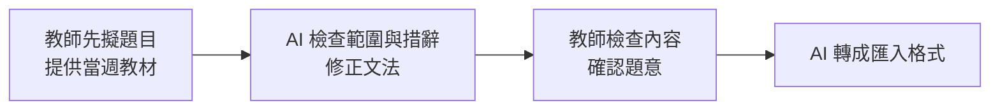
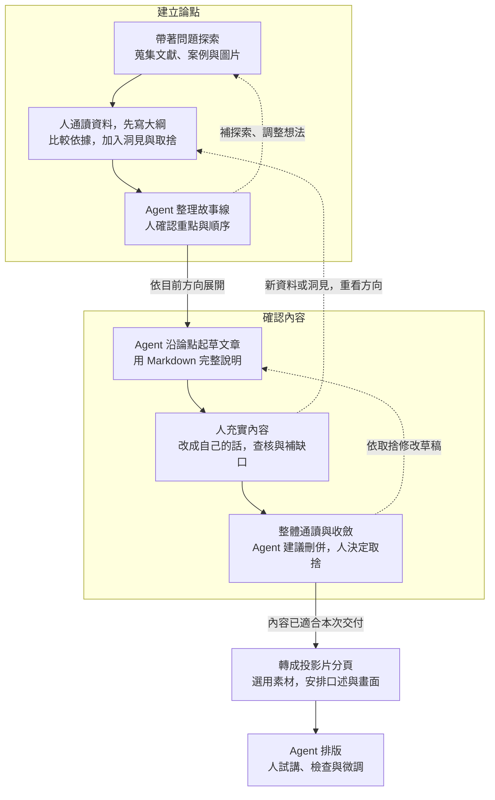
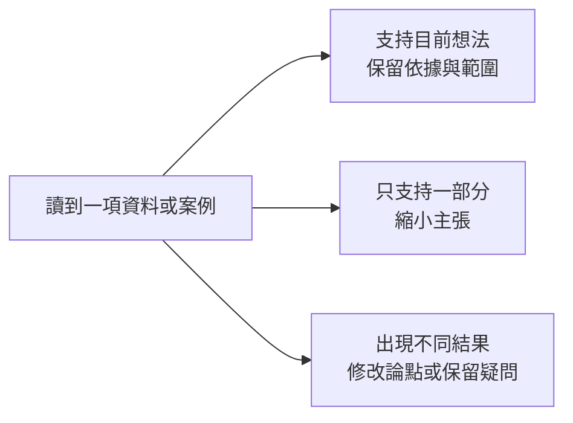

# Agent 時代的知識工作 — 第二週教案：先體驗 agent

> 主教案草稿，2026-09-07 整體整理；尚未同步正式教材或 PPTX。依使用者手稿與討論、既有教案及 [圖文與中英文來源選用紀錄](../kb/week2-paragraph-evidence-and-visuals.md)整理。完整素材與授權見 [來源表](../assets/week2-enrichment/README.md)，舊內容去向見 [移出主題與後續用途](06-week2-deferred-topics.md)。

## 本週目的與安排

從自己需要協助的工作開始，理解領域知識與駕馭 agent 的能力如何配合。以製作簡報為練習，經過請教、取捨、起草與修改，做出自己能說明、能接續編輯的成果。

| 段落 | 安排 |
|---|---|
| 前半段 | 從需要切入 → 請教與交辦 → 三種產出物 → 兩個迴圈 → 保存過程 |
| 後半段 | 講師另開演示專案，做一段、學員跟一段；從背景與材料走到可編輯簡報 |
| 收尾 | 回看前後版本，說明自己的觀點、取捨與修改 |

預計製作三到五頁，至少完整走過一條論點到文章段落、分頁、排版與試講；其餘依時間擴展。討論、來源、論點與棄案、文章及投影片都能找到並接續使用。不以視覺華麗程度評分，不要求 GitHub push 或課後作業。實作主題與總時數仍待選定。

## 前半段：概念與流程

### 一、AI 如何配合自己的能力與需要

上次介紹了 agent 是什麼，這次從自己想完成的工作開始，實際試試它能在哪裡協助。

可以用「領域知識 × 駕馭 agent 的能力」理解 AI 放大器，乘號是兩種能力配合的比喻。

- **領域知識：理解方法與結果的因果關係。** 知道一件事為什麼做得成，能看出目前缺什麼、該調整哪個環節，再把需要的材料、方法與結果向 agent 說清楚，透過檢查與回饋接近預期成果。
- **駕馭 agent 的能力：熟悉模型與工具。** 了解不同模型擅長什麼、能做到什麼程度，以及有哪些可用功能與限制。例如知道何時用 sub-agent 分工，或確認工具支援哪些遠端操作，便能選擇合適的做法。

以簡報為例，看出一頁缺少支持主張的證據，知道應補哪種資料，是領域判斷；知道可以用哪些搜尋工具、讓哪種模型查找或分工，則是工具熟悉度。兩者配合，才能把「這頁不夠好」轉成具體可執行的要求。


圖片：Julo，[Wikimedia Commons](https://commons.wikimedia.org/wiki/File:Lupa.na.encyklopedii.jpg)，公有領域，未修改。用於引入比喻，畫面不疊長文。

Agent 可以協助補短板，也可以用來延伸原有專長。客服研究提供了補短板的例子：5,172 位客服人員導入 AI 助理後，每小時解決問題數平均增加 15%，較少經驗、較低原始技能者改善較多。

這項結果呈現該次工具導入的差異，不能據此認定能力較強者沒有放大空間。若進一步運用領域知識重新設計 SOP、分工或整個工作流程，可能產生不同效益；這是本課提出的延伸方向，效果需要另外驗證。


整理自 Brynjolfsson、Li、Raymond，[*Generative AI at Work*，2024 arXiv v2 摘要](https://arxiv.org/abs/2304.11771v2)；圖為 [Figure 3，PDF 第 46 頁](https://arxiv.org/pdf/2304.11771v2#page=46)，整頁轉圖、未修改，[CC BY-NC-ND 4.0](https://creativecommons.org/licenses/by-nc-nd/4.0/)。結果限於該客服情境，不直接推估署內或其他 agent 的效益。

> **講圖提示：** A 圖按導入前表現、B 圖按年資分組；比較差異與估計不確定性即可。圖中的 agent 是客服人員，縱軸是每小時解決問題數的變化，0.5 不等於提升 50%。正式投影若字太小，改以文字摘要與來源說明。

回到自己的工作，先看目前需要哪一種協助：

- **缺知識與方向：** 請 agent 解釋、提供關鍵字與做法，再查閱或試做。
- **缺具體操作：** 已知道要什麼，就交辦排版、格式整理或語句潤飾等環節。
- **需要協助檢查：** 請它找遺漏與盲點，再依材料和工作目的決定是否修改。

同一件工作可能需要幾種協助。現場請學員說一件想完成的事，選一個具體需要開始；交付的內容仍要自己能判斷與說明。

### 二、請教與交辦，保留自己的判斷

**請教時，像在和不同領域的導師討論。** 帶著自己的專業、經驗與問題，說目前怎麼想、為什麼，再從它提供的觀點繼續追問。背景可逐步補充，建議要經資料或實作確認，自己的觀察與取捨也要加入。

**交辦時，把方向與重要限制講清楚。** 說明給誰用、做成什麼、範圍在哪，以及長度、格式或必須保留的內容。區分必要條件與偏好，具體做法讓 agent 提出。

還不清楚方向時先請教，有了方向再交辦；看到成果有問題，就回頭討論。已有順手的工作流程可以沿用，在需要協助的環節加入 agent。

> 「他人幫助，但我主導」

——孫以瀚，2026-05-11 講座，[第 61 頁標題](https://ethics.moe.edu.tw/files/resource/lecture/20260511/20260511_lecture_20260508.pdf#page=61)。整理自同頁：人的貢獻包括形成問題、篩選與判斷、後續執行。這是講者個人觀點。

臺大土木系蔡亞倫的教學案例可讓分工更具體：



依 [臺大教發中心，蔡亞倫教學札記](https://www.dlc.ntu.edu.tw/ai-teaching-notes/)自繪整理。教師保留題意與內容判斷，AI 協助檢查與格式輸出；屬教師實踐案例，不是效益實驗。帶學員指出自己工作中相似的分工即可。

### 三、同一個想法，留下三種產出物

| 產出物 | 用途與同主題示例 |
|---|---|
| 論點 | 保存主張、依據、順序與棄案理由。例如「Agent 可以協助補短板」，連到客服研究；流程重設能否進一步放大專長，另列為待驗證的延伸。 |
| 文章 | 用連續文字說完整脈絡，保留自己的觀點與引用。例如先交代研究情境和結果，再談適用範圍，供備講與輔助閱讀。 |
| 投影片 | 安排口述與畫面。例如畫面放一句重點與研究圖，口述補情境、限制與例子，頁腳保留來源。 |

三種產出物是本課安排。媒介用途可參考 [Garr Reynolds 的準備建議](https://www.garrreynolds.com/preparation-tips)與 [TEDx Speaker Guide，第 3–6 頁](https://storage.ted.com/tedx/manuals/tedx_speaker_guide.pdf#page=3)，後面實作會分別保存。

### 四、建立論點與確認內容的兩個迴圈

「建立論點」處理想講什麼、如何組織；「確認內容」把草稿充實、收斂成自己能說明的內容。文獻、案例與圖片在建立論點時一起探索，文章階段補缺口，分頁時再決定選用。



讀圖時抓三件事：

- **人先通讀、自己列綱。** 加入自己的洞見與取捨，再讓 agent 沿方向整理；真的卡住，可請它試串後逐段確認理由。
- **新材料可以改變方向。** 回到受影響的論點或段落修正，不必整圈重做。
- **接近交付時逐步收斂。** 先處理正確性與理解問題，延伸想法留下一版；內容盡量在 Markdown 修定後再排版。

Reynolds 建議早期故事板就預想圖表與照片，再找適合素材；可作為提早考慮畫面的參考。[作者原文，第 1 節](https://www.garrreynolds.com/preparation-tips)。本次以一條論點示範往返，不再增加另一套流程。

### 五、保存過程，才能接著做

討論到值得留下的內容，就請 agent 整理成 Markdown，自己打開確認；下次指定讀取，再接著做。保留資料、想法、建議、取捨及未定事項，也保存來源與圖片，讓結論能回到依據。


畫面只指出原文、標註、筆記如何連在一起。來源：[Zotero 官方文件](https://www.zotero.org/support/pdf_reader)，[CC BY-SA 4.0](https://www.zotero.org/support/licensing)，原圖未修改，內嵌研究圖僅作工具示範。臺大數學系圖書室也介紹了書目、PDF、筆記與圖片管理，[洪翠錨整理，2026-08-14](https://www.math.ntu.edu.tw/~mathlib/News_Content_n_204689_s_264943.html)。

今天用檔案與 Markdown 練習這個保存習慣，不要求安裝 Zotero。資料夾隨需要形成，已有整理方式就沿用；下一段直接建立第一則筆記。

## 後半段：從空專案做出一份簡報

### 開始前

講師另開演示專案，做一段、學員跟一段，每步打開成果確認後再繼續。使用公開、虛構或確認適合提供給工具的材料；舊簡報也要檢查備註與附件。關閉訓練用途不代表資料不上雲，private repo 也在雲端。

數發部手冊提醒，避免將個人訊息與機密資料提供給公開或 API 串接的生成式 AI 服務。[第 81 頁，4.3.6](https://www-api.moda.gov.tw/File/Get/moda/zh-tw/WwHCroVhwWy52dw#page=81)。拿不準的材料改用講師範例，工具設定依實際帳號確認。

### 一、初始化專案與保存習慣

開空專案，簡述大致要做什麼，先建立 `kb/` 保存討論。請 agent 把保存方式與位置寫入 `AGENTS.md`，打開兩個檔案確認，再明確請它讀取並接續。

```text
練習專案/
├── AGENTS.md             保存方式與共用要求
└── kb/
    └── 第一次討論.md     背景、想法、來源與未定事項
```

這是示範目錄，檔名可調整；現場要看到實際寫入、打開與再次讀取。後續需要圖片時建 `assets/`，需要論點、文章及分頁時建 `drafts/`，簡報成果放 `output/`。資料夾名稱本身不會讓 agent 自動使用內容。

### 二、聊背景與限制，一起探索材料

先說受眾、時間、長度與希望觀眾知道什麼，再請 agent 提出建議，隨回應補齊背景。例如：「我想先講大家會遇到的問題，再用一兩個例子說明，你覺得還缺什麼？」確認的需求保存到筆記，共用要求補進 `AGENTS.md`。

需求太籠統時，可用數發部的一組例子比較：

| 需求較籠統 | 加入具體工作情境 |
|---|---|
| 如何提升公務員工作效率？ | 如何在合適情境中，用 AI 協助公文撰寫？ |

改寫自數發部《公部門人工智慧應用參考手冊》V1.0，2026-01-28，[第 25 頁](https://www-api.moda.gov.tw/File/Get/moda/zh-tw/WwHCroVhwWy52dw#page=25)。整理自該頁的原則是：清楚目標、適當範圍、可行動性，以及可觀察或量化的預期目標。請學員用自己的工作改說一次。

提供相關材料，請 agent 同時找研究、台灣或其他地區的案例與圖片，也查不同結果。例如：「這個想法有哪些研究可以參考？有沒有不同結果，或適合說明的圖？」先挑一兩項深入看，對照原文，記下版本、位置、可支持的想法與限制。

圖片另存原檔及來源說明。現場用 [放大鏡的 Commons 來源頁](https://commons.wikimedia.org/wiki/File:Lupa.na.encyklopedii.jpg)示範查作者、原檔及授權；文獻與圖片都連回 `kb/` 的相關想法。

### 三、建立論點，保存故事線與棄案

人先通讀材料與筆記，列出自己的主張、依據、取捨與大致順序，再請 agent 沿大綱整理故事線。真的想不到時，可讓它先試串，自己逐段說明認同或修改的理由。



本課自繪的材料判斷方式。把候選圖像放在相關想法旁，記下用途；支持不足就縮小主張或補查。前面的客服研究可用來區分：資料支持 AI 在該情境協助補短板；「重設流程後能否進一步放大專長」則需要另外的證據，不能從單次導入的改善幅度判定。

臺大護理系劉欣怡分享讓學生先讀教材，再用 AI 比較支持與反對觀點，最後判斷自己的立場。[〈與 AI 共學〉](https://www.dlc.ntu.edu.tw/ai-teaching-notes/)，屬教師經驗。可用來引導本次材料比較，不再展開另一套步驟。

連讀故事線，確認理解順序、重複與跳接，保存到 `drafts/`；棄案記下證據不足、超出範圍或不適合受眾等理由，不為湊數新增。組織證據與處理合理反對意見可參考 [TEDx 指南，第 4–5 頁](https://storage.ted.com/tedx/manuals/tedx_speaker_guide.pdf#page=4)。

### 四、起草文章，加入自己的內容再收斂

請 agent 先沿論點寫一段 Markdown，看過寫法再展開。人補入自己的理解、經驗與例子，對照既有來源查核；有缺口再補材料。文字內容直接引用或整理，合適的圖表、照片與示意放在相關段落。

**待修正草稿（課程自擬）：** 有經驗的客服改善較少，表示 AI 無法放大專長。

**補入依據與範圍後：** 一項客服研究發現，導入 AI 助理後，較少經驗者改善較多，可作為 AI 協助補短板的例子。若運用專業重新設計工作流程，能否產生更多效益，仍需另外驗證。

來源：[*Generative AI at Work*，2024 v2 摘要](https://arxiv.org/abs/2304.11771v2)。前句為課程自擬的過度推論；後句先整理研究結果，再將流程重設列為待驗證問題，並非論文已證實的結論。現場用實作主題的一句話做同樣修改。

整體通讀，請 agent 建議刪重、合併與重排，人決定取捨。論點有變就回頭更新；文章保留完整脈絡，供備講與輔助閱讀。尚未取得的素材註記用途、查找方向及待核對事項。

### 五、分頁，安排口述與畫面

從文章整理三到五頁分頁草稿，逐頁決定重點、口述、畫面，以及停留與換頁的節奏。先挑一頁深入修改，再通讀整份順序。

選圖與引用依用途處理：

| 這一頁需要什麼 | 呈現方式 |
|---|---|
| 介紹來源，留下出處印象 | 可展示真實論文首頁、封面或網站，辨識作者、期刊／機構與版本；目前客服來源為 arXiv v2，未另製首頁圖 |
| 讓聽眾讀懂文字內容 | 直接排短引文或摘要；逐字引用加引號，改寫標「整理自」 |
| 理解證據、情境或關係 | 使用研究圖表、照片、操作畫面與流程圖；自繪或生成概念圖標示意 |

例如沿用客服案例，畫面放「Agent 可以協助補短板」與 Figure 3，口述交代客服情境與分組差異；流程重設的可能性留作延伸問題，不用此圖替它背書。原圖需保留座標與圖說；若投影難以閱讀，改用文字摘要，不勉強縮小。

Penn State 的 [Assertion-Evidence 方法](https://www.assertion-evidence.com/)以明確訊息配合視覺證據，適合參考研究頁的安排；[TEDx 指南，第 5–6 頁](https://storage.ted.com/tedx/manuals/tedx_speaker_guide.pdf#page=5)也強調圖表集中表達重點。概念引入與操作轉場依實際用途安排。

畫面保留必要短來源與署名，完整連結、版本及授權留備註與素材紀錄。分頁草稿另存，若發現論點問題，回到相應內容修改。

### 六、先做一頁 PPTX，再展開與修改

確認要輸出的文字與順序，請 agent 製作可編輯 PPTX。有指定版型就提供，交代必要格式，其他做法讓它提出。例如：「把剛才確認的內容做成五頁以內、可以編輯的 PowerPoint，先試做一頁，說明排法的原因。」

打開第一頁，檢查內容關係、圖文可讀性與來源位置，提出具體修改，再展開其餘頁面。用實際首次輸出與修改版並排，指出哪裡變得清楚；畫面由現場成果取得。

檢查文字對比、閱讀順序與圖片替代文字，可參考 [Microsoft 中文支援文件](https://support.microsoft.com/zh-tw/accessibility/powerpoint/make-your-powerpoint-presentations-accessible-to-people-with-disabilities)。本次針對遇到的版面問題處理。

### 七、試講、驗收與回看修改

試著選取文字編輯，再實際講一頁、計時、看投影，請聽者重述重點或指出不清楚處。依 [TEDx 排練建議，第 7 頁](https://storage.ted.com/tedx/manuals/tedx_speaker_guide.pdf#page=7)安排實講與回饋；聽者重述是本課補充。

依問題回到論點、文章或分頁修改；單純版面問題改該頁，再試講受影響的部分。交付前確認：

- 文字、圖片、座標與來源可讀，引用支持本頁主張，示意與實證分得清楚。
- 待補素材已完成、替換或移出交付範圍。
- 論點與棄案、文章、分頁及 PPTX 的最新版本與來源能找到。

最後回看自己的前後版本，說明一項採納或刪除、一處自己的觀點，以及一項值得沿用的修改要求。把適合共用的要求補進 `AGENTS.md`，講師收集下次想處理的工作，練習在課堂完成。

## 講師準備與備講材料

- **課前決定**：實作主題、總時數與配比，準備少量相關公開材料並測試輸出環境。時間不足就縮減頁數與素材量，保留一條論點到試講的完整體驗。
- **演示環境**：課程備課與現場演示分開專案；確認工具如何讀取 `AGENTS.md` 及帳號資料設定。每步先保存、打開、確認，再繼續，不要求固定提示模板。
- **實際畫面**：準備展示筆記讀寫、素材與論點的連結、首次 PPTX 與修改版。若用粗略故事板，拍實際挑選前後；備援成果標明為預備版本，只在工具異常時使用。
- **來源與延伸**：本稿的來源放在使用處；授權細節與未採用素材查 [素材來源表](../assets/week2-enrichment/README.md)。HBS／BCG、雙鑽石、Forte 等留 [選材紀錄](../kb/week2-paragraph-evidence-and-visuals.md)備講，不另加進主流程。
- **後續範圍**：第四週承接思考與蒸餾；長期知識庫、版本管理、模型配置與簡報設計深入內容依需求安排，不預配第五週以後。
