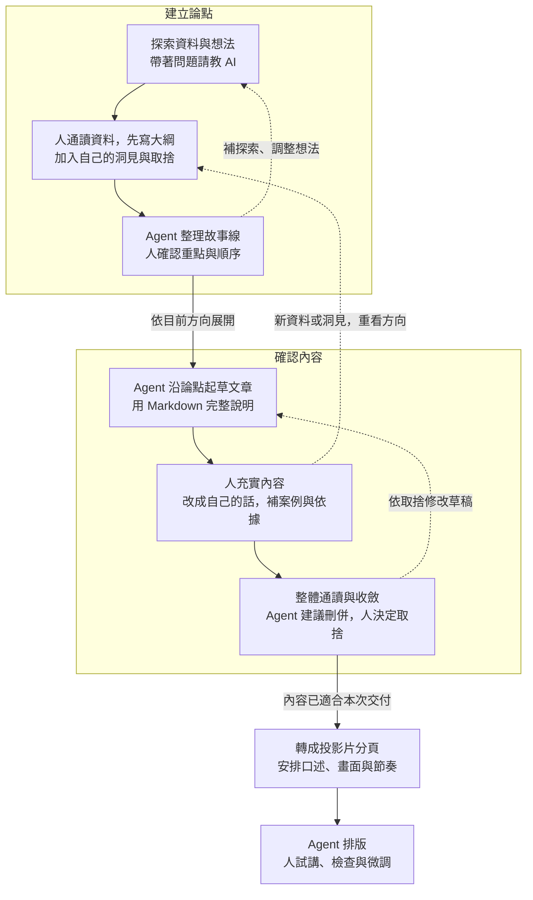

# 第二週逐頁投影片內容：Agent 時代的知識工作

> 2026-09-07 初稿。依使用者要求另存於 `drafts/`，供逐頁修改，尚未製作 PPTX 或更新正式教材。
> 來源：[第二週主教案](02-week2-presentation-lesson-plan.md)、使用者六頁手稿及後續討論；相關素材為 `kb/presentation-process-before-and-after.md`、`kb/purposeful-reading-and-agent-assisted-practice.md`、`kb/nesa-slide-presentation-forms.md`。本稿只引用現行教案已選用的概念，不重新展開舊 lesson 的移出主題。

## 使用方式與頁面安排

這是授課簡報的逐頁草稿。每頁分為「畫面文字」「口述草稿」「呈現與切換」，畫面文字可作為投影片輸入；口述承接未放在畫面上的解釋，呈現與切換只供講師備課。

共 22 頁：第 1–11 頁為開場、概念與流程，第 12–13 頁銜接實作，第 14–21 頁帶領現場操作，第 22 頁回顧。操作頁作為停留與切換的提示，不按純講授速度逐頁播放。總時數沿用主教案的待定狀態，不預設分鐘數。

這 22 頁是課程簡報。介紹 NESA-SLIDE 的三到五頁演示簡報，另在獨立專案現場做出來；本稿不預先填入其論點、版型選擇或結果。課前工具、資料設定與備援準備沿用主教案的講師備註。

## 01｜Agent 時代的知識工作

### 畫面文字

Agent 時代的知識工作

先玩玩看 agent 吧

### 口述草稿

上次介紹了 agent 是什麼，今天來試著用它做一件工作。我們會用一份簡報，看想法怎麼在討論、整理與修改中逐漸成形。

### 呈現與切換

封面只放課名與副標，簡短開場後換頁。

## 02｜今天會做什麼

### 畫面文字

先理解合作方式

再現場做一份介紹 NESA-SLIDE 的簡報

### 口述草稿

前面先說明怎麼和 agent 合作，後面從空專案開始，做一份介紹 NESA-SLIDE 的簡報。每完成一段，大家就跟著操作一段。

我們會留下論點、文章和投影片，至少把一條論點走到文章段落、分頁、排版與試講。演示簡報預計三到五頁，其餘依時間展開。

### 呈現與切換

先讓學員知道今天的範圍。此處只交代題目，NESA 的內容留到實作探索。

## 03｜AI 是放大器

### 畫面文字

領域知識 × 駕馭 agent 的能力

知道什麼合用　｜　把想法做出來

### 口述草稿

領域知識讓我們知道方向在哪裡，也比較能判斷結果是否合用。駕馭 agent 的能力，則是把材料和要求說清楚，再透過回饋把東西做出來。兩邊會互相幫助。

不用等全部學會才能開始，可以邊查、邊試、邊累積理解。交付出去的內容，自己仍要能說明和判斷。

### 呈現與切換

乘號作為兩種能力相互配合的示意，不解釋成計分公式。先談領域知識，再談如何運用 agent。

## 04｜從自己需要補足的地方開始

### 畫面文字

- 知識與方向：請教、查閱、試做
- 具體操作：製作、排版、整理格式
- 協助檢查：找遺漏、疑問與盲點

### 口述草稿

先想目前要做什麼，再看哪一段需要協助。不知道怎麼做，可以先問方法、找材料。知道內容卻不熟排版，可以請它做一版。已有成果，也可以請它換個角度檢查。

同一件工作可以同時有幾種需要。你如果已經累積出順手的工作流程，就繼續沿用，挑需要協助的環節加入 agent。

### 呈現與切換

停下來口頭問「你目前哪一段工作想找人幫忙？」收一兩個例子，避免逐人輪流拉長時間。

## 05｜請教：先帶著自己的想法

### 畫面文字

目前怎麼想？為什麼？

再問方法、關鍵字與不同觀點

### 口述草稿

請教時，可以把 agent 當作不同領域的導師。你帶入自己的專業和工作脈絡，再從它提出的關鍵字繼續追問，挖出原本不知道的東西。

已有自己的想法就先說，看到另一套完整說法時，和原本想法比較。哪些補到了自己，哪些不合適，由自己決定。背景可以在來回對話中慢慢補齊，資料與方法還要查閱或試做確認。

### 呈現與切換

讓「自己的想法」先出現，再呈現向外請教的文字。此頁講心態，後面建立論點時才實際列綱。

## 06｜交辦：方向與限制說清楚

### 畫面文字

給誰用？做成什麼？
範圍、格式、長度有哪些限制？

具體做法，讓 agent 提出

### 口述草稿

有了方向，準備請它做事情，就要說清楚這次一定要符合什麼。必要條件和偏好可以分開，讓它在範圍內提出做法。

說得太籠統，成果容易和期待不同；把細節規定得太滿，也可能限制更好的方法。看過成果有新問題，隨時可以回到請教和討論。

### 呈現與切換

口述一個自然例子：「先做一頁可以編輯的簡報，內容用剛才確認的版本，版面你提出一個做法。」不要求學員複製例句。

## 07｜論點、文章與投影片

### 畫面文字

| 產出物 | 留下什麼 |
|---|---|
| 論點 | 主張、依據、取捨與棄案 |
| 文章 | 完整的說明與脈絡 |
| 投影片 | 口述、畫面與節奏 |

### 口述草稿

論點記錄想說什麼、根據什麼，以及哪些方向最後沒有採用。棄案有理由，之後才知道為什麼放下。

文章比較像一篇完整說明，可以幫助備講，也可以提供輔助閱讀。投影片再把內容分配到口述與畫面，安排哪些先出現、哪裡停一下、什麼時候換頁。

### 呈現與切換

依論點、文章、投影片的順序帶過。這頁先建立成果的差別，下一頁才看形成過程。

## 08｜建立論點與確認內容

### 畫面文字

### 口述草稿

先看上半圈：探索資料後，人把前面材料通讀一遍，自己試著列幾個重點與順序，再請 agent 沿這個方向整理故事線。真的想不到，也可以讓它試串，再逐段確認。

接著看下半圈：沿論點寫文章，人加入實際經驗和依據，通讀後刪重、合併與重排。內容有了，再安排投影片的口述與畫面。

兩個圈會互相影響。後面找到的新資料可能推翻前面的論點，所以保留回到大綱的路徑。

### 呈現與切換

畫面使用主教案同一張流程圖。先聚焦上半圈，再聚焦下半圈，最後指出跨圈箭頭與分頁出口。不要同時口述所有節點細節；排版時確保字可讀，不靠縮小字塞入。

## 09｜每次先改能看完的一小段

### 畫面文字

先在對話中確認做法
內容留在 Markdown 修改
再投入排版

### 口述草稿

每次讓 agent 做一段自己能看完、能判斷的東西。方向還不清楚，先讓它在對話裡講一遍準備怎麼做，討論後再落成檔案。

內容仍在變動，就先改文字。如果太早把整份美編做好，方向一變，就可能換圖、重排、整批返工。現在這一段可以往下做就繼續，未定事項也可以記下來。

### 呈現與切換

畫面依序呈現對話、Markdown、排版三行。口述用「換一段順序」和「重排好幾頁」對照修改成本。

## 10｜方向隨交付接近逐漸鎖定

### 畫面文字

前期：探索、補充、重排

接近交付：縮小改動範圍

影響正確性與理解的問題仍要修

### 口述草稿

內容做出來才發現論點不成立，就回去調整。方向不是進到下一步就永遠不能變。

不過越接近交付，越要判斷哪些值得現在改、會影響多少內容。必要的問題要修，其他可以延伸的想法先記下來，留給下一版。

### 呈現與切換

以簡單的前後位置表示時間接近，不畫硬性的鎖定分界或量化曲線。

## 11｜把討論存下來，之後接著做

### 畫面文字

資料、想法、取捨、未定事項

整理成檔案，打開確認
下次請 agent 讀取後接續

### 口述草稿

聊天會產生很多有用的東西，包括還沒採用的方向。我會請 agent 把討論持續存下來，讓之後能找到脈絡。

這次先用 kb 保存。文章和投影片有需要時再形成草稿位置；文獻很多也可以另整理。你已有熟悉的分類就沿用，其他資料夾跟著需要建立。

### 呈現與切換

此頁只講保存的目的。資料夾名稱與實際位置，接下來開空專案時展示。

## 12｜現在做一份介紹 NESA-SLIDE 的簡報

### 畫面文字

NESA-SLIDE

讀它的做法，整理自己的介紹
把選出的排版方法用在這份簡報上

https://github.com/slidefirm/NESA-SLIDE

### 口述草稿

這個實作把材料和操作連在一起：我們先看 repo 裡的說明與例子，整理想向同仁介紹什麼，最後把選出的做法用在自己的簡報上。先選一兩個能用到的例子深入看。

我會另開一個專案，現場做一段，大家跟一段。這樣素材、討論、取捨和成果都在同一個演示脈絡裡。

### 呈現與切換

此頁為實作轉場。正式授課投影片停在操作提示，NESA 介紹簡報另在獨立專案中當場形成，不預寫演示結果。

## 13｜練習資料的範圍

### 畫面文字

本次使用公開 repo 與公開材料

機密、個資、未公開公務資料不拿來測試

本次不要求 GitHub push

### 口述草稿

先用公開材料練習。若換成自己的舊簡報，內頁、備註和附件也要看過。

關閉模型訓練用途不代表沒有上傳雲端，private repo 也在雲端。工具設定依今天使用的帳號確認，拿不準的材料就先不要提供。

### 呈現與切換

依課前核對結果簡短說明實際工具設定。這頁結束後切到空專案。

## 14｜初始化專案與保存習慣

### 畫面文字

空專案

簡述要做什麼
建立 kb，保存討論
把保存方式寫入 AGENTS.md

### 口述草稿

一開始先大致說這個專案要介紹 NESA-SLIDE，請它建立 kb，後續討論都保存進去。再把這個做法寫進 AGENTS.md，讓這次工作有共同的保存習慣。

先不用把所有背景都講完，這一步完成初始化，後面再慢慢補。

### 呈現與切換

現場操作：用自然對話交代保存討論，再打開 kb 與 AGENTS.md，確認位置和要求。請 agent 讀取後接續。停下讓學員完成同一步。

## 15｜背景與觀眾需要知道的事

### 畫面文字

受眾、演講時間、簡報長度

希望觀眾知道什麼？
目前打算怎麼介紹？

### 口述草稿

接著聊背景和限制。先講自己的初步方向，例如想介紹它解決什麼問題，再挑幾個排版例子；讓 agent 提出補充。時間與篇幅用這次實際安排。

看過回應後繼續補充與取捨，確認的背景保存下來，適用整個專案的要求補進 AGENTS.md。

### 呈現與切換

現場操作：說出自己的版本，讓 agent 拓展一次，當場挑一項回應或修正。不要預先指定「一定會採納」的建議。

## 16｜讀資料，補入自己的觀點

### 畫面文字

README、相關說明與 demo

這個例子適合我們嗎？
根據在哪裡？

### 口述草稿

請 agent 從 README 找相關說明，選一兩個支持本次介紹的例子深入讀。自己也要看原文，才知道它整理得有沒有偏離。

把實際簡報經驗拿來比較。資料說了什麼、自己的觀察是什麼、哪些還要查，分開存進 kb，並保留來源與版本。

### 呈現與切換

現場操作：打開一份原文與筆記對照，加入自己的觀點。無法連線時用課前備存資料，說明讀取版本。

## 17｜自己先列綱，再整理故事線

### 畫面文字

人先通讀材料，列重點與順序
Agent 沿大綱整理故事線

留下論點，也留下棄案與理由

### 口述草稿

這裡先停一下，不急著讓 AI 寫。我把目前材料看過，自己用幾個條列寫想講哪些事、為什麼這樣排。

再請 agent 沿大綱整理，我看它有沒有保留原意、哪裡跳太快。真的想不到也可以讓它先試串。最後採用的論點和沒有採用的方向都留下理由。

### 呈現與切換

現場操作：講師先親自寫粗綱，讓學員也有自行列綱的時間，再請 agent 整理。保存前後版本；有實際棄案才記錄，不製造棄案。

## 18｜文章先把意思寫完整

### 畫面文字

先試一段，再展開

補經驗、案例與依據
整體通讀，刪重、合併與重排

### 口述草稿

讓 agent 沿論點先寫一段，我看過寫法再繼續。這時候用接近文章的方式，把前後關係講完整。

接下來人要投入，補上自己真正想講的內容。各段有了，再通讀整體，請 agent 建議怎麼收斂，由自己決定。文章可以留下來備講，也能作為輔助閱讀。

### 呈現與切換

現場操作：深入改一段，說出改的原因，再請 agent 檢查整體重複與順序。新依據改變論點時回到論點紀錄；保留修改前後版本。

## 19｜分頁安排口述與畫面

### 畫面文字

| 口述 | 畫面 |
|---|---|
| 解釋什麼、怎麼帶領 | 此刻讓觀眾看見什麼 |

停在哪裡？什麼時候換頁？

### 口述草稿

文章有完整脈絡，轉成投影片時，表達節奏會改變。一頁畫面放多少、哪些細節由嘴上說、什麼先講什麼後講，都要重新安排。

先整理三到五頁的分頁草稿，挑一頁看口述和畫面是否配合，再連起來看順序和時間。分頁另存，原本文章保留。

### 呈現與切換

現場操作：請 agent 從文章整理分頁，在 Markdown 中並看口述與畫面。先改內容安排，不急著做美編。

## 20｜排版用上剛才介紹的方法

### 畫面文字

先試一頁可編輯 PPTX

為什麼選這個版型？
內容關係、重點與留白是否清楚？

### 口述草稿

分頁內容確認後，請 agent 用讀過、選出的做法排一頁，說明這個版型為什麼適合。必要格式和限制說清楚，其他細節讓它提出。

打開看成果，對照剛才介紹的方法，檢查是否真的表達出這頁的內容關係。合用後再展開其他頁。

### 呈現與切換

現場操作：切到 NESA 來源例子與輸出頁面比較，提出具體修改。採用的 skills 或工具以備課測試結果為準，不預寫已成功輸出。

## 21｜試講與交付檢查

### 畫面文字

文字能編輯嗎？
內容正確、意思清楚嗎？
實際講一遍，順不順？

### 口述草稿

打開 PPTX 選取文字、改一個字，確認可編輯。再實際講一頁，找出畫面看不清楚、說起來不順或意思不對的地方。

版面問題改那一頁，內容或論點有問題就回到相應文字修正，再更新投影片。確認這次交付的版本，值得沿用的要求也保存下來。

### 呈現與切換

現場操作：做一次真實試講與修改。若工具失敗，清楚區分備援成果與當場完成部分，不把未完成步驟當成完成。

## 22｜回看自己的取捨

### 畫面文字

論點與棄案　／　文章　／　投影片

採納或刪除了什麼？
哪裡加入自己的觀點？
哪個修改要求值得留下？

### 口述草稿

回到資料夾，看原本想法怎麼變成現在的成果。能找到論點與取捨，文章保留完整說明，投影片則配合實際表達。

請分享一處自己選擇或修改的地方，以及下一次想用這個方式處理什麼工作。今天練習在課堂完成，不另外加回家作業。

### 呈現與切換

開啟當場檔案並對照版本，收幾個學員分享。以至少一條論點走到試講的範圍確認完成情形。

