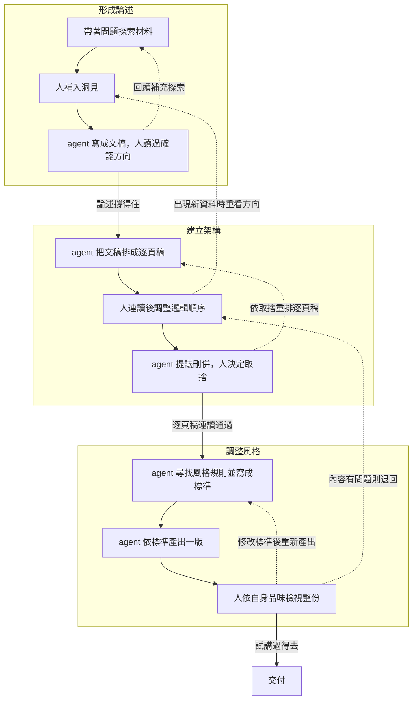

# 第四週：Agent 工作價值工作坊（底稿）

> 2026-09-19 更新：使用者確認第四週採兩節課工作坊。以下安排取自 `工作紀錄.md`「2026-09-19：第四週改為兩節課的工作坊」與當次對話。每節分鐘數尚未確認。

## 本次確認與設計方向

- 已定：第四週改為工作坊，使用兩節課時間。
- 討論方向：從學員的工作出發，理解價值原本如何產生，再探索 agent 能帶來哪些收益、增加哪些成本與風險。
- 設計緣由：上次備課示範過多依賴講師自己的脈絡，需要更直接連結學員需求；講師也要協助提出學員尚未想像過的做法。
- agent 候選安排，尚未定案：第一節討論價值與瓶頸，第二節探索分工與小範圍驗證。分組、案例、實作方式、成果形式與時間配置待討論。
- 原三圈與知識管理底稿保留在下方，供選材；不視為現行工作坊必講內容。

## 先前底稿（2026-09-09，保留作素材）

> 2026-09-09。第四週延續第二週，主題是工作流本身：agent 結合 kb 作為第二大腦去思考與輸出。此檔只放底，之後依自己的經驗擴充或詮釋。
> 較長的診斷與候選（十條張力、四圈版、通用性檢驗表、360 分課堂配置）存 `tmp/week4-outline-long-2026-09-09.md`，需要時再抽。
> 取自：`drafts/02-week2-presentation-lesson-plan.md` 第三節、`assets/week2-diagrams/three-loops.mmd`、`drafts/06-week2-deferred-topics.md` 第一節。

## 三個迴圈

| 圈 | 人做的事 | agent 做的事 | 產出物 | 通過標準 |
|---|---|---|---|---|
| 形成論述 | 定方向：通讀材料，補入洞見 | 探索材料，順著討論長成文稿 | 文稿 | 文稿讀過，論述撐得住 |
| 建立架構 | 順邏輯：連讀標題，決定刪併 | 把文稿排成逐頁稿，提刪併建議 | 逐頁稿 | 只讀標題連讀能講完 |
| 調整風格 | 看風格：依品味檢視整份 | 找規則寫成標準，依標準整份產出 | 成品 | 整份像自己，試講過得去 |

每圈同一個形狀：拿標準 → agent 產出 → 人檢查 → 通過，或改了再產，或退回前一圈。退回前一圈永遠比本圈再產貴，所以便宜的先做，內容留在 Markdown。

## 流程圖

正本在 `ssot/three-loops.md`（v2：第一圈改名形成論述，其餘與第二週相同），此處是複本。第四週的改動先改 ssot 並記版本，再同步回這裡。

## 第四週要討論的四個問題

1. **要不要調整**：第一圈已改名形成論述（v2）；順序不動，看圈內步驟。
2. **要不要多一圈**：候選是前面的「累積」（沒有任務時 kb 也在長）與後面的「回存」（標準補進 AGENTS.md、棄案留 drafts）。
3. **語意要不要更精準**：標準只畫在第三圈，其實每圈入口都是標準；「連讀」「試講」是簡報用語，換成簽呈或報告時怎麼說。
4. **步驟夠不夠清楚**：第一圈「人補入洞見」一格裝了通讀、排序、定方向、對 agent 試串做反應；原第四週的發想、何時問、怎麼問落在這裡。

## 原第四週六條的去處

發想、何時問、怎麼問 → 形成論述圈人那一格；蒸餾與失真、素材庫抽想法 → 候選的累積圈；收斂的技術 → 第二圈。
