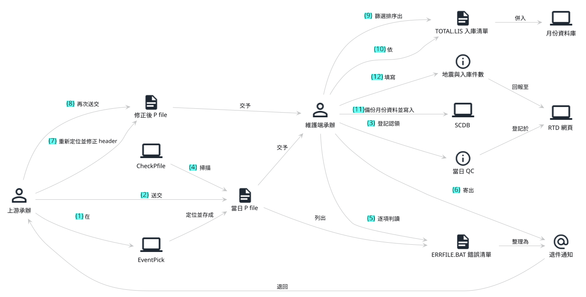
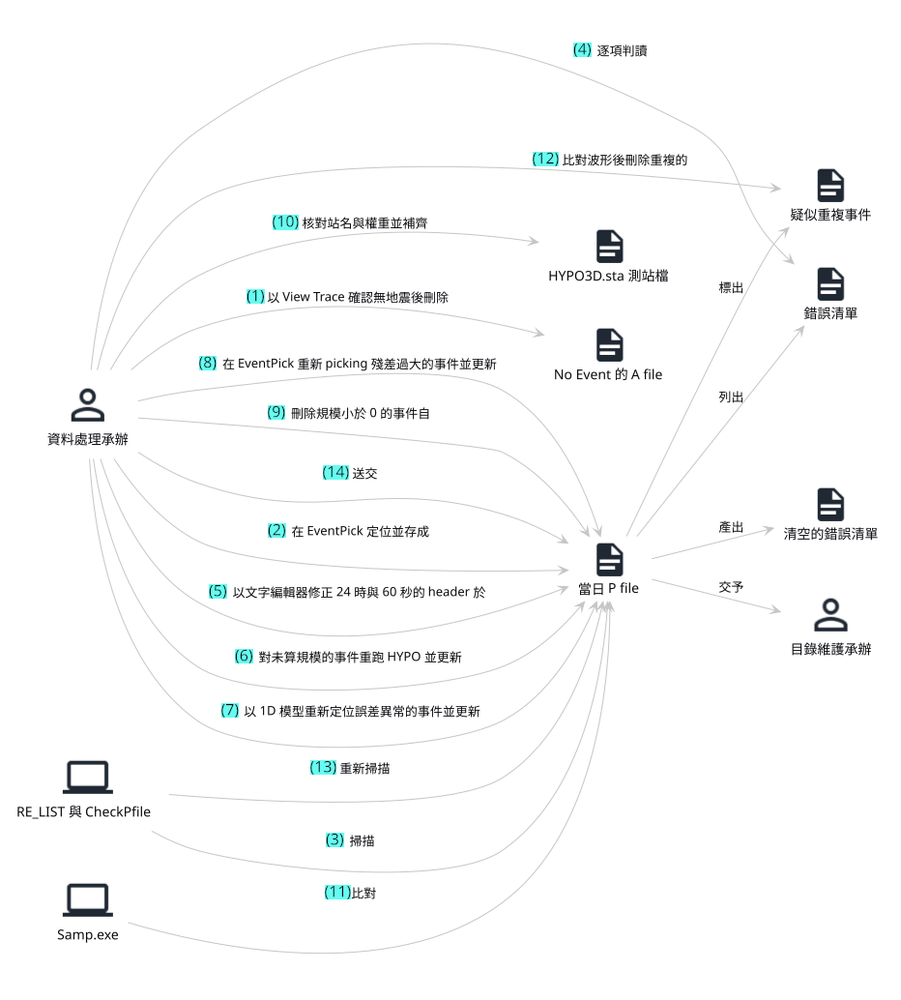
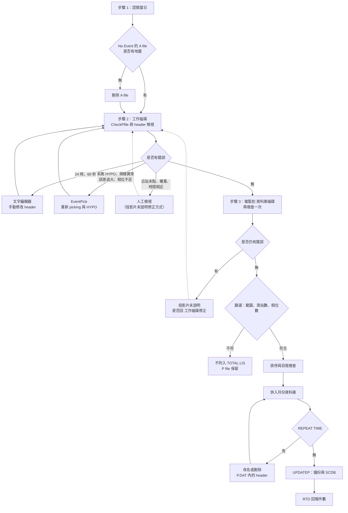

# 地震資料庫 QC 現況整理

> 2026-09-29 第十版：徹底去識別化，磁碟與路徑改用用途代稱（工作磁碟、資料庫磁碟），並已改寫 git 歷史。
> 2026-09-29 第九版：資料處理端故事圖加入 EventPick 的線索（GPS Lock、Quick Sort、End and Write 後重跑 HYPO、GPS 狀態 0、權重 9），增為 18 步。
> 2026-09-29 第八版：新增「EventPick 操作說明的補充」。
> 2026-09-29 第七版：新增「資料處理端應做的完整步驟」故事圖，聚焦需要攔截的步驟。
> 2026-09-29 第六版：故事圖加入除錯重跑的程式（文字編輯器、HYPO、CheckPfile 重新掃描、Samp.exe、MERGEPO 與 BIGSORT1）。
> 2026-09-29 第五版：新增「發生錯誤後需要重跑的程式」；兩方改稱資料處理承辦與目錄維護承辦。
> 2026-09-29 第四版：新增「現況故事圖」。
> 2026-09-29 第三版：新增「步驟與檢查清單」與「發現錯誤時的修正位置」（含流程圖），依投影片原文整理，未說明處標出。
> 2026-09-29 第二版：新增「背景」「投影片的內容」「改善方向」三段與「檢查項目依處理方式分類」，依使用者說明的背景與構想整理；分類為 agent 提出的候選，待使用者確認。
> 2026-09-29 第一版。整理地震資料科每日 QC 的現行流程、檢查項目與已知問題，作為後續改善的起點；尚未指定課程用途。
> 取自：[[cwa-earthquake-db-qc-training]]（Sb-A-3 教材投影片 18 頁、紙本 QC 檢查清單）、使用者 2026-09-29 隨手筆記（原文保留於文末）與口頭說明。
> 三份來源的門檻數字不一致之處，列在「待確認」，未自行裁定。

## 背景

地震目錄由負責收錄的科維護。資料處理承辦完成地震事件的定位之後，將大量 P file 送交目錄維護端，由目錄維護端執行 QC 再併入資料庫與地震目錄。

資料處理承辦以處理件數計算工作量，為了盡快達到數量，常有步驟未執行或僅抽選部分事件處理的情形。目錄維護端檢查出問題後只能退回資料處理端，往返次數多，成為雙方的主要負擔。

## 投影片的內容

Sb-A-3 是目錄維護端的新進人員教材，說明一日 QC 從環境準備到回報的完整操作，重點有三項：

- **檢查什麼：** 以 CheckPfile 系列程式掃描 header，輸出 ERRFILE.BAT 錯誤清單，再由人逐項判讀（第 6 至 9 頁）。這是投影片的核心，紙本檢查清單則補充程式未涵蓋的項目。
- **如何入庫：** 篩選範圍內且資料量足夠的事件，依時間排序後併入月份資料庫，並處理重複檔名與重複時間（第 10 至 13 頁）。
- **如何備份與回報：** 以批次檔備份至多處並寫入 SCDB，回到 RTD 網頁填寫件數，月底轉檔提供國際交換（第 14 至 16 頁）。

投影片的角度是「目錄維護端收到資料之後如何檢查」。其中大部分錯誤，例如時間進位、未跑 HYPO、未計算規模、誤差異常，其實源自資料處理端的處理步驟；目錄維護端能做的只有找出問題與退回。

## 改善方向

使用者的構想：在資料處理承辦送出之前，先經過一道自動化的初步 QC，減少退件。這個程式預計負責三件事：

1. **自動修正：** 能以規則修正的 header 問題，由程式直接修正。
2. **自動重跑：** 可用命令列執行的定位程式，由程式嘗試以不同模型重新定位，比較結果。
3. **列出人工項目：** 必須在 UI 中處理的問題（例如重新 picking），由程式列成待修正清單交給承辦，而不是送到目錄維護端後才退回。

## 流程總覽

| 階段 | 位置 | 主要動作 | 使用工具 | 人工判斷 |
|---|---|---|---|---|
| 環境準備 | 個人電腦 | 對應共用網路磁碟，申請讀寫權限，複製程式並設定環境 | 手動設定 | 無 |
| 認領 | RTD 網頁 | 認領一日的 QC，列印該日 P file 列表 | 瀏覽器 | 無 |
| 清除無事件檔 | 工作磁碟當日目錄 | 以 View Trace 檢視 `--No Event--` 的 A file，確認無地震後刪除 | EventPick | 目視確認有無地震 |
| 第一輪檢查 | 工作磁碟當日目錄 | 產生清單、檢查 P file、閱讀錯誤清單 | `RE_LIST`、`CheckPfile`／`CheckPfileII`、`PE2` | 逐項判讀 ERRFILE.BAT |
| 檢查 header | 工作磁碟當日目錄 | 抽出全部 header，依時間排序後逐筆檢視 | `ck_pfile`、`bigsort` | 時間相近、相位數、誤差、規模 |
| 重新定位 | 定位程式 | 有問題者重新檢視波形並重跑 HYPO，再回到第一輪檢查 | 定位程式 | 是否需要重做、改用哪個模型 |
| 有感地震 | 工作磁碟的有感地震目錄 | 步驟同上 | 同上 | 同上 |
| 複製至資料庫區 | 資料庫磁碟月份目錄 | 複製當日與有感地震的 P file，再檢查一次 | `COPY`、`RE_LIST1`、`CheckPfile`、`PE2` | 檢查有無遺漏 |
| 篩選入庫事件 | 資料庫磁碟月份目錄 | 選出範圍內、測站數與相位數足夠的事件 | `MPE2` 或 `chooseadat` | 無（依條件篩選） |
| 排序與整理清單 | 資料庫磁碟月份目錄 | 依時間排序，目視檢查後以垂直選取複製檔名至 TOTAL.LIS | `BIGSORT1`／`freesort`、Notepad++ | 時間相近、相位數 |
| 合併與備份 | 資料庫磁碟月份目錄 | 併入月份資料庫、排序、備份至多處並寫入 SCDB | `MERGEPO`、`BIGSORT1`、`UPDATEP.BAT` | 處理 REPEAT FILENAME／REPEAT TIME |
| 回報 | RTD 網頁 | 填寫地震個數與入庫個數，才算完成一日 | 瀏覽器 | 無 |
| 月底轉檔 | 資料庫磁碟月份目錄 | 轉為地球所 TTSN 格式，備份並提供 ISC 交換 | `CWBPFILE`、`BACKIES` | 無 |

## 現況故事圖

以 domain storytelling 畫出一日事件從資料處理端定位到入庫的現況，具體案例為當日有一筆 header 出現 24 時、一筆定位後未跑 HYPO，被目錄維護端退回一次。第 5 至 9 號活動（退件、修正與重送）來自使用者說明的背景，不在投影片內；第 7、8、10、11 號為除錯時重跑的程式。原始檔為 [story/earthquake-qc-current.puml](story/earthquake-qc-current.puml)。



1. 資料處理承辦在 EventPick 定位，存成當日 P file。
2. 資料處理承辦將當日 P file 送交目錄維護承辦。
3. 目錄維護承辦在 RTD 網頁登記認領當日 QC。
4. RE_LIST 與 CheckPfile 掃描當日 P file，列出 ERRFILE.BAT 錯誤清單。
5. 目錄維護承辦逐項判讀錯誤清單，整理為退件通知。
6. 目錄維護承辦寄出退件通知，退回資料處理承辦。
7. 資料處理承辦以文字編輯器修正 24 時的 header，存成修正後 P file。
8. 資料處理承辦在 EventPick 對未跑 HYPO 的事件重跑 HYPO，更新修正後 P file。
9. 資料處理承辦再次將修正後 P file 送交目錄維護承辦。
10. RE_LIST 與 CheckPfile 重新掃描修正後 P file，產出清空的錯誤清單。
11. Samp.exe 比對修正後 P file 中發震時間相近的事件。
12. 目錄維護承辦篩選並排序，產出 TOTAL.LIS 入庫清單。
13. MERGEPO 與 BIGSORT1 依入庫清單併入月份資料庫並排序。
14. 目錄維護承辦以 UPDATEP 備份月份資料，並寫入 SCDB。
15. 目錄維護承辦填寫地震與入庫件數，回報至 RTD 網頁。

## 資料處理端應做的完整步驟

攔截的重點是資料處理承辦沒有做的步驟，因此另畫一張只有資料處理端的故事圖。案例假設當日 P file 中每一種錯誤都出現一次，資料處理承辦把應做的步驟全部做完才送出；圖上每一個修正步驟，都是目前可能被省略、初步 QC 程式需要攔截的位置。原始檔為 [story/earthquake-qc-processing-full.puml](story/earthquake-qc-processing-full.puml)。



| 編號 | 步驟 | 程式可以做到的程度 |
|---|---|---|
| 1 | 以 View Trace 確認 No Event 的 A file 無地震後刪除 | 人工項目 |
| 2 | 在 EventPick 以 GPS Lock 的測站定位 | 既有工作 |
| 3 | 以 Quick Sort 跑 HYPO，再依 Show Theory 補點 GPS 狀態 2 的近站 | 人工項目 |
| 4 | 以 End and Write 存檔後重跑 HYPO | 既有工作；省略即產生第 8 項錯誤 |
| 5 | RE_LIST 與 CheckPfile 掃描當日 P file，列出錯誤清單 | 自動執行 |
| 6 | 資料處理承辦逐項判讀錯誤清單 | 程式預先分類 |
| 7 | 以文字編輯器修正 24 時與 60 秒的 header | 自動修正 |
| 8 | 對存檔後未重跑 HYPO 的事件重跑 HYPO | 自動重跑（待確認 DOS 版 HYPO） |
| 9 | 以 1D 模型重新定位誤差異常的事件 | 自動重跑（待確認 DOS 版 HYPO） |
| 10 | 在 EventPick 重新 picking 殘差過大的事件 | 人工項目 |
| 11 | 移除 GPS 狀態 0 測站上的 P、S 後重跑 HYPO | 自動檢查（待確認 P file 是否記錄 GPS 狀態） |
| 12 | 刪除規模小於 0 的事件 | 僅需判定 |
| 13 | 核對權重僅含 0 至 4 與 9 | 自動檢查 |
| 14 | 核對站名並補齊 HYPO3D.sta 測站檔 | 僅需判定 |
| 15 | Samp.exe 比對當日 P file，標出疑似重複事件 | 自動執行 |
| 16 | 比對波形後刪除重複的事件 | 人工項目 |
| 17 | RE_LIST 與 CheckPfile 重新掃描，產出清空的錯誤清單 | 自動執行 |
| 18 | 將當日 P file 送交目錄維護承辦 | 送出條件 |

## EventPick 操作說明的補充

取自 [[cwa-eventpick-manual]]（24bit 程式使用說明，25 頁）。這份說明對除錯與自動化有幾項直接的線索：

- **HYPO 曾有命令列版。** 主畫面有「Hypo 程式 dos 版（目前停用）」與「Hypo 程式 VB 版」兩個按鈕（第 2 頁）。DOS 版若仍可執行，「自動重跑」一類即有可能成立。
- **未跑 HYPO 的成因。** 定位畫面以「End and Write」存檔離開時，需要再跑一次 HYPO；「Quick Sort」則可在不存檔的情況下先跑 HYPO（第 17 頁）。承辦若以 End and Write 離開後未重跑，就會出現 CheckPICK 與規模為 0 的錯誤。
- **權重的合法值為 0 至 4 與 9。** 9 代表取消定位（第 12 頁），與紙本「weighting 0-4」一致；程式可以直接檢查其他數值。
- **近站補點的規則。** 先以 GPS Lock 的測站定位並跑 Quick Sort HYPO，再回頭檢視未 Lock 的近站：GPS 狀態為 2 且 P、S 波與理論到時相近者可以補點，狀態為 0 者一律不可點（第 21 頁）。若 P file 記錄了 GPS 狀態，「在狀態 0 的測站點了 P 或 S」可以成為一項自動檢查。
- **殘差的顯示門檻為 1 與 2。** 測站清單以顏色標示 P、S 波誤差大於 1 與大於 2 的測站（第 22 頁），與 CheckPfile 的 P 3 秒、S 5 秒不同。
- **理論到時使用速度模型 1。** Show Theory 以模型 1 計算理論 P、S 波到時，可協助辨識難以判讀的波相（第 16 頁）。

## 步驟與檢查清單

依投影片的步驟編號整理，每一步列出完成時應確認的項目。括號內為投影片頁碼。

### 步驟 1：準備與認領

- [ ] 共用網路磁碟已對應，讀寫權限已申請（第 4 頁）
- [ ] 暫存目錄與本機程式目錄已建立，程式已複製、環境已設定（第 4 頁）
- [ ] 已在 RTD 認領當日，並列印 P file 列表（第 5 頁）
- [ ] `--No Event--` 的 A file 已以 View Trace 檢視，確認無地震者已刪除（第 5 頁）

### 步驟 2：在 工作磁碟檢查當日事件

- [ ] 已以 `RE_LIST` 產生 LIST.D（第 6 頁）
- [ ] 已執行 CheckPfile 或 CheckPfileII，產生 ERRFILE.BAT（第 6 頁）
- [ ] ERRFILE.BAT 的每一項錯誤皆已處理或確認可略過（第 7、8 頁）
- [ ] 已以 `ck_pfile` 抽出 header，並以 `bigsort` 依時間排序（第 9 頁）
- [ ] 逐筆檢視：發震時間相近（小於 1 秒）、相位數少於 5、ERH 或 ERZ 大於 2、規模為 0 或含字母（第 9 頁）
- [ ] 修正後已重新執行步驟 2，直到沒有錯誤（第 9 頁）
- [ ] 有感地震目錄已依相同步驟檢查（第 9 頁）

### 步驟 3：在 資料庫磁碟入庫

- [ ] 當日與有感地震的 P file 已複製到 資料庫磁碟月份目錄（第 10 頁）
- [ ] 已重新執行 `RE_LIST1`、CheckPfile 與 PE2，確認沒有遺漏（第 10 頁）
- [ ] 已以 MPE2 或 `chooseadat` 篩選：監測範圍內、測站數至少 3、相位數至少 5，輸出 A.DAT（第 11 頁）
- [ ] A.DAT 已依時間排序，並目視檢查時間相近與相位數（第 12 頁）
- [ ] 符合條件的檔名已整理至 TOTAL.LIS，多餘檔名已刪除（第 12 頁）
- [ ] 再執行一次 CheckPfile，ERRFILE.BAT 為空，或僅剩發震時間與檔名不同的項目（第 12 頁）
- [ ] 已以 `MERGEPO` 併入月份資料庫，並以 `BIGSORT1` 排序、產生清單（第 13 頁）
- [ ] REPEAT TIME 的事件已判斷改名或刪除（第 13 頁）
- [ ] 已執行 `UPDATEP.BAT`，完成備份與 SCDB 寫入（第 14 頁）
- [ ] 已在 RTD 填寫地震個數與入庫個數（第 15 頁）

### 月底

- [ ] 已以 `CWBPFILE` 轉出 TTSN 格式，並以 `BACKIES` 備份（第 16 頁）

## 發現錯誤時的修正位置

投影片對每一種錯誤的處理方式寫得並不一致：有些寫明到哪裡修改，有些只寫「請留意」或「再檢查一次」。下表依投影片原文整理，「投影片未說明」的項目是明天可以一併確認的缺口。

| 錯誤 | 投影片寫的處理 | 修正位置 | 頁碼 |
|---|---|---|---|
| No Event 的 A file | 確認無地震後刪除 | EventPick（View Trace） | 5 |
| 遠震欄位出現 `**` | 程式自動以 00 取代 | CheckPfile 自動處理 | 6、8 |
| 時間出現 24 時或 60 秒 | 自行手動修改 header | 文字編輯器修改 P file | 8、17 |
| 規模為 0（大陸地區） | 跳出後重新進入 picking，再跑 HYPO | EventPick 重新定位 | 7 |
| 相位順序錯誤 | 可能 picking 後未跑 HYPO | EventPick 重新定位（推定） | 7 |
| 時間相近、相位數不足、ERH 或 ERZ 過大、規模異常 | 必要時重新檢視及定位 | EventPick 重新定位 | 9 |
| 發震時間相近（Samp.exe） | 比對波形與震央位置 | 投影片未說明後續動作 | 17 |
| 近站未 picking | 看一下震央與測站分布是否合理 | 投影片未說明 | 8 |
| 權重大於 5 | 程式無法檢查，請自行留意 | 投影片未說明 | 8 |
| 資料庫磁碟再檢查仍有錯誤 | 再檢查看有無漏網之魚 | 投影片未說明是否回 工作磁碟修正後重新複製 | 10、12 |
| 遠震、測站或相位數不足 | 篩選時排除 | 不列入 TOTAL.LIS，P file 保留 | 11 |
| 發震時間與檔名不同 | 可略過 | 不需修正 | 12 |
| REPEAT FILENAME | 只保留一筆 | 程式自動處理 | 13 |
| REPEAT TIME | 判斷改名或刪除 | 月份資料庫 P.DAT 內的 header | 13 |

另外兩點值得注意：

- 投影片中的修正全部由 QC 人員自行在 EventPick 或文字編輯器完成，沒有出現「退回資料處理端」這個動作。現況的退件流程是教材之外形成的做法，或是教材撰寫時 QC 與定位仍由同一人負責，需要確認。
- 篩選範圍寫法不一致：MPE2 寫 119/121、21/26，`chooseadat` 寫 119/123、21/26，紙本與使用者筆記則為 119–123。

### 流程圖



實線為投影片寫明的修正路徑，虛線為投影片未說明、推定需要回頭處理的路徑。

## 發生錯誤後需要重跑的程式

依投影片原文整理，分為兩類：一類是重新產生資料的程式，錯誤要在這裡修正；另一類是修正之後，必須從頭再跑一次的檢查與整理程式。

### 重新產生資料

| 程式 | 何時重跑 | 投影片依據 | 可否自動化 |
|---|---|---|---|
| EventPick（`EventPick_NB.exe`、`EventPick.exe`） | 重新 picking；相位順序錯誤、需補點 | 第 5、7 頁 | 否，需在 UI 操作 |
| HYPO（在 EventPick 內執行） | 規模為 0、picking 後未跑 HYPO、規模 0.01、ERH 或 ERZ 過大、未收斂 | 第 7、9 頁，紙本第 7 條 | 待確認能否命令列執行 |
| HYPO 的速度模型（1D、3D） | 深度小於 0（3D 模型較易發生）、ERH 或 ERZ 為 0 或大於 2 | 第 8 頁，使用者筆記 | 待確認可切換的模型與參數 |

### 修正後從頭重跑

| 位置 | 重跑順序 | 投影片依據 |
|---|---|---|
| 工作磁碟當日目錄 | `RE_LIST` → `CheckPfile` 或 `CheckPfileII` → `PE2` 檢視 → `ck_pfile` → `bigsort` → 逐筆檢視 | 第 9 頁：「全部檢查完後再重複步驟【2】」 |
| 資料庫磁碟月份目錄 | `RE_LIST1` → `CheckPfile` → `PE2`，直到錯誤清單為空 | 第 10、12 頁 |
| 資料庫磁碟月份目錄 | `Samp.exe` 檢查發震時間相近的事件 | 第 17 頁 |
| 資料庫磁碟月份目錄 | 出現 REPEAT TIME 並修改後，推定需再跑 `MERGEPO`、`BIGSORT1` | 第 13 頁，投影片未寫明 |
| 資料庫寫入 | `UPDATEP.BAT`：其中 `Pdat2Scdb` 重跑時會以新資料取代 SCDB 中的舊資料，因此月份資料修改後可以重跑 | 第 14 頁 |
| 月底 | 月份資料修改後，推定需再跑 `CWBPFILE`、`BACKIES` | 第 16 頁，投影片未寫明 |

從表中可以看出，每修正一筆事件，工作磁碟的整段檢查就要從 `RE_LIST` 重新跑一次。初步 QC 程式若把這一串包成一個指令，即使只處理「修正後重跑」這一部分，也能減少遺漏步驟的機會。

## 檢查項目對照

三份來源各自列出的檢查項目，依性質合併如下。「程式」指 CheckPfile 系列輸出至 ERRFILE.BAT 的項目；「紙本」指紙本 QC 檢查清單；「筆記」指使用者 2026-09-29 的筆記。

| 類別 | 項目 | 程式 | 紙本 | 筆記 | 現行處理 |
|---|---|---|---|---|---|
| 時間 | 出現 24 時或 60 秒 | CheckTime | 第 1 條 | 有 | 00 時的 header 常跑到前一天 24 時，需手動修正 |
| 時間 | 發震時間與檔名時間不符、檔案時間順序錯誤 | CheckTIME | — | — | 若僅發震時間與檔名不同，可略過 |
| 位置 | 經緯度超出 21–26°N、119–123°E | OutofAREA | 第 10 條 | 有 | 遠震一般不入庫，有感者入庫（見下節） |
| 位置 | 遠震因距離或規模過大出現 `**`、`-` 等字元 | 以 00 取代 | 第 8 條 | — | CheckPfile 自動替換 |
| 定位品質 | ERH、ERZ 等於 0 或大於 2 | Er=0、Er>2（2024/9/27 新增） | — | 有 | 改用 1D 模型重跑；等於 0 理論上不可能，需人工重看 |
| 定位品質 | 殘差過大 | P>3 秒、S>5 秒 | 大於 3 | — | 標示並再檢查 |
| 定位品質 | GAP 大於 160 度 | — | 第 5 條 | — | 確認有無改善空間 |
| 定位品質 | 近站未 picking、未收斂、hypo case 或 quality 異常 | ???、h、H、Q | — | — | 人工檢視震央與測站分布 |
| 定位品質 | 深度小於 0 | CHECK D<0 | — | — | 使用 3D 模型時容易發生 |
| 資料量 | 測站數小於 3 或相位數小於 5 | DATA TOO FEW | — | — | 不入庫 |
| 資料量 | 相位順序錯誤、測站數等於相位數 | CheckPICK | — | — | 可能 picking 後未重跑 HYPO |
| 規模 | 未計算規模或規模為 0 | NO_ML_&_mb、ML=0 | — | 「沒有做完的地震」 | 重新進入 picking 再跑 HYPO |
| 規模 | 規模小於 0 | ML<0、ml<0 | 第 6 條 | 有 | 一般為儀器問題，刪除 |
| 規模 | 測站視規模為 0.01 | ml ? | 第 7 條 | — | 一般為尚未跑 HYPO；跑完仍為 0.01 則刪除 |
| 規模 | logA 為 -9.99 或 99.99 | LogAx | — | — | 人工檢視 |
| 相位 | 權重超出 0–4 | 無法檢查 | 第 2 條 | — | 僅能人工留意 |
| 測站 | 測站名稱含空白、新站未同步加入 HYPO3D.sta | — | 第 3 條 | — | 僅能人工留意 |
| 重複 | 發震時間過近且位置相近 | Samp.exe（預設 3 秒） | 小於 2 秒 | — | 比對波形與震央；投影片寫小於 1 秒可能重複 |

## 檢查項目依處理方式分類（候選）

依改善方向的三類處理方式，將上表的檢查項目重新歸類。另加一類「僅需判定」：程式不必修改資料，只需標示去向。以下為 agent 依投影片與紙本清單推定的分類，是否可行需逐項向目錄維護端確認。

| 處理方式 | 項目 | 依據 |
|---|---|---|
| 自動修正 | 24 時、60 秒的時間進位 | 規則明確，投影片寫明需手動修改 |
| 自動修正 | 遠震的 `**`、`-` 等字元改為 0 | CheckPfile 已自動替換 |
| 自動修正 | 測站名稱的多餘空白 | 需確認空白是否可能屬於站名格式 |
| 自動重跑 | ERH、ERZ 等於 0 或大於 2 | 使用者筆記：改用 1D 模型重跑 |
| 自動重跑 | 深度小於 0 | 投影片：使用 3D 模型時容易發生，可改用 1D 比較 |
| 自動重跑 | 未計算規模、規模為 0 或 0.01、相位順序錯誤 | 多為 picking 後未重跑 HYPO；重跑後仍異常者轉為人工項目或刪除 |
| 自動重跑 | 未收斂、hypo case 或 quality 異常 | 可嘗試不同模型，結果仍異常者轉為人工項目 |
| 僅需判定 | 超出監測範圍（遠震） | 無感者不入庫，有感者標示需詢問 |
| 僅需判定 | 測站數小於 3 或相位數小於 5 | 不入庫 |
| 僅需判定 | 規模小於 0 | 儀器問題，標示刪除 |
| 僅需判定 | 權重超出 0–4 | 現行程式無法檢查，新程式可直接掃描 |
| 僅需判定 | 新測站未加入 HYPO3D.sta | 比對站名與測站檔 |
| 人工項目 | 殘差過大 | 需回到波形重新 picking |
| 人工項目 | 近站未 picking、GAP 大於 160 度 | 需檢視測站分布並補點 |
| 人工項目 | 疑似重複事件 | 需比對波形與震央位置 |
| 人工項目 | `--No Event--` 的 A file | 需以 View Trace 確認有無地震 |

## 入庫的分流規則

- **近震：** 通過檢查後併入月份資料庫與地震目錄。
- **遠震有感：** 併入地震目錄；紙本清單寫明需主動詢問是否放入資料庫。
- **遠震無感：** 不入庫，P file 保留。
- **規模小於 0、或重跑 HYPO 後仍為 0.01：** 刪除。
- **資料量不足：** 測站數小於 3 或相位數小於 5 者不入庫。
- 地震目錄必須依時間排序；合併時出現 REPEAT FILENAME 只保留一筆，出現 REPEAT TIME 需人工判斷改名或刪除。

## 目前觀察到的問題

以下依使用者筆記為主，並補上投影片中可以看到的現象。

- **檢查程式分散。** 使用者筆記：「目前有很多 check 的檔案散在各地」。同一件事有多套工具：CheckPfile 與 CheckPfileII、`bigsort`、`BIGSORT1` 與 `freesort`、`MERGEPO` 與 `mergep`、`MPE2` 與 `chooseadat`；程式分布在本機程式目錄與工作磁碟的程式目錄。
- **人工步驟容易遺漏。** 使用者筆記：「人工會有少步驟」。一日的 QC 需在 工作磁碟與 資料庫磁碟之間重複執行檢查兩次，並多次切換命令列、Notepad++ 與網頁。
- **是否重跑 HYPO 沒有明確規則。** 使用者筆記：「有些東西沒有要重做 hypo」。錯誤清單只列出問題，哪些項目必須重新定位、哪些可以略過，仍依個人經驗判斷。
- **錯誤清單需當作文字檔閱讀。** ERRFILE.BAT 與 header 列表以 Notepad++ 逐筆檢視，時間相近、相位數不足等項目靠目視比對。
- **程式無法檢查的項目只能依賴記憶。** 權重超出範圍、測站名稱、GAP、新站同步等項目沒有程式檢查，紙本清單是目前唯一的提醒。
- **路徑與日期寫死在指令中。** 每次操作需手動替換年、月、日與檔名前綴，並手動整理 TOTAL.LIS。
- **備份與回報分散。** 月份資料庫需複製到本機、備份磁碟、目錄暫存區與 SCDB 等處，完成後再到 RTD 網頁回報個數；月底轉檔另外備份三處。

## 待確認

- 重複事件的時間門檻：投影片寫小於 1 秒、紙本寫小於 2 秒、Samp.exe 預設 3 秒，現行以哪一個為準。
- 殘差門檻：紙本寫大於 3，CheckPfile 預設 P 為 3 秒、S 為 5 秒，兩者是否一致。
- 紙本第 8 條「規模超過0以上」，是否少寫一位數。
- ERH、ERZ 大於 2 時，一律改用 1D 模型重跑，或視情況判斷。
- 遠震有感事件由誰決定入庫、需詢問哪一位。
- 各檢查程式的原始碼與維護者，以及 CheckPfileII 是否已取代 CheckPfile。
- 定位程式（HYPO）能否以命令列批次執行、可切換哪些速度模型；這決定「自動重跑」一類能否成立。
- 資料處理承辦最常被退件的原因與比例，用以決定程式先處理哪些項目。
- 初步 QC 放在資料處理承辦的哪個時間點執行：定位完成後、送出前，或整合進送出動作。

## 使用者原始筆記（2026-09-29）

```text
QC 的流程

Pfile Header 檢查

遠震
沒有做完的地震
時間格式

經緯度有沒有落在觀測範圍 21 26 119 123

Errorfile.bat 當文字檔看

先看 pfile 有沒有問題 有些時間有沒有進位的問題
會出現 24 小時
Erh erz = 0  或 > 2的問題 -> 1D 去重跑
=0 理論上不可能，但是會看過 -> 需要人去重看

規模>=0 可能儀器有問題（2026-09-29 使用者確認為筆誤，應為規模小於 0）

checkpfileII.exe

目前有很多 check 的檔案散在各地

人工會有少步驟

有些東西沒有要重做 hypo

遠震有感的話會進地震目錄
無感 pfile 會留著

QC 結果要進資料庫跟地震目錄

地震目錄要照時間排好
```
