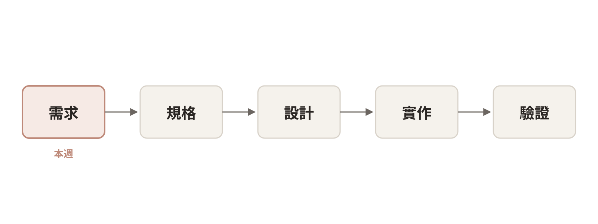
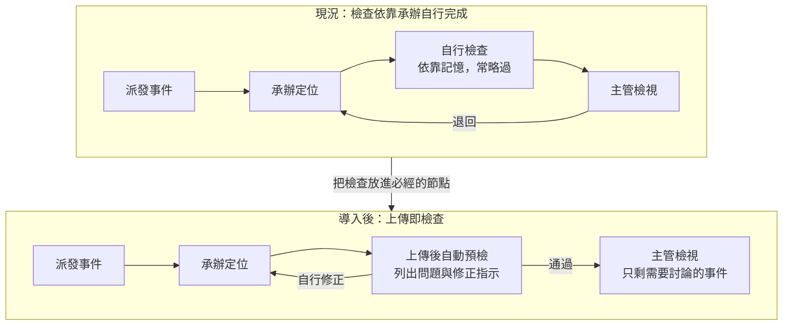
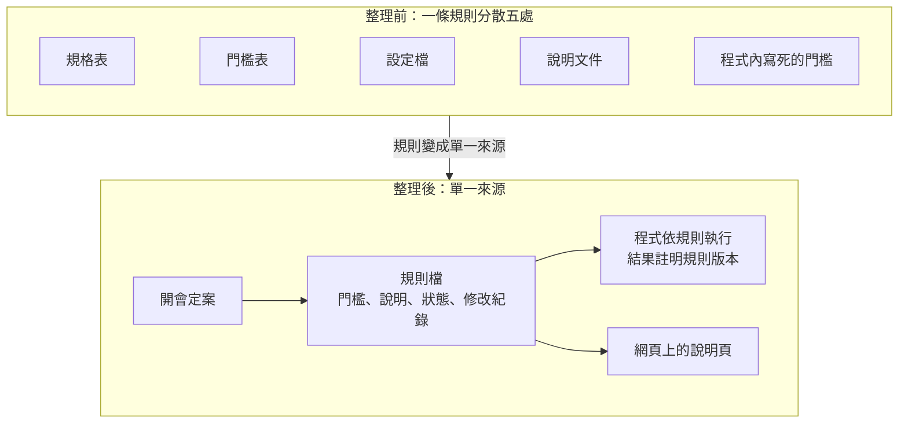

# 第六週文稿：從減少返工到可用的預檢工具

> 狀態：第六週講述的文稿，供討論，尚未放入正式教材。以一個完整的開發案例，說明第五週「選出一段交給 Agent」之後如何進行，一週講完，不跨週。
> 文稿是形成論述這一圈的產出：能獨立閱讀，以書面語寫成，不是照唸的講稿。論述確認之後，再依 [ghost deck 做法](../skills/ghost-deck-from-own-words.md) 排成逐頁稿；各設計重點的原話整理在文末附錄。
> 取材：[預檢工具的開發過程](../kb/arguments/domain-expert-tool-development-case.md)、講師保存的開發對話紀錄與截圖（含真實資料，不進本 repo）、第四週的六種介入方式、第五週的需求工程與三個條件。
> 去識別化：案例取自講師的實際開發，依工作區規定不寫系統與程式名稱、主機、路徑與真實資料；定位軟體、檢查程式、派工網頁、定位結果檔皆為一般說法。開發畫面含真實資料，投影片需以虛構資料重拍或遮蔽。
> 建議配時（待確認）：引言 5 分、第一段 15 分、第二段 12 分、第三段 12 分、第四段 20 分、第五段 12 分、第六段 8 分，講述合計約 85 分；其餘時間為工作坊，內容待定。
> 2026-10-05 第八版（續三）：第六段依由近到遠重排為目前的狀態、從原型到正式工具、分階段導入、評估導入的效果、長期的方向、下一週；前測與後測獨立成「評估導入的效果」；刪去重複的現況描述；下一週補上在測試機執行舊程式逐筆比對。
> 2026-10-05 第八版（續二）：第六段新增「分階段導入」：四個階段、本週只完成第一階段；自動修正、自動重新定位與需要人工辨識的項目需更詳細評估（講師提出）。前測與後測補上每個階段以前一階段結果為新的前測。
> 2026-10-05 第八版（續）：「目前的狀態」補上前測與後測：導入前蒐集退回紀錄與送出時的問題分布，導入後以同樣方式再量一次，評估看返工而不看使用率（講師提出）。
> 2026-10-05 第八版：整體整理。「原型的製作順序」併入引言的階段總表（新增「主要的工作」欄），第四段只留一句導言；「以文字描述想像的畫面」補進第一段；第一段不再重複描述第一版故事圖的雜亂；引言兩段 vibe coding 的說明合併。
> 2026-10-05 第七版（續八）：第四段開頭新增「原型的製作順序」六步：文字描述想像、從投影片抽規則、以真實資料初步確認、畫面雛形、對齊現有介面、加強可讀性（講師提出）。
> 2026-10-05 第七版（續七）：「貼近實際作業」補上直接給截圖請 Agent 照著做的小技巧，第五段合作做法同步新增一項（講師提出）。
> 2026-10-05 第七版（續六）：附錄的開發環境移入第三段，新增「由 Agent 操作測試機」，展示 Agent 透過遠端登入操作另一台電腦（講師提出）；刪除附錄「開發環境的細節」。
> 2026-10-05 第七版（續五）：第三段改為「還原實際環境」，小節為「在實際的條件下測試」：真實的資料、真實的程式與真實的系統環境，取得資料的過程一句帶過（講師提出）。
> 2026-10-05 第七版（續四）：依講師說明改寫「現況圖要畫到能討論」：Agent 起初照規則逐項列出而顯得雜亂，整理成較大的步驟、把同一步驟的細項收起來之後，才看得到資料在人與程式之間往返的樣子。
> 2026-10-05 第七版（續三）：第六段的「下一週」移到最後獨立成小節，並預告說明文件與程式不一致的發現；Karpathy 一段緊接在工程化的說明之後；「兩端的利益」改為「使用者的利益」。
> 2026-10-05 第七版（續二）：引言明確寫出本週全部屬於 vibe coding：先快速設計畫面與操作，想像完成的樣子是否合理，再依此目標回頭設計架構（講師提出）；第六段的銜接同步。
> 2026-10-05 第七版（續）：第六段補上與下一週的銜接：下一週進入規格階段，重現原本流程、完成規則溯源後再重新設計程式（講師提出）。
> 2026-10-05 第七版：主軸由「轉折」改為設計重點。四個階段仍依時間排列，每一節以一個設計重點為標題，依「重點是什麼、為什麼、案例中如何決定」說明；正文不再使用「轉折」一詞，「取得新資訊、Agent 做出一版、人判斷」的模式改在第五段整理為與 Agent 合作的方式。「好的設計」的五個條件放回第一段；原第六段與收尾合併為「之後的路」；原型用於探索需求的說明只保留於引言與第六段。上一版見 commit 5df7840。

## 引言：一件工作為什麼一再被退回

承辦把完成的資料交出去，幾天後被退回，修正之後再交，有時又被退回一次。每一次退回，雙方都要重新打開同一筆資料，說明同一個問題。

本週以一個實際開發的檢查工具為例。對其他科別的同仁，這個案例可以理解為：如何以 vibe coding 做出一個有實際用途的網頁。用自然語言描述想要的東西，由 Agent 寫出程式，人負責引導、試用與回饋。學員不必學會寫程式，重點在於看清每一個設計決定從哪裡來。

本週呈現的整個過程，在軟體開發的階段中都還屬於最前面的需求階段。這個階段的做法是先快速把使用者會看到的畫面與操作設計出來，讓大家能夠想像完成的樣子，判斷它是否合理。網頁原型的用途在於確認目標，並不是交出一個可以正式上線的系統；目標確定之後，才回頭設計程式的架構。

案例依時間分為四個階段，每個階段整理出幾項設計重點。

| 階段 | 主要的工作 | 設計重點 |
|---|---|---|
| 讀懂現況 | 以文字描述想像的畫面；從投影片與紙本清單抽出檢查規則 | 好的設計要滿足的條件、分層攔截、工具的定位 |
| 釐清需求 | 把現況圖畫到能討論；向同仁確認分工與派工的方式 | 現況圖要畫到能討論、檢查放在必經的節點 |
| 還原實際環境 | 取得真實資料與原始碼，先以掃描程式確認；準備測試機 | 在實際的條件下測試、由 Agent 操作測試機 |
| 製作原型 | 做出畫面的雛形；對齊現有的介面；加強檢查結果的可讀性 | 貼近實際作業、規則單一來源、讓驗證過程看得見 |

畫面是在最後一個階段才做的，但對畫面的想像從第一天就在。先有想像，才知道要整理哪些規則、要確認哪些資料；規則與資料確認過，畫面才不會做成一個空殼。

## 一、讀懂現況

案例的業務是地震資料的品質檢查。主管以派工網頁派發地震事件，承辦以定位軟體完成定位、產出定位結果檔之後自行檢查，再交給主管。主管檢視時發現問題就退回，承辦修正後再交。檢查的依據是一份訓練投影片與一張紙本清單。

### 好的設計要滿足的條件

設想講師自己要完整執行這件事，會先遇到幾個阻礙。拿到訓練投影片之後，要花上許多功夫才能大致理解內容。每次送出資料之前，又要把各個資料來源逐一打開，照著清單一項一項檢查，費力的程度足以讓人想要略過。即使願意完整執行，規則散在各處，檢查也只能依靠自己記得去做。

從這些阻礙回頭看，一個好的檢查工具應該滿足以下條件。這些條件也是之後檢視每一版成品的標準。

- **很快知道哪裡不對。** 所有問題一次列出，並指出在資料的哪個位置。
- **知道如何修改。** 每一項問題附上明確的處理指示，不必回頭查閱投影片。
- **不偏離原本的習慣。** 操作方式與原本的作業相近，不必重新學習。
- **容易上手。** 不必另外安裝程式，打開就能使用。
- **不讓人感覺受到監視。** 結果先給承辦本人，不自動回報，也不統計個人錯誤。

條件都達到了，使用者用起來能比原本輕鬆，這就是好的設計。這一節對應第五週的需求工程：先確認要解決的問題與成功的條件，再決定做什麼。

### 分層攔截：先假設每一步都出錯

要決定哪些錯誤交給程式、哪些交給人，可以先假設流程中每一個步驟都出錯，再逐一檢視原本的流程能攔下多少，有多少會流到下一位承辦手上。依錯誤的性質，可以分成三層。

1. **流程錯誤，以規則攔截。** 時間格式、欄位範圍等有明確對錯的項目，由程式直接攔截。
2. **執行品質，以物理限制篩選。** 殘差、深度、定位誤差等沒有標準答案，但必須落在合理範圍內的結果，由程式篩選。
3. **其餘項目，由人檢視。** 前兩層都攔不下、需要看波形才能判斷的項目，才交給承辦。

這樣分層，人的時間就能留給真正需要判斷的地方。

案例中，講師看過 Agent 依投影片畫出的第一版故事圖之後，認為重點應該放在錯誤被漏掉的地方，要求改畫「每一步都出錯」的情況；讀完 Agent 依此所做的說明，講師歸納出這三層。這個分層之後成為整個工具的骨架。

### 工具的定位：減少承辦的工作

工具能不能被使用，取決於使用者覺得它是幫手還是負擔。講師分析了使用者的利益：承辦要願意使用，這個工具就必須真正幫忙減少工作，而不是監控程式，才有機會被普遍使用。

同一次討論中，講師也確定了另外兩項做法。第一，檢查依原本訓練投影片的步驟編排，不大幅改動大家熟悉的流程，每一項都有原本的文件可以比對。第二，現有的程式大多是老舊的 Windows 程式，第一版只以指令執行，必須在圖形介面完成的步驟改為提示承辦操作。

這三項決定來自對業務、同仁處境與現有環境的理解，Agent 無法自行提出。

同一天，講師也先以文字寫下對工具畫面的想像：一份任務清單，分開列出程式已經完成的工作，以及需要承辦協助的地方。這時還沒有任何程式，但之後整理規則、確認資料與製作畫面，都朝著這個想像前進。

> **Agent 在這個階段的協助。** 把難讀的投影片整理成文字與步驟清單，依講師的方向重畫故事圖，並分析舊程式的類型與可以介入的方式。

## 二、釐清需求

### 現況圖要畫到能討論

流程圖的用途是讓人能夠拿來討論，資訊完整不等於好用。案例中，Agent 一開始照著投影片的規則，把每一項檢查、每一支程式都逐一列成圖上的活動。內容沒有錯，但整張圖看起來相當雜亂，也看不出重點在哪裡。

後來的修改是把圖整理成比較大的步驟：同一個步驟裡的細項，例如逐項檢查、逐項修正，全部收進一個活動，不再一一畫出。細節收起來之後，才看得到資料實際在人與程式之間如何往返：承辦交出、主管退回、承辦修正後再交出。這個往返正是返工發生的地方，也是工具要介入的位置。講師在修改過程中一再要求「圖好像可以再更簡單」，並逐一調整活動的寫法，例如讓掃描由承辦發起而程式只作為工具、在人與程式之間補上動詞，使每個活動都能讀成完整的句子。

前後修改約二十次，最後收斂為三張遞進的圖：現況、假設承辦以現有工具完整自行檢查、導入工具之後。第二張圖說明了步驟為什麼常被省略：即使承辦願意完整檢查，現有的工具也不足以支撐。這是第四週「把圖修順」在真實業務上的樣子。每一版圖畫出來，才看得出哪裡太複雜，前一版本身就是下一版的依據。

### 檢查放在必經的節點

只要檢查需要承辦自己想到才做，就一定會有遺漏。比起提醒大家記得，更可靠的做法是把檢查放在流程上一定會經過的位置。

案例中，Agent 分析後發現定位軟體缺少一些防呆的措施，因此可以產出帶有簡單錯誤的定位結果檔；原本已有兩支檢查程式，卻不是流程上必經的節點。向同仁了解實際的作業方式之後，又得到兩項資訊：主管派發地震事件使用的是一個網頁介面，而且原本以為分屬兩個單位的資料處理與目錄維護，實際上是同一組。原本並列的兩種方案（工具放在送出端或接收端）因此取消，派工網頁則成為最合適的位置。承辦本來就要在這個網頁上提交成果，上傳之後先自動執行一輪檢查，簡單的問題自動修正或附上明確的指示，承辦不必再依靠記憶。

這也印證第五週的觀察：提出需求的人往往只看得到自己那一段，需求需要透過詢問逐步釐清。

> **Agent 在這個階段的協助。** 重畫故事圖的每一個版本、分析定位軟體與舊程式的防呆缺口、整理要向同仁確認的問題、依新資訊改寫全部文件。哪一版的圖可以拿來討論、分工到底如何，則由講師判斷與詢問確認。

## 三、還原實際環境

### 在實際的條件下測試

原型要在接近實際作業的條件下測試，才看得出問題。用自己編的範例，只會驗證自己想得到的情況；換成真實的資料、真實的程式與真實的系統環境，投影片沒有寫到的問題才會浮現。

案例中，講師向單位取得一個月內約一千筆尚未經過檢查的定位結果檔，以及舊檢查程式的原始碼，並另外準備一台與實際作業相同、使用 Windows 的測試機。三者各自補上一塊只看投影片看不到的資訊。

- **真實的資料。** 以這批資料執行掃描，才知道每一項問題實際有多常發生。例如「方位角空缺過大」一項就標出約四成的事件，這不表示四成事件都有問題，而是這項門檻還沒有定案。工具列出的是需要注意的地方，不是結論，門檻如何訂定仍需熟悉業務的人決定。
- **真實的程式。** 讀原始碼才知道舊程式實際檢查了什麼，說明文件寫的不一定是程式的實際行為。這也是下一週規則溯源的起點。
- **真實的系統環境。** 舊程式只能在 Windows 上執行，日後若要與舊程式的結果逐筆比對，也需要在相同的環境中進行。

因為前兩個階段已經把規則與流程整理清楚，掃描程式很快就寫出來了，這個階段的重點在於讓原型面對真實的條件。

### 由 Agent 操作測試機

還原實際環境，不一定要人坐到另一台電腦前操作。這個案例的硬體安排如下，也展示 Agent 可以透過遠端登入，直接操作另一台電腦。

- **日常開發在 Mac，測試在 Windows。** 舊程式只能在 Windows 上執行，因此另外準備一台 Windows 電腦作為測試機；所有修改、討論與 Agent 的對話都在 Mac 上進行。
- **兩台電腦以私人網路連線。** 兩台電腦加入同一個私人虛擬網路，測試機的遠端登入只對這個網路開放，並改用金鑰登入，不對外公開。
- **Agent 遠端執行測試。** Agent 在 Mac 上把程式送到測試機，透過遠端登入（SSH）執行測試、啟動網頁，再把網頁轉接回 Mac 的瀏覽器，人在 Mac 上就能直接操作。
- **測試機只負責執行。** 起初兩台電腦上各有 Agent 在工作，造成檔案格式互相轉換、討論歷史分散在兩處，事後整理時只看得到其中一段。改為所有修改集中在 Mac、測試機只執行之後，這兩個問題都消失了。測試機平時不開機，需要 Windows 時才開。

讓 Agent 操作另一台電腦時，權限要先劃清楚：只開放私人網路、只用金鑰登入、測試機只做測試。這些安排也寫進專案的工作說明檔，下一次對話或更換 Agent 時，照同一套規則進行。

> **Agent 在這個階段的協助。** 依舊程式的讀取格式寫出解析與掃描程式，以真實資料執行，並統計各項問題的筆數；協助設定測試機的環境與遠端連線，之後透過遠端登入在測試機上執行測試。

## 四、製作原型

有了規則與確認過的資料，才開始做畫面：先做出雛形，再對齊現有的介面，最後加強檢查結果的可讀性。以下三個設計重點，是製作畫面時做出的決定。

### 貼近實際作業

工具要能被使用，操作方式必須符合實際的作業，這也是第一段「不偏離原本的習慣」的具體做法。

案例中，前一階段的程式一次掃描整個月的檔案。講師想像的實際作業則是每個人提交一個檔案，就針對那個檔案列出全部結果與建議，工具因此改為單筆提交。接著講師直接把派工網頁的截圖交給 Agent，請它照著畫面做。Agent 原本做的是通用的上傳頁面，看到截圖之後，改為沿用既有的欄位與排列，只新增一欄「預檢」。

這是一個實用的小技巧：要 Agent 做出某種樣子的畫面時，直接給一張圖，比用文字描述欄位、排列與配色快得多，也準確得多。手邊有現成的畫面、紙本表單或別人做好的範例，都可以拍下來請 Agent 照著做。

之後的修改也多半在沿用現場的習慣：承辦自己上傳之後再按預檢、細節以派工網頁慣用的彈出視窗顯示、配色維持淺色。這些都是現場的資訊，Agent 事先無從得知，只能先依一般做法做出合理的版本，等人提供畫面與說明之後再修正。

### 規則單一來源，網頁只說明

一條規則原本散在規格表、門檻表、設定檔、說明文件與程式五處，各處的版本不一定相同，修改一個門檻也容易漏改。設計上改為單一來源：一條規則一個檔案，記錄門檻、說明、狀態與修改紀錄，程式依規則檔執行，網頁上的說明頁也由規則檔產生。來源之間互相矛盾時，工具不自行決定，而是全部列出、標明出處，交由會議定案。每份檢查結果也註明依第幾版規則檢查。

案例中有兩次修正。第一次，講師原本希望有一個友善的地方可以修改規則，Agent 依此做出網頁上的規則編輯、草稿與發布流程。看到成品之後，講師判斷介面過於複雜：規則是開會討論後才定案的東西，網頁不需要讓人修改，只要有說明的介面即可，編輯功能因此移除。需求在口頭描述時看似合理，做成畫面之後才發現過大，這正是以原型探索需求的用處。

第二次，講師追問規則的編號是不是署內訂的。查證後發現，編號是 Agent 早期整理資料時自訂的，寫進多份文件之後，看起來就像正式代碼。工具尚未上線，修改成本最低，於是重新編號，並保留舊編號對照。Agent 整理出來的內容，即使看起來很正式，也需要追問來源。

### 讓驗證過程看得見

使用者要能相信檢查結果，就必須看得到工具檢查了什麼。定位結果檔是固定欄位的文字格式，數值彼此的關係很難直接看出來。

案例中，講師要求詳細檢視的畫面左邊列出每一項檢查，右邊對照原始資料，能作圖的就作圖。看過第一版之後，又要求標出每項檢查讀取的欄位，這樣才知道它在檢查什麼。最後的畫面中，點選任何一項檢查，原始資料中它讀取的欄位會以底色標出，有問題的值另以醒目的顏色標出；地圖、走時圖與規模圖呈現原始格式中看不出的數值關係；滑鼠移到數值上，則提示欄位名稱與解讀後的值。使用者不必讀程式，也能判斷工具是否檢查了正確的位置。

> **Agent 在這個階段的協助。** 撰寫規則檔、三個網頁、四種圖表與自動測試，每次修正在數分鐘內做出新版並附上截圖；比對兩支舊檢查程式的原始碼，找出說明文件與實際程式不一致之處；規則搬進規則檔之後，以約一千筆真實資料重新檢查，逐筆確認結果與搬移之前相同。講師問全部預先檢查會不會太久時，Agent 先量測，一整天約一百三十個檔案不到 0.1 秒，才依結果決定整日一次檢查。

## 五、與 Agent 合作的方式

### 資訊越多，設計越貼近現實

回顧整個過程，設計每一次改變方向，幾乎都是因為取得了新的資訊：訓練投影片、舊程式的類型、派工網頁、實際的分工、原始碼與真實資料、現場的畫面與習慣，以及前一版的成品本身。每多一項資訊，設計就更貼近現實一些。與 Agent 溝通也是如此，提供的資訊越多，得到的設計越接近實際的需要。

這並不是 Agent 特有的限制。人類工程師在資訊不足的時候，同樣只能先依一般做法做出合理的猜測，完成手上這個階段的工作，取得新的資訊之後，再重新對齊需求、修正設計。方向調整幾次，代表需求是在過程中逐步釐清的，這是開發的常態。

### 合作時的幾個做法

- **主動提供現場的資料。** 畫面截圖、作業說明、既有的程式與實際的資料，都比抽象的描述更能讓產出貼近現場。
- **給圖片，請 Agent 照著做。** 想要的畫面直接給截圖或照片，比用文字描述更快也更準確。
- **先做出一版，再提出修正。** 第一版的價值不只在成品本身，也在於它能換來新的資訊。看到第一版故事圖，才知道圖要畫什麼；看到規則編輯的畫面，才知道不需要這個功能。
- **追問依據。** 例如「這些編號是誰訂的」，讓 Agent 回頭查證來源。
- **先量測，再決定。** 擔心效能時，先請 Agent 實際量測，而不是憑印象判斷。

### 力氣花在哪裡

開發對話中，講師輸入的訊息共約一百二十則。其中約八十則發生在寫程式之前，用於讀懂投影片、畫出現況與釐清分工，寫程式的兩個階段合計約三十則。程式本身可以很快完成，前提是問題已經弄清楚。

### 人與 Agent 的分工

Agent 縮短的是製作與查證的時間：整理難讀的投影片、重畫故事圖的每一個版本、逐行比對原始碼、以真實資料估算影響、撰寫檢查程式與網頁。人負責的是判斷：寫下好的設計要滿足的條件、提出攔截的三層、確立工具不能是監控程式、向同仁詢問實際的分工、提供現場的畫面與習慣、在看到成品之後刪去過大的需求、追問 Agent 的整理是否有依據。

這也回應第五週的三個條件。驗收標準是事先寫下的設計條件與規則檔，外部檢查是原始碼的比對、量測、真實資料的重新檢查與講師的試用，判斷與責任由熟悉業務的人承擔，規則由開會定案。

## 六、之後的路

### 目前的狀態

本週完成的是需求階段的原型，而且只做到後面「分階段導入」的第一階段：掃描、列出問題與修正指示。規則全部還在待確認的狀態，網頁是仿照派工網頁製作的示範，尚未接上實際的系統，承辦也還沒有實際使用。返工是否真的減少，要等規則定案、正式對接、承辦用過之後才能確認。工具能夠完成，與是否解決了原本的問題，是兩件需要分開確認的事。

### 從原型到正式工具

這個原型類似開發時用來展示構想的 demo，讓同仁看得到上傳之後會出現什麼結果。原型能在短時間內做出來，是因為它只需要回答「這樣做是否合用」。一旦要接上實際的系統，讓同仁每天使用，就會出現許多原型階段不必處理的工程問題。

- **可以追溯。** 每一筆檢查結果都要能回溯到當時的輸入檔、規則版本與程式版本，日後被問到「這筆資料當時為什麼通過」，能夠拿出依據。
- **版本化。** 程式、規則與部署的環境都要有版本，知道目前線上執行的是哪一版，出問題時能夠退回上一版。
- **日誌與錯誤回報。** 程式在伺服器上自動執行時，沒有人在旁邊看著。執行紀錄要保存下來，發生錯誤時要能通知負責的人，不能默默失敗。
- **自動測試與部署（CI/CD）。** 每次修改程式或規則，都先自動執行測試，通過之後才部署到正式環境，避免一次修改讓原本正常的檢查失效。

原型階段已經有一些雛形，例如每份結果註明依第幾版規則檢查、修改後執行自動測試、以真實資料確認結果不變，但這些都只是開發者自己的習慣，還不是正式系統的機制。真正對接時，必須先弄清楚派工網頁的實際架構，包括由誰維護、資料存放在哪裡、能否在伺服器端執行檢查，並與維護者一起設計，決定由誰負責日後的維運。這個案例的順序是先把業務流程大致收斂，再去研究如何對接。

vibe coding 能夠很快做出原型，用於探索需求相當合適，走到正式工具則需要上述的工程化。提出 vibe coding 一詞的 Karpathy，後來也把有工程紀律的專業用法另稱為 agentic engineering。兩者都使用 Agent，差別在於是否具備可以追溯、版本化、錯誤回報與自動測試這些機制。

### 分階段導入

工具的權限依可靠程度逐步放大，每一階段確認可靠之後，才進入下一階段。

1. **只檢查、不修改。** 掃描並列出問題與修正指示，所有修正由承辦自己做。程式不改動任何資料，風險最低，也最容易取得同仁的同意。
2. **自動修正。** 時間進位等規則明確的欄位由程式直接修正，並保留修改前後的內容。
3. **自動重新定位。** 需要重跑定位程式的項目由程式代做，先以過去已定位的事件逐筆比對，結果一致後才使用。
4. **是否強制。** 是否要求每筆都通過檢查才能提交，等承辦實際用過、認為有幫助之後再討論，不以強制作為推廣方式。

自動修正與自動重新定位都還沒有實作；需要人工辨識的項目，例如看波形判斷有無地震、依理論到時補挑近站、比對疑似重複的事件，目前只列為提示，交給承辦處理。這些功能一旦由程式代做，錯誤會直接寫進資料，因此每一項都要先更詳細地評估：規則是否明確、能否以過去的資料驗證、出錯時如何發現與復原。需要人判斷的項目，程式可以先把判斷所需的資訊整理好，判斷本身仍由承辦做；是否能進一步自動化，要另外以實際案例評估。

### 評估導入的效果

要確認工具是否解決了原本的問題，導入前就得先準備前測與後測，否則事後無法說明工具帶來了什麼改變。依第五週的原則，評估看的是返工，而不是使用率或速度。

- **前測（導入前）。** 蒐集現行的退回紀錄：每筆事件被退回幾次、退回的原因、送出時仍有哪些問題。這個案例以一個月尚未經過檢查的真實資料執行掃描，得到的問題分布可以作為前測的一部分。
- **後測（導入後）。** 承辦實際使用一段時間之後，以同樣的方式再量一次：退回次數與原因、送出時仍有的問題，並以訪談或少量問卷了解承辦花在檢查上的時間是否減少。

前後兩次用同一套規則與同樣的計算方式，差異才有意義。這也是規則要有版本的另一個理由：比較時要能說明兩次各依據哪一版規則。每進入下一個階段，都以前一階段的結果作為新的前測。

### 長期的方向：在上游補上防呆

問題之所以會留到送出前的檢查才被發現，根本原因在於上游的定位軟體沒有防呆。預檢是在下游攔截錯誤，可以減少退回，卻無法讓錯誤不再產生。長期的解法是等挑波定位程式進行大規模更新時，把這些檢查條件寫進程式，在產出定位結果檔的當下就阻止錯誤。到了那個時候，規則檔可以直接作為更新的規格，短期的預檢工具因此也在為長期的修正累積規格。

### 下一週：規格階段

下一週接續這個案例，進入規格階段。做法是一步一步重現原本的流程：逐支閱讀舊程式的原始碼、逐頁比對投影片與清單，列出每一個來源實際做了哪些檢查，再確認每一項都被規則接住，或註明不納入的理由。所有規則都能追溯到來源之後，再以本週原型確定的畫面與操作為目標，回頭設計架構，重新寫出實現這些業務邏輯的程式。照著投影片直接重寫，容易漏掉舊程式實際在做、投影片卻沒有寫到的檢查。實際逐支讀過之後也發現，說明文件與程式的實際行為有好幾處並不一致，只看文件會寫出另一套規則。因此下一週也會在測試機上，以同一批真實資料執行舊的檢查程式，把它的結果與規則的結果逐筆比對。

## 工作坊（待定）

內容待講師決定。候選方向：學員以第五週收集到的問題重畫現況圖；為自己的問題寫下「好的設計」應滿足的條件；讓 Agent 先做出一版並修正一輪；主管盤點單位內分散或矛盾的規定。

## 附：各設計重點的原話

供 ghost deck 取用標題與原話，不放入正式教材。系統與程式名稱以［］內的一般說法取代，其餘為原文。

| 設計重點 | 原話 |
|---|---|
| 好的設計要滿足的條件 | 讓操作的人可以很快知道哪裡不對，還有知道怎麼改，就是有個明確的指示，然後操作起來又不會跟原本的習慣差太多，也不會很難上手，還有不要感覺是一個被監視的東西（講課說明） |
| 分層攔截 | 感覺有點醜，還是你畫只有資料處理流程，然後全部都錯的情況他走了所有的東西，因為我們應該重點在要攔截所以他沒做的事情 |
| 分層攔截 | 最重要的就是看如果全部都錯，可以有多少東西沒有被原本流程攔截，變成跑到下一個承辦身上需要檢查 |
| 工具的定位 | 這個程式不是一個監控程式，而是一個真的幫忙減少工作的程式，這樣才會有機會被普遍使用 |
| 工具的定位 | check list 應該要貼近原本 ppt 的步驟，就是不要大幅改動原本大家熟悉的流程 |
| 工具的定位 | 我覺得第一版可能先不要去測試 ui，就是想辦法用指令的方式去跑，UI 部分就是提示人類要去做 |
| 現況圖要畫到能討論 | 我覺得圖好像可以再更簡單？ |
| 現況圖要畫到能討論 | ［檢查程式］好像沒有從人的操作發起 |
| 檢查放在必經的節點 | 得到一個新資訊，他們有個派發地震事件的一個網頁，那這個 qc 原本是人工做，這裡感覺就是可以變成一個自動化的節點去提示 |
| 檢查放在必經的節點 | 那這樣就沒有什麼方案一跟二的差別了 |
| 在實際的條件下測試 | 這個就是他們給的一些範例［定位結果檔］，也就是要 qc 的對象，那就會是可能寫個程式去掃描這些［定位結果檔］看有沒有都符合目前的規則？ |
| 貼近實際作業 | 我想像不是全部一起掃，比較像是每個人他提交到網頁上，他會針對那一個［定位結果檔］把所有 qc 結果與建議秀出來 |
| 貼近實際作業 | 我記得他們網站比較習慣是用 lightbox 的形式，而不是展開一個下拉資訊 |
| 規則單一來源 | 這些 qc 規則是需要一個地方來記錄到底做了什麼，有點像版本……還有可以有比較友善的地方可以來改這些規則 |
| 規則單一來源 | 目前的介面好像太過於複雜了？就是實際不需要讓他們網頁上面可以改，這個會是開會討論後才會定案的東西 |
| 規則單一來源 | 這些編號應該不是氣象署訂的，是前面 agent 分類的？那應該可以重新換一下，因為還沒上線 |
| 讓驗證過程看得見 | 我也要標出檢查哪一個欄位，這樣才可以知道是在檢查什麼 |
| 資訊越多，設計越貼近現實 | 越多的資訊就會得到越貼近現實的設計，人類工程師也是需要通靈才能先完成階段任務，然後獲得新資訊重新對其後就會修正（講課說明） |

## 附：可用的圖與素材

- 本文的流程圖（現況與導入後）可直接用於投影片；檢查方式與規則位置的前後對照圖見[素材筆記](../kb/arguments/domain-expert-tool-development-case.md)。
- 講師另行保存了故事圖各版本與網頁各版本的截圖，以及對應的原話。故事圖只有角色與程式名稱，換成一般說法後重畫即可使用；網頁截圖含真實資料，需以虛構資料重拍或遮蔽。
- 「力氣花在哪裡」可以畫成一張長條圖：寫程式之前約八十則、寫程式約三十則。
- 素材筆記決策表的前兩欄（Agent 原本的做法）可作為課堂練習：請學員推測熟悉業務的人會如何導正、依據是什麼。

## 附：講師的說明（原話，2026-10-05）

講師對這堂課講法的說明，供 ghost deck 取用。系統與程式名稱以［］內的一般說法取代，其餘為原文。

> 我自己的想法，如果要講我可能會先從整個問題分析開始講，然後聽了上次他們給的一些意見跟拿到的資料與程式碼，加上可能對於同仁心裡的分析
>
> 就是我自己拿到那個投影片，也是要花很大功夫才會大概知道他在寫什麼，然後送出去之前也很懶得把那個資料來源打開來一個一個照著做，那是不是有辦法設計一個 qc 清單，讓操作的人可以很快知道哪裡不對，還有知道怎麼改，就是有個明確的指示，然後操作起來又不會跟原本的習慣差太多，也不會很難上手，還有不要感覺是一個被監視的東西，用起來大家都可以輕鬆一點，那這就會是個好的設計
>
> 流程層面來說，就是 agent 分析了一下原本［定位軟體］好像少了一些防呆的措施，所以才會有辦法做出一些簡單錯誤的［定位結果檔］，除了那些真的很特殊的案例需要人去看，實際上這些東西可以用一個 qc 攔截，那原本也有兩個［檢查程式］了，只是沒有變成流程上必經的節點，全部靠人本身去完成。後來看到說其實有個網頁的派發介面，那這個會是一個很好的自動化流程節點，讓［定位結果檔］上傳後先自動過一輪 qc，然後一些簡單的問題可以先自動修正或者有明確指示，這樣就不會需要靠記憶想到才做
>
> 程式設計方面設計原則我能想到的大概就是規則要變成 single source，才不會有一大堆散落各地的版本，這樣整理後也可以很清楚的放在 UI 上面說明到底在檢查什麼，另外介面設計就是做一些畫圖跟實際比對來讓整個驗證流程更直觀一點
>
> agent 怎麼在中間開發輔助的話，就看哪邊有用到就補個說明這樣？
>
> 那我這邊流程上的一個缺口，就是現在問題會跑到 qc 來就是因為那個上游的［定位軟體］沒有做防呆，那長遠來講應該會是等整個挑波定位程式要做大更新的時候，要把這些條件寫進去，就可以從根本上去解決這個問題
>
> 我覺得這些轉折其實也是像我們要跟 agent 溝通一樣，越多的資訊就會得到越貼近現實的設計，人類工程師也是需要通靈才能先完成階段任務，然後獲得新資訊重新對其後就會修正，所以才會有這麼多轉折
