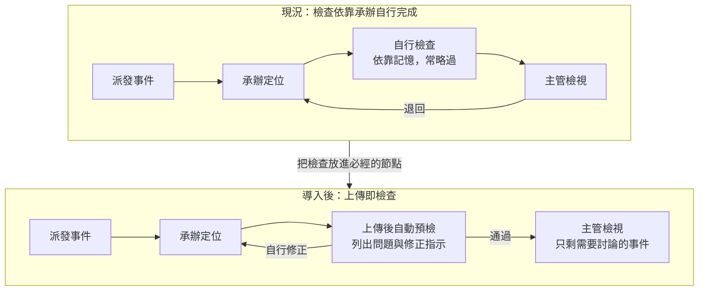
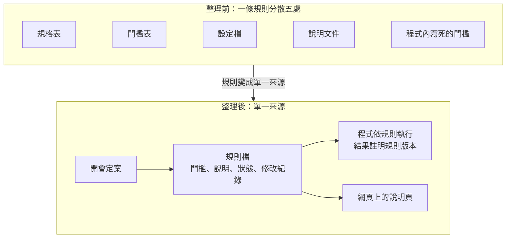

# 第六週文稿：從減少返工到可用的預檢工具

> 狀態：第六週講述的文稿，供討論，尚未放入正式教材。以一個完整的開發案例，說明第五週「選出一段交給 Agent」之後如何進行，一週講完，不跨週。
> 文稿是形成論述這一圈的產出：能獨立閱讀，以書面語寫成，不是照唸的講稿。論述確認之後，再依 [ghost deck 做法](../skills/ghost-deck-from-own-words.md) 排成逐頁稿；講師的原話保存在文末附錄。
> 取材：[預檢工具的開發過程](../kb/arguments/domain-expert-tool-development-case.md)（問題分析、設計邏輯、十二項導正、引導方法、分工、工作環境）、第四週的六種介入方式、第五週的需求工程與三個條件。
> 去識別化：案例取自講師的實際開發，依工作區規定不寫系統與程式名稱、主機、路徑與真實資料；定位軟體、檢查程式、派工網頁、定位結果檔皆為一般說法。開發畫面含真實資料，投影片需以虛構資料重拍。
> 建議配時（待確認）：引言 3 分、第一段 20 分、第二段 20 分、第三段 20 分、收尾 10 分，講述合計約 75 分；其餘時間為工作坊，內容待定。
> 2026-10-05 第四版：依講師的說明重排為四段：問題分析（業務、取得的意見與資料、同仁的心理、好的設計）→ 流程設計（防呆缺口、必經的檢查節點）→ 程式設計（規則單一來源、直觀的驗證）→ 收尾。Agent 的協助不另立一段，在用到的段落補充說明，每則同時寫出 Agent 做了什麼與人如何導正。上一版依每週節奏排列，未提交，不另保存。

## 引言：一件工作為什麼一再被退回

承辦把完成的資料交出去，幾天後被退回，修正之後再交，有時又被退回一次。每一次退回，雙方都要重新打開同一筆資料，說明同一個問題。

本週以一個實際開發的工具為例，從問題分析開始，說明如何把「減少退回」轉成流程與程式的設計，最後做出一個可以操作的網頁原型。這個案例對應第四週六種介入方式中的「製作工具」：Agent 參與製作，工具完成之後由一般程式執行，運行時沒有 Agent。學員不必學會寫程式，重點在於看清每一步的判斷從哪裡來，以及 Agent 在其中協助了什麼。

整個過程約一週，前三天用於分析問題與設計，取得真實資料之後才開始實作。

| 日期 | 階段 | 主要產出 |
|---|---|---|
| 9 月 29 日 | 整理現況 | 訓練教材的整理、現況說明、第一版流程圖、待確認的問題 |
| 9 月 30 日 | 釐清需求 | 反覆修改後的流程圖、攔截的三層、利益與採用條件 |
| 10 月 2 日 | 取得資料、開始實作 | 一個月約一千筆的真實資料與舊程式原始碼、第一版檢查程式 |
| 10 月 4 至 5 日 | 製作原型 | 規則檔、單筆預檢網頁、詳細檢視與圖表 |

## 一、問題分析：什麼樣的檢查，大家才會願意使用

### 業務與退回

案例的業務是地震資料的品質檢查。主管以派工網頁派發地震事件，承辦以定位軟體完成定位、產出定位結果檔之後自行檢查，再交給主管。主管檢視時發現問題就退回，承辦修正後再交。

### 取得的意見與資料

分析從手邊的訓練投影片開始，再向同仁詢問實際的作業方式。同仁的說明修正了最初的理解：原本以為資料處理與目錄維護分屬兩個單位，實際上是同一組，由主管派發、承辦自行檢查、主管檢視後退回；派發則透過一個網頁介面進行。

之後取得的資料與程式，讓分析不再只依靠投影片的描述。資料是一個月內尚未經過檢查的定位結果檔，約一千筆；程式是兩支既有檢查程式的原始碼，以及存放舊程式的資料夾。有了實際的資料，才能估算每一項問題實際影響多少筆；有了原始碼，才能確認舊程式實際檢查了什麼。

綜合投影片、同仁的說明、資料與程式，退回的原因可以歸為三類。

- **規則分散且不一致。** 約三十項檢查分散在訓練投影片、紙本清單與兩支舊的檢查程式裡。同一個門檻有兩三種說法，例如判斷重複事件的時間差，就有一秒、兩秒、三秒三種。
- **檢查不是必經的步驟。** 檢查程式已經存在，但流程上不一定會執行，結果要到主管檢視時才看得出來。
- **步驟繁瑣、工具分散。** 每次檢查要手動更換日期與路徑，舊程式沒有涵蓋的項目只能對照紙本清單。

> **Agent 在這一段的協助。** Agent 把訓練投影片整理成可以閱讀的文字，畫出現況的流程圖，並列出需要向同仁確認的問題。第一版流程圖列出了全部步驟，內容正確卻無法用於討論，經過一個多小時、約二十次修改，多數是刪減，才收斂為只有主線與退回迴圈的版本。分析過程中也曾以為資料處理與目錄維護分屬兩個單位而並列兩種方案，經同仁說明之後得知是同一組，兩種方案的區分因此取消。圖要畫到能討論、分工要問到確定，這兩項判斷都由熟悉業務的人完成。

### 實際執行時的阻礙

設想講師自己要完整執行這件事，會先遇到幾個阻礙。拿到訓練投影片之後，要花上許多功夫才能大致理解內容；每次送出資料之前，又要把各個資料來源逐一打開，照著清單一項一項檢查，費力的程度足以讓人想要略過。即使願意完整執行，規則散在各處，檢查也只能依靠自己記得去做。

工具要能被使用，就得先移除這些阻礙。同時也要避免帶來新的負擔：如果工具讓檢查變得更慢，或讓人覺得自己的錯誤被記錄下來，即使功能完整，也很難推行。講師在分析的第一天就確立了這個方向：這個工具不能是監控程式，而必須是真正幫承辦減少工作的程式，才有機會被普遍使用。這項判斷來自對業務與同仁處境的理解，Agent 無法自行提出。

### 好的設計

從上面的分析，可以寫出一個好的檢查工具應該滿足的條件。這些條件也是之後檢視每一版成品的標準。

- **很快知道哪裡不對。** 所有問題一次列出，並指出在資料的哪個位置。
- **知道如何修改。** 每一項問題附上明確的處理指示，不必回頭查閱投影片。
- **不偏離原本的習慣。** 檢查依原本訓練教材的步驟編排，畫面沿用派工網頁的欄位與慣例。
- **容易上手。** 不必另外安裝或學習新的操作。
- **不讓人感覺受到監視。** 結果先給承辦本人，不自動回報，也不統計個人錯誤。

條件都達到了，使用者用起來能比原本輕鬆，這就是好的設計。這一段對應第五週的需求工程：先確認要解決的問題與成功的條件，再決定做什麼。

## 二、流程設計：把檢查變成必經的節點

### 防呆的缺口

分析定位軟體與舊程式之後發現，定位軟體缺少一些防呆的措施，因此可以產出帶有簡單錯誤的定位結果檔，例如時間欄位進位錯誤、權重不在允許的範圍。這類錯誤有明確的對錯，不需要人來判斷。

決定哪些錯誤交給程式、哪些交給人，所用的分層由講師提出。Agent 依訓練教材畫出完整步驟的流程圖之後，講師看完它的說明，認為最重要的是先假設每一個步驟都出錯，再逐一檢視原本的流程能攔下多少，有多少會流到下一位承辦手上。依錯誤的性質可以分成三層：有明確對錯的流程錯誤，以規則攔截；殘差、深度、定位誤差等沒有標準答案、但必須落在合理範圍內的結果，以物理限制篩選；需要看波形才能判斷的特殊案例，才交給人檢視。前兩層都可以由檢查程式攔截。

原本已經有兩支檢查程式，問題在於它們不是流程上必經的節點。是否執行、執行後是否逐項處理，全部依靠承辦自己想到、自己完成。

> **Agent 在這一段的協助。** Agent 逐行閱讀兩支舊程式的原始碼並與說明文件比對，發現兩者有幾處不一致，也找出哪些檢查項目目前完全沒有攔截。最初 Agent 只依說明文件整理檢查項目，是使用者提供原始碼、要求比對之後，才得到這些發現。以證據取代說明，是檢視 Agent 產出時的基本要求。

### 派工網頁作為檢查節點

後來得知主管派發事件使用的是一個網頁介面。承辦本來就要在這個網頁上提交成果，因此它是設置自動檢查最合適的位置：定位結果檔上傳之後，先自動執行一輪檢查，簡單的問題自動修正，或附上明確的修正指示，承辦不必再依靠記憶想到才做。

導入採取分階段的做法。第一階段只檢查、不修改任何資料，確認檢查結果可靠之後，才加入自動修正與自動重新定位；是否強制每筆都通過才能提交，等承辦實際用過之後再討論。

目前的網頁是一個示範用的原型，類似開發時用來展示構想的 demo：它仿照派工網頁的畫面製作，讓同仁看得到上傳之後會出現什麼結果，但並未接上實際的系統。真正要對接，必須先弄清楚派工網頁的實際架構，包括由誰維護、資料存放在哪裡、能否在伺服器端執行檢查。這個案例的順序是先把業務流程大致收斂，確認檢查要放在哪裡、要給承辦看到什麼，再去研究如何對接。流程尚未收斂就先處理系統架構，往往會把時間花在一個之後需要推翻的方案上。

### 長期的方向：在上游補上防呆

問題之所以會留到送出前的檢查才被發現，根本原因在於上游的定位軟體沒有防呆。預檢是在下游攔截錯誤，可以減少退回，卻無法讓錯誤不再產生。長期的解法是等挑波定位程式進行大規模更新時，把這些檢查條件寫進程式，在產出定位結果檔的當下就阻止錯誤，從根本解決問題。

到了那個時候，規則檔可以直接作為更新的規格。哪些條件需要檢查、門檻是多少、依據是什麼、經過哪一次會議定案，都已整理在同一個地方。短期的預檢工具因此也在為長期的修正累積規格，兩者並不衝突。

> **Agent 在這一段的協助。** Agent 最先做出的是整月批次檢查，一次掃描約一千個檔案，產出一份報表。使用者指出實際作業是每個人提交一個檔案，就針對那個檔案列出結果與建議，工具因此改為單筆提交。使用者又提供派工網頁的截圖，Agent 才把原本通用的上傳頁面，改為沿用既有欄位、只新增一欄「預檢」的原型。實際的作業流程與既有的畫面，Agent 事先無從得知，必須由人提供。

## 三、程式設計：規則單一來源，驗證直觀可見

### 規則單一來源

一條規則原本散在規格表、門檻表、設定檔、說明文件與程式五處，各處的版本不一定相同，修改一個門檻也容易漏改。設計上改為單一來源：一條規則一個檔案，記錄門檻、說明、狀態與修改紀錄，程式依規則檔執行，給人看的說明頁也由規則檔產生。

規則整理成單一來源之後，網頁上就能清楚說明每一項到底在檢查什麼、為什麼檢查、依據是什麼、目前的門檻是多少。來源之間互相矛盾時，工具不自行決定，而是全部列出、標明出處，交由會議定案；每份檢查結果也註明依第幾版規則檢查，日後能說明當時的依據。

> **Agent 在這一段的協助。** Agent 把三十多條規則搬進規則檔，再以約一千筆真實資料重新檢查，逐筆確認結果與搬移之前相同。這一段有兩次導正。第一次，Agent 另外加做了網頁上的規則編輯與發布流程，使用者認為規則是開會討論後才定案的東西，網頁不需要讓人修改，編輯功能因此移除。第二次，使用者追問規則的編號是不是署內訂的，查證後發現是 Agent 早期整理資料時自訂的，寫進多份文件之後看起來就像正式代碼，於是趁尚未上線時重新編號。Agent 傾向做出完整而通用的解法，也會把自己的整理寫得像既有規範，刪減與查證都需要人來判斷。

### 以圖與比對讓驗證更直觀

定位結果檔是固定欄位的文字格式，數值彼此的關係很難直接看出來。介面因此以作圖與實際比對，讓驗證的過程更直觀。

- **標出檢查讀取的欄位。** 點選任何一項檢查，原始資料中它讀取的欄位以底色標出，有問題的值另以醒目的顏色標出；通過的檢查也能看到它看了哪些值。使用者不必讀程式，也能判斷工具是否檢查了正確的位置。
- **以圖呈現數值的關係。** 地圖顯示測站分布、方位角的空缺與漏挑的近站，走時圖顯示每個測站的觀測值與理論值相差多少，規模圖顯示各站的估計是否分散。
- **解讀不易閱讀的數值。** 滑鼠移到數值上，提示欄位名稱與解讀後的值，例如把度分格式的經緯度換成一般的度數。

> **Agent 在這一段的協助。** Agent 撰寫解析、作圖與網頁，每次修正在數分鐘內做出新版並附上截圖。詳細檢視最初只標出有問題的值，是使用者要求也標出每項檢查讀取的欄位，才能檢驗工具本身；之後的修改多是減少負擔與沿用既有習慣，例如只顯示檔名、整欄改用一條底色標示、細節改以派工網頁慣用的彈出視窗顯示。使用者問全部預先檢查會不會太久時，Agent 先量測，一整天約一百三十個檔案不到 0.1 秒，才依結果改為整日一次檢查。

## 收尾：分工，以及案例目前的狀態

回顧整個過程，Agent 縮短的是製作與查證的時間：整理難讀的投影片、逐行比對原始碼、以真實資料估算影響、撰寫檢查程式與網頁，並在每次修正之後很快做出新版。人負責的是判斷：分析問題與同仁的心理、寫下好的設計應滿足的條件、提供實際的作業流程與既有畫面、刪去超出需求的部分、查證 Agent 的整理是否有依據。

這也回應第五週的三個條件。驗收標準是第一段寫下的「好的設計」與規則檔，外部檢查是原始碼的比對、量測、真實資料的重新檢查與使用者的試用，判斷與責任由熟悉業務的人承擔，規則由開會定案。

這個案例目前只完成了工具本身。規則全部還在待確認的狀態，網頁是仿照派工網頁製作的示範原型，對接實際系統之前還需要釐清系統的架構，承辦也還沒有實際使用。以一個月的資料執行檢查時，「方位角空缺過大」一項就標出約四成的事件，原因是這項門檻還沒有定案，工具列出的是需要注意的地方，不是結論。返工是否真的減少，要等規則定案、承辦用過之後才能確認。工具能夠完成，與是否解決了原本的問題，是兩件需要分開確認的事。

## 工作坊（待定）

內容待講師決定。候選方向：學員以第五週收集到的問題重畫現況圖；為自己的問題寫下「好的設計」應滿足的條件；讓 Agent 先做出一版並導正一輪；主管盤點單位內分散或矛盾的規定。

## 附：可用的圖與素材

- 本文的兩張流程圖可直接用於投影片：現況與導入後、規則整理的前後；另有檢查方式的前後與開發過程的整體導正圖，見[素材筆記](../kb/arguments/domain-expert-tool-development-case.md)。
- 開發畫面（列表、詳細檢視、地圖、走時圖、滑鼠提示）含真實資料，需以虛構資料重拍後才能使用。
- 素材筆記決策表的前兩欄（Agent 原本的做法）可作為課堂練習：請學員推測熟悉業務的人會如何導正、依據是什麼。

## 附：開發環境的細節

以下為講師的開發環境，供有興趣的學員參考，不在課堂上展開。

- **測試機與作業環境一致。** 舊程式與實際作業環境都是 Windows，因此準備一台 Windows 電腦作為測試機，避免換到作業用的電腦才發現問題。
- **開發與測試分在兩台電腦。** 所有修改、討論與 Agent 的對話都在日常使用的 Mac 上進行。測試機上另有一份程式的副本，Mac 以遠端登入把修改送過去，並在測試機上執行測試與啟動網頁，結果再傳回 Mac 的瀏覽器。原本 Agent 分別在兩台電腦上工作，造成檔案格式互相轉換、討論歷史分散在兩處，因此改為這個做法，並寫進工作說明檔。
- **兩台電腦以私人網路連線。** 測試機的遠端登入只對這個私人網路開放，並改用金鑰登入。

## 附：講師的說明（原話，2026-10-05）

供 ghost deck 取用標題與原話，不放入正式教材。依去識別化規定，系統與程式名稱以［］內的一般說法取代，其餘為原文。

> 我自己的想法，如果要講我可能會先從整個問題分析開始講，然後聽了上次他們給的一些意見跟拿到的資料與程式碼，加上可能對於同仁心裡的分析
>
> 就是我自己拿到那個投影片，也是要花很大功夫才會大概知道他在寫什麼，然後送出去之前也很懶得把那個資料來源打開來一個一個照著做，那是不是有辦法設計一個 qc 清單，讓操作的人可以很快知道哪裡不對，還有知道怎麼改，就是有個明確的指示，然後操作起來又不會跟原本的習慣差太多，也不會很難上手，還有不要感覺是一個被監視的東西，用起來大家都可以輕鬆一點，那這就會是個好的設計
>
> 流程層面來說，就是 agent 分析了一下原本［定位軟體］ 好像少了一些防呆的措施，所以才會有辦法做出一些簡單錯誤的 ［定位結果檔］ ，除了那些真的很特殊的案例需要人去看，實際上這些東西可以用一個 qc 攔截，那原本也有兩個［檢查程式］了，只是沒有變成流程上必經的節點，全部靠人本身去完成。後來看到說其實有個網頁的派發介面，那這個會是一個很好的自動化流程節點，讓 ［定位結果檔］ 上傳後先自動過一輪 qc ，然後一些簡單的問題可以先自動修正或者有明確指示，這樣就不會需要靠記憶想到才做
>
> 程式設計方面設計原則我能想到的大概就是規則要變成 single source ，才不會有一大堆散落各地的版本，這樣整理後也可以很清楚的放在 UI 上面說明到底在檢查什麼，另外介面設計就是做一些畫圖跟實際比對來讓整個驗證流程更直觀一點
>
> agent 怎麼在中間開發輔助的話，就看哪邊有用到就補個說明這樣？
