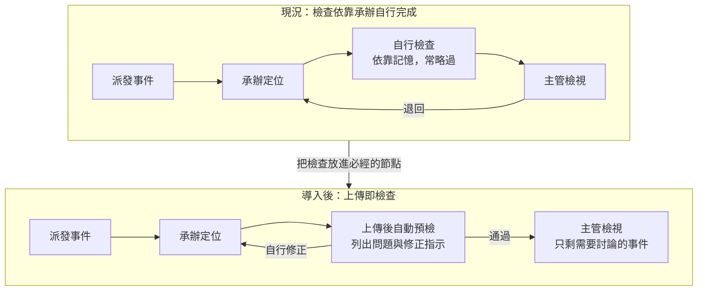

# 第六週文稿：從減少返工到可用的預檢工具

> 狀態：第六週講述的文稿，供討論，尚未放入正式教材。以一個完整的開發案例，說明第五週「選出一段交給 Agent」之後如何進行，一週講完，不跨週。
> 文稿是形成論述這一圈的產出：能獨立閱讀，以書面語寫成，不是照唸的講稿。論述確認之後，再依 [ghost deck 做法](../skills/ghost-deck-from-own-words.md) 排成逐頁稿；各轉折的原話整理在文末附錄。
> 取材：[預檢工具的開發過程](../kb/arguments/domain-expert-tool-development-case.md)、講師保存的開發對話紀錄與截圖（含真實資料，不進本 repo）、第四週的六種介入方式、第五週的需求工程與三個條件。
> 去識別化：案例取自講師的實際開發，依工作區規定不寫系統與程式名稱、主機、路徑與真實資料；定位軟體、檢查程式、派工網頁、定位結果檔皆為一般說法。開發畫面含真實資料，投影片需以虛構資料重拍或遮蔽。
> 建議配時（待確認）：引言 5 分、第一段 15 分、第二段 12 分、第三段 8 分、第四段 20 分、第五段 10 分、第六段 5 分、收尾 5 分，講述合計約 80 分；其餘時間為工作坊，內容待定。
> 2026-10-05 第六版（續）：第五段新增「轉折為什麼這麼多」：資訊越多設計越貼近現實，人類工程師同樣先依合理猜測完成階段工作，取得新資訊後重新對齊（講師提出）。
> 2026-10-05 第六版：依講師的說明，引言加入「以 vibe coding 做出有實際用途的網頁」的理解方式，說明整個案例都在需求階段、原型用於探索需求；新增第六段「從原型到正式工具」，列出對接時才會出現的工程（可以追溯、版本化、日誌與錯誤回報、CI/CD）。
> 2026-10-05 第五版（後修）：正文與原話表不寫具體日期與時刻，改以四個階段表示。
> 2026-10-05 第五版：依開發對話的紀錄改為照時間順序講述，以六個轉折為主線，每個轉折都依「取得新資訊、Agent 做出一版、講師判斷」說明；設計原則改在最後回頭整理。更正：規則編輯功能原是講師先提出的需求，看到成品後才判斷過於複雜；舊程式原始碼的比對發生在製作原型的階段。上一版（依主題分段）見 commit c6ba84f。

## 引言：一件工作為什麼一再被退回

承辦把完成的資料交出去，幾天後被退回，修正之後再交，有時又被退回一次。每一次退回，雙方都要重新打開同一筆資料，說明同一個問題。

本週以一個實際開發的工具為例，說明從「為什麼一再退回」到一個可以操作的網頁原型之間發生了什麼。這個案例對應第四週六種介入方式中的「製作工具」：Agent 參與製作，工具完成之後由一般程式執行，運行時沒有 Agent。學員不必學會寫程式，重點在於看清每一步的判斷從哪裡來。

對其他科別的同仁，這個案例也可以理解為：如何以 vibe coding 做出一個有實際用途的網頁。用自然語言描述想要的東西，由 Agent 寫出程式，人負責引導、試用與回饋。需要說明的是，本週呈現的整個過程，在軟體開發的階段中都還屬於最前面的需求階段。做出網頁原型的目的，是讓需求在看到具體成品之後變得清楚，而不是交出一個可以正式上線的系統。

整個過程可以分成四個階段、六個轉折。每個轉折都是同一個模式：取得一項新資訊，Agent 依此做出一版，講師看過之後判斷，方向因此改變。

| 階段 | 取得的新資訊 | Agent 做出的東西 | 講師的判斷 |
|---|---|---|---|
| 讀懂現況 | 訓練投影片、紙本清單 | 抽出文字、畫出第一版故事圖 | 改畫「全部出錯」的情況，提出攔截的三層 |
| 讀懂現況 | 舊程式都是 Windows 程式 | 分析能從哪裡介入 | 第一版只用指令執行、清單貼近原投影片、工具不能是監控程式 |
| 釐清需求 | 沒有新資訊，專注修改 | 故事圖約二十個版本 | 一再要求簡化，收斂為迴圈 |
| 釐清需求 | 派工網頁、同一組 | 原本並列的兩種方案 | 取消方案的區分，網頁成為檢查的節點 |
| 取得資料 | 舊程式原始碼、一個月的真實資料 | 很快寫出掃描程式 | 確認資料尚未經過檢查，可用來估算影響 |
| 製作原型 | 派工網頁的畫面與現場習慣 | 網頁原型、規則管理頁 | 改為單筆提交、移除規則編輯、改正編號、沿用網站慣例 |

前四個轉折都發生在寫程式之前。

## 一、讀懂現況：整理投影片，畫出現況

### 業務與退回

案例的業務是地震資料的品質檢查。主管以派工網頁派發地震事件，承辦以定位軟體完成定位、產出定位結果檔之後自行檢查，再交給主管。主管檢視時發現問題就退回，承辦修正後再交。檢查的依據是一份訓練投影片與一張紙本清單。

### 實際執行時的阻礙

設想講師自己要完整執行這件事，會先遇到幾個阻礙。拿到訓練投影片之後，要花上許多功夫才能大致理解內容；每次送出資料之前，又要把各個資料來源逐一打開，照著清單一項一項檢查，費力的程度足以讓人想要略過。即使願意完整執行，規則散在各處，檢查也只能依靠自己記得去做。

### 轉折一：從畫出全部步驟，到找出沒被攔下的錯誤

講師把投影片與紙本清單交給 Agent，第一個要求是整理出投影片到底想講什麼。Agent 抽出全部文字，整理成步驟與對應的檢查清單，再依此畫出第一版的故事圖。這張圖把兩位承辦的互動與所有除錯程式都畫了上去，線條交錯，難以閱讀。

講師看過之後認為重點不對。要解決的是錯誤被漏掉的問題，因此圖應該只畫資料處理的流程，並假設每一個步驟都出錯，看錯誤會走過哪些地方。讀完 Agent 依此所做的說明，講師歸納出攔截的三層：有明確對錯的流程錯誤，以規則攔截；殘差、深度、定位誤差等沒有標準答案、但必須落在合理範圍內的結果，以物理限制篩選；前兩層都攔不下、需要看波形才能判斷的項目，才交給人檢視。這個分層由講師提出，之後成為整個工具的骨架。

### 轉折二：舊程式都是 Windows 程式

接著發現，現有的程式大多是老舊的 Windows 程式。講師詢問 Agent 能否在這些程式之間協助，並在討論中做出三個決定。

- **第一版只用指令執行。** 必須在圖形介面完成的步驟，改為提示承辦操作，不嘗試操作介面。
- **清單貼近原本的投影片。** 檢查依原投影片的步驟編排，不大幅改動大家熟悉的流程，每一項都有原本的文件可以比對。
- **工具不能是監控程式。** 講師分析了兩端的利益：承辦要願意使用，這個工具就必須真正幫忙減少工作，而不是監控程式，才有機會被普遍使用。

這三個決定都來自對業務與同仁處境的理解，Agent 無法自行提出。

> **Agent 在這個階段的協助。** 把難讀的投影片整理成文字與步驟清單，依講師的方向反覆重畫故事圖，並分析舊程式的類型與可以介入的方式。

## 二、釐清需求：簡化現況圖，確認分工

### 轉折三：故事圖修改約二十次

接下來一段時間沒有新的資訊，心力都花在修改故事圖。Agent 先依講師的要求加上顏色與圖示、調整箭頭、把定位軟體畫成一個大框，圖越畫越完整，卻也越來越難讀。講師提出「圖好像可以再更簡單」之後，修改轉為刪減：只保留主線與退回的迴圈、讓掃描由承辦發起而程式只作為工具、在人與程式之間補上動詞，使每個活動都能讀成完整的句子。

前後修改約二十次，最後收斂為三張遞進的圖：現況、假設承辦以現有工具完整自行檢查、導入工具之後。第二張圖說明了步驟為什麼常被省略，因為即使承辦願意完整檢查，現有的工具也不足以支撐。這是第四週「把圖修順」在真實業務上的樣子。

### 轉折四：派工網頁與同一組

向同仁了解實際的作業方式後，得到兩項新資訊。第一，主管派發地震事件使用的是一個網頁介面。第二，原本以為資料處理與目錄維護分屬兩個單位，因此並列了兩種方案，把工具放在送出的一端或接收的一端；實際上兩者基本上是同一組，由主管派發、承辦自行檢查、主管檢視後退回。兩種方案的區分因此整段取消。

這兩項資訊也讓流程的缺口變得清楚。定位軟體缺少一些防呆的措施，因此可以產出帶有簡單錯誤的定位結果檔；原本已有兩支檢查程式，卻不是流程上必經的節點，是否執行全靠承辦自己想到。派工網頁是承辦本來就要提交成果的地方，因此是設置自動檢查最合適的位置：上傳之後先自動執行一輪檢查，簡單的問題自動修正或附上明確的指示，承辦不必再依靠記憶。

這印證第五週的觀察：提出需求的人往往只看得到自己那一段，需求需要透過詢問逐步釐清。

> **Agent 在這個階段的協助。** 重畫故事圖的每一個版本、整理訪談前要確認的問題、依新資訊改寫全部文件。哪一版的圖可以拿來討論、分工到底如何，都由講師判斷與詢問確認。

## 三、取得資料：拿到程式碼與真實資料

### 轉折五：很快寫出掃描程式

這個階段取得兩樣東西：一整包舊程式的原始碼，以及一個月內的定位結果檔約一千筆。講師判斷這些資料應該尚未經過檢查，正好是要檢查的對象，於是請 Agent 寫一個程式掃描這批檔案，看是否符合目前整理出的規則。因為規則與流程已經整理清楚，程式很快就完成並提交。

有了真實的資料，分析不再只依靠投影片的描述，而能估算每一項問題實際影響多少筆。例如「方位角空缺過大」一項就標出約四成的事件；這不表示四成事件都有問題，而是這項門檻還沒有定案，需要熟悉業務的人判讀。工具列出的是需要注意的地方，不是結論。

> **Agent 在這個階段的協助。** 依舊程式的讀取格式寫出解析與掃描程式，以真實資料執行並統計各項問題的筆數。前兩個階段整理好的規則與流程，讓這一步可以很快完成。

## 四、製作原型：做出網頁原型

### 轉折六：把檢查變成承辦用得上的畫面

網頁原型在一次集中的開發中完成。過程中講師提出的修正，大多來自現場的資訊與看到成品後的感受。

**從整批掃描到單筆提交。** 前一階段的程式一次掃描整個月的檔案。講師想像的實際作業則是每個人提交一個檔案，就針對那個檔案列出全部結果與建議，工具因此改為單筆提交。講師再提供派工網頁的畫面，Agent 把通用的上傳頁面改為沿用既有欄位、只新增一欄「預檢」的原型。

**規則集中，但不在網頁上修改。** 講師提出規則需要一個地方記錄到底做了什麼，要有版本，程式依此執行，也希望有一個友善的地方可以修改規則。Agent 依此做出規則檔，以及網頁上的規則編輯、草稿與發布流程。看到成品之後，講師判斷介面過於複雜：規則是開會討論後才定案的東西，網頁不需要讓人修改，只要有說明的介面即可。編輯功能因此移除。原本的需求在看到成品之後才被發現過大，這也是先做出一版的價值。

**編號的來源。** 規則依檢查的對象分組之後，講師追問這些編號是不是署內訂的。查證後發現，編號是 Agent 早期整理資料時自訂的，寫進多份文件之後，看起來就像正式代碼。工具尚未上線，修改成本最低，於是重新編號，並保留舊編號對照。

**讀原始碼，而非只讀說明文件。** 講師請 Agent 比對兩支舊檢查程式的原始碼，發現說明文件與實際程式有幾處不一致，也確認了哪些檢查項目目前完全沒有攔截。

**讓驗證過程看得見。** 講師要求詳細檢視的畫面左邊列出每一項檢查，右邊對照原始資料，能作圖的就作圖。看過第一版之後，又要求標出每項檢查讀取的欄位，這樣才知道它在檢查什麼。地圖、走時圖與規模圖則呈現原始格式中看不出的數值關係。

**沿用現場的習慣。** 承辦應是自己上傳之後再按預檢；派工網頁習慣以彈出視窗顯示細節，配色為淺色；有些數值不易直接讀懂，因此加上滑鼠提示，顯示欄位名稱與解讀後的值。講師問全部預先檢查會不會太久，Agent 先量測，一整天約一百三十個檔案不到 0.1 秒，才依結果改為整日一次檢查。

目前的網頁是示範用的原型，類似開發時用來展示構想的 demo：它仿照派工網頁的畫面製作，讓同仁看得到上傳之後會出現什麼結果，但並未接上實際的系統。這個原型的主要用途是探索需求。規則編輯功能就是一例：需求在口頭描述時看似合理，做成畫面之後才發現過於複雜。真正要對接，必須先弄清楚派工網頁的實際架構，包括由誰維護、資料存放在哪裡、能否在伺服器端執行檢查。這個案例的順序是先把業務流程大致收斂，再去研究如何對接。

> **Agent 在這個階段的協助。** 撰寫規則檔、三個網頁、四種圖表與自動測試，每次修正在數分鐘內做出新版並附上截圖；規則搬進規則檔之後，以約一千筆真實資料重新檢查，逐筆確認結果與搬移之前相同。

## 五、回頭整理

### 設計原則

把六個轉折放在一起看，可以整理出這個工具遵守的原則。這些原則大多不只適用於寫程式，任何規範與作業流程的管理都可以沿用。

- **好的設計的條件。** 很快知道哪裡不對、知道如何修改、不偏離原本的習慣、容易上手、不讓人感覺受到監視（轉折二、六）。
- **檢查放在必經的節點。** 上傳就會執行，不依靠記憶（轉折四）。
- **分層攔截。** 規則能判斷的交給程式，物理限制能篩選的交給程式，其餘才交給人（轉折一）。
- **規則單一來源。** 一條規則一個檔案，程式與說明頁都由它產生；矛盾時不自行裁定，交由會議定案；結果註明依第幾版規則檢查（轉折六）。
- **驗證過程看得見。** 標出檢查讀取的欄位，以作圖呈現數值的關係（轉折六）。
- **分階段導入。** 第一階段只檢查、不修改資料，確認可靠之後才擴大權限；是否強制每筆都通過才能提交，等承辦實際用過再討論。

### 轉折為什麼這麼多

六個轉折都有同一個來源：新的資訊。訓練投影片、舊程式的類型、派工網頁、實際的分工、原始碼與真實資料、現場的畫面與習慣，每多一項資訊，設計就更貼近現實一些。與 Agent 溝通也是如此，提供的資訊越多，得到的設計越接近實際的需要。

這並不是 Agent 特有的限制。人類工程師在資訊不足的時候，同樣只能先依一般做法做出合理的猜測，完成手上這個階段的工作；取得新的資訊之後，再重新對齊需求、修正設計。轉折多，代表需求是在過程中逐步釐清的，這是開發的常態，並不表示前面做錯了。

因此，先做出一版的價值不只在於成品本身，也在於它能換來新的資訊。看到第一版故事圖，才知道圖要畫什麼；看到規則編輯的畫面，才知道不需要這個功能。學員在自己的工作上與 Agent 合作時，可以主動提供現場的資料，例如畫面截圖、作業說明、既有的程式與實際的資料，也可以預期方向會隨著新資訊調整幾次。

### 力氣花在哪裡

開發對話中，講師輸入的訊息共約一百二十則。其中約八十則發生在寫程式之前，用於讀懂投影片、畫出現況與釐清分工；寫程式的兩個階段合計約三十則。程式本身可以很快完成，前提是問題已經弄清楚。

### 人與 Agent 的分工

Agent 縮短的是製作與查證的時間：整理難讀的投影片、重畫故事圖的每一個版本、逐行比對原始碼、以真實資料估算影響、撰寫檢查程式與網頁。人負責的是判斷：決定圖要畫什麼、提出攔截的三層、確立工具不能是監控程式、向同仁詢問實際的分工、提供現場的畫面與習慣、在看到成品之後刪去過大的需求、追問 Agent 的整理是否有依據。

這也回應第五週的三個條件。驗收標準是事先寫下的設計條件與規則檔，外部檢查是原始碼的比對、量測、真實資料的重新檢查與講師的試用，判斷與責任由熟悉業務的人承擔，規則由開會定案。

## 六、從原型到正式工具

原型能在短時間內做出來，是因為它只需要回答「這樣做是否合用」。一旦要接上實際的系統，讓同仁每天使用，就會出現許多原型階段不必處理的工程問題。

- **可以追溯。** 每一筆檢查結果都要能回溯到當時的輸入檔、規則版本與程式版本，日後被問到「這筆資料當時為什麼通過」，能夠拿出依據。
- **版本化。** 程式、規則與部署的環境都要有版本，知道目前線上執行的是哪一版，出問題時能夠退回上一版。
- **日誌與錯誤回報。** 程式在伺服器上自動執行時，沒有人在旁邊看著；執行紀錄要保存下來，發生錯誤時要能通知負責的人，而不是默默失敗。
- **自動測試與部署（CI/CD）。** 每次修改程式或規則，都先自動執行測試，通過之後才部署到正式環境，避免一次修改讓原本正常的檢查失效。

這個案例在原型階段已經有一些雛形：每份結果註明依第幾版規則檢查、每完成一段就提交版本、修改後執行自動測試、以約一千筆真實資料確認結果不變。但這些都只是開發者自己的習慣，還不是正式系統的機制。真正對接時，還需要與派工網頁的維護者一起設計，並決定由誰負責日後的維運。

vibe coding 能夠很快做出原型，用於探索需求相當合適；走到正式工具，則需要上述的工程化。提出 vibe coding 一詞的 Karpathy，後來也把有工程紀律的專業用法另稱為 agentic engineering。兩者都使用 Agent，差別在於是否具備可以追溯、版本化、錯誤回報與自動測試這些機制。

## 收尾：目前的狀態與長期的方向

這個案例目前只完成了需求階段的原型。規則全部還在待確認的狀態，網頁是仿照派工網頁製作的示範原型，承辦也還沒有實際使用。返工是否真的減少，要等規則定案、正式對接、承辦用過之後才能確認。工具能夠完成，與是否解決了原本的問題，是兩件需要分開確認的事。

長期來看，問題之所以會留到送出前的檢查才被發現，根本原因在於上游的定位軟體沒有防呆。預檢是在下游攔截錯誤，可以減少退回，卻無法讓錯誤不再產生。長期的解法是等挑波定位程式進行大規模更新時，把這些檢查條件寫進程式，在產出定位結果檔的當下就阻止錯誤。到了那個時候，規則檔可以直接作為更新的規格，短期的預檢工具因此也在為長期的修正累積規格。

## 工作坊（待定）

內容待講師決定。候選方向：學員以第五週收集到的問題重畫現況圖；為自己的問題寫下「好的設計」應滿足的條件；讓 Agent 先做出一版並導正一輪；主管盤點單位內分散或矛盾的規定。

## 附：各轉折的原話

供 ghost deck 取用標題與原話，不放入正式教材。系統與程式名稱以［］內的一般說法取代，其餘為原文。

| 轉折 | 原話 |
|---|---|
| 一 | 我現在想要先整理一下這個投影片到底想要講什麼 |
| 一 | 感覺有點醜，還是你畫只有資料處理流程，然後全部都錯的情況他走了所有的東西，因為我們應該重點在要攔截所以他沒做的事情 |
| 一 | 最重要的就是看如果全部都錯，可以有多少東西沒有被原本流程攔截，變成跑到下一個承辦身上需要檢查 |
| 二 | 我覺得第一版可能先不要去測試 ui，就是想辦法用指令的方式去跑，UI 部分就是提示人類要去做 |
| 二 | check list 應該要貼近原本 ppt 的步驟，就是不要大幅改動原本大家熟悉的流程 |
| 二 | 這個程式不是一個監控程式，而是一個真的幫忙減少工作的程式，這樣才會有機會被普遍使用 |
| 三 | 我覺得圖好像可以再更簡單？ |
| 三 | ［檢查程式］好像沒有從人的操作發起 |
| 四 | 得到一個新資訊，他們有個派發地震事件的一個網頁，那這個 qc 原本是人工做，這裡感覺就是可以變成一個自動化的節點去提示 |
| 四 | 那這樣就沒有什麼方案一跟二的差別了 |
| 五 | 這個就是他們給的一些範例［定位結果檔］，也就是要 qc 的對象，那就會是可能寫個程式去掃描這些［定位結果檔］看有沒有都符合目前的規則？ |
| 六 | 我想像不是全部一起掃，比較像是每個人他提交到網頁上，他會針對那一個［定位結果檔］把所有 qc 結果與建議秀出來 |
| 六 | 這些 qc 規則是需要一個地方來記錄到底做了什麼，有點像版本……還有可以有比較友善的地方可以來改這些規則 |
| 六 | 目前的介面好像太過於複雜了？就是實際不需要讓他們網頁上面可以改，這個會是開會討論後才會定案的東西 |
| 六 | 這些編號應該不是氣象署訂的，是前面 agent 分類的？那應該可以重新換一下，因為還沒上線 |
| 六 | 我也要標出檢查哪一個欄位，這樣才可以知道是在檢查什麼 |
| 六 | 我記得他們網站比較習慣是用 lightbox 的形式，而不是展開一個下拉資訊 |

## 附：可用的圖與素材

- 本文的流程圖（現況與導入後）可直接用於投影片；檢查方式與規則位置的前後對照圖見[素材筆記](../kb/arguments/domain-expert-tool-development-case.md)。
- 講師另行保存了故事圖各版本與網頁各版本的截圖，以及對應的原話。故事圖只有角色與程式名稱，換成一般說法後重畫即可使用；網頁截圖含真實資料，需以虛構資料重拍或遮蔽。
- 「力氣花在哪裡」可以畫成一張長條圖：寫程式之前約八十則、寫程式約三十則。
- 素材筆記決策表的前兩欄（Agent 原本的做法）可作為課堂練習：請學員推測熟悉業務的人會如何導正、依據是什麼。

## 附：開發環境的細節

以下為講師的開發環境，供有興趣的學員參考，不在課堂上展開。

- **測試機與作業環境一致。** 舊程式與實際作業環境都是 Windows，因此準備一台 Windows 電腦作為測試機，避免換到作業用的電腦才發現問題。
- **開發與測試分在兩台電腦。** 所有修改、討論與 Agent 的對話都在日常使用的 Mac 上進行。測試機上另有一份程式的副本，Mac 以遠端登入把修改送過去，並在測試機上執行測試與啟動網頁，結果再傳回 Mac 的瀏覽器。原本 Agent 分別在兩台電腦上工作，造成檔案格式互相轉換、討論歷史分散在兩處，事後整理時只看得到其中一段，因此改為這個做法，並寫進工作說明檔。
- **兩台電腦以私人網路連線。** 測試機的遠端登入只對這個私人網路開放，並改用金鑰登入。

## 附：講師的說明（原話，2026-10-05）

講師對這堂課講法的說明，供 ghost deck 取用。系統與程式名稱以［］內的一般說法取代，其餘為原文。

> 我自己的想法，如果要講我可能會先從整個問題分析開始講，然後聽了上次他們給的一些意見跟拿到的資料與程式碼，加上可能對於同仁心裡的分析
>
> 就是我自己拿到那個投影片，也是要花很大功夫才會大概知道他在寫什麼，然後送出去之前也很懶得把那個資料來源打開來一個一個照著做，那是不是有辦法設計一個 qc 清單，讓操作的人可以很快知道哪裡不對，還有知道怎麼改，就是有個明確的指示，然後操作起來又不會跟原本的習慣差太多，也不會很難上手，還有不要感覺是一個被監視的東西，用起來大家都可以輕鬆一點，那這就會是個好的設計
>
> 流程層面來說，就是 agent 分析了一下原本［定位軟體］好像少了一些防呆的措施，所以才會有辦法做出一些簡單錯誤的［定位結果檔］，除了那些真的很特殊的案例需要人去看，實際上這些東西可以用一個 qc 攔截，那原本也有兩個［檢查程式］了，只是沒有變成流程上必經的節點，全部靠人本身去完成。後來看到說其實有個網頁的派發介面，那這個會是一個很好的自動化流程節點，讓［定位結果檔］上傳後先自動過一輪 qc，然後一些簡單的問題可以先自動修正或者有明確指示，這樣就不會需要靠記憶想到才做
>
> 程式設計方面設計原則我能想到的大概就是規則要變成 single source，才不會有一大堆散落各地的版本，這樣整理後也可以很清楚的放在 UI 上面說明到底在檢查什麼，另外介面設計就是做一些畫圖跟實際比對來讓整個驗證流程更直觀一點
>
> agent 怎麼在中間開發輔助的話，就看哪邊有用到就補個說明這樣？
>
> 那我這邊流程上的一個缺口，就是現在問題會跑到 qc 來就是因為那個上游的［定位軟體］沒有做防呆，那長遠來講應該會是等整個挑波定位程式要做大更新的時候，要把這些條件寫進去，就可以從根本上去解決這個問題
>
> 我覺得這些轉折其實也是像我們要跟 agent 溝通一樣，越多的資訊就會得到越貼近現實的設計，人類工程師也是需要通靈才能先完成階段任務，然後獲得新資訊重新對其後就會修正，所以才會有這麼多轉折
