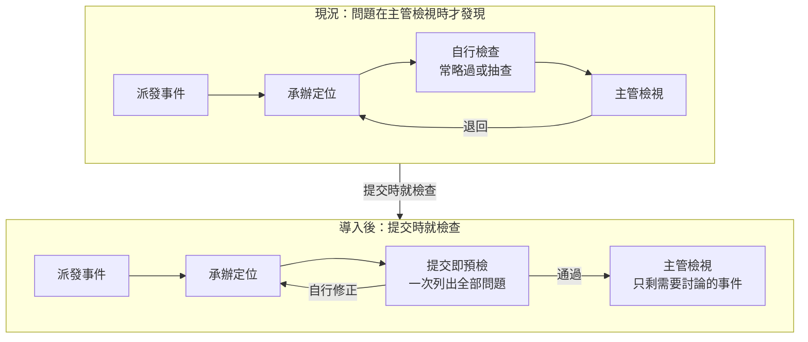
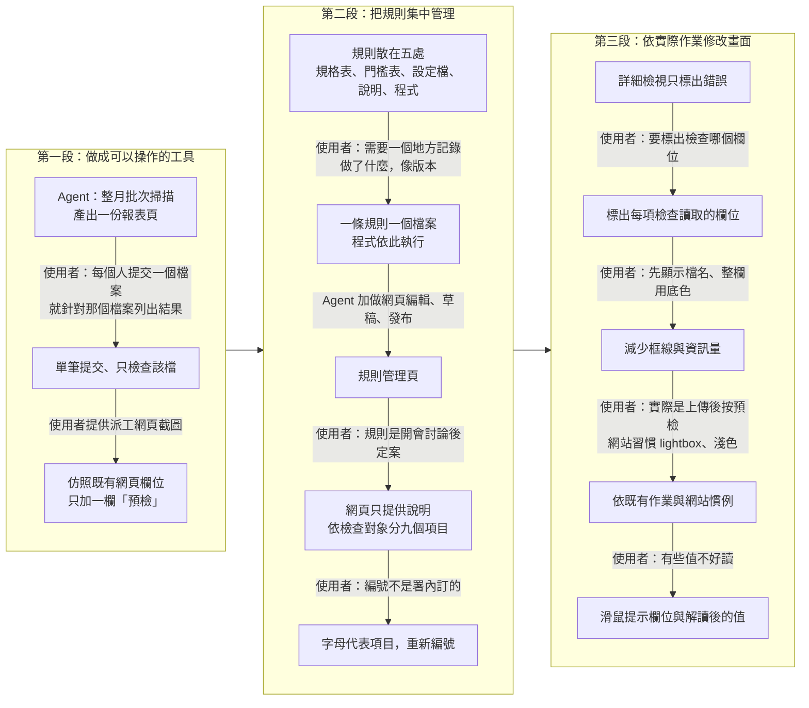
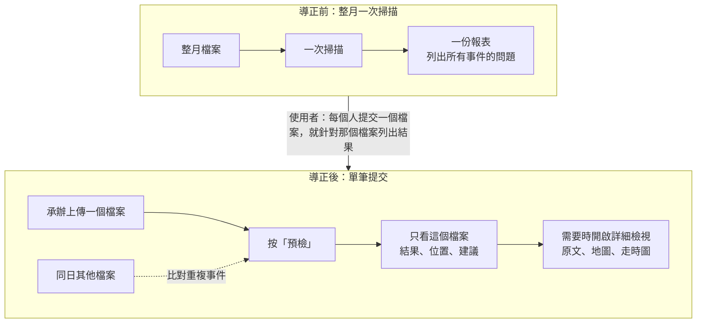
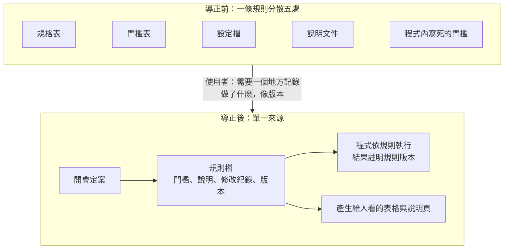

# 預檢工具的開發過程：問題分析、設計邏輯與 agent 的分工

整理日期：2026-10-05。使用者要求分析一次與 agent 共同開發工具的過程，作為教材素材。使用者說明想傳達三件事：軟體設計的邏輯（例如規則要有單一參照）、引導 agent 的方法（交辦什麼、如何要求），以及 agent 實際做了什麼、幫了什麼忙；並補充更早的判斷方向：目標是減少返工，分析流程後發現規則太亂太雜、舊程式不必滿足條件也能做完，因此設計上讓流程防呆、把資訊集中並能逐一對照，再以視覺化輔助。

## 來源

- 2026-09-29 至 09-30 的問題分析與設計文件：現況整理、要解決的問題與相關人員、設計原則與分階段導入。這一段在另一台電腦的另一段對話中完成，包括現況圖的反覆修改（約二十次）與釐清分工後取消兩種方案；整理本筆記的 agent 起初只看得到 10-04 之後的對話，曾誤以為全程只有兩天（2026-10-05 更正）。
- 2026-10-02 至 10-05 的實作：10-02 取得一個月約一千筆真實資料與舊程式原始碼，寫出第一版檢查程式；10-04 至 10-05 的開發對話在 Windows 測試機上進行，製作規則檔與網頁原型。使用者（地震業務的領域專家）與 agent 共同開發地震資料庫送出前的預檢工具。使用者（地震業務的領域專家）與 agent 共同開發地震資料庫送出前的預檢工具。完整素材依工作區上一層 `AGENTS.md` 的指引存放；本筆記已去識別化，不寫專案與系統名稱、主機、路徑與真實資料，檢查程式與網頁改用一般說法。
- 第一段的問題與第二段多數設計原則來自使用者在設計文件中的判斷；第二段中標示「agent 補充」者、第四段至第五段的歸納與「洞見」一段由 agent 整理，尚未經使用者確認。
- 相關筆記：[[vibe-coding]]（領域專家用自然語言做出工具）、[[presentation-process-before-and-after]]（同樣記錄前後差異）、[[ai-adoption-failure-cases]]（多此一舉與流於形式）。

## 重點

### 一、出發點：減少返工

原本的作業是：主管以派工網頁派發地震事件，承辦完成定位後自行檢查，再交給主管；主管檢視時發現問題就退回，承辦修正後再交。問題多半要到主管檢視時才被發現，同一筆事件因此來回多次。

分析流程後，返工的原因歸為三類：

- **規則太亂太雜。** 約三十項檢查散在投影片、紙本清單與兩支舊程式；同一個門檻有兩三種說法，例如重複事件的時間差有一秒、兩秒、三秒三種。
- **舊程式不必滿足條件也能做完。** 檢查步驟可以略過，工作量又以完成件數計算，步驟容易被省略或只抽查；舊程式的錯誤碼互相覆蓋，一次只看得到最後一個，修正一個才看到下一個；說明文件與實際程式也有不一致之處。
- **步驟繁瑣、工具分散。** 每次檢查要手動更換日期與路徑，舊程式沒有涵蓋的項目只能對照紙本清單。

目標因此定為：在交給主管之前，就發現並修正大部分問題，主管檢視時只剩少數需要討論的事件。

### 二、設計邏輯

| 原則 | 針對的問題 | 具體做法 |
|---|---|---|
| 規則單一參照 | 規則散在多處、說法不一 | 一條規則一個檔案，含門檻、說明與修改紀錄；程式依規則執行，給人看的表格由規則產生，不另外維護 |
| 流程防呆 | 步驟可以略過、錯誤碼互相覆蓋 | 檢查放在提交的位置，提交就會執行；所有問題一次列出，並附位置與處理建議，不必修正一項才看到下一項 |
| 分層攔截 | 人的時間花在機器能做的檢查上 | 明確的規則（時間、格式）由程式攔截；物理限制（殘差、深度、誤差）由程式篩選；需要看波形的項目才交給人判斷 |
| 資訊集中、逐一對照 | 結果、原文與規則分散在不同地方 | 一份報告包含發現、原文中的位置、處理建議與規則依據；詳細檢視中，點選任一檢查即標出它讀取的欄位 |
| 視覺化輔助判讀 | 原始格式不易閱讀，數值彼此的關係看不出來 | 地圖（測站分布、方位空缺、漏挑的近站）、走時圖、殘差圖、規模圖；滑鼠提示欄位解讀後的值 |
| 不確定的不自行裁定 | 來源之間互相矛盾 | 不一致的數值全部列出；規則分為候選、待確認、已確認，未確認者不預設啟用，由開會定案 |
| 分階段導入、先不改資料 | 程式出錯會直接影響資料 | 第一階段只檢查不修改；之後才加入自動修正與自動重跑，重跑前先驗證結果與原程式一致；是否強制使用等實際用過再議 |
| 以使用者的利益為先 | 工具被視為監控而不被使用 | 結果先給承辦本人，不自動回報，不統計個人錯誤；用了比不用更省時，才有理由持續使用 |
| 可追溯 | 日後無法說明當時為何通過 | 每份結果註明依第幾版規則檢查；修改保留前後內容；改編號時保留舊編號對照 |
| 沿用既有、補上缺漏 | 另起一套標準會增加學習成本 | 以舊程式的檢查為基礎，補上舊程式沒有的項目；沿用原本流程的步驟編號、既有網頁的欄位與網站慣例 |
| 以真實資料驗證（agent 補充） | 修改程式後不確定結果是否改變 | 每次結構調整後，以約一千筆真實資料重新檢查，逐筆比對與調整前相同；另以虛構資料撰寫測試 |

### 三、開發過程的導正

#### 起點與終點

起點是一份約三十項的檢查清單，散在投影片、紙本清單與舊的檢查程式裡。終點是一個網頁原型：承辦上傳定位結果檔，按下「預檢」，得到逐項結果、問題在原文中的位置與處理建議；需要細看時，開啟詳細檢視，對照原文、地圖與走時圖。

10-04 至 10-05 的開發對話大致分為三段：先把檢查做成可以操作的工具，再把規則集中管理，最後依實際作業習慣修改畫面。每一段都有使用者提出的導正，下圖的箭頭表示「agent 先做出一版，使用者看過後改變方向」。

#### 關鍵決策與前後變化

| 決策 | Agent 原本的做法 | 使用者的導正 | 導正後的做法 | 導正依據 |
|---|---|---|---|---|
| 1. 檢查的方式 | 一次掃描整月約一千個檔案，產出一份報表頁 | 「不是全部一起掃，比較像是每個人提交到網頁上，針對那一個檔案把所有結果與建議秀出來」 | 單筆提交，只檢查該檔；同日其他檔案只用於比對重複事件 | 現場的工作流程 |
| 2. 介面的樣子 | 通用的上傳頁面 | 提供現有派工網頁的截圖：「他介面長這樣，你可以對照一下」 | 沿用既有欄位，只新增一欄「預檢」 | 現有系統的畫面 |
| 3. 規則放在哪裡 | 一條規則散在規格表、門檻表、設定檔、說明與程式五處，改一個門檻要改好幾處 | 「需要一個地方來記錄到底做了什麼，有點像版本，然後程式會根據這個來做」 | 一條規則一個檔案，含門檻、說明與修改紀錄；每份結果註明依第幾版規則檢查；給人看的表格由規則檔產生 | 使用者對管理的需求 |
| 4. 規則由誰改 | 加做網頁上的規則管理：編輯、草稿、發布 | 「介面太過於複雜，實際不需要讓他們網頁上可以改，這是開會討論後才會定案的東西」 | 網頁只提供說明；開會定案後由維護者修改規則檔並記錄版本 | 組織的決策方式 |
| 5. 規則怎麼分類 | 依編號字母列出三十多條 | 「應該是根據項目去列，像是規模自己一條，然後有兩個檢驗」 | 依檢查對象分九個項目，例如「規模」底下有五個檢查 | 使用者理解業務的方式 |
| 6. 編號 | 沿用 agent 早期整理時自訂的編號 | 「這些編號應該不是署內訂的，是前面 agent 分類的？還沒上線，可以重新換」 | 編號的字母代表項目；保留舊編號對照，並記入版本紀錄 | 使用者查證來源 |
| 7. 舊程式做了什麼 | 依舊程式的說明文件整理檢查項目 | 提供兩支舊程式的原始碼，要求比對 | 逐行比對後發現說明與實作不一致：錯誤碼互相覆蓋、只看得到最後一個；現行版本會直接改寫檔案；測站數欄位只有兩位數 | 原始碼證據 |
| 8. 詳細檢視標示什麼 | 只標出有問題的值 | 「要標出檢查哪一個欄位，這樣才可以知道是在檢查什麼」；三個區塊要固定，不必捲動整頁 | 點選任一項檢查，通過的也標出它讀取的欄位 | 使用者需要檢驗工具本身 |
| 9. 畫面資訊量 | 顯示完整檔案路徑與複製鈕；每個欄位各加框線 | 「先秀檔名就好」「如果是整個欄位就用背景色整塊去標，現在每個都框有點太擠」 | 只顯示檔名；整欄改為一條底色直帶 | 實際閱讀的感受 |
| 10. 作業流程 | 示範頁每一列都能直接預檢 | 「實際作業應該是自己上傳後去按預檢」；之後又問全部預先產生報告「會不會跑太久」 | 上傳與預檢分開；量測整日檢查約 0.1 秒後，改為整日一次預檢並快取 | 現場流程與量測結果 |
| 11. 網站慣例 | 結果在列表中下拉展開；跟隨系統深色模式 | 「他們網站比較習慣用 lightbox」「配色要跟原本一樣是淺色」 | 結果改開在畫面中央的視窗；固定淺色 | 既有網站的慣例 |
| 12. 數值的可讀性 | 只標出位置 | 「滑鼠移上去可以說明是哪個欄位跟實際上是什麼值，有些值不是很好直接讀」 | 提示欄位名稱、解讀後的值（例如經緯度換成度分）與原文 | 原始格式不易閱讀 |

#### 檢查方式的前後（決策 1、2、10）

報表適合主管一次檢視，承辦卻需要在送出前看到自己那一個檔案的問題。導正之後，工具嵌入既有的提交流程，而不是另外產生一份報表。

#### 規則位置的前後（決策 3、4、6）

中間曾加入一層網頁編輯與發布流程，後因「規則由開會定案」而移除。版本紀錄保留，修改改由維護者在定案後進行。

#### 標示方式的前後（決策 8、9、12）

| 階段 | 畫面上看得到什麼 | 使用者能回答的問題 |
|---|---|---|
| 只標錯誤 | 有問題的值以橘色標出 | 哪裡錯了 |
| 標出讀取的欄位 | 點選任一檢查，它讀取的欄位以底色標出；整欄的欄位畫成一條直帶 | 這項檢查到底在看什麼；通過是看了哪些值才通過 |
| 提示解讀後的值 | 滑鼠移到標示上，顯示欄位名稱、解讀後的值與原文 | 這個看不懂的數字代表什麼 |

### 四、引導 agent 的方法

| 做法 | 本案的例子 | 作用 |
|---|---|---|
| 提供現場資料，而非抽象需求 | 派工網頁的截圖、作業流程的說明、舊程式的原始碼、真實的定位結果檔 | Agent 不必依一般做法猜測，產出直接貼近現場 |
| 先看一版，再提出修正 | 每次修正都針對已經做出的畫面：「太擠」「先顯示檔名」「網站習慣 lightbox」 | 對具體成品反應，比事先寫完整規格快，也較能發現沒想到的問題 |
| 先要分析，再要實作 | 先請 agent 整理檢查條件與分類、逐行比對舊程式，再決定怎麼做 | 先看清現況，避免依錯誤的前提動手 |
| 追問依據，要求證據 | 「這些編號是署內訂的嗎？」「全部預檢會不會太久？」 | 讓 agent 追溯來源或實際量測，以證據取代推測 |
| 把工作規則寫成 agent 每次都讀的文件 | 規則單一來源、規則狀態、去識別化、圖下附文字說明等規定寫在工作說明檔 | 不必每次重新交代；新的對話也依同一套規則工作 |
| 重大取捨由人決定 | 誰能修改規則、草稿何時生效、說明文件如何處理，由 agent 列出選項，使用者選擇 | 業務與組織的判斷留在人手上，agent 負責列出取捨 |
| 限定範圍 | 「不是全部一起掃」「網頁上不需要可以改」 | 收斂 agent 傾向做大的解法 |
| 要求驗證，分段保存 | 每次修改後跑測試、截圖給使用者確認；告一段落即提交版本 | 隨時可以回到上一個可用的狀態，也留下每一步的紀錄 |

### 五、Agent 做了什麼、幫了什麼忙

| 工作 | 具體內容 | 若由人做 |
|---|---|---|
| 閱讀與比對 | 逐行閱讀兩支不同語言的舊程式，與說明文件比對，找出錯誤碼覆蓋、直接改寫檔案、欄位位數上限等不一致之處；整理檔案格式的欄位位置 | 需要能讀舊語言的人花數天 |
| 量化影響 | 以約一千筆真實資料估算各項差異實際影響幾筆；量測整日檢查所需時間 | 通常只憑印象判斷 |
| 撰寫程式與測試 | 檔案解析、二十多項檢查、規則庫、三個網頁、四種圖表，以及自動測試 | 需要軟體開發人力與數週時間 |
| 大量且一致的修改 | 三十多條規則搬入規則檔；全部文件與程式中的編號一次更換；由規則產生說明文件 | 容易漏改，前後不一致 |
| 快速做出可看的版本 | 每次修正在數分鐘內完成並附截圖 | 修改成本高，較少嘗試不同做法 |
| 環境與部署 | 本機服務、遠端連線方式的說明與排錯 | 需要另外查詢 |
| 紀錄與整理 | 每次修改留下版本紀錄；整理成去識別化的教材素材 | 常被省略 |

使用者負責的部分：定義問題與目標、提供現場資訊、判斷做法是否合理、決定規則與取捨、驗收結果。整個過程約一週，前三天沒有寫程式，用於分析現況、釐清需求與寫下設計原則；原型能在實作階段快速完成，是因為這些判斷一直由使用者提供；agent 縮短的是製作與查證的時間。

### 六、工作環境的安排

使用者補充的做法（2026-10-05）：準備一台 Windows 電腦作為測試機，日常從 Mac 遠端操作。以下依專案紀錄整理。

| 安排 | 做法 | 用意 |
|---|---|---|
| 測試機與作業環境一致 | 以一台個人 Windows 電腦作為測試機；舊程式與署內作業環境都是 Windows | 程式在與實際作業相同的系統上執行與驗證，避免換到署內電腦才出問題 |
| 從 Mac 遠端操作 | 兩台電腦以私人網路服務連在同一個虛擬網路；測試機開啟遠端登入，只對這個私人網路開放，改用金鑰登入 | 不必坐在測試機前；網路不對外公開 |
| Agent 在測試機上執行 | Agent 在測試機上寫程式、執行測試、啟動網頁並開啟內建瀏覽器檢查；以無介面瀏覽器截圖，再把截圖傳給使用者 | 使用者在 Mac 或手機上就能看到結果，agent 也能自行確認畫面 |
| 網頁原型分享到 Mac | 測試機上的網頁只在本機開放，再透過私人網路的分享功能提供給自己的其他裝置 | 在 Mac 的瀏覽器直接操作原型；不開放防火牆，也不對外公開 |
| 環境寫進專案說明 | 測試機的軟體版本、連線方式、已知的限制（例如某些指令在遠端執行會中斷）記錄在專案說明 | 下一次對話或換一個 agent，讀說明就能接續，不必重新摸索 |
| 工作區分層說明 | 工作區最上層的說明檔列出各專案資料夾的用途；每個專案另有自己的說明檔與資料夾規則 | Agent 進入哪個資料夾，就依那裡的規則工作 |
| 資料與程式分開保存 | 原始資料與投影片等來源檔不進版本控制；程式、規格與文件進私有版本庫，每個段落提交一次並寫明原因 | 真實資料不外流；每一步都能回溯 |
| 舊資料先建清單 | 約五千個檔案的舊程式資料夾，先請 agent 讀過說明檔與原始碼，整理成清單 | 之後需要時能快速找到依據，不必每次重新翻找 |
| 私有素材與教材分開 | 開發素材留在私有專案；寫進課程時一律去識別化 | 課程能使用真實案例，又不洩漏內部細節 |

## 洞見

- **導正大多來自現場資訊，不是技術判斷。** 十二項導正中，依據多為工作流程、既有畫面、組織的決策方式與網站慣例。Agent 缺少這些資訊時，會依一般做法補上合理的假設；使用者一提供截圖或流程，方向就改變。
- **Agent 傾向做完整、通用的解法，使用者負責刪減。** 整月掃描、網頁上編輯規則、完整路徑加複製鈕、每格框線，技術上皆屬合理，卻大於實際需求或增加閱讀負擔。這對應失敗案例中的「多此一舉」：需求清楚，解法過大。
- **Agent 自訂的東西容易被當成既有規範。** 早期整理時自訂的編號，寫進多份文件後看起來像正式代碼，直到使用者追問來源。尚未上線時修改的成本最低；修改時保留對照與版本紀錄，舊紀錄仍讀得懂。
- **先查證，再判斷。** 讀舊程式原始碼，才發現說明文件與實作不一致；擔心全部預檢太慢時，先量測約 0.1 秒再決定。兩次都以證據取代猜測。
- **工具要讓使用者能檢驗它。** 標出每項檢查讀取的欄位與解讀後的值，使用者不必讀程式，也能判斷工具是否檢查了正確的位置。這是領域專家自己試用即可驗證的條件。
- **融入既有習慣，降低採用的阻力。** 沿用派工網頁的欄位、使用網站慣用的 lightbox 與淺色，承辦不必學新的操作。
- **設計邏輯先於工具。** 單一參照、防呆、分層攔截、可追溯等原則，在動手之前就由問題分析推得；開發過程的導正，多是讓實作回到這些原則上，例如網頁編輯規則違反「由開會定案」，整月報表違反「在提交時就檢查」。
- **時間花在說明與判斷，不在製作。** 每一版畫面在幾分鐘內完成；主要時間花在看過一版、指出不合用之處、補充現場資訊。

## 課程用途（候選）

- 教學順序可依本筆記五段排列：先講問題與返工的原因，再講設計邏輯，接著以導正的例子說明人的判斷，最後整理引導 agent 的方法與 agent 的分工。
- 第五週「兩種賦能」中「領域專家自建工具」的實例，搭配[[vibe-coding]]：說明做得出來之外，人仍需提供現場資訊與判斷。
- 「多此一舉」的正面對照：網頁編輯規則的加入與移除，示範需求清楚時如何收斂解法。
- 工作坊練習：給學員決策表的前兩欄（agent 原本的做法），請學員推測使用者會怎麼導正、依據是什麼。
- 圖片：開發過程的截圖含真實資料，不能直接使用；需以虛構資料重拍，或改用本筆記的示意圖。
- 講師參考：完整開發紀錄與程式保存在私有專案，不放入本 repo。
