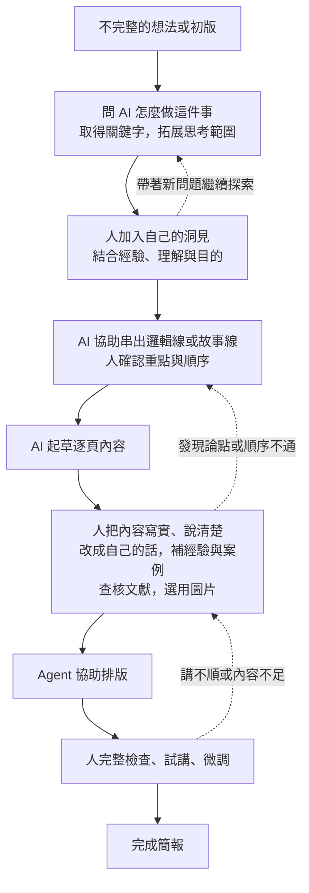

# 簡報流程如何從自己的想像，經比較補充成候選版本

## 來源

- 2026-09-07 課程討論：使用者先提供六頁投影片手稿，列出自己想像的簡報七步；之後詢問其他人整理的流程，並要求記錄原想法與補充後的差別。
- [Duarte：How to write a great presentation](https://www.duarte.com/blog/how-to-write-a-great-presentation/)，Kevin Friesen，2024-01-26；本次已查閱。
- [Garr Reynolds：Presentation Zen 準備方法](https://www.garrreynolds.com/preparation-tips)與[準備、設計、表達三部分架構](https://www.garrreynolds.com/tips)；本次已查閱。
- [TEDx Speaker Guide](https://storage.ted.com/tedx/manuals/tedx_speaker_guide.pdf)；本次已查閱。
- 相關筆記：[[purposeful-reading-and-agent-assisted-practice]]、[[nesa-slide-presentation-forms]]。

## 重點

### 使用者原本提出的流程

訂主題 → 找資料 → 整理大綱 → 尋找素材 → 文案收斂 → 排版 → 最終確認。

這份流程來自使用者的投影片手稿，已整合進第二週主 draft。它把做簡報的工作拆開，讓學員可以找到其中一段，嘗試請 agent 協助。

### 討論如何往前推進

1. 使用者先提供自己的流程，agent 按此展開講稿。
2. 使用者接著問：「你有一些其他的人整理出來的流程嗎？」將討論從自己的做法擴展到外部參考。
3. Agent 查閱原作者／官方資料，整理三種方法。Duarte 強調受眾、希望促成的改變、結構與視覺；Reynolds 將準備、設計與表達分開，準備時先思考目的與內容順序；TEDx 指南依序處理想法、大綱與講稿、投影片、排練與演講。
4. Agent 比對原流程，提出補充後的課程版；這是綜合改編，不是任何一位作者的原版流程。
5. 使用者要求保存這次前後差異。這表示確認記錄過程，尚未表示採用新流程替換現行 draft。

### Agent 提出的課程版候選

確認對象與目的 → 蒐集資料、發展想法 → 收斂核心訊息 → 組織大綱與逐頁內容 → 製作圖文與排版 → 試講、檢查與修改。

### 原想法與補充後的差別

| 原本明列的步驟 | 後來補上的內容 | 差別與用途 |
|---|---|---|
| 訂主題 | 確認對象、目的與希望聽眾理解或改變的事情 | 從決定「講什麼」，進一步交代「為誰講、為什麼講」，供後續取捨內容 |
| 找資料 | 蒐集資料，同時發展想法 | 查找過程也可以改變原先的問題與方向；不只為已決定的內容補材料 |
| 整理大綱，較後面才文案收斂 | 先提出核心訊息，再組織大綱與逐頁內容 | 把「決定主要想說什麼」與「縮短或潤飾文字」區分開；核心訊息仍可隨資料與試講修正 |
| 尋找素材 → 文案收斂 → 排版 | 內容方向較清楚後，再選擇圖文形式與排版 | 依每頁要傳達的內容決定需要什麼素材，減少先找素材再勉強安排內容的情況；不表示素材探索不能提早進行 |
| 最終確認 | 實際試講、檢查與修改 | 將概括的確認變成可操作的檢查：時間、順序、解釋是否足夠、圖文能否配合口述 |

比較針對「流程中明列了什麼」，不能由此推論使用者原本不考慮受眾、不會試講，或原版一定較差。原版較細列製作工作；候選版把溝通目的與使用成果的檢查也明確列入。

### 使用者再提出：內容逐漸長完整的演變流程

2026-09-07，使用者在「先講放大器，再用獨立簡報演示」的安排下，提出更貼近實際協作的過程，要求先整理成圖。以下依使用者敘述整理，回返箭頭為 agent 對反覆修改的視覺化補充。

1. 先有不完整的想法或初版。
2. 問 AI 這件事可以怎麼做，取得關鍵字與可追查的方向，擴大思考範圍。
3. 人結合自己的經驗、理解與目的，形成洞見，把洞見放回討論。
4. 請 AI 協助整理邏輯線或故事線，人確認是否表達了自己的意思。
5. 依這條線展開成逐頁內容，AI 可以先起草。
6. 人大量參與，把 AI 的草稿改成自己會說的話，補入真實經驗、案例、文獻來源與圖片，讓內容充實且有依據。
7. Agent 協助排版。
8. 人完整檢查、試講並微調，完成簡報。

這個版本把「人的洞見如何進入內容」與「AI 逐頁初稿如何變成自己能講的內容」明確列出。前面的七步偏工作項目，這張圖則呈現內容如何經協作逐漸成熟；不以步數比較高下。

狀態更新（2026-09-07）：使用者已要求將本圖整合第二週 draft，現已放在「從自身需要切入」之後，取代授課主線的七步流程，並同步演示與實作。先前七步與六步比較保留為歷史來源；正式授課簡報與演示材料仍分開，尚未修改 PPTX 或正式 lesson。

### 使用者補充：縮小迭代範圍，延後投入排版

2026-09-07，使用者提出：迭代回圈盡量小，越早進入細緻成品，方向改變後越容易增加修改與返工。因此先在對話中請 agent 說明做法，確認後才落成 Markdown；內容階段盡量在 Markdown 修改，再投入簡報美編。

已整合到第二週流程圖後的原理說明，實作相應改為先聊故事線、確認後保存，先試一頁文字再展開，內容確認後才排版。Agent 補充的操作細節：必要時先看一頁版面；未定事項可以標記保存；排版後若發現方向問題仍回到文字修正，避免把延後排版理解成禁止回頭修改。

### 使用者補充：先自行通讀與列綱，再請 AI 整理

2026-09-07，使用者認為流程圖節點過多，並補充探索與洞見之後應先由人通讀前面所有探索資料，試著不用 AI 寫出大綱，再讓 AI 沿方向整理一版。使用者希望藉此讓人先想過材料，減少認知債；真的想不到時仍可請 AI 試串。此處記錄教學設計意圖，未將其當成已驗證的效果結論。

主 draft 已將圖簡化為七個主要階段：探索 → 人通讀並列綱 → agent 整理故事線與逐頁起草 → 人充實 → 整體收斂 → 排版 → 人試講。洞見併入人列綱，獨立起點與完成節點省略，只保留方向回大綱、試講回內容兩條主要回返；各階段仍可小步修改。前次新增的整體收斂仍保留。原圖留作歷史，現行流程以主 draft 為準。

Agent 補充操作：自己的大綱可以只是粗略條列；若請 AI 試串，須逐段對照資料並說明取捨。後半第四步同步為自己先列綱，再請 agent 整理，不增加新的固定模板。

### 使用者補充：訂方向與確認內容的兩個迴圈

2026-09-07，使用者將流程概括為前半「訂方向」、後半「確認內容」。主 draft 依此分區：探索 → 人通讀並列綱 → agent 整理故事線，方向未清楚就回到探索與想法；方向確認後，逐頁草稿 → 人充實 → 整體收斂，依取捨再修改草稿。原本合併的故事線與起草拆到兩區，避免跨越兩種目的。

排版與試講放在內容確認之後，不必每次修改文字都重新排版。圖僅呈現兩個主要迴圈，文字保留試講回到內容、方向改變回到第一圈的可能；各圈內仍以小步修改為原則。

### 使用者修正：兩個迴圈可往返，方向隨交付接近逐漸鎖定

2026-09-07，使用者指出「方向確認」後單向進入內容太像一刀切；後續看到資料或形成洞見，可能推翻論點，需要回到方向。方向是隨交付日期接近而逐漸鎖定。

主 draft 將跨區文字改為「依目前方向展開」，補回充實內容到人重看大綱、整體收斂到重整故事線的路徑。Agent 補充操作上的收斂方式：前期容許探索與重排，交付接近時衡量改動影響、縮小範圍；正確性與理解問題仍修正，其他延伸想法保存到下一版。這項修正取代前述容易被理解為單向關卡的圖示。

### 使用者描述自己的實際操作順序（2026-09-07，待整合）

使用者補充習慣：先開空專案，簡述要做什麼，建立 kb 並要求 agent 把討論寫入，再把這個保存習慣寫進 AGENTS.md，完成初始化。接著談背景、受眾、時間、簡報長度等限制，拓展想讓觀眾知道的內容；有大方向後請 AI 補充可能調整的地方，持續聊天補齊。之後依序產生講稿草稿、投影片分頁草稿，分頁確認後輸出 PPTX，借用 PPT 技巧排版，最後檢查交付。

Agent 檢閱建議：這比現行先查材料再建立 AGENTS.md 更貼近使用者工作習慣，並清楚區分講稿與投影片分頁兩層。初始化先記保存習慣，背景與限制在討論後補入；討論脈絡、取捨、未定事項需保存，使用者所說「全部討論」是否也包含完整逐字對話，尚未明定，不能擅自只留結論。延續先前人通讀資料並自行列綱的原則，在 AI 起講稿前保留人先整理重點與順序。講稿階段先收斂重複與論點，轉成分頁時再判斷哪些留畫面、哪些留口頭說明，並依頁數與時間再次取捨。這些為對使用者順序的補充建議，尚未改寫主 draft。

### 使用者釐清：講稿與投影片分頁的差別（2026-09-07）

講稿比較像文章，先以連續文字完整表達內容；投影片分頁則拆成口述與畫面，安排兩者如何配合，敘述、停留與換頁的節奏也不同。這項釐清修正 agent 先前偏重「收斂、挑選畫面內容」的解釋：分頁同時是在重新組織表達方式與節奏。已補入主 draft 相關說明，整體實作順序仍待依前項建議重整。

### 使用者確認三種產出物：論點、文章、投影片（2026-09-07）

使用者指出流程會產生論點、文章與投影片，論點形成時的棄案也可以整理保存，文章可作輔助使用。主 draft 已按此區分成果用途：論點記採用主張、依據與棄案理由；文章完整說明脈絡，供備講或輔助閱讀；投影片分頁重新安排口述、畫面與節奏，再輸出排版。

實作拆開文章與分頁步驟，流程圖將內容起草改為文章，收斂後再轉分頁。棄案由實際取捨整理，不要求額外產生；放棄原因由 agent 協助記錄、人確認。初始化順序仍待依前項使用者操作習慣重整。

## 洞見

以下為 agent 對本次過程的整理：

- 自己先提出版本，才有具體比較基準。外部方法補充的是原流程中尚未明列的面向，無須將自己的做法全部推翻。
- 本次同時示範了「補知識與方向」和「請 agent 找盲點」：由 agent 查找可追溯的參考，再和現有想法比較，提出可供人選擇的修改。
- 「訂主題」與「確認溝通目的」、「文案收斂」與「核心訊息收斂」、「檢查檔案」與「試講」，是這次值得保留的三組區別。
- 補充後的六步是編排建議；步數減少來自合併工作項目，不表示原七步多餘，也不表示所有簡報都適用同一固定順序。
- 是否適合課程，仍需由使用者依學員、時數與教學目的選擇。第二週可以只展示一小段前後差異，第四週再深入練習如何比較來源、形成自己的方法。

## 課程用途（候選）

- 作為第二週實作一的備援示範：先展示自己的七步 → 請 agent 找其他作者的方法 → 比較新增面向 → 自己挑選要採用的修改。能直接連回「多想到什麼、留下什麼、為什麼」。
- 示範「AI 放大器」如何運作：人提供已有經驗與教學目的，agent 補充外部參考與比較，人再判斷內容是否合用。
- 第四週可用來說明來源摘要、自己的推論與最終採納需要分清楚；來源有名或文字通順，都不等於應整套照用。
- 狀態更新（2026-09-07）：使用者進一步要求調整大綱，讓學員看出這份簡報如何靠 agent 協助修改；案例已整合進第二週主 draft 的開場。六步流程仍以 agent 候選建議展示，未宣稱使用者已全部採納；正式教材與 PPTX 尚未修改。

- 後續修正（2026-09-07）：使用者認為以備課故事開場太亂，決定先講放大器概念，再用獨立演示簡報套用流程。正式授課簡報與演示版本分開。本筆記的前後比較繼續保存，可作演示的候選素材，不再作為開場主線；三種用途改寫不另串成第二個故事。

### 操作順序整合狀態（2026-09-07）

使用者要求依整體檢閱修改後，前述空專案初始化、先講背景限制、探索後形成論點、文章再轉投影片的安排已整合主 draft。七步依序為初始化、背景與探索、論點與棄案、文章、分頁、排版、檢查交付；上文「待整合」保留當時討論狀態，現行順序以主 draft 為準。

### 依 Reynolds 框架檢查現行 draft（2026-09-07，候選）

依使用者要求重讀 [Reynolds 準備框架](https://www.garrreynolds.com/preparation-tips)全文。以下問題與補法是 agent 對現行教案的檢閱，不是作者逐字問題，也未直接整合 draft。

1. **目的與核心訊息（第 2–4 節）**：除了做出三到五頁，最想讓學員改變哪個工作習慣？候選是能辨認一個缺口、向 agent 提出具體要求，並檢查修改是否合用；模型知識、保存與簡報流程服務這個目標。
2. **受眾與開場例子（第 3、8、10 節）**：哪個常見工作卡點能讓學員立刻認出自己？目前先談能力定義與客服研究，可考慮用一張缺證據的簡報頁作短例子，再接領域判斷與工具熟悉度。保留先講概念的安排，不重啟已被否決的備課歷史敘事。
3. **關聯與取捨（第 5 節）**：客服研究、臺大案例與 Zotero 各幫助學員下一步做什麼？客服接辨認短板、臺大接人機分工、Zotero 接來源回查；同一用途的第二個例子可留備講，不再增加來源數量。
4. **節奏與結構（第 6–7 節）**：第一次讓學員說、判斷或操作出現在何時？前半五節可能仍連講較久；候選在缺口例子後請學員判斷、分工圖後挑一項可交辦工作，再接後半完整實作。未定總時數前不硬排分鐘；採用節奏變換建議，不把「十分鐘」當通用注意力定律。
5. **閱讀材料（第 9 節）**：學員要帶走哪份可自行閱讀與接續操作的材料？目前主 draft 有講師備註，不能直接等同學員講義；候選從已確認內容整理學員版文章，留下來源與操作重點，不加課後作業。
6. **結尾與備援（第 10–11 節）**：結尾如何回到最初工作卡點；工具或網路失效時還能完成哪個核心練習？已有版本回看，可對照開場那一頁；備援可使用公開材料、預存輸出及前後版本，讓學員判斷並提出修改，不把大量時間花在排障。

優先待討論：核心帶走訊息、貼近學員的短例子、前半互動節奏。模型能力與檔案分類已足夠，暫不增加新理論。另記：三種產出物已由先前「論點／文章／投影片」改為「kb／draft／PPT」，採用論點在文章，棄案另存 draft；前文保留歷史。

### 核心訊息與研究型受眾的開場（2026-09-07，已整合主 draft）

使用者重新思考：原想強調 agent 比對話式工具厲害，但發想時差異未必明顯；可能更值得展示搜尋、逐步形成 kb、整理想法與完成 PPT 的連續工作。認同辨認缺口、請 agent 協助、判斷是否合用的方向，但希望更短。研究型受眾在意內容不足，也希望省下排版時間。

Agent 候選主句：「讓 agent 把你的想法做成成果。」人的主導與驗收放在示範中呈現。以能否接續執行搜尋、保存、整理與製作來說明本課工作方式，不把搜尋或發想說成某類產品獨有，也不保證搜尋多就收斂快、資料夾自動增加就代表有知識。

開場候選用同一份研究簡報的三個狀態：只有主張與少量材料 → 補入來源、圖表及人的取捨，形成可說明的 draft → agent 製作可編輯 PPT。內容價值先出場，再呈現排版省力；研究情境由使用者確認，不以所有研究者皆如此作普遍結論。預覽保持短，後半另開專案完整操作，避免重啟備課歷史的長敘事。尚未修改主 draft。

整合更新：使用者要求採入後，主 draft 已加入核心訊息、三個狀態的短開場、接入能力互補的轉場，以及回應開場的收尾。搜尋與 kb 保存作為接續執行的一環，保留人的取捨；預覽標示為待準備的實際預作，不宣稱已完成。前文候選描述保留討論歷史，其他 Reynolds 檢閱項仍依原採用狀態。

### 開場回到 agent 的協助範圍（2026-09-07，已整合）

使用者修正：有想法但不熟工具（如 vibe coding）與簡單重複雜工應分開；先用投影片開場可能過早限縮到文書。主 draft 已改為四種需求開場：知識方向、工具操作、重複雜工、協助檢查，再談能力互補與請教／交辦，之後引入簡報作完整練習。前次三個簡報狀態移到實作例子的介紹，結尾回看最初需求；核心「讓 agent 把你的想法做成成果」保留。此更新取代前次簡報直接開場的安排。

### 開場採研究專案情境，協助類型回到概念段（2026-09-07，已整合）

使用者再釐清：四種協助是「AI 如何配合自己的能力與需要」的細節，開場應先呈現課程首頁的研究專案情境，後面的投影片才是一個實例。已對照本地 `index.qmd` 的「知識如何變成交付成果」，將文獻、資料、人的洞見與實驗結果持續累積、依需求交付並存回修改的關係寫成假設情境。

現行順序：研究專案情境 → 能力互補與四種需要 → 請教／交辦 → 專案要向同事說明發現，以簡報作完整練習。開場先談情境，不提早教資料夾命名；後半保留 kb、draft、PPT 與兩個迴圈。取代前次以四種協助直接開場，首頁來源未修改。
