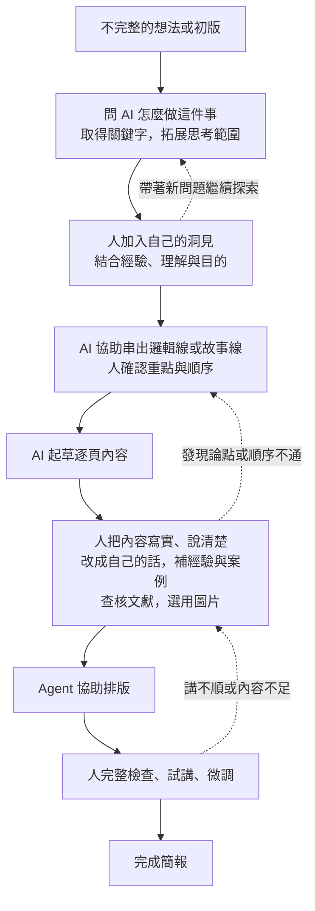

# 簡報流程如何從自己的想像，經比較補充成候選版本

## 來源

- 2026-09-07 課程討論：使用者先提供六頁投影片手稿，列出自己想像的簡報七步；之後詢問其他人整理的流程，並要求記錄原想法與補充後的差別。
- [Duarte：How to write a great presentation](https://www.duarte.com/blog/how-to-write-a-great-presentation/)，Kevin Friesen，2024-01-26；本次已查閱。
- [Garr Reynolds：Presentation Zen 準備方法](https://www.garrreynolds.com/preparation-tips)與[準備、設計、表達三部分架構](https://www.garrreynolds.com/tips)；本次已查閱。
- [TEDx Speaker Guide](https://storage.ted.com/tedx/manuals/tedx_speaker_guide.pdf)；本次已查閱。
- 相關筆記：[[purposeful-reading-and-agent-assisted-practice]]、[[nesa-slide-presentation-forms]]。

## 重點

### 使用者原本提出的流程

訂主題 → 找資料 → 整理大綱 → 尋找素材 → 文案收斂 → 排版 → 最終確認。

這份流程來自使用者的投影片手稿，已整合進第二週主 draft。它把做簡報的工作拆開，讓學員可以找到其中一段，嘗試請 agent 協助。

### 討論如何往前推進

1. 使用者先提供自己的流程，agent 按此展開講稿。
2. 使用者接著問：「你有一些其他的人整理出來的流程嗎？」將討論從自己的做法擴展到外部參考。
3. Agent 查閱原作者／官方資料，整理三種方法。Duarte 強調受眾、希望促成的改變、結構與視覺；Reynolds 將準備、設計與表達分開，準備時先思考目的與內容順序；TEDx 指南依序處理想法、大綱與講稿、投影片、排練與演講。
4. Agent 比對原流程，提出補充後的課程版；這是綜合改編，不是任何一位作者的原版流程。
5. 使用者要求保存這次前後差異。這表示確認記錄過程，尚未表示採用新流程替換現行 draft。

### Agent 提出的課程版候選

確認對象與目的 → 蒐集資料、發展想法 → 收斂核心訊息 → 組織大綱與逐頁內容 → 製作圖文與排版 → 試講、檢查與修改。

### 原想法與補充後的差別

| 原本明列的步驟 | 後來補上的內容 | 差別與用途 |
|---|---|---|
| 訂主題 | 確認對象、目的與希望聽眾理解或改變的事情 | 從決定「講什麼」，進一步交代「為誰講、為什麼講」，供後續取捨內容 |
| 找資料 | 蒐集資料，同時發展想法 | 查找過程也可以改變原先的問題與方向；不只為已決定的內容補材料 |
| 整理大綱，較後面才文案收斂 | 先提出核心訊息，再組織大綱與逐頁內容 | 把「決定主要想說什麼」與「縮短或潤飾文字」區分開；核心訊息仍可隨資料與試講修正 |
| 尋找素材 → 文案收斂 → 排版 | 內容方向較清楚後，再選擇圖文形式與排版 | 依每頁要傳達的內容決定需要什麼素材，減少先找素材再勉強安排內容的情況；不表示素材探索不能提早進行 |
| 最終確認 | 實際試講、檢查與修改 | 將概括的確認變成可操作的檢查：時間、順序、解釋是否足夠、圖文能否配合口述 |

比較針對「流程中明列了什麼」，不能由此推論使用者原本不考慮受眾、不會試講，或原版一定較差。原版較細列製作工作；候選版把溝通目的與使用成果的檢查也明確列入。

### 使用者再提出：內容逐漸長完整的演變流程

2026-09-07，使用者在「先講放大器，再用獨立簡報演示」的安排下，提出更貼近實際協作的過程，要求先整理成圖。以下依使用者敘述整理，回返箭頭為 agent 對反覆修改的視覺化補充。

1. 先有不完整的想法或初版。
2. 問 AI 這件事可以怎麼做，取得關鍵字與可追查的方向，擴大思考範圍。
3. 人結合自己的經驗、理解與目的，形成洞見，把洞見放回討論。
4. 請 AI 協助整理邏輯線或故事線，人確認是否表達了自己的意思。
5. 依這條線展開成逐頁內容，AI 可以先起草。
6. 人大量參與，把 AI 的草稿改成自己會說的話，補入真實經驗、案例、文獻來源與圖片，讓內容充實且有依據。
7. Agent 協助排版。
8. 人完整檢查、試講並微調，完成簡報。

這個版本把「人的洞見如何進入內容」與「AI 逐頁初稿如何變成自己能講的內容」明確列出。前面的七步偏工作項目，這張圖則呈現內容如何經協作逐漸成熟；不以步數比較高下。

狀態更新（2026-09-07）：使用者已要求將本圖整合第二週 draft，現已放在「從自身需要切入」之後，取代授課主線的七步流程，並同步演示與實作。先前七步與六步比較保留為歷史來源；正式授課簡報與演示材料仍分開，尚未修改 PPTX 或正式 lesson。

### 使用者補充：縮小迭代範圍，延後投入排版

2026-09-07，使用者提出：迭代回圈盡量小，越早進入細緻成品，方向改變後越容易增加修改與返工。因此先在對話中請 agent 說明做法，確認後才落成 Markdown；內容階段盡量在 Markdown 修改，再投入簡報美編。

已整合到第二週流程圖後的原理說明，實作相應改為先聊故事線、確認後保存，先試一頁文字再展開，內容確認後才排版。Agent 補充的操作細節：必要時先看一頁版面；未定事項可以標記保存；排版後若發現方向問題仍回到文字修正，避免把延後排版理解成禁止回頭修改。

### 使用者補充：先自行通讀與列綱，再請 AI 整理

2026-09-07，使用者認為流程圖節點過多，並補充探索與洞見之後應先由人通讀前面所有探索資料，試著不用 AI 寫出大綱，再讓 AI 沿方向整理一版。使用者希望藉此讓人先想過材料，減少認知債；真的想不到時仍可請 AI 試串。此處記錄教學設計意圖，未將其當成已驗證的效果結論。

主 draft 已將圖簡化為七個主要階段：探索 → 人通讀並列綱 → agent 整理故事線與逐頁起草 → 人充實 → 整體收斂 → 排版 → 人試講。洞見併入人列綱，獨立起點與完成節點省略，只保留方向回大綱、試講回內容兩條主要回返；各階段仍可小步修改。前次新增的整體收斂仍保留。原圖留作歷史，現行流程以主 draft 為準。

Agent 補充操作：自己的大綱可以只是粗略條列；若請 AI 試串，須逐段對照資料並說明取捨。後半第四步同步為自己先列綱，再請 agent 整理，不增加新的固定模板。

## 洞見

以下為 agent 對本次過程的整理：

- 自己先提出版本，才有具體比較基準。外部方法補充的是原流程中尚未明列的面向，無須將自己的做法全部推翻。
- 本次同時示範了「補知識與方向」和「請 agent 找盲點」：由 agent 查找可追溯的參考，再和現有想法比較，提出可供人選擇的修改。
- 「訂主題」與「確認溝通目的」、「文案收斂」與「核心訊息收斂」、「檢查檔案」與「試講」，是這次值得保留的三組區別。
- 補充後的六步是編排建議；步數減少來自合併工作項目，不表示原七步多餘，也不表示所有簡報都適用同一固定順序。
- 是否適合課程，仍需由使用者依學員、時數與教學目的選擇。第二週可以只展示一小段前後差異，第四週再深入練習如何比較來源、形成自己的方法。

## 課程用途（候選）

- 作為第二週實作一的備援示範：先展示自己的七步 → 請 agent 找其他作者的方法 → 比較新增面向 → 自己挑選要採用的修改。能直接連回「多想到什麼、留下什麼、為什麼」。
- 示範「AI 放大器」如何運作：人提供已有經驗與教學目的，agent 補充外部參考與比較，人再判斷內容是否合用。
- 第四週可用來說明來源摘要、自己的推論與最終採納需要分清楚；來源有名或文字通順，都不等於應整套照用。
- 狀態更新（2026-09-07）：使用者進一步要求調整大綱，讓學員看出這份簡報如何靠 agent 協助修改；案例已整合進第二週主 draft 的開場。六步流程仍以 agent 候選建議展示，未宣稱使用者已全部採納；正式教材與 PPTX 尚未修改。

- 後續修正（2026-09-07）：使用者認為以備課故事開場太亂，決定先講放大器概念，再用獨立演示簡報套用流程。正式授課簡報與演示版本分開。本筆記的前後比較繼續保存，可作演示的候選素材，不再作為開場主線；三種用途改寫不另串成第二個故事。
