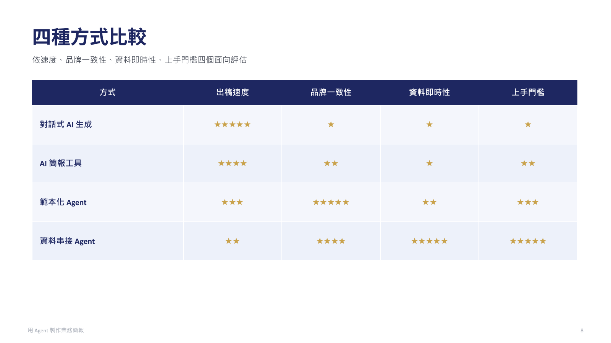

假設你正在做一個研究專案。手上有幾篇論文、一批資料和之前試過的方法，也有一些尚未想清楚的問題。你一邊讀材料、做分析，一邊調整想法；過程中還需要整理資料、製作小工具，或向同事說明目前的發現。

Agent 可以參與這些工作。把目前的材料、想法與問題放進專案，讓它依需要協助查找、整理、試作或檢查；討論後採用哪些建議、發現什麼問題，也一起保存，下次從這裡接著做。要讓 agent 幫上忙，先得知道目前卡在哪裡、希望它協助哪一段。

本週先說明 agent 能協助什麼、如何合作，再用一份直接生成的簡報說明沒有判斷的產出長什麼樣。實作由你自選題目，走一遍從材料、論點、文章到投影片的流程，做出一份 10 到 12 頁、可編輯、每一頁都答得出為什麼的簡報。

## AI 如何配合自己的能力與需要

同樣在做研究，有人熟悉分析方法但不熟工具，有人能很快做出程式，卻不清楚結果該怎麼解讀。可以用「**領域知識 × 駕馭 agent 的能力**」理解 AI 放大器，乘號是兩種能力配合的比喻。


圖片：Julo，[Wikimedia Commons](https://commons.wikimedia.org/wiki/File:Lupa.na.encyklopedii.jpg)，公有領域，未修改。

- **領域知識：理解方法與結果的因果關係。** 知道一件事為什麼做得成，才看得出目前缺什麼、該調整哪個環節，再把材料、方法與預期結果向 agent 說清楚。
- **駕馭 agent 的能力：熟悉模型與工具。** 知道不同模型擅長什麼、有哪些功能與限制，例如何時分工給 sub-agent，才能選擇合適的做法。

例如想做資料展示，知道要回答什麼問題、需要哪些資料、怎樣呈現才不會誤導，是領域判斷；知道可以請 agent 做互動網頁、如何試用與回報問題，是工具熟悉度。兩者配合，想法才能轉成具體可執行的要求。

Agent 可以協助補足不熟悉的部分，也可以接手既有工作中的一些環節。先從目前的需要選一個切入點：

- **缺知識與方向：** 請 agent 解釋、提供關鍵字與做法，再查閱或試做。
- **有想法，但不熟悉工具操作：** 描述想法、請 agent 實作，再試用與修改。
- **簡單、重複的雜工：** 把規則與完成條件說清楚，交給 agent 處理後檢查。
- **需要協助檢查：** 請它找遺漏與盲點，再依材料和工作目的決定是否修改。

同一件工作可能需要幾種協助。想一件要向同事說明的事，指出目前卡在哪裡、想先試哪種協助；這件事可以直接當作本週實作的題目。選定之後，下一步是把需要向 agent 說清楚。

## 請教與交辦，保留自己的判斷

還不知道該用什麼方法，先請教；已經知道要做什麼，就把要求交代清楚，請它動手。

**請教時，像在和不同領域的導師討論。** 帶著自己的專業、經驗與問題，說目前怎麼想、為什麼，再從它的觀點繼續追問。例如：「我要向同事比較幾種用 agent 做簡報的方式，比較條件該怎麼定？」建議要經資料或實作確認，自己的觀察與取捨也要加入。

**交辦時，把方向與重要限制講清楚。** 說明給誰用、做成什麼、範圍在哪，以及長度、格式或必須保留的內容。例如：「把確認的內容做成十頁左右可編輯的 PowerPoint，16:9，先試做一頁。」區分必要條件與偏好，具體做法讓 agent 提出。

> 「他人幫助，但我主導」

——孫以瀚，2026-05-11 講座，[第 61 頁標題](https://ethics.moe.edu.tw/files/resource/lecture/20260511/20260511_lecture_20260508.pdf#page=61)。同頁指出人的貢獻包括形成問題、篩選與判斷、後續執行，屬講者個人觀點。

請教與交辦可以來回切換：討論後有了方向就試做，成果出現新問題再回頭討論。採用什麼、如何修改，仍由自己決定。

## 直接生成的簡報：漂亮，但答不出為什麼

先看一份把題目直接貼給 agent 做出來的簡報。只給它一句「幫我做一份介紹用 agent 做業務簡報有哪些方式、怎麼選的投影片，給同事看的」，十分鐘後得到 12 頁：議程、四種方式各一頁、星等比較表、四個判斷問題、情境對照、提醒與回顧。



課程試做，2026-09-07 由 agent 生成，未經任何查證；四種方式與星等皆出自模型既有知識，不是事實陳述。

第一眼會覺得做得不錯。問題出在拿去報的時候：第四種「資料串接 agent」是什麼，講的人自己也不知道，一被追問便無法回答；星等沒有依據；情境全是客戶提案與品牌規範，沒有送審、列印與承辦人接手。整份通順、漂亮，卻沒有一頁是自己的判斷。

它漂亮的原因不是模型品味，而是照一份寫成文字的版面規則做，做完又看過畫面。版面規則可以交給 agent，內容判斷不行。本週要做的簡報頁數相同、版面也用同一套規則，差別只在每一頁有沒有依據、答不答得出為什麼。

課堂示範的題目是「用 agent 做業務簡報，該選哪種方式」。先認識圖片、HTML、PPTX 三大類，三張總覽圖各是一種形式的六頁縮圖：


由上而下為圖片式、HTML、PPTX。來源：[slidefirm/NESA-SLIDE](https://github.com/slidefirm/NESA-SLIDE) README 的 demo 縮圖，MIT 授權，未修改。乍看都像簡報，差別在做好之後能改什麼、改了存在哪。原站把 HTML 再分兩型，本課合併為一類。

## 建立論點與確認內容的兩個迴圈

「建立論點」處理想講什麼、如何組織；「確認內容」把草稿充實、收斂成自己能說明的內容。文獻、案例與圖片在建立論點時一起探索，文章階段補缺口，分頁時再決定選用。

```{mermaid}
flowchart TD
    subgraph direction_loop["建立論點"]
        A["帶著問題探索<br/>蒐集文獻、案例與圖片"] --> B["人通讀資料，先寫大綱<br/>比較依據，加入洞見與取捨"]
        B --> C["Agent 整理故事線<br/>人確認重點與順序"]
        C -. 補探索、調整想法 .-> A
    end

    C -->|依目前方向展開| D

    subgraph content_loop["確認內容"]
        D["Agent 在主 draft 展開文章<br/>沿論點用 Markdown 完整說明"] --> E["人充實內容<br/>改成自己的話，查核與補缺口"]
        E --> F["整體通讀與收斂<br/>Agent 建議刪併，人決定取捨"]
        F -. 依取捨修改草稿 .-> D
    end

    E -. 新資料或洞見，重看方向 .-> B

    F -->|內容已適合本次交付| H["轉成投影片分頁<br/>選用素材，安排口述與畫面"]
    H --> G["Agent 排版<br/>人試講、檢查與微調"]
```

讀圖時抓三件事：

- **人先通讀、自己列綱。** 加入自己的洞見與取捨，再讓 agent 沿方向整理；真的卡住，可請它試串後逐段確認理由。
- **新材料可以改變方向。** 回到受影響的論點或段落修正，不必整圈重做。
- **接近交付時逐步收斂。** 先處理正確性與理解問題，延伸想法留下一版；內容盡量在 Markdown 修定後再排版。

走完會留下三樣東西：`kb/` 保存搜尋到的材料與來源；`drafts/` 保存採用的論點、文章與分頁草稿，棄案另放一份並記理由；PPT 是對外表達的成品。三者都找得到，這份簡報才接得下去。

## 把過程保存下來，才能接著做

討論到值得留下的內容，就請 agent 整理成 Markdown，自己打開確認；下次指定讀取，再接著做。保留資料、想法、建議、取捨及未定事項，也保存來源與圖片，讓結論能回到依據。資料增加本身不代表內容成熟，收斂依靠取捨。

Markdown 是可用純文字編輯的文件格式，常以 `.md` 保存，方便持續閱讀與修改。實作時所有中間成果都用它保存。

## 實作：自選題目，做一份 10 到 12 頁的簡報

課堂上講師先以預設題目「用 agent 做業務簡報，該選哪種方式」走一遍下面七步，只展開一條論點。接著由你自己走一遍，時間約兩小時。

### 題目、成品與開始前

**題目。** 預設題就是示範題，材料連結都現成。自選題要符合三個條件：有明確的受眾與用途，例如給誰看、看完要做什麼決定；材料公開或可虛構，不碰署內真實資料；兩小時內找得到依據。適合的類型例如向同仁介紹一個新工具或新做法、比較某個業務流程的幾種改法、向不熟的同事說明一項研究或分析的進度。

**成品。** 一份 10 到 12 頁、可編輯的 PPTX，每一頁對應草稿裡的一段內容，被問到都答得出為什麼。練習在課堂完成，不要求另外繳交作業或 GitHub push。

**開始前確認兩件事。** 所用 agent 工具的資料使用設定，例如對話是否用於訓練；練習專案若放上 GitHub，是公開還是私有。關閉訓練用途不代表資料不上雲，private repo 也在雲端。數發部手冊提醒避免將個人訊息與機密資料提供給公開或 API 串接的生成式 AI 服務，[第 81 頁，4.3.6](https://www-api.moda.gov.tw/File/Get/moda/zh-tw/WwHCroVhwWy52dw#page=81)。舊簡報也要檢查備註與附件，拿不準的材料改用講師範例。製作 PPTX 的路徑與沒有預覽軟體時怎麼看畫面，講師會在示範時說明。

**先讓 agent 做第一版。** 把題目一句話貼給 agent，請它直接做一份簡報，讓它在背景跑；另開一個視窗，繼續下面的步驟。這一版最後回看時要用。

### 一、初始化專案與保存習慣

開空專案，說明題目、受眾與用途，先建立 `kb/` 保存找到的材料與討論。請 agent 把保存方式與位置寫入 `AGENTS.md`，打開兩個檔案確認；嫌長就請它刪到只留保存位置與共用要求。之後明確請它讀取 `AGENTS.md`，再接續下一節。

```text
練習專案/
├── AGENTS.md             保存方式與共用要求
└── kb/
    └── 第一次討論.md     題目、受眾、用途、想法與未定事項
```

檔名可調整，重點是實際寫入、打開與再次讀取。後續需要圖片時建 `assets/`，整理文章、棄案與分頁時建 `drafts/`，簡報成果放 `output/`，製作用的程式碼也留在專案裡。資料夾名稱本身不會讓 agent 自動使用內容。

### 二、聊背景與限制，探索材料

先說受眾與使用情境，再依回應補充需求，確認內容保存到筆記。一開始講不出條件是正常的：先請 agent 查資料，看過範例之後，工作上的條件會逐漸想起來，例如內容是否經常改、誰要接手、在哪裡播放、要不要送審或列印。想到一項就補進筆記。

請 agent 找到的每一份材料都實際打開看，整理可編輯範圍、交接方式、製作條件及限制，附來源與查閱日期。區分作者說明、自己實際看見或測試的功能、仍待確認的項目；只讀程式碼而未實際操作的功能算待確認。查找足以支撐目前的比較就先形成草稿，避免一直擴大清單。搜尋以二十分鐘為限，時間到就先用手上的材料往下走，缺的標記待補。

#### 預設題的材料

把 [NESA-SLIDE](https://github.com/slidefirm/NESA-SLIDE) 的連結交給 agent，請它看原站的分類與範例，每類實際打開一份：圖片式 PDF、HTML demo、PPTX 檔，確認能改什麼、改了存在哪、交給同事要用什麼軟體。只看範例，不查它的安裝方式與製作工具，那些是給特定平台用的，一般機器多半跑不了；PPTX 範例存於 Git LFS，抓不到時向講師索取備份。再按缺口查代表工具的官方文件，例如講師告知的 PPTX 製作路徑。

### 三、建立論點，整理進主草稿

人先通讀材料與筆記，依受眾需要排出條件的優先順序，提出自己的主張與理由，再請 agent 沿這些判斷整理故事線。真的想不到時，可讓它先試串，自己逐段說明認同或修改的理由。

第一次說出的立場常不完整。練習時常見的例子是把圖片式講成「好看但不能改」，看過故事線才改成「一次性、不再修改的內容才選圖片」，這種修正就是論點形成的過程。讀到一項資料，可能支持目前想法、只支持一部分、或出現不同結果；依此保留依據、縮小主張，或修改論點。

連讀故事線，確認理解順序、重複與跳接，把採用的主張、依據與大綱整理進主草稿，文章在下一節於同一份檔案展開。棄用或暫緩的論點另存一份草稿，記下證據不足、超出範圍或不適合受眾等理由，不為湊數新增。例如業務簡報沒有台下互動，又沒實測過三種形式的互動功能，「互動性」這項比較就可以移出。

### 四、起草文章，挑一句查證

請 agent 在主草稿沿目前的大綱與論點寫一段 Markdown，看過寫法再展開文章。人補入自己的理解、經驗與例子，例如季報開會前長官臨時改字換圖的經驗，可以放進「內容常改」那段；對照既有來源查核，有缺口再補材料。

Agent 起草時常出現這樣的結尾：「這種方式比較好，適合所有業務簡報。」這句話缺選擇條件。回到受眾的需要，說明優先考量的是什麼，再用查到的功能與限制支持建議。

接著從自己的草稿挑一句對功能或事實下了斷言的句子，請 agent 對照來源檢查，前後版本都留在草稿裡。練習時的一個例子：

| 修改前 | 對照來源 | 修改後 |
|---|---|---|
| HTML 簡報改完可以直接存檔，同事接手後也能在瀏覽器裡繼續改。 | 範例的說明：預設只把草稿存在瀏覽器本機，寫回 HTML 檔需另備 server，repo 未附。 | HTML 簡報可以在瀏覽器裡改文字與位置；改完預設只存在該台電腦的瀏覽器，要交接得先匯出或存檔。此為作者說明，未實測。 |

查文件仍未實測的功能，修正後照樣標「未實測」。整體通讀，請 agent 建議刪重、合併與重排，人決定取捨；文章不像自己講話就請它改短。論點有變就更新主草稿對應段落，移出的內容及理由補到棄案草稿。

### 五、分頁，安排口述與畫面

從文章整理 10 到 12 頁的分頁草稿，逐頁決定重點、口述、畫面與節奏。口述寫兩三句重點與過渡，不是逐字稿；節奏寫成「停留約 60 秒，講完第三點換頁」這樣一行。先挑一頁深入修改，再通讀整份順序。

頁面安排可依這個模板，再按題目調整：

| 頁 | 內容 |
|---|---|
| 1–2 | 受眾需要什麼，這次用什麼條件或角度看 |
| 3–7 | 主體：各選項、各發現或各步驟，一項一頁，附真實範例 |
| 8–9 | 套入受眾的情境，說明取捨 |
| 10 | 建議與理由 |
| 11 | 這份簡報自己是怎麼做的 |
| 12 | 來源與備註，可併入各頁備註 |

兩條判斷標準：每一頁都要對應草稿裡的一段，對不上的頁刪掉，agent 自行補的議程頁、回顧頁、提醒頁多半屬於這類；第一頁不能省，留一小段開場，聽眾才知道在比什麼標準。畫面選一項最影響決策的差異，用範例畫面或可讀的對照表呈現，口述補使用條件與限制。畫面保留短來源與署名，完整連結、版本及授權留備註。

### 六、先做一頁 PPTX，再展開與修改

確認要輸出的文字與順序，請 agent 先做一頁可編輯 PPTX，確認這台機器真的做得出來，再展開其餘頁面。沒有指定版型時，至少交代字體與頁面比例。例如：「把剛才確認的內容做成十二頁以內、可以編輯的 PowerPoint，16:9，先試做一頁，說明排法的原因。」

交辦排版時，把下面這份視覺設計規則一併交給 agent。內容仍然來自草稿，版面規則讓它照做。規則可以沿用，也可以改成自己的；不理解的條目先拿掉。採用的規則之後補進 `AGENTS.md`，下次排版就不必再說一遍。

| 項目 | 規則 |
|---|---|
| 配色 | 一組配色，一色主導，一個強調色；不用預設藍 |
| 明暗 | 標題頁與結尾頁深底，內容頁白底 |
| 母題 | 選一個元素整份重複，例如圓形圖示或同一種卡片 |
| 每頁 | 都要有一個視覺元素：圖、表、圖示或色塊；版型輪替，不每頁條列 |
| 字級 | 標題 36 到 44，段落標 20 到 24，內文 14 到 16，來源 10 到 12 |
| 留白 | 邊界至少半吋，區塊間距固定用一種 |
| 禁止 | 標題下的裝飾線、整寬色條、純文字頁、置中內文、溢出框外的文字 |
| 產出後 | 匯出圖片逐頁看溢出、重疊、對齊、對比，修完再出；每頁備註保留口述與完整來源 |

打開第一頁看畫面。沒有直接預覽的軟體時，請 agent 用 PowerPoint 或 Keynote 匯出 PDF 或圖片再看。首次輸出常見的問題是整頁太空：標題和說明句之間一大塊空白，三個關鍵字散在下方，字偏小。提出具體修改，例如標題加大、關鍵字做成並排的色塊、往上靠近標題；改好之後把首次輸出與修改版並排。

再展開其餘頁面，逐頁看一次；字級太小、圖片高度不一、卡片下方空白，直接指出來改。修改版另存，不覆蓋首次輸出。檢查只做兩件事：每頁備註有口述與完整來源；請 agent 用程式逐頁確認文字都是文字框，不是圖片。

### 七、試講與回看

有三件事 agent 無法代做：親自在 PowerPoint 點選文字、改一個字，確認真的能編輯；實際講一頁、計時；請聽者重述重點或指出不清楚處。兩人一組，各挑自己最沒把握的一頁講，聽的人重述重點。題目不同反而合適，聽者沒有背景，重述不出來就是那頁沒講清楚。講到卡住、被問答不出來的那一頁，內容還不是自己的判斷，回到草稿補材料或刪掉。

交付前確認：

- 文字、圖片、頁碼與來源可讀，引用支持本頁主張，示意與實證分得清楚。
- 開頭說的需求，每一項都出現在成品裡。常見的情況是開頭說長官在意圖表好不好看，做出來的頁面卻沒有處理這一項，自己與 agent 都沒發現。
- `kb/` 的來源材料、主草稿、棄案草稿、分頁草稿及 PPTX 的最新版本能找到。

做完之後留下的東西不只一份 PPTX：

| 給誰 | 內容 |
|---|---|
| 交給同事 | 可編輯的 PPTX |
| 自己備講與日後回查 | 主草稿的文章與查證紀錄、分頁草稿的逐頁重點與口述 |
| 有人質疑依據時 | `kb/` 的來源筆記、棄案草稿與理由 |
| 還沒做完的 | 移出交付範圍的素材、試講與聽者回饋 |

最後把開頭那份直接生成的第一版和自己做的並排，問同一個問題：哪一頁答得出為什麼。再回答三問：補上了什麼內容、哪一項採用或刪除是自己的判斷、哪些搜尋、整理或排版工作交給了 agent。將一項值得沿用的要求補進 `AGENTS.md`，例如「查到範例做法時，先確認在這台機器上跑得通」。

### 各步時間與檢查點

| 分鐘 | 步驟 | 要做到 |
|---|---|---|
| 0–5 | 開始前 | 確認資料設定；把題目貼給 agent 做第一版，另開視窗。 |
| 5–10 | 一、初始化 | `AGENTS.md`、`kb/第一次討論.md` 寫好題目、受眾、用途，讓 agent 讀過。 |
| 10–30 | 二、材料 | 請 agent 找材料，每份實際打開，補自己的條件，整理進 kb。三十分鐘到就停止搜尋。 |
| 30–45 | 三、論點 | 自己先說立場，agent 試串，至少改一處，有棄案記理由。**檢查點一：** kb 有題目、受眾、用途、三份材料，加一條故事線。 |
| 45–65 | 四、文章與查證 | agent 展開文章，人補自己的例子，挑一句斷言請 agent 對照來源。 |
| 65–75 | 五、分頁 | 依模板出分頁草稿，每頁對應草稿一段，口述兩三句。 |
| 75–100 | 六、PPTX | 先做一頁、看畫面、提修改、交規則、展開其餘頁，逐頁看。**檢查點二：** 第一頁做好且看過畫面。 |
| 100–110 | 七、試講 | 兩人一組，各講最沒把握的一頁，聽的人重述。 |
| 110–120 | 回看 | 第一版與自己版並排；回答三問；補一條要求進 `AGENTS.md`。 |

檢查點沒過的人，改走保底路徑：交第 2 頁、主體任一頁、建議頁，加試講一頁，仍是一條論點到試講的完整體驗。

## 延伸閱讀

- 組織證據、處理反對意見與排練：[TEDx 講者指南，第 4–7 頁](https://storage.ted.com/tedx/manuals/tedx_speaker_guide.pdf#page=4)。
- 早期故事板就預想圖表與照片：[Reynolds, Preparation Tips](https://www.garrreynolds.com/preparation-tips)。
- 明確訊息配合視覺證據：[Assertion-Evidence 方法](https://www.assertion-evidence.com/)。
- 文字對比與閱讀順序檢查：[Microsoft 支援文件，讓 PowerPoint 簡報無障礙](https://support.microsoft.com/zh-tw/accessibility/powerpoint/make-your-powerpoint-presentations-accessible-to-people-with-disabilities)。
- 原文、標註與筆記如何連在一起：[Zotero PDF 閱讀器](https://www.zotero.org/support/pdf_reader)；臺大數學系圖書室的書目與筆記管理介紹，[洪翠錨整理，2026-08-14](https://www.math.ntu.edu.tw/~mathlib/News_Content_n_204689_s_264943.html)。
- 教師先擬題目、AI 檢查、教師確認的往返，以及先讀教材再用 AI 比較觀點：[臺大教發中心 AI 教學札記](https://www.dlc.ntu.edu.tw/ai-teaching-notes/)，蔡亞倫與劉欣怡兩則。
- 需求具體化的提問方式：[數發部手冊第 25 頁](https://www-api.moda.gov.tw/File/Get/moda/zh-tw/WwHCroVhwWy52dw#page=25)。
