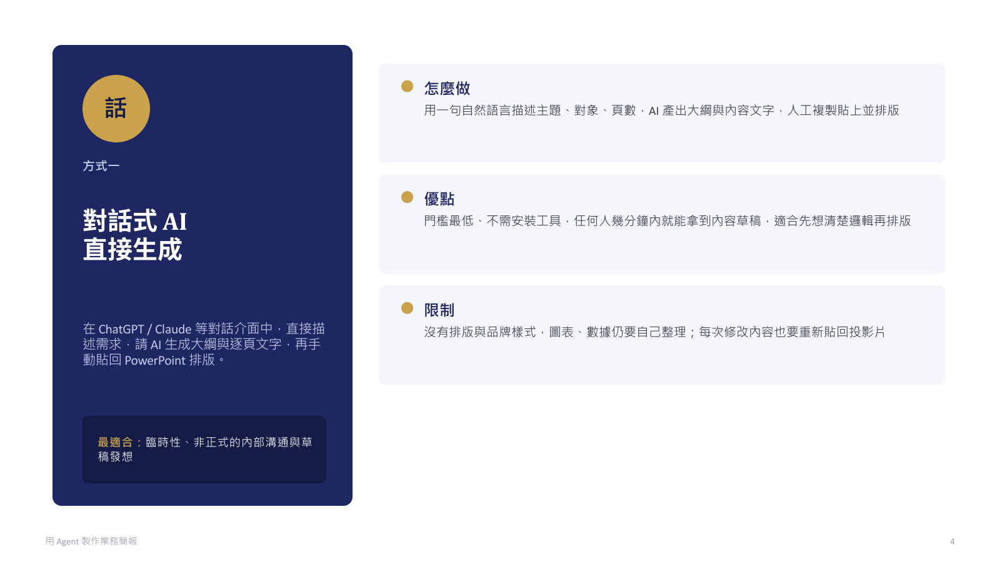
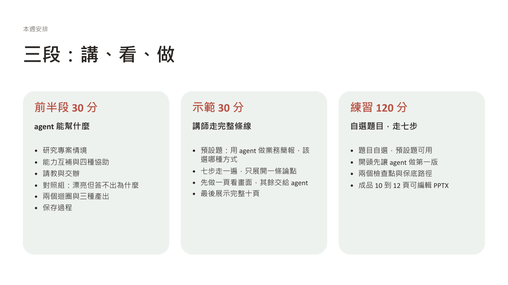

假設你正在做一個研究專案。手上有幾篇論文、一批資料和之前試過的方法，也有一些尚未想清楚的問題。你一邊讀材料、做分析，一邊調整想法；過程中還需要整理資料、製作小工具，或向同事說明目前的發現。

Agent 可以參與這些工作。把目前的材料、想法與問題放進專案，讓它依需要協助查找、整理、試作或檢查；討論後採用哪些建議、發現什麼問題，也一起保存，下次從這裡接著做。要讓 agent 幫上忙，先得知道目前卡在哪裡、希望它協助哪一段。

本週先說明 agent 能協助什麼、如何合作，再用這份教材自己的投影片當例子，看內容怎麼走過確認方向、建立架構、調整風格三個迴圈。實作由你自選題目，走一遍八步，做出一份 10 到 12 頁、可編輯、每一頁都答得出為什麼的簡報。三段用同一個動作：先看 agent 憑一句話做出什麼，再看加入判斷之後變成什麼。

本週的[授課投影片](https://1drv.ms/p/c/02708679a802899d/IQAM3J8zls1MR5anu0ITdGDAAZw2_fOCFa9wbXtOuutHiVA)可在 PowerPoint 網頁版開啟。文章版補上投影片中由講師口述的說明、查證紀錄與實作細節，兩者可以配合閱讀。

## AI 如何配合自己的能力與需要

同樣在做研究，有人熟悉分析方法但不熟工具，有人能很快做出程式，卻不清楚結果該怎麼解讀。可以用「**領域知識 × 駕馭 agent 的能力**」理解 AI 放大器，乘號是兩種能力配合的比喻。


圖片：Julo，[Wikimedia Commons](https://commons.wikimedia.org/wiki/File:Lupa.na.encyklopedii.jpg)，公有領域，未修改。

- **領域知識：理解方法與結果的因果關係。** 知道一件事為什麼做得成，才看得出目前缺什麼、該調整哪個環節，再把材料、方法與預期結果向 agent 說清楚。
- **駕馭 agent 的能力：熟悉模型與工具。** 知道不同模型擅長什麼、有哪些功能與限制，例如何時分工給 sub-agent，才能選擇合適的做法。

例如想做資料展示，知道要回答什麼問題、需要哪些資料、怎樣呈現才不會誤導，是領域判斷；知道可以請 agent 做互動網頁、如何試用與回報問題，是工具熟悉度。卡的是哪一邊，就決定需要哪種協助：

- **缺知識與方向：** 請 agent 解釋、提供關鍵字與做法，再查閱或試做。
- **有想法，但不熟悉工具操作：** 描述想法、請 agent 實作，再試用與修改。
- **簡單、重複的雜工：** 把規則與完成條件說清楚，交給 agent 處理後檢查。
- **需要協助檢查：** 請它找遺漏與盲點，再依材料和工作目的決定是否修改。

同一件工作可能需要幾種協助。選定之後，下一步是把需要向 agent 說清楚。

不必把原有流程整套換掉。先找出重複、機械式或完成條件明確的環節，也可以從過去一直想補、但沒有時間處理的部分開始。做過之後再決定哪些做法值得留下。

## 請教與交辦，保留自己的判斷

還不知道該用什麼方法，先請教；已經知道要做什麼，就把要求交代清楚，請它動手。

**請教時，像在和不同領域的同事討論。** 帶著自己的專業、經驗與問題，說目前怎麼想、為什麼，再從它的觀點繼續追問。例如：「我要向新進同仁介紹 GDMS，他們最先需要知道什麼？」建議要經資料或實作確認，自己的觀察與取捨也要加入。

**交辦時，把方向與重要限制講清楚。** 說明給誰用、做成什麼、範圍在哪，以及長度、格式或必須保留的內容。例如：「只用 GDMS 公開頁面，做成十頁左右可編輯的 PowerPoint，16:9，先給我逐頁稿。」區分必要條件與偏好，具體做法讓 agent 提出。

請教與交辦可以來回切換：討論後有了方向就試做，成果出現新問題再回頭討論。採用什麼、如何修改，仍由自己決定。最省事的交辦是只給一句話、不給材料、不請教，下一節就是這樣做出來的。

## 把過程保存下來，才能接著做

討論到值得留下的內容，就請 agent 整理成 Markdown，自己打開確認；下次指定讀取，再接著做。保留資料、想法、建議、取捨及未定事項，也保存來源與圖片，讓結論能回到依據。資料增加本身不代表內容成熟，收斂依靠取捨。

Markdown 是可用純文字編輯的文件格式，常以 `.md` 保存，方便持續閱讀與修改。實作時所有中間成果都用它保存。整個資料夾結構是跟著專案長出來的，不用先設計；只要先向 agent 說明要記錄過程。有自己熟悉的整理方式，也可以先請它照原有方式建立，再把共用要求寫進 `AGENTS.md`。

## 交付物代表自己

先看一份把題目一句話貼給 agent 做出來的簡報。它沒有查任何資料，十分鐘後交出十二頁，版面完整、配色統一。



課程試做，2026-09-07 由 agent 生成，未經任何查證；畫面中的分類與說明出自模型既有知識，不是事實陳述。

看的人的反應是：做得不錯，但拿去報就會卡，被問就答不出來。用幾句話完成什麼東西看起來很厲害，但那不是你要的東西；與其讓 AI 一次吐一堆看不完的東西，不如一點一點把工作流程替換。交出去的東西代表自己，每一頁都要答得出為什麼。它漂亮的原因不是模型品味，而是照一份寫成文字的版面規則做；版面規則可以交給 agent，內容判斷不行，這一點後面第三圈會用到。

## 確認方向、建立架構、調整風格：三個迴圈

一般簡報流程常寫成六步：釐清目的與聽眾、整理素材、安排故事與大綱、撰寫每頁內容、設計版面、試講與修正。三個迴圈沒有取代這些工作，而是依每個階段要形成的產物與人的檢查重新分組：先確認方向，再建立架構，最後調整風格。

內容不是一次寫成的。每一圈以自己的產物收尾，產物就是這一圈的檢驗：文稿測方向，討論長成文稿讀過還撐得住，方向才算定了，撐不住就回頭改主軸；逐頁稿測架構，文稿排成逐頁稿後只讀標題連讀，講不完故事就回文稿順邏輯；成品測風格，人依品味看整份，不像自己就改標準再產。檢驗一道比一道具體、也一道比一道貴，所以便宜的先做：文稿與逐頁稿都在 Markdown 上，成品才進 PPTX。

```{mermaid}
flowchart TD
    subgraph direction_loop["確認方向"]
        A["帶著問題探索<br/>蒐集文獻、案例與圖片"] --> B["人通讀資料，補入洞見<br/>想講的方向與取捨在這裡定"]
        B --> C["Agent 順著討論長成文稿<br/>人讀過確認方向"]
        C -. 補探索、改主軸 .-> A
    end

    C -->|文稿撐得住方向| D

    subgraph content_loop["建立架構"]
        D["Agent 把文稿排成逐頁稿<br/>先出只有標題的 ghost deck"] --> E["人只讀標題連讀<br/>調整邏輯順序，改回文稿"]
        E --> F["整體通讀與收斂<br/>Agent 建議刪併，人決定取捨"]
        F -. 依取捨重排逐頁稿 .-> D
    end

    E -. 新資料，重看方向 .-> B

    subgraph form_loop["調整風格：先文字與語氣，再版面與圖文"]
        I["Agent 尋找風格規則<br/>寫成標準"] --> J["Agent 依標準整份產出"]
        J --> K["人依品味檢視整份<br/>不合就改標準，內容問題退回"]
        K -. 改標準，重新產出 .-> I
    end

    F -->|逐頁稿連讀通過| I
    K -. 內容問題 .-> E
    K -->|試講過得去| L["交付"]
```

三圈各有概念、產出物與通過標準：

| 圈 | 概念 | 產出物 | 通過標準 |
|---|---|---|---|
| 確認方向 | 探索材料，人補入洞見，agent 順著討論長成文稿 | 文稿 | 文稿讀過撐得住方向，不必回頭改主軸 |
| 建立架構 | 文稿排成逐頁稿，連讀時調整邏輯順序 | 逐頁稿與順過的文稿 | 只讀標題連讀能講完故事 |
| 調整風格 | agent 找風格規則寫成標準並產出，人依品味檢視 | 成品 | 整份看像自己，試講過得去 |

讀圖時抓五件事：

- **人先通讀，補入洞見。** 想講的方向與取捨在第一圈定下，不必先寫大綱，agent 順著討論慢慢長成文稿；真的卡住，可請它試串後逐段確認理由。
- **第一圈以文稿收尾。** 方向不是想出來就算定，討論長成文稿讀過還撐得住才算；第二圈接著把這份文稿排成逐頁稿。
- **新材料可以改變方向。** 回到受影響的論點或段落修正，不必整圈重做。
- **第二圈從逐頁稿開始。** 文稿一定下來就排成逐頁稿，前置是只有標題的 ghost deck，每頁一句主張句；連讀時看得出跳接與缺口，人在這裡調整邏輯順序，改回文稿再重排；依序連讀能講完故事才算架構定了。
- **第三圈每個面向的入口都是標準。** 自己沒有判斷力的面向，先請 agent 整理別人的做法，自己挑出要用的，寫成標準再產出；有判斷力的面向直接拿出自己的規則檔。標準用過確定有效就補進 `AGENTS.md`，下次這一格就變短。看整份成品時發現的多半是內容問題，退回第二圈改，不在成品上修。

第三圈管的是成品像不像自己的，只有輸出成品之後才是調風格。三個迴圈也可以和軟體開發的需求探索、建立架構與寫程式互相對照；做過第一門課的人，可以用熟悉的流程理解。

走完會留下三樣東西：`kb/` 保存搜尋到的材料與來源，標準也在這裡起草；`drafts/` 保存採用的論點、文稿與逐頁稿，棄案另放一份並記理由；PPTX 是對外表達的成品。三者都找得到，這份簡報才接得下去。

## 這份投影片是怎麼做出來的

這份教材的投影片就是照上面那張圖做的。三段各對應一圈，每段的判斷都留有紀錄。

**確認方向：方向改了三次，洞見進了文稿，文稿在兩輪試跑之間來回修。** 9 月 2 日這週的主題是「文件專案化與模型能力」，重點在說服訂閱；9 月 4 日改成「公部門用 AI 的阻礙與規範」；9 月 6 日才改成「先體驗 agent」。洞見是在討論裡補進去的：迭代回圈小一點、內容留在 md；一直在改就是缺一個原則；第三個迴圈讓交付物對齊自己的標準。文稿是方向的檢驗：後半段的操作步驟先請 agent 扮演學員從空資料夾走一遍，第一輪學員照字面操作，第二輪學員口語、繞路、會講錯，兩輪都看不懂的句子退回來改，例如「以備課試跑確認可用的路徑」改成「先做一頁，確認這台機器真的做得出來」；客服 AI 的研究找來了又移出，因為不好講；簡報形式的比較整段移出。總時數定為 60 分，文稿才有尺可量。

**建立架構：文稿排成逐頁稿，連讀之後調的是順序與取捨。** agent 排出的第一版逐頁稿標題通順但認不出自己的思路，改了七版還不是要的感覺；換成使用者在討論裡說過的原話當底才看得懂，這個做法留成一份 [skill](https://github.com/jimmy60504/agentic-knowledge-work/blob/main/skills/ghost-deck-from-own-words.md)。

| agent 生成的標題 | 原話當底的標題 |
|---|---|
| 還沒有方法時請教 | 把 AI 當同事 |
| 開空專案，建 kb 與 AGENTS.md | 開空專案 |
| 確認表達 | 調整風格 |
| 寫成判準 | 寫成標準 |
| 交付出去的東西是要負責的 | 交付物代表自己 |

只讀標題連讀之後改的都是邏輯：先講迴圈再講實例、保存接在流程後面、把 AI 當同事前移、迴圈與實例穿插；刪掉研究專案情境頁與練習時間表頁，歷程從五頁併成三頁。agent 提刪併建議，留哪頁、什麼順序由人決定。

**調整風格：先讓 agent 排一版，看到一個錯修一個，六版沒有方向。** agent 照文稿一次排出 23 頁。第一眼覺得可以，細看每頁都有一句像口號的標題，沒有增加資訊。



於是一次修一件：刪金句、精簡成書面文、一頁一個概念、內文要有呈現方式、實作頁要能跟著做。文案改了六版，每版解一個問題，每版又冒出新問題。

**然後換了方法：先讓 agent 找原則，寫成標準，再整份套用。** 查到的是 Alley 的主張加證據、Duarte 的三秒看懂、Mayer 的冗餘與一致原則、顧問業的只讀標題連成故事，五個來源指向同一件事：標題是一句主張，畫面是證據，解釋交給口述。語氣與版面各找了一份標準：文字用自己說過的原話，加上一份文案語氣規則；版面用一份視覺設計規則，圖示統一一套單色，流程圖改成直式。之後每一版都是整份重建，不在 PPTX 上手改；看畫面發現的內容問題退回前兩圈。

這段要講出一件事：一次修一個錯，是因為每次只有一個判斷；先找原則，判斷變成一組，一次套用。這就是第三圈的入口。通則是：同一類問題修了兩三次還在冒，就停下來，請 agent 找這件事的做法，寫成標準再做；用過確定有效就補進 `AGENTS.md`，下次不必再找。排版與圖示交給了 agent，主張與順序是自己排的。這三段留下的檔案，就是前面說的三樣東西：原則筆記在 `kb/`，文稿與逐頁稿在 `drafts/`，成品是這份投影片。

## 實作：自選題目，走八步

課堂上講師先以預設題目「向新進同仁介紹 GDMS」走一遍下面八步，只展開一條論點；開頭先把題目一句話貼給 agent，讓它在背景做第一版，收尾時把兩版並排。接著由你自己走一遍，時間約兩小時，自由發揮，不收成品。

### 題目、成品與開始前

**題目。** 預設題就是示範題，材料連結講師提供。自選題要符合三個條件：有明確的受眾與用途，例如給誰看、看完要做什麼決定；材料公開或可虛構，不碰署內非公開資料；兩小時內找得到依據。適合的類型例如向同仁介紹一個系統、工具或做法，比較某個業務流程的幾種改法，向不熟的同事說明一項研究或分析的進度。開始前先想清楚三件事：這件事是什麼？給誰看、看完要做什麼決定？目前卡在哪裡？

**成品。** 一份 10 到 12 頁、可編輯的 PPTX，每一頁對應文稿裡的一段內容，被問到都答得出為什麼。

**開始前確認兩件事。** 所用 agent 工具的資料使用設定，例如對話是否用於訓練；練習專案若放上 GitHub，是公開還是私有。關閉訓練用途不代表資料不上雲，private repo 也在雲端。數發部手冊提醒避免將個人訊息與機密資料提供給公開或 API 串接的生成式 AI 服務，[第 81 頁，4.3.6](https://www-api.moda.gov.tw/File/Get/moda/zh-tw/WwHCroVhwWy52dw#page=81)。舊簡報也要檢查備註與附件，拿不準的材料改用講師範例。PPTX 製作路徑與沒有預覽軟體時怎麼看畫面，講師在示範時說明。

**先讓 agent 做第一版。** 把題目一句話貼給 agent，請它直接做一份簡報，讓它在背景跑；另開一個視窗，繼續下面的八步。這一版最後回看時要用。

### 一、初始化專案與保存習慣

開空專案，說明題目、受眾與用途，先建立 `kb/` 保存找到的材料與討論。請 agent 把保存方式與位置寫入 `AGENTS.md`，打開兩個檔案確認；嫌長就請它刪到只留保存位置與共用要求。之後明確請它讀取 `AGENTS.md`，再接續下一節。

```text
練習專案/
├── AGENTS.md             保存方式與共用要求
└── kb/
    └── 第一次討論.md     題目、受眾、用途、想法與未定事項
```

檔名可調整，重點是實際寫入、打開與再次讀取。後續需要圖片時建 `assets/`，整理文稿、棄案與逐頁稿時建 `drafts/`，簡報成果放 `slides/`，製作用的程式碼也留在專案裡。資料夾名稱本身不會讓 agent 自動使用內容。

### 二、聊背景與限制，探索材料

先說受眾與使用情境，再依回應補充需求，保存到筆記。一開始講不出條件是正常的：先請 agent 查資料，看過材料之後，工作上的條件會逐漸想起來，例如受眾最常問什麼、哪些步驟最容易出錯、要不要送審或列印。想到一項就補進筆記。

請 agent 找到的每一份材料都實際打開看，整理內容、適用範圍與限制，附來源與查閱日期。區分作者說明、自己實際看見或測試的功能、仍待確認的項目。查找足以支撐目前的論點就先形成草稿，避免一直擴大清單；搜尋以三十分鐘為限，時間到就先用手上的材料往下走，缺的標記待補。材料不只在這一步找：之後任何一步卡住都可以再找一輪，例如排版前先找投影片的原則，就是同一個動作。

#### 預設題的材料

講師提供 GDMS 公開頁面與說明文件的連結，交給 agent 讀取，只用公開內容；系統內需要帳號才看得到的畫面與資料不提供給工具。agent 對系統功能、資料範圍與數字的描述，一律對照說明頁確認，沒查到的標待確認。

### 三、先找出想講的方向

人先通讀材料與筆記，依受眾需要排出優先順序，先找出這次想講的方向和理由，再請 agent 沿這個方向拓展，看有沒有要調整的。真的想不到時，可讓它先試串，自己逐段說明認同或修改的理由。自己的洞見在這一步進去，成果才代表自己。

第一次說出的方向常不完整。試跑時的例子（題目為簡報形式比較）：學員把圖片式講成「好看但不能改」，看過故事線才改成「一次性、不再修改的內容才選圖片」，這種修正就是論點形成的過程。讀到一項資料，可能支持目前想法、只支持一部分、或出現不同結果；依此保留依據、縮小主張，或修改論點。

把採用的主張與依據整理進主 draft，文稿在下一節於同一份檔案展開。棄用或暫緩的論點另存一份 draft，記下證據不足、超出範圍或不適合受眾等理由，不為湊數新增。

### 四、起草文稿，挑一句查證

這是確認方向的最後一步。文稿是方向的檢驗：討論展開成完整邏輯還撐得住，方向才算定了；展開時發現跳接或段落站不住，回第三步重看主軸。請 agent 在主 draft 沿目前的方向寫一段 Markdown，看過寫法再展開。人補入自己的理解、經驗與例子，例如自己第一次用這個系統卡在哪裡；把 agent 說的話順成自己說的話，對照既有來源查核，有缺口再補材料。

Agent 起草時常出現這樣的結尾：「這個系統功能完整，適合所有使用者。」這句話缺條件。回到受眾的需要，說明他們最先需要的是什麼，再用查到的功能與限制支持。

接著從自己的文稿挑一句對功能或事實下了斷言的句子，請 agent 對照來源檢查，前後版本都留在 draft 裡。試跑時的例子（題目為簡報形式比較）：

| 修改前 | 對照來源 | 修改後 |
|---|---|---|
| HTML 簡報改完可以直接存檔，同事接手後也能在瀏覽器裡繼續改。 | 範例的說明：預設只把草稿存在瀏覽器本機，寫回 HTML 檔需另備 server，repo 未附。 | HTML 簡報可以在瀏覽器裡改文字與位置；改完預設只存在該台電腦的瀏覽器，要交接得先匯出或存檔。此為作者說明，未實測。 |

查文件仍未實測的功能，修正後照樣標「未實測」。論點有變就更新主 draft 對應段落，移出的內容及理由補到棄案 draft。

### 五、分成逐頁稿

建立架構從這裡開始。請 agent 把文稿分成逐頁稿，分兩步。先排 ghost deck：每頁只寫一句標題，標題用自己在討論裡說過的原話當底，agent 補的標明無原話；標題依序連讀一遍，能講完整個故事、沒有跳接，才往下。連讀時改的是順序與取捨，agent 提刪併建議，留哪頁由人決定。再逐頁配內容：每頁寫這句主張要用什麼證據支撐，真實畫面、對照表、流程圖或步驟卡，以及口述兩三句重點與過渡。全部用 Markdown 存成逐頁稿，之後的修改都在這份檔案上做。

分頁的原則不必另外找，一頁一句主張、畫面是證據、解釋交給口述，直接寫進對 agent 說的話裡；想看依據可對照課程的[原則筆記](https://github.com/jimmy60504/agentic-knowledge-work/blob/main/kb/tools/slide-design-principles-argument-to-slides.md)。

頁面安排可依這個模板，再按題目調整：

| 頁 | 內容 |
|---|---|
| 1–2 | 受眾需要什麼，這次用什麼條件或角度看 |
| 3–7 | 主體：各功能、各步驟或各發現，一項一頁，附真實畫面 |
| 8–9 | 套入受眾的情境，說明取捨 |
| 10 | 建議與理由 |
| 11 | 這份簡報自己是怎麼做的 |
| 12 | 來源與備註，可併入各頁備註 |

三條判斷標準：只讀標題能講完故事；每一頁都要對應文稿裡的一段，對不上的頁刪掉，agent 自行補的議程頁、回顧頁、提醒頁多半屬於這類；第一頁不能省，留一小段開場，聽眾才知道在講什麼。畫面只放支撐該頁主張的東西，解釋交給口述；畫面保留短來源與署名，完整連結、版本及授權留備註。

### 六、修改語氣

進調整風格，第一個面向，還在 Markdown 上做，便宜。標準兩條：能用自己說過的原話就用原話，討論紀錄與 kb 筆記裡都找得到；其餘依一份寫下來的文案語氣規則改，例如不用金句口號、動詞用工整的書面詞、一句一件事。沒有自己的規則，可以請 agent 先整理「AI 寫作有哪些特徵」的清單當對照，再挑幾條寫成自己的規則。現成的來源有三份：維基百科的 [AI 寫作特徵清單](https://en.wikipedia.org/wiki/Wikipedia:Signs_of_AI_writing)、OpenAI 給自家模型的寫作規則與禁用詞清單、Anthropic 給 Claude 的「mannered prose」反模式定義，整理見[廠商語氣指引筆記](https://github.com/jimmy60504/agentic-knowledge-work/blob/main/kb/tools/vendor-writing-style-guidance.md)。兩家廠商自己都承認模型有固定腔調，並教使用者怎麼壓掉。

做法：把逐頁稿整份交給 agent，請它依規則逐頁改寫，並標出哪些句子它沒有原話依據；人讀一遍，讀起來不像自己講話的句子指出來，再改。看畫面時最常見的問題，標題像口號，在這一步就解決，不會帶進排版。

### 七、找排版原則，整份產出

調整風格的第二個面向，輸出成品之後才是真正的調風格。排版的標準這門課已經找過一輪，就是下面這份視覺設計規則；也可以請 agent 再找一輪比對，或直接沿用，不理解的條目先拿掉。標準用過確定有效，補進 `AGENTS.md`，下次進到排版直接拿出來，這一步就消失了。

| 項目 | 規則 |
|---|---|
| 配色 | 一組配色，一色主導，一個強調色；不用預設藍 |
| 明暗 | 標題頁與結尾頁深底，內容頁白底 |
| 母題 | 選一個元素整份重複，例如圓形圖示或同一種卡片 |
| 每頁 | 都要有一個視覺元素：圖、表、圖示或色塊；版型輪替，不每頁條列 |
| 字級 | 標題 36 到 44，段落標 20 到 24，內文 14 到 16，來源 10 到 12 |
| 留白 | 邊界至少半吋，區塊間距固定用一種 |
| 禁止 | 標題下的裝飾線、整寬色條、純文字頁、置中內文、溢出框外的文字 |
| 產出後 | 匯出圖片逐頁看溢出、重疊、對齊、對比，修完再出；每頁備註保留口述與完整來源 |

第一次走這條製作路徑時，先請 agent 做一頁可編輯 PPTX，確認這台機器真的做得出來；路徑確認之後，每次都請 agent 依逐頁稿整份產出。agent 排版是寫程式，整份重建的成本和做一頁差不多，所以迭代單位是整份：整份重建，匯出 PDF 整份看。沒有指定版型時，至少交代字體與頁面比例。例如：「照這份逐頁稿做成可編輯的 PowerPoint，16:9，版面照這份規則，做完匯出 PDF 給我看。」規則從第一版就給。

沒有直接預覽的軟體時，請 agent 用 PowerPoint 或 Keynote 匯出 PDF 或圖片再看。看畫面時把問題分兩類。版面問題，例如整頁太空、字級太小、圖片高度不一、卡片下方空白，直接指出來，改規則或腳本再整份重建，不手改 PPTX。內容問題，例如標題讀起來像口號、頁與頁之間跳接、一頁塞了兩個主張，這些不在投影片上修，回第五、六步改逐頁稿，論點有變就回第四步改文稿，再重建。第一次看畫面找到的問題，多半是後者。

修改版另存，不覆蓋首次輸出，回看時要並排。檢查只做兩件事：每頁備註有口述與完整來源；請 agent 用程式逐頁確認文字都是文字框，不是圖片。

### 八、整個過一遍

有兩件事 agent 無法代做：親自在 PowerPoint 點選文字、改一個字，確認真的能編輯；自己找時間真的講一遍、計時。這是一個確認，不用兩人一組。講到卡住、講不順的那一頁，內容還不是自己的判斷，回到文稿補材料或刪掉。

交付前確認：

- 文字、圖片、頁碼與來源可讀，引用支持本頁主張，示意與實證分得清楚。
- 開頭說的需求，每一項都出現在成品裡。試跑時學員開頭說長官在意圖表好不好看，做出來的頁面卻沒有處理這一項，自己與 agent 都沒發現。
- `kb/` 的來源材料、主 draft、棄案 draft、逐頁稿及 PPTX 的最新版本能找到。

做完之後留下的東西不只一份 PPTX：

| 給誰 | 內容 |
|---|---|
| 交給同事 | 可編輯的 PPTX |
| 自己備講與日後回查 | 文稿與查證紀錄、逐頁稿的逐頁重點與口述 |
| 有人質疑依據時 | `kb/` 的來源筆記、棄案 draft 與理由 |
| 還沒做完的 | 移出交付範圍的素材、試講時發現的問題 |

最後把開頭那份一句話做出的第一版和自己做的並排，逐頁問同一個問題：這一頁為什麼這樣寫。再對回三圈問三問：方向與洞見是自己的嗎；順序是自己調的嗎；風格照了哪份標準。說不出理由的那頁，內容還不是自己的。將一項值得沿用的要求補進 `AGENTS.md`，例如「查到範例做法時，先確認在這台機器上跑得通」。

## 延伸閱讀

- 這門課找過的三份標準：分頁的[原則筆記](https://github.com/jimmy60504/agentic-knowledge-work/blob/main/kb/tools/slide-design-principles-argument-to-slides.md)、[文案語氣規則](https://github.com/jimmy60504/agentic-knowledge-work/blob/main/skills/chinese-copy-style.md)、[廠商語氣指引筆記](https://github.com/jimmy60504/agentic-knowledge-work/blob/main/kb/tools/vendor-writing-style-guidance.md)。
- 用使用者原話當 ghost deck 的底：[skill 說明](https://github.com/jimmy60504/agentic-knowledge-work/blob/main/skills/ghost-deck-from-own-words.md)。
- 組織證據、處理反對意見與排練：[TEDx 講者指南，第 4–7 頁](https://storage.ted.com/tedx/manuals/tedx_speaker_guide.pdf#page=4)。
- 早期故事板就預想圖表與照片：[Reynolds, Preparation Tips](https://www.garrreynolds.com/preparation-tips)。
- 明確訊息配合視覺證據：[Assertion-Evidence 方法](https://www.assertion-evidence.com/)。
- 文字對比與閱讀順序檢查：[Microsoft 支援文件，讓 PowerPoint 簡報無障礙](https://support.microsoft.com/zh-tw/accessibility/powerpoint/make-your-powerpoint-presentations-accessible-to-people-with-disabilities)。
- 原文、標註與筆記如何連在一起：[Zotero PDF 閱讀器](https://www.zotero.org/support/pdf_reader)；臺大數學系圖書室的書目與筆記管理介紹，[洪翠錨整理，2026-08-14](https://www.math.ntu.edu.tw/~mathlib/News_Content_n_204689_s_264943.html)。
- 教師先擬題目、AI 檢查、教師確認的往返，以及先讀教材再用 AI 比較觀點：[臺大教發中心 AI 教學札記](https://www.dlc.ntu.edu.tw/ai-teaching-notes/)，蔡亞倫與劉欣怡兩則。
- 需求具體化的提問方式：[數發部手冊第 25 頁](https://www-api.moda.gov.tw/File/Get/moda/zh-tw/WwHCroVhwWy52dw#page=25)。
