本頁說明 Agent 如何把一句要求變成實際成果，以及它可以用哪些方式參與工作流程。課程以「測試一個研究想法」為共同案例，從提出問題、查找文獻、選定方法、取得資料、執行分析到撰寫報告，逐段比較 Agent 的位置、權限與人的責任。

[開啟第四週 4-1 授課投影片](https://1drv.ms/p/c/02708679a802899d/IQDj6J5-aiDqRIs5R12DMrSyAahOCmnErrJZtN-Fx91goR4?e=qoWyow)。文章版補上投影片中由講師口述的說明，並保留流程圖供放大閱讀。

第四週另有[下半場講課](03-back-to-your-work.html)與[工作坊](04-workshop-find-agent-use.html)。下半場將外部用法與地震業務改寫成同一組工作動詞；工作坊則由學員選擇一件實際工作，拆解流程並評估是否值得嘗試。

## 研究工作的一般流程

研究工作可以先用六個活動表示：提出問題、查找文獻、選定方法、取得資料、執行分析、撰寫報告。這個簡化版本便於掌握方向，但尚未顯示資料如何交接、哪些步驟需要判斷，以及每一步留下什麼成果。

Domain Storytelling 將流程拆成演員、活動與工作物件。下圖以研究者為主要演員，另外加入文獻資料庫、資料管理者、計算環境、同事與審閱者。活動依編號閱讀，箭頭顯示每一步使用或產生的工作物件。

這張圖包含十一個活動：

1. 研究者寫下研究問題。
2. 研究者依研究問題查詢文獻資料庫，取得論文清單。
3. 研究者閱讀論文清單，並與同事討論後，選定方法與評估指標。
4. 研究者向資料管理者申請資料，取得整理後資料。
5. 研究者依方法與評估指標撰寫程式碼。
6. 計算環境以整理後資料執行程式碼，產出結果圖表。
7. 研究者將結果圖表與現行方法對照，製作比較表。
8. 研究者檢視比較表，依結果調整程式碼。
9. 研究者依比較表歸納結論。
10. 研究者依結論撰寫報告。
11. 審閱者審閱報告，寫出審閱意見。

流程圖的用途不是規定所有研究都要遵循同一套步驟，而是把一件具體工作攤開。圖上可以直接查看誰負責、使用什麼材料、產生什麼成果，以及哪些位置需要交接與驗收。

## Agent 的運作機制

模型本身只產生文字。輸出可能是一段回答、一段程式碼，也可能是符合工具規格的呼叫，其中寫明工具名稱與參數。模型寫出「建立檔案」並不會直接改變電腦狀態。

實際執行動作的是 Harness，也就是執行框架。執行框架預先接好檔案、終端機、程式、API、瀏覽器等工具。模型提出工具呼叫，執行框架檢查工具與權限後執行，再把結果送回模型。模型讀取結果，決定繼續操作、請人確認或停止。

這個循環可以簡化成四個步驟：

1. 人提出目標與限制。
2. 模型產生訊息或工具呼叫。
3. 執行框架呼叫程式，程式改變檔案或外部系統。
4. 工具回傳結果，模型依結果決定下一步。

因此「模型提出動作」「程式執行動作」「結果得到驗證」要分開看待。能完成哪些動作，取決於當時接入的工具與授予的權限。此處的架構整理自 Anthropic 的 [Building effective agents](https://www.anthropic.com/engineering/building-effective-agents)。

### 修改一個 Markdown 檔案

修改 Markdown 看似只是一個動作，實際上通常包含五個階段。每一階段都可能呼叫數個工具，也都會產生供下一步使用的結果。

#### 1. 接收需求

使用者說明要修改的文件、目的與限制。模型先形成工作計畫，判斷需要查看哪些檔案與專案規則。

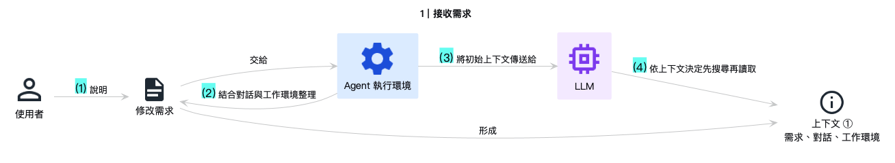

#### 2. 搜尋與讀取

Agent 先搜尋目錄與相關文字，再讀取目標文件、專案規則與引用來源。工具回傳的檔案清單與內容都會成為下一次模型判斷的輸入。

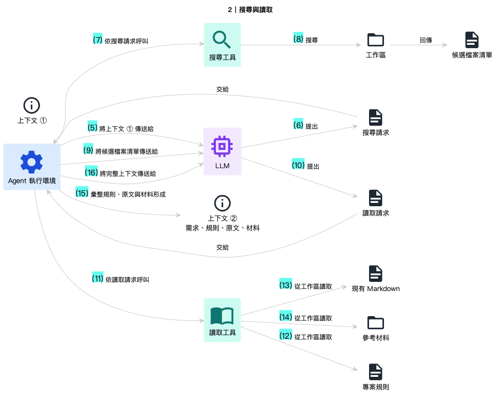

#### 3. 產生並套用 Patch

模型依讀到的內容產生修改內容，再提出套用 Patch 的工具呼叫。真正寫入磁碟的是工具，不是模型。工具執行完成後，回傳成功、失敗或衝突資訊。

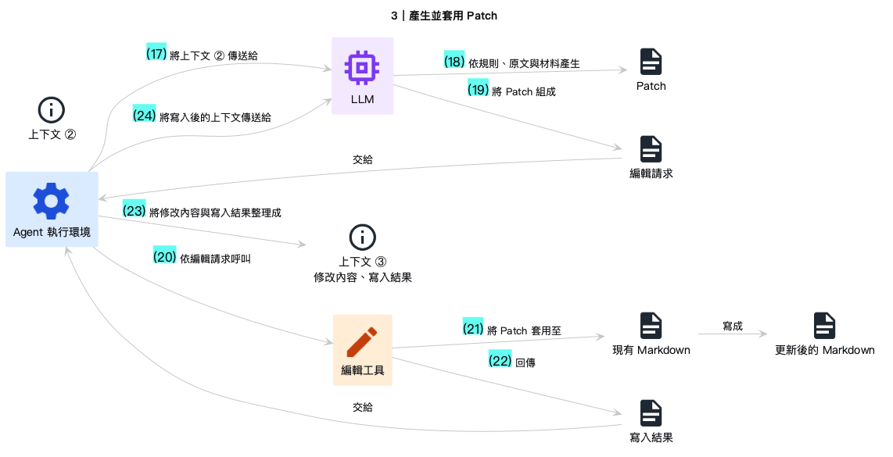

#### 4. 複查與比較

Agent 重新讀取修改後的文件，並查看差異。若發現遺漏、格式問題或非預期變動，便回到前一步修正。這個階段將「工具成功」與「內容正確」分開驗證。

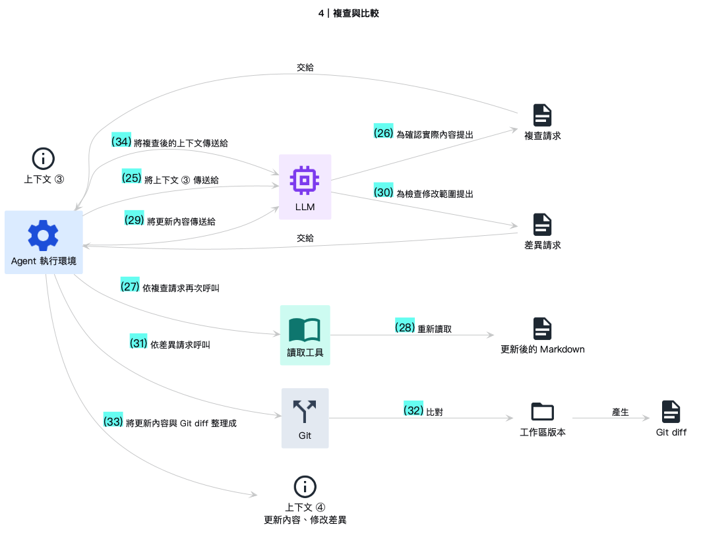

#### 5. 建置驗證與回報

文件若屬於網站或文件專案，還要執行建置或檢查命令。Agent 讀取輸出與錯誤訊息，確認頁面可以產生，再向使用者回報修改範圍、驗證結果與尚待處理的問題。

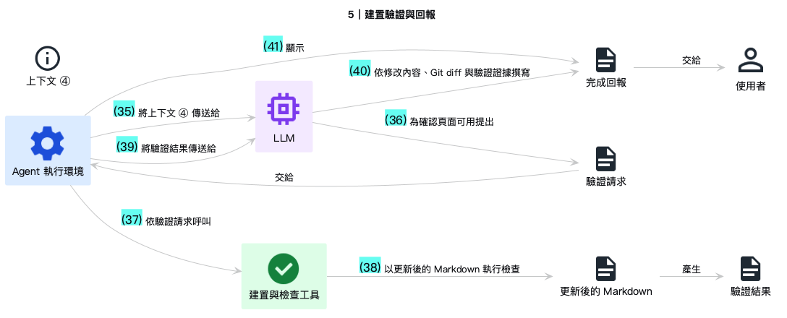

這五個階段解釋了為什麼 Agent 會呼叫許多工具。每次呼叫只完成一個具體操作，例如列出檔案、讀取內容、寫入修改、查看差異或執行建置。模型依每次返回的結果調整下一步，直到成果通過檢查。

## 六種介入方式

同一件研究工作可以讓 Agent 以不同方式參與。以下六種方式依介入流程的深淺排列。前三種由人直接使用工具，後三種由程式在流程中呼叫模型或 Agent。編號只表示說明順序，不代表能力等級。

### 1. 對話

Agent 在正式流程之外提供建議。它不讀寫流程中的檔案，也不替人執行後續工作。這種方式適合定義未明、規則未定，或已經有成品而需要另一個角度檢查的情境。

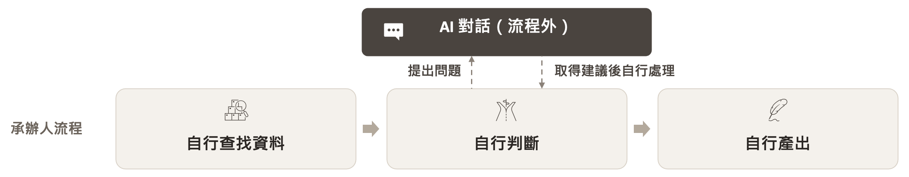

套入本課程的研究流程後：

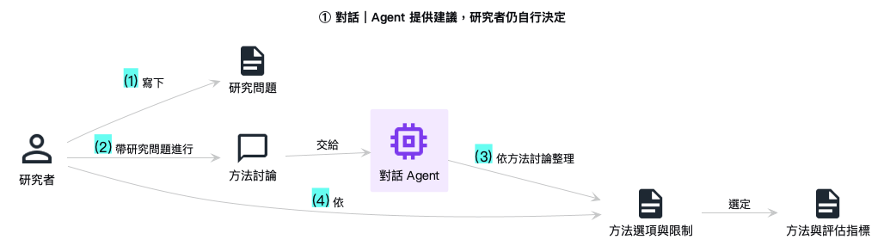

研究者先形成自己的問題，再請 Agent 整理可能的方法與限制。最後採用哪個方法、使用哪些評估指標，仍由研究者決定。這種方式不用建置系統，也不必開放工作環境；代價是產出只有建議，無法直接成為流程中的成果。

### 2. 交辦

人將一項有明確邊界的工作交給 Agent。Agent 查找資料、使用工具並交出可檢查的成果，完成後退出，不留在後續流程。

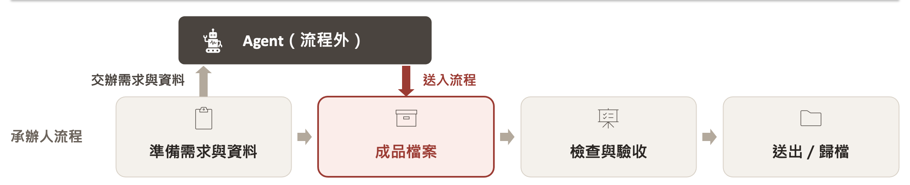

套入本課程的研究流程後：

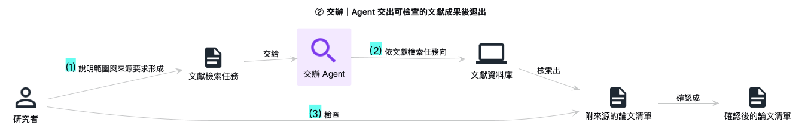

圖中的工作包是文獻檢索。研究者先說明範圍與來源要求，Agent 交出附來源的論文清單，研究者再檢查來源並決定採用內容。這種方式會留下實際檔案，接受或退回的責任線也較清楚；若同一工作要定期重做，仍需再次交辦與檢查。

### 3. 製作工具

Agent 只參與建置階段。人先確認規則、輸入、輸出與測試條件，再請 Agent 建立程式。工具完成後由一般計算環境執行，運行時沒有 Agent。

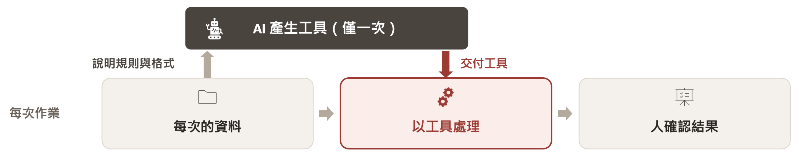

套入本課程的研究流程後：

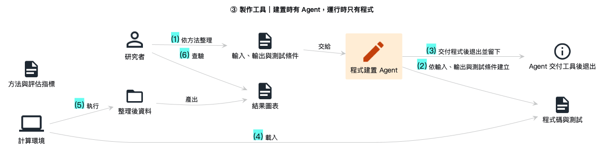

這是 vibe coding 常見的使用方式。相同輸入可以得到相同輸出，程式也可以測試與重複執行。程式沒有報錯不代表研究結果正確，因此仍須查驗輸出，並先確認寫入程式的規則本身成立。

### 4. 結構化判斷

既有程式在固定節點把資料送給模型。答案的格式與範圍由程式預先定義，模型只能回傳某個類別、分數或機率，不選擇工具，也不決定流程下一步。

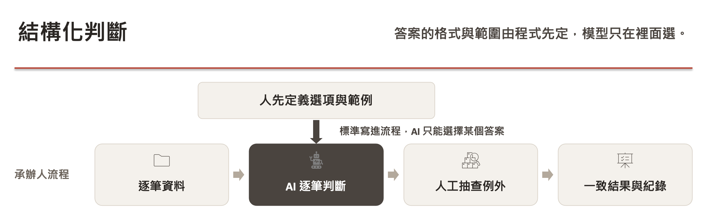

套入本課程的研究流程後：

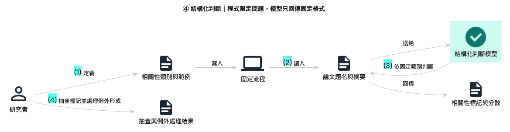

圖中的模型只判斷論文相關性。人先定義類別與範例，程式逐篇送出題名與摘要，模型回傳標記與分數。研究者抽查低信心或分類錯誤的項目。這種方式適合選項已知、規則明確且數量較大的判斷，但只能回答預先定義的問題。

投影片以 TypeSafe AI 的 Jev 作為近期例子。Jev 的官方說明將它定位為供程式使用的結構化決策模型，回傳預先定義的型別與機率，不產生自由文字。產品仍在早期階段，官方公布的速度與成本數字應視為廠商測試結果；型別正確也不代表判斷內容正確。詳見 [TypeSafe AI 的發布說明](https://typesafe.ai/blog/introducing-system-one-models-and-jev)。

### 5. 流程指派 Agent

事件或資料到達時，流程建立一項任務並指派給 Agent。Agent 可以自行選擇工具、處理例外與反覆執行，最後將產物交回流程或交由人驗收。

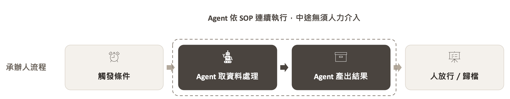

套入本課程的研究流程後：

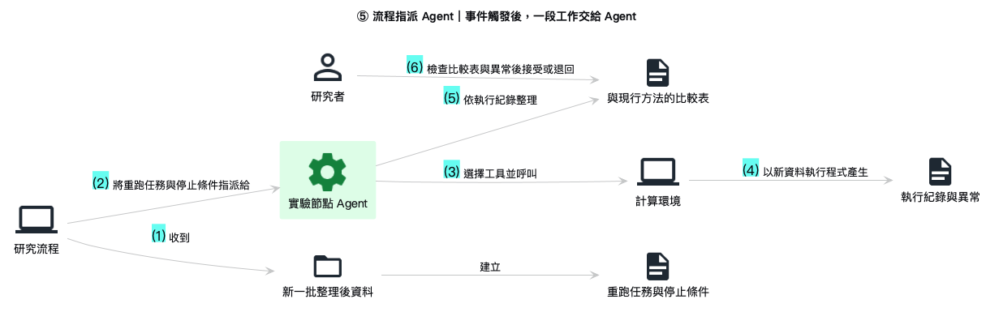

這種方式適合下一步無法完全寫成固定路徑，且需要查詢多個來源或處理例外的工作。它可以在無人守候時執行，但須先限定資料與操作權限、指定停止條件，並保留執行紀錄與可檢查的成果。

投影片另以兩種近期產品說明部署位置的差異：[Grok Bot](https://docs.x.ai/grok-bot/overview) 在雲端電腦執行，[OpenClaw](https://docs.openclaw.ai/) 則在個人電腦執行。兩者都可能取得檔案、瀏覽器或應用程式權限；差異在於執行環境、帳號管理與資料邊界。產品功能變動快速，文章只用它們說明架構，不作為採購建議。

### 6. Agent 管理流程

主 Agent 承接整件工作，建立計畫、呼叫工具或其他 Agent，持續更新進度，並在需要核准的位置暫停。這種方式的範圍跨越多個流程節點。

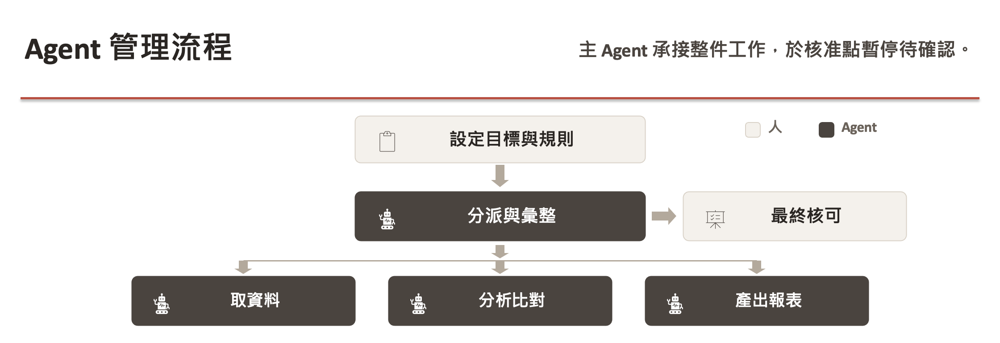

套入本課程的研究流程後：

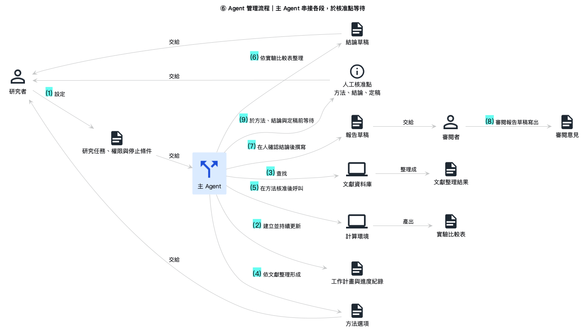

圖中的主 Agent 從文獻整理一路追蹤到報告審閱。研究者仍負責方法選擇、結論確認與最後定稿。這種方式讓整件工作有單一承接者，但錯誤也可能跨系統延伸，因此須先建立權限、操作紀錄、核准點、停止條件與回復方式。

## Agent 在流程中的角色

介入方式決定 Agent 位於流程的哪裡，角色則說明它在該位置承擔什麼工作。機關內原本就有類似分工，可以沿用既有語言說明。

| 工作方向 | 角色 | 主要工作 |
|---|---|---|
| 協助思考 | 討論者 | 提供方向與選項 |
| 協助思考 | 對手 | 提出反例與疑點 |
| 協助思考 | 模擬對象 | 模擬民眾或記者提問 |
| 代為執行 | 整理者 | 查找比對並整理成表 |
| 代為執行 | 起草者 | 撰寫可修改的草稿 |
| 代為執行 | 操作員 | 執行程式與軟體操作 |
| 監督把關 | 規劃者 | 拆解步驟與順序 |
| 監督把關 | 審查者 | 對照標準檢查產出 |
| 監督把關 | 協調者 | 分派工作並追蹤結案 |

同一個 Agent 可以在不同階段更換角色，但每個角色需要的資料、工具與權限不同。整理與審查多半只需要讀取權限，起草需要寫入草稿，操作員才需要執行程式或操作軟體。無論使用哪一種介入方式，方法選擇、結論、對外發送與無法回復的操作都應事先指定由誰核准。

## 取捨與現況

介入越深，Agent 需要的信任、權限、建置成本與操作難度通常越高。現階段較容易取得明確效益的是交辦與製作工具：前者留下可檢查的成果，後者將已確定的規則收斂成可以測試與重複執行的程式。

結構化判斷、流程指派 Agent 與 Agent 管理流程仍在快速演變。試行時宜限縮範圍，保留人工查驗與回復方式，並以已知答案或既有流程作為比較基準。更換工具的理由應來自實際試用後的差異，不必因產品展示而改造整段工作。

公部門使用 AI 時，還須遵循機關適用的資料與資訊安全規範。行政院的[生成式 AI 參考指引](https://www.ey.gov.tw/File/99391880264BBB73)與數位發展部的[公部門人工智慧應用參考手冊](https://www-api.moda.gov.tw/File/Get/moda/zh-tw/WwHCroVhwWy52dw)可作為檢查資料、責任、風險與導入方式的起點。實際工作仍須依最新規定與機關內部要求辦理。

六種方式不必擇一使用。同一件研究工作中，可以用對話整理方法選項、交辦 Agent 查找文獻、請 Agent 建立分析工具，再由固定流程或節點 Agent 處理後續資料。適合的做法取決於該段工作的規則是否明確、成果能否驗收、需要哪些權限，以及最後由誰負責。
