[開啟第四週 4-2 授課投影片](https://1drv.ms/p/c/02708679a802899d/IQCJIiorE-INR4-WN4BPJUiBAQ5Z5WzeRoEvetw0XTo7LMY?e=VZyzOg)。

[上半場](02-agent-and-methods.html)比較了 Agent 介入工作的六種方式。下半場回到自己的業務，不先問「哪裡可以放 AI」，而是先畫出一次實際完成的工作。整堂課分成三段：畫出現況、讀箭頭上的動詞、從現況討論介入。最後的成果不是一張理想流程圖，而是兩個可以比較的版本：人目前怎麼完成工作，以及加入 Agent 後哪些活動改變、留下什麼產物、在哪裡交回人判斷。

## 第一段：用 Domain Storytelling 畫出現況

### 什麼是 Domain Storytelling

Domain Storytelling（領域故事化）由領域專家口述一個具體完成的案例，記錄者當場把內容畫成圖像句子，參與者再逐句確認與修正。它常用來釐清跨部門流程或界定系統邊界；在本課程中，它的用途更直接：先取得一張大家都讀得懂的現況圖，再據以討論 Agent 可以站在哪裡。

一張 Story 圖只有三種元素：

- **演員**：執行活動的人、單位或系統。文獻資料庫與計算環境也算演員。
- **工作物件**：文件、資料、對話或其他在活動之間傳遞的東西。
- **活動**：帶編號的箭頭，箭頭上寫動詞。從 1 號讀到最後，整張圖應能讀成一段敘述。

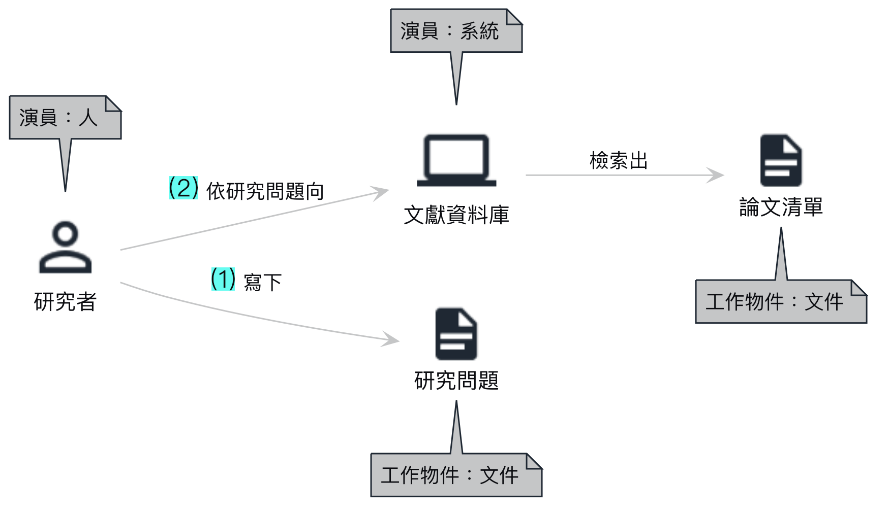

一張圖只描述一個具體案例，不把所有可能分支放在一起。想掌握整件工作時用較粗的顆粒，想討論一段交接或判斷時再把那一段畫細。

### 先把圖寫成活動句

畫圖之前，先把工作寫成一行一句。基本文法是「演員＋動詞＋工作物件」，也可以補上依據、下一個物件或接收者。

| 句型 | 例句 |
|---|---|
| 演員＋動詞＋物件 | 研究者寫下研究問題 |
| 演員＋依據＋動詞＋下一個物件 | 研究者依比較表歸納出結論 |
| 演員＋動詞＋物件＋交給另一位演員 | 研究者撰寫報告，送交審閱者 |

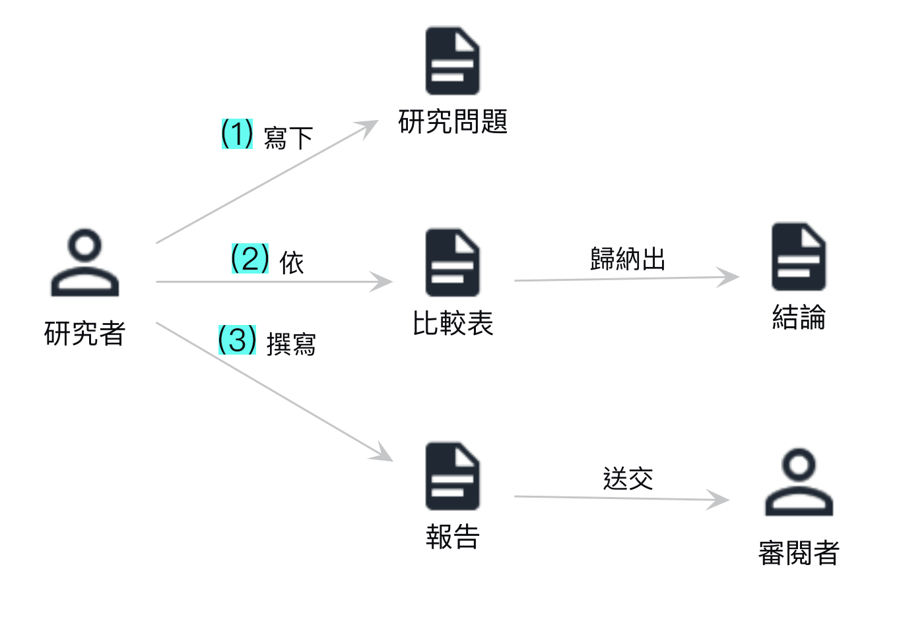

動詞要說明實際做了什麼。「找文獻，得到論文清單」只寫出結果；「研究者依研究問題向文獻資料庫檢索出論文清單」才補回使用的系統、依據與產物。上一句交出的物件應能成為下一句的材料。演員交替的位置就是交接點，也是之後要找完成證據與驗收人的地方。

### 請 Agent 協助畫圖

人先口述一次實際完成的工作，Agent 將內容整理成演員、工作物件與活動句。人逐句修正後，再把句子寫成 PlantUML 文字檔，由工具產生圖片。之後若流程描述要修改，只改文字檔並重新產圖，不必從頭拖拉圖形。

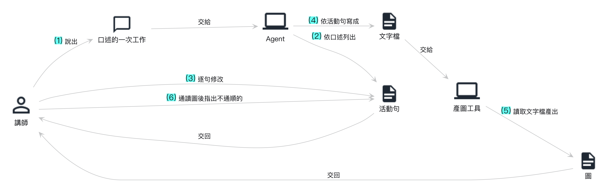

Agent 可以先產生第一版，但領域專家仍要確認每句是否符合實際工作。圖畫得漂亮，不代表流程描述正確。

### 第一版只畫實際現況

第一版不放 Agent，也不畫尚未執行的理想步驟。由人完成的判斷照樣畫出，執行不順或無法接續的地方也照實保留，因為這些位置正是下一階段要找的缺口。

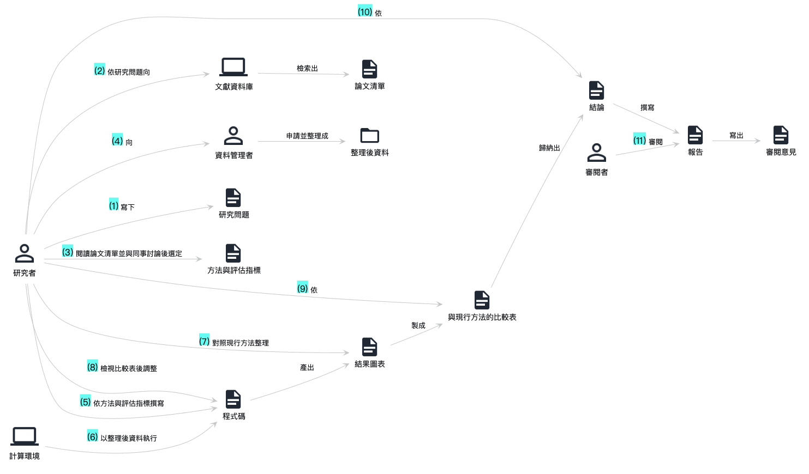

這個研究案例可以讀成十一個活動：

1. 研究者寫下研究問題。
2. 研究者依研究問題向文獻資料庫檢索出論文清單。
3. 研究者閱讀論文並與同事討論，選定方法與評估指標。
4. 研究者向資料管理者申請資料，由資料管理者整理成可用資料。
5. 研究者依方法與評估指標撰寫程式碼。
6. 計算環境以整理後資料執行程式碼，產出結果圖表。
7. 研究者對照現行方法整理結果圖表，製成比較表。
8. 研究者檢視比較表後調整程式碼。
9. 研究者依比較表歸納結論。
10. 研究者依結論撰寫報告。
11. 審閱者審閱報告，寫出審閱意見。

## 第二段：讀箭頭上的動詞

外部案例不拿來模仿產品介面，而是把 Agent 視為圖上的演員，讀它實際執行的活動。要問的是：Agent 讀取什麼、查找什麼、產生什麼、交給誰；人又保留了哪些判斷與處置。

### 員工詢問規定

員工反覆詢問福利條款或資訊規定。Agent 依詢問查找知識庫、擷取相關條文並草擬答覆；無法回答或涉及例外時，它把問題整理成轉交摘要交給承辦人。承辦人維護知識庫、處理例外並抽查答覆。

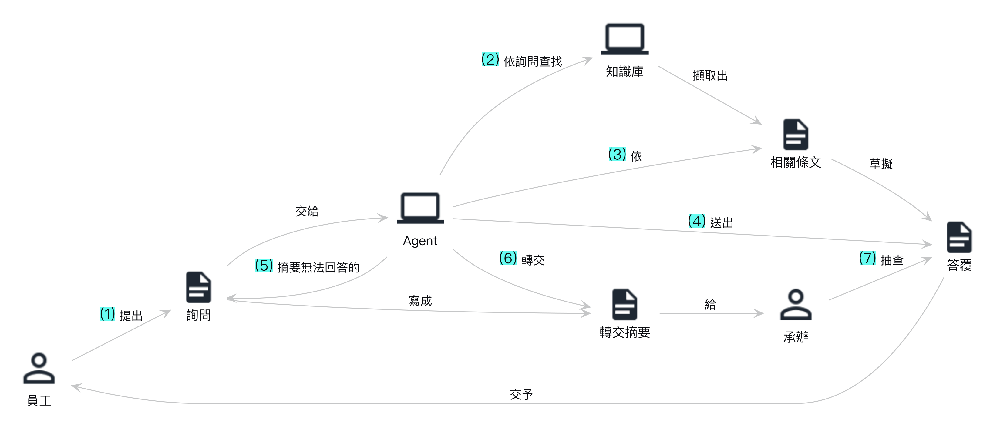

這個案例的工作動詞是「回答、解釋」。公開案例包括 [Newfront 福利助理](https://www.anthropic.com/customers/newfront)與 [ServiceNow 自家 IT 服務台](https://www.servicenow.com/customers/now-on-now-autonomous-it-service-desk.html)。兩者皆為業者自述，用來說明工作機制，不代表一般組織都能取得相同效果。

### 投資研究助理

投資研究所需資料分散在報告、新聞與資料庫。Agent 依分析師提出的問題跨來源檢索，整理矛盾之處，附上來源形成研究底稿。分析師定義問題、檢查證據並決定結論。

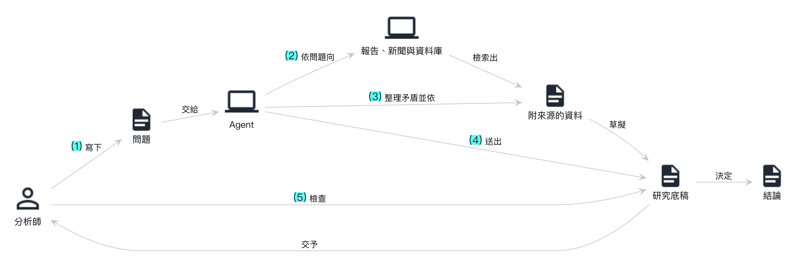

這個案例的工作動詞是「分析、研究」。參考案例包括 [Schroders 的研究助理原型](https://cloud.google.com/blog/topics/customers/how-schroders-built-its-multi-agent-financial-analysis-research-assistant)與 [Balyasny 投資研究系統](https://openai.com/index/balyasny-asset-management/)。

### 資安警報分級

資安中心每天收到大量警報，分析師難以逐件補齊主機、帳號與歷史紀錄。Agent 先彙集相關紀錄，製成事件卡，再提出分級建議與調查方向；分析師確認真正風險、處理重大事件並修正規則。

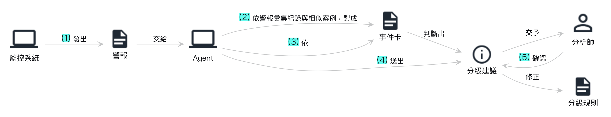

這個案例對應「守視、發現」與「查核、判定」。參考案例包括 [Trellix 資安警報分析](https://www.anthropic.com/customers/trellix)與 [ServiceNow IT 服務台](https://www.servicenow.com/customers/now-on-now-autonomous-it-service-desk.html)。

### 合約資料擷取

財務人員要從大量合約整理付款條件、期限與特殊約定。Agent 讀取 PDF、擷取固定欄位，並比對標準條款，將非標準內容與原文位置列成例外清單。財務人員審核例外並決定處置。

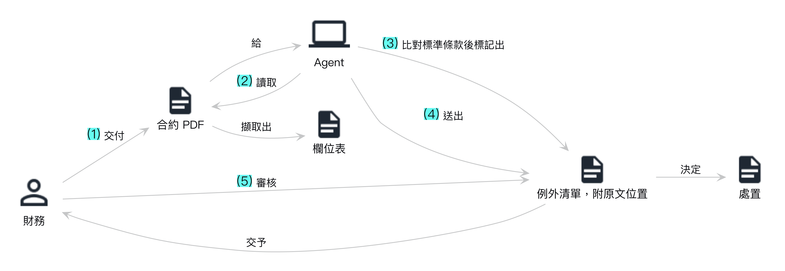

這個案例對應「整理、保存」與「提供資料」。參考案例包括 [OpenAI 內部合約資料 Agent](https://openai.com/index/openai-contract-data-agent/)與 Newfront 的文件處理案例。

四個案例表面上分屬客服、投資、資安與財務，圖上的 Agent 活動卻可以用同一組動作理解：讀取、查找、擷取、比對、計算、草擬、寫程式、執行或寫入、通知或交接、詢問核准、驗證。這些動作比產品名稱更適合拿來和自己的工作比較。

## 第三段：從現況討論介入

### 在圖上找三種活動

先沿著第一版現況圖逐一查看活動，找出三種位置：

- **無法銜接**：上一個物件送到下一個活動後仍無法繼續，常見原因是定義不清、參數未交代或判斷缺乏依據。這裡需要補中間節點。
- **每次相同**：輸入整齊、規則固定且反覆執行。這類工作可能收斂成一般程式，也可能交給 Agent 執行。
- **由人決定**：方法選擇、結論與定稿等活動應保留給人，並明確標為核准點。

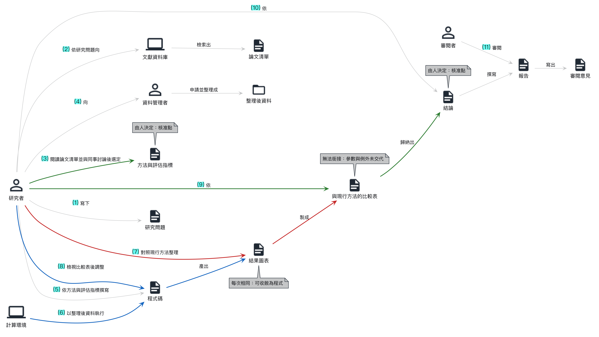

在研究案例中，製作比較表時若參數與例外沒有交代，下一個人便無法重現判斷；執行程式與整理結果經常重複，可以考慮程式化或交給 Agent；選定方法與歸納結論仍由研究者負責。

### 第二版把 Agent 畫成演員

選定候選位置後，讓 Agent 進入 Story 圖。每個候選都要回答三個問題：執行什麼動作、留下什麼產物、人在何處驗收。採用的候選才畫入第二版，第一版仍保留，以便看出介入範圍。

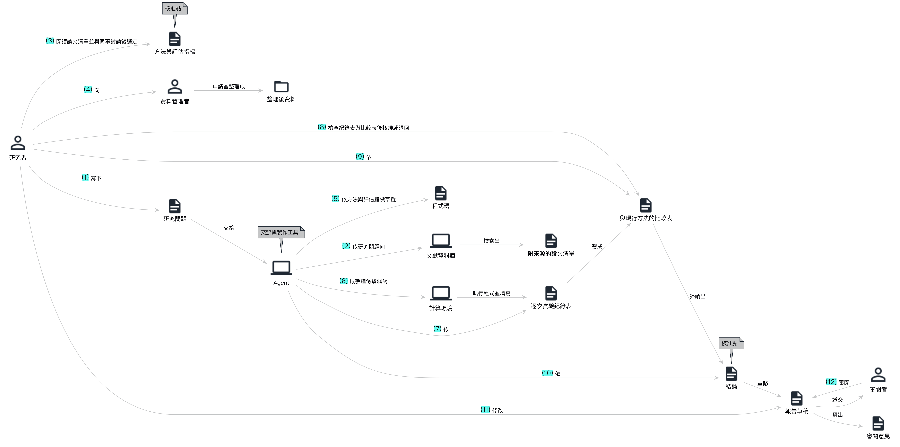

第二版的主要變化如下：

1. 研究者把研究問題交給 Agent，Agent 檢索出附來源的論文清單。
2. 研究者閱讀資料後選定方法與評估指標，這是一個核准點。
3. Agent 依方法草擬程式，在計算環境執行並填寫逐次實驗紀錄表。
4. Agent 依紀錄表製成比較表，研究者檢查後核准或退回。
5. 研究者依比較表歸納結論，Agent 再依結論草擬報告。
6. 研究者修改報告草稿，送交審閱者。

### 從第二版選出一段

討論不必一次涵蓋整件工作。可以從第二版選出起點、終點與交付對象清楚的一段，填寫 A、B、C：A 是起點材料，B 是完成證據，C 是中間留下、可供檢查的產物。

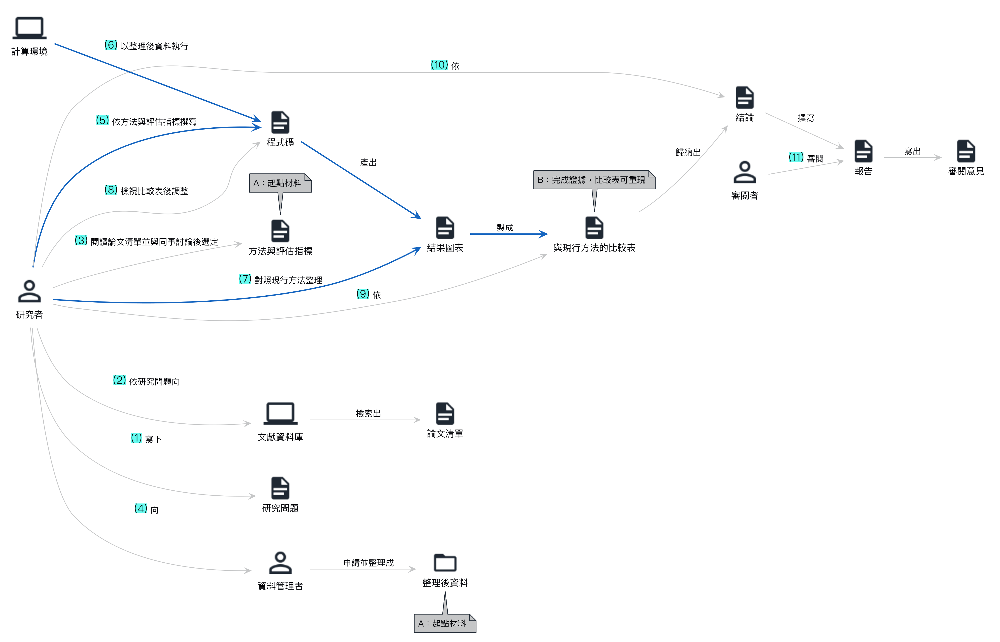

下一頁的[工作坊](04-workshop-find-agent-use.html)會依序完成五件事：選定工作、畫第一版現況圖、討論介入並畫第二版、拆出一段、評估後試作並留下紀錄。
