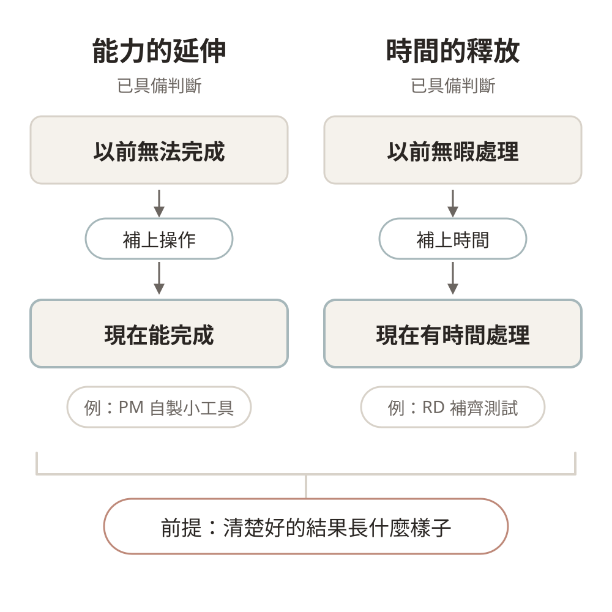
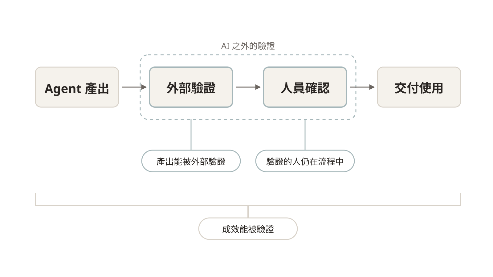
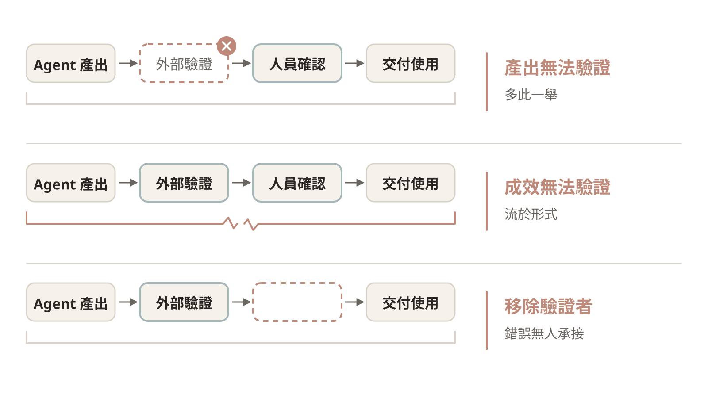
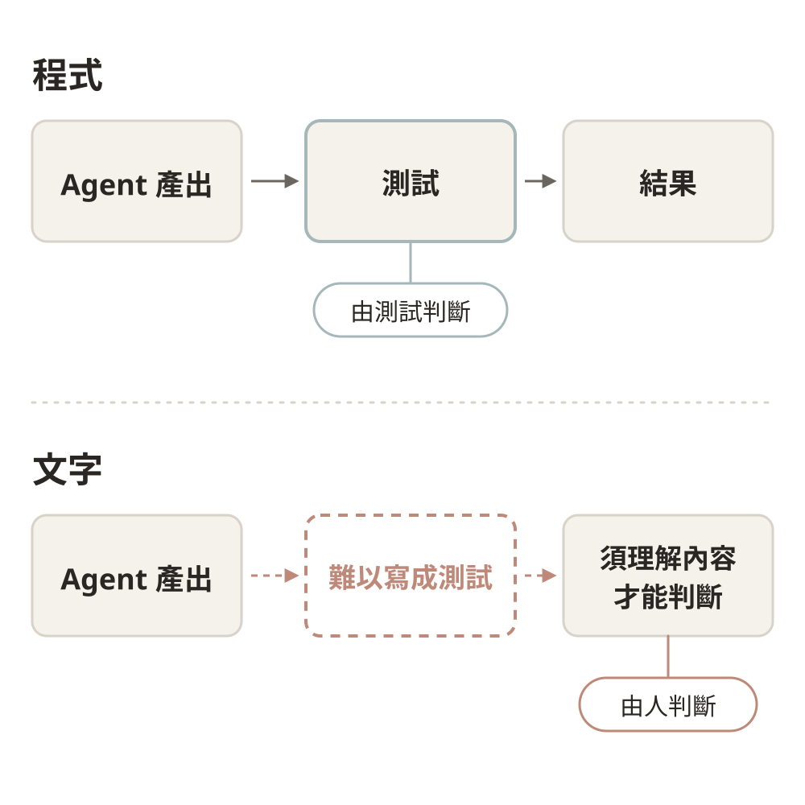
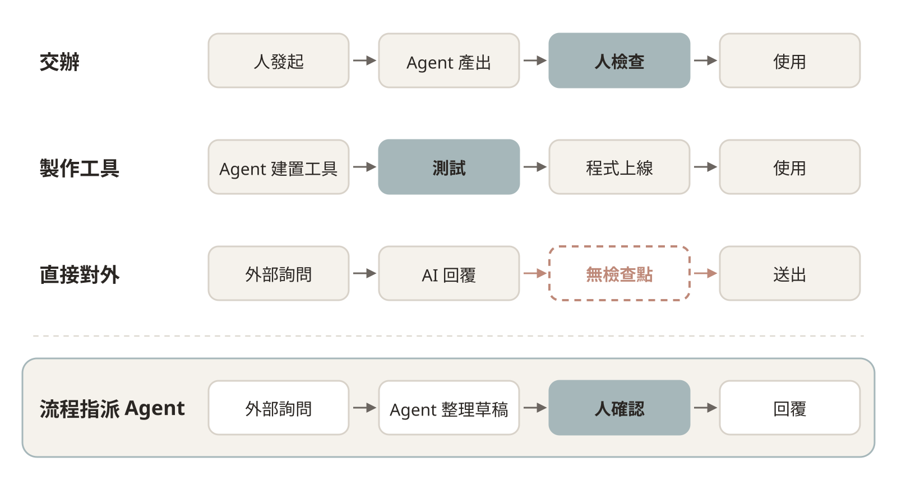
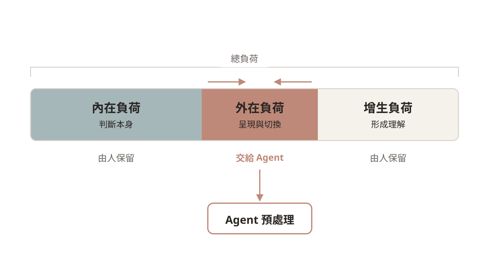
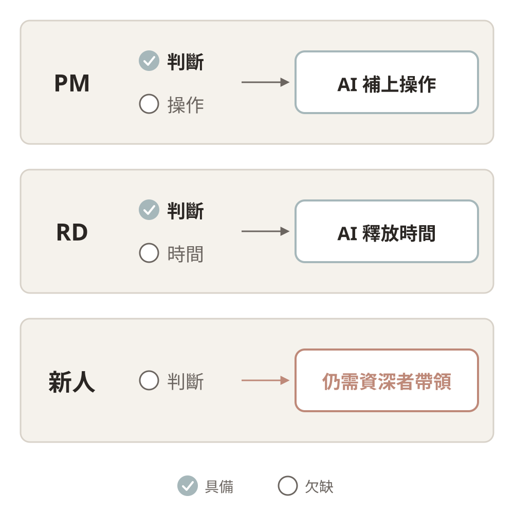
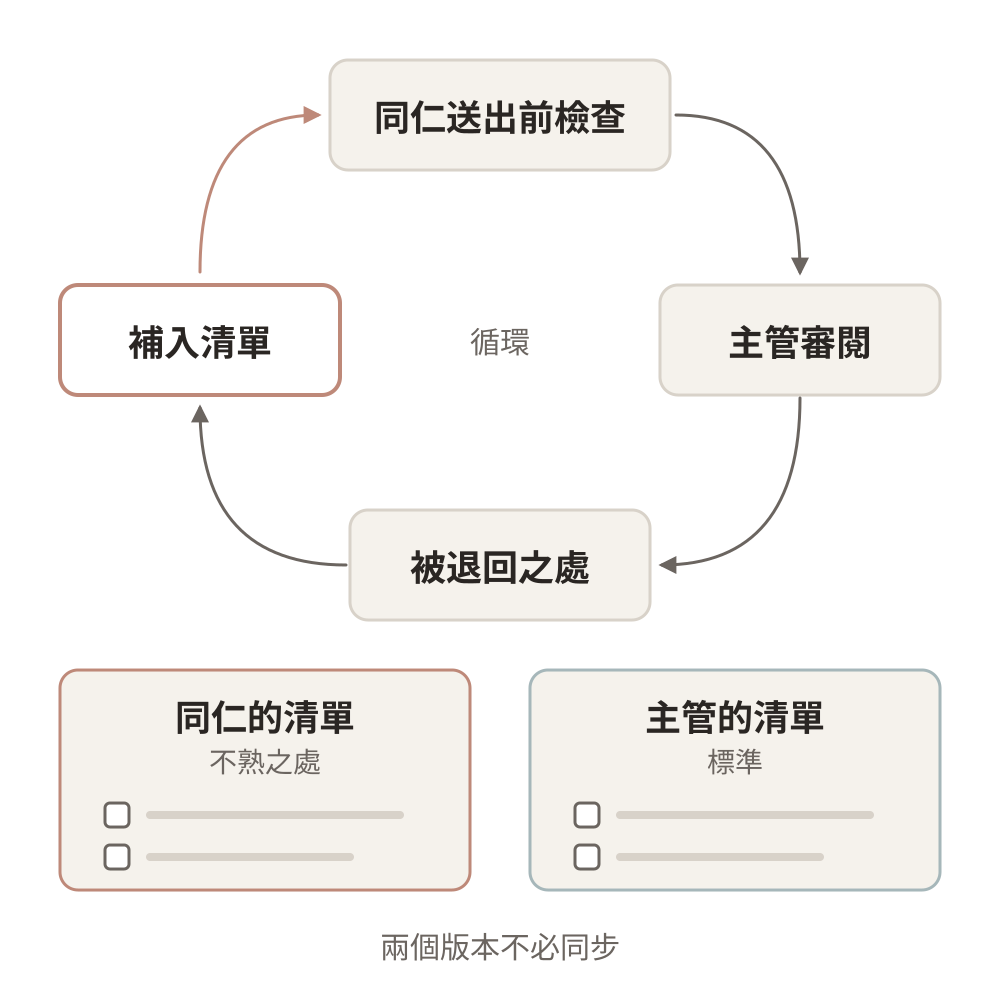

## 上週繪製 Story 圖的緣由

上週以 Domain Storytelling 畫出一件工作的現況，標出誰做什麼、交給誰，以及哪裡需要判斷。本週要說明的，是為什麼在導入 Agent 之前，需要先畫出這張圖。

把 Agent 導入流程，通常也是一個軟體開發的過程。軟體開發會依序經過需求、規格、設計、實作與驗證，如果沒有先釐清需求，即使後面做得再快，解決的也可能不是真正的問題。Agent 確實降低了撰寫規格與程式的成本，但要解決什麼問題、業務原本如何運作，仍然只有熟悉業務的人說得清楚，因此本週先處理最前面的需求階段。

## 導入 AI 的期待

要找出需求，可以先從大家對導入 AI 的期待談起，再對照實際發生的情況。一般的期待大致有兩種：一種是完成以前無法完成的事，另一種是處理以前沒有時間處理的事。

{width=70%}

### 能力的延伸

以前 PM 不會寫程式，許多想法只能等工程師排入開發，現在 PM 可以自己寫出簡單的小工具。這類工具之所以能夠成功，是因為 PM 本來就清楚需求，也知道好的結果應該是什麼樣子，所以工具做出來之後，自己試用就能判斷對不對。

- Anthropic 的法務與行銷人員，以 Claude Code 自行建立工作所需的工具（[How Anthropic teams use Claude Code](https://claude.com/blog/how-anthropic-teams-use-claude-code)，2025）。
- 已有產品經理教過五百多位 PM 以 AI 製作產品雛形（[How to get your entire team prototyping with AI](https://www.lennysnewsletter.com/p/how-to-get-your-entire-team-prototyping)，2025）。
- P&G 的 776 人實驗中，一個人搭配 AI 提出的方案，品質可以追平兩人團隊（[The Cybernetic Teammate](https://www.nber.org/papers/w33641)，2025）。

### 時間的釋放

以前 RD 常因為趕工而沒有時間建置 CI/CD 與撰寫測試，現在終於有時間把這些原本就該做的事補齊。測試本身也是一種檢查機制，所以補上測試之後，之後檢查 Agent 的產出也會更省力。

- Airbnb 約 3,500 個測試檔的遷移，原本估計需要一年半，最後在六週內完成（[Accelerating Large-Scale Test Migration with LLMs](https://airbnb.tech/infrastructure/accelerating-large-scale-test-migration-with-llms/)，2025）。
- DevOpsDays Taipei 2025 中，SmartNews 分享如何以 LLM 補齊測試並提升覆蓋率（[Creating "Awesome Change" in SmartNews](https://speakerdeck.com/martin_lover/devopsdays-taipei-2025-creating-awesome-change-in-smartnews)）。
- Anthropic 的內部研究發現，工程師以 Claude Code 完成的工作中，約有 27% 是原本不會去做的（[How AI is transforming work at Anthropic](https://www.anthropic.com/research/how-ai-is-transforming-work-at-anthropic)，2025）。

### 成功的條件

這些例子能夠成功，關鍵在於結果可以被外部驗證，而不是交由 AI 自己判斷對錯。PM 自己試用小工具，本身就是一次驗證，而 RD 補上的測試，則讓程式有了固定的檢查方式。歸納起來，成功的導入需要三個條件：

1. **產出能被外部驗證**：有測試可以檢查，或由熟悉業務的人自行驗證。
2. **成效能被驗證**：事先知道要解決什麼、怎樣才算成功，才能判斷是否真的有所改善。
3. **驗證的人仍在流程中**：成果經過熟悉業務的人確認之後才使用。

這三個條件與 RAND 對 AI 專案失敗根因的研究、資訊系統失敗的分類，以及各國政府導入框架對可驗證與人工複核的要求，大致一致。

## 未達期待的原因

實際上，多數導入並沒有達到期待，而且原因大多與模型能力無關。OECD 分析兩百個政府案例後發現，多數專案停留在試點階段（[Governing with Artificial Intelligence](https://www.oecd.org/en/publications/governing-with-artificial-intelligence_795de142-en.html)，2025）。若以上述三個條件來對照，可以發現每個失敗案例都破壞了其中一項。

### 產出無法驗證而多此一舉

太想導入 AI 的結果，是連不適合的工作也交給 AI，最後檢查所花的力氣比原本自己做還多，變成多此一舉。文字類的產出尤其如此，因為它很難用測試檢查，錯誤往往要等到被引用或被投訴之後才會發現，而這些錯誤的責任仍然由組織承擔。

- Deloitte 為澳洲政府撰寫的報告，被發現引用了不存在的文獻，最後退還部分費用（[OECD.AI 事件紀錄](https://oecd.ai/en/incidents/2025-10-05-be45)，2025）。
- 紐約市的聊天機器人曾建議店家做出違法的行為，市府加上免責聲明後讓它繼續運作，直到兩年後由新任市長決定關閉（[The Markup](https://themarkup.org/artificial-intelligence/2026/01/30/mamdani-to-kill-the-nyc-ai-chatbot-we-caught-telling-businesses-to-break-the-law)，2026）。

### 成效無法驗證而流於形式

沒有規劃就直接導入，通常是先有了工具才開始尋找用途。由於事先沒有定義怎樣才算成功，試辦的效果無從判斷，也就無法決定要擴大還是停止，最後只停留在展示，流於形式。另一種情況是省下的時間沒有事先說定用途，於是被更多的工作吸收，工作反而變得更密集，改善也沒有人看得見。

- 英國政府推出多項 AI 試辦工具，數個月後陸續關閉（[Global Government Forum](https://www.globalgovernmentforum.com/uk-closes-ai-pilots-amid-strategic-changes-to-prioritise-legacy-tech-overhaul/)，2025）。美國聯邦機關登記的生成式 AI 用例大幅增加，但多數仍停留在試辦（[The Register](https://www.theregister.com/2025/07/29/us_government_identified_ai_use/)，2025）。
- 一項針對科技公司的追蹤研究發現，AI 並沒有減少工作，反而讓員工同時處理更多工作、反覆檢查 AI 的產出，使工作變得更密集（[AI Doesn't Reduce Work—It Intensifies It](https://hbr.org/2026/02/ai-doesnt-reduce-work-it-intensifies-it)，2026）。

### 移除驗證者導致錯誤無人承接

以完全取代人力為目標，會把流程中負責判斷與確認的人一併移除，出錯時便沒有人能夠承接，最後往往只能重新補回人力。這個問題與利益歸誰無關：即使省下的利益全部歸承辦人所有，承辦人若因此希望把工作完全交給 AI、自己不再經手，同樣的問題仍會浮現。

- 世新大學自 2026 年起將各系秘書縮減為一人，行政詢問改由 AI 回覆。學生詢問選課與抵免規定時，機器人反覆回覆查無此題，需要個案判斷的事項也無人受理（[自由時報](https://news.ltn.com.tw/news/life/breakingnews/5582285)、[CTWANT](https://www.ctwant.com/article/499621/)）。校方說明，業務是依性質回歸教務、學務等專責單位，AI 只處理常見問題，調動的人員也沒有解聘。從事件的經過來看，問題在於人力先調整了，資料與個案的承接卻還沒有準備好。
- Klarna 以 AI 取代約 700 名客服人力之後，執行長承認調整過度，重新聘用客服人員（2025）。
- 澳洲 Robodebt 以演算法自動認定社福溢領並移除人工複核，造成大規模誤判，政府最後以和解賠償收場（[The flawed algorithm at the heart of Robodebt](https://pursuit.unimelb.edu.au/articles/the-flawed-algorithm-at-the-heart-of-robodebt)）。

完全取代的方向雖然是錯的，但取代確實正在發生，只是方式與過去一個人換一台機器不同。現在是執行的部分交給 AI，需要判斷的工作則集中到較少的人身上，因此組織仍然可能縮編。當確認的人負荷過重，往往只能照單核准，實際上等於被移除。受影響最大的則是新進人員，職缺減少的同時，練習判斷的機會也跟著減少（[Stanford Digital Economy Lab](https://digitaleconomy.stanford.edu/news/canariesaug26/)，2026）。

### 上下層目標不一致

這些情況之所以一再發生，是因為上層與承辦人想要的東西並不一致。上層期待提升效率、節省人力，因此容易走向移除人員，而承辦人則擔心被加派工作或被取代，於是選擇隱藏自己的使用方式，試點自然推不下去。此外，若沒有事先與利害關係人充分說明，也可能讓導入受阻。司法院研發生成式 AI 產生判決書草稿時，技術已有雛形，卻因為說明與溝通不足而暫緩試辦（[未來城市](https://futurecity.cw.com.tw/article/3272)，2023）。

綜合來看，這些導入之所以失敗，並不是因為 AI 的能力不足，而是破壞了成功所需要的條件。

## 導入應達到的標準

前面歸納的三個條件，也就是導入應達到的標準：成效能被驗證、產出能被外部驗證，以及驗證的人仍在流程中。

### 做好工作以減少返工

導入 AI 最大的誘因，是把事情做好、減少返工，而不是單純把事情做快。如果只追求速度，返工的負擔往往會轉嫁給別人。一項調查指出，收到同事以 AI 產出的文件後，收件者平均每次要花將近兩小時處理（[AI-Generated "Workslop" Is Destroying Productivity](https://hbr.org/2025/09/ai-generated-workslop-is-destroying-productivity)，2025）。唯有減少返工的次數，事情才會真正往前推進，也才會產生價值。

把事情做好，最先受益的是做事的人自己，因此他們會自發地使用。RD 補上測試之後，就不必一再處理同樣的錯誤，這正是他們願意投入的原因。相反地，如果改以考核指標來推動，大家便會朝指標調整做法，反而偏離原本要達成的目的。心理學的後設分析也顯示，預期中的獎勵會削弱內在動機，而讓對方知道自己哪裡做得好的回饋，則能提升內在動機（Deci、Koestner 與 Ryan，1999）。

以減少返工為目標，看的就是品質，也就是有沒有把問題想得更全面。不過品質只要達到標準即可，不必追求完美。過去常常是缺東缺西、來回修改好幾次才能通過，現在則可以在送出之前先讓 Agent 看過可能的問題，也可以把過去收到的修改意見整理成檢查清單，讓每次送出前的檢查更完整。本課程的語氣規則就是這樣累積出來的，每一次被修正的語句都記錄下來，之後先由 Agent 依照這些紀錄檢查。新加坡政府也採取類似的做法，把公文的格式與品質標準直接寫進會議紀錄工具，使一份紀錄的整理時間由四到六小時縮短為一小時以內（[GovTech Pair](https://www.tech.gov.sg/products-and-services/for-government-agencies/productivity-and-marketing/pair/)）。

### 保留外部檢查與人員確認

要把工作做好，需要有不依賴 AI 自行判斷的檢查方式，也需要在流程中保留人員確認的位置。

前面提到的成功案例多半來自寫程式，這與程式碼的特性有關。程式可以用測試來驗證，而不是由 LLM 自己球員兼裁判。即使 Agent 可能改動測試，只要做好隔離與權限限制，就能避免這個問題。文字則不同，文獻是否存在、文件內容是否正確，很難寫成固定的測試來檢查，否則也不需要用 LLM 處理這麼複雜的文字理解，最後仍須由人理解內容之後才能判斷。因此，寫程式的成功經驗不能直接套用到文書工作上，能否找到不依賴 AI 自行判斷的檢查方式，才是選擇導入方向的關鍵。

{width=70%}

前述的失敗案例還有一個共同點，就是由 LLM 在執行時直接產出文字並對外送出，中間沒有機會先經過檢查。程式則是在測試與檢查之後才上線，上線後的行為也不會改變，兩者在本質上並不相同。這一點可以對照[第四週](02-agent-and-methods.qmd)介紹的六種介入方式：

- **交辦**：Agent 完成的成品，由人檢查之後才使用。
- **製作工具**：AI 只在建置階段參與，上線後執行的是經過測試的程式。
- **流程指派 Agent**：由外部事件觸發，Agent 先處理大部分的情況，處理到指定的節點便停下，等待人員確認後才送出，性質類似預處理。
- **直接對外的聊天機器人**：模型在流程中執行，中間沒有人員或規則把關，也就是前述失敗案例的做法。

以世新大學的情況為例，學生的詢問屬於外部事件。如果先由 Agent 整理回覆草稿並查好相關規定，停在節點由秘書確認之後再回覆，原本直接對外的做法，就能改為流程指派 Agent 加上人員確認。

外部驗證也有它的限度。數學是最容易驗證的領域之一，因為證明可以用形式化工具檢查，也正因為如此，AI 已協助解決約百題 Erdős 問題。然而數學家指出，找到答案並不等於推進了人類對數學的理解，因為人寫出的證明往往更簡潔、更具一般性，也更容易讓其他人讀懂（[Why the Legendary Erdős Problems Are Falling to AI](https://www.quantamagazine.org/why-the-legendary-erdos-problems-are-falling-to-ai-20260803/)，2026）。工作也是同樣的道理，通過檢查只代表結果正確，並不代表人已經理解了問題，也不代表工作真正有所推進。

驗證的人不只要留在流程中，也要負荷得了。需要做的決定一多，就容易產生決策疲勞，這可以從認知負荷的三個類別來思考如何分工：

- **內在負荷**：判斷本身的難度，這正是人要負責的部分，應由人保留。
- **外在負荷**：冗長的產出、在多個工具之間切換所造成的負擔，可以交給 Agent 預先整理成摘要、疑點與差異。能交給測試、規則或已知答案處理的部分，就不必依靠人來判斷。
- **增生負荷**：逐一分析、寫下判斷理由的投入，是形成理解的過程，也應由人保留。把退件理由寫成規則，下次遇到同樣的情況，就不必再重新判斷一次。

### 初期變慢而成果更完整

認真用 AI 把事情做好時，初期反而會變慢。一方面是需要時間熟悉新的工具，另一方面是以前沒有考慮到的觀點會一一浮現，需要逐一分析、消化，並累積成自己的判斷。這些時間從執行移到了分析與判斷，換來的是後續較少的返工與更完整的成果，而熟悉之後，速度也會跟著提升。因此在導入之前，就應該先說清楚：評估效果要看返工的次數與成果的完整度，而不是只看速度。

## 因人而異的需求

推動 Agent 時，如果所有人都套用同一套標準，不但可能不合適，還可能造成更多麻煩與反彈。Duolingo 宣布「AI 優先」的政策之後，便引發使用者與員工的反彈（[TechCrunch](https://techcrunch.com/2025/08/07/the-backlash-against-duolingo-going-ai-first-didnt-even-matter/)，2025），而以使用率要求員工的企業，也常出現員工繞過指定工具的情形。多數人本來就不會是最早採用新工具的一群，因此不必急著讓每個人同時開始。

### 起點不同

持續使用 AI 的人，通常是已經找到了合適的任務，也累積了使用經驗，而還沒有使用的人，原因則各不相同。有些人是受限於環境與時間，沒有權限，也沒有學習的時間。有些人是因為過去的經驗，曾經把 AI 用在不適合的任務上而放棄，或是不清楚 AI 和自己的工作有什麼關聯。也有些人是基於態度與處境，原則上不信任 AI，或是已經在使用卻不願意公開。另外也有一部分人的判斷是正確的，他們的工作確實不適合使用 AI，也就不必勉強。

在美國，未使用 AI 的工作者中有 45% 認為自己的工作幾乎用不到（[Pew Research Center](https://www.pewresearch.org/short-reads/2025/10/06/about-1-in-5-us-workers-now-use-ai-in-their-job-up-since-last-year/)，2025），另一項全球調查則發現，57% 的員工隱藏自己使用 AI 的情況（[KPMG 與墨爾本大學](https://kpmg.com/xx/en/our-insights/ai-and-technology/trust-attitudes-and-use-of-ai.html)，2025）。這些人需要的協助並不相同，有人需要合適的例子，有人需要被允許公開使用，而原則上不信任 AI 的資深同仁，反而適合擔任檢查的角色。

### 受益不同

能從 AI 得到什麼，取決於一個人是否已經具備判斷能力。PM 清楚需求，AI 補上的是操作，RD 已經具備判斷，AI 釋放的是時間。新人的情況則不同，他們跟 PM 的差別在於還沒有累積出判斷，看不出結果的對錯，所以仍然需要資深同仁帶領，而資深同仁則可以利用多出來的時間，補齊原本應該做的事。

{width=60%}

此外，英國政府的 Copilot 評估發現，有 ADHD、讀寫障礙以及英語非母語的同仁，受益最為明顯。

### 風險不同

每個人面對的風險也不一樣。新人可能因此失去練習的機會，日後難以建立自己的判斷。資深同仁可能淪為只負責核准的驗證者，負荷過重。已經私下使用的人，則可能在公開之後被加派更多工作。因此，推動的方式應該因人而異，而不是要求所有人達到相同的使用程度。

## 主管可採取的作為

要讓導入真正產生成效，前面提到的許多問題都需要由主管處理。Gallup 的調查顯示，團隊投入程度的差異約有七成取決於主管，DORA 的研究也指出，AI 是一個放大器，組織原有的體質決定了它放大的是優點還是缺點（[DORA 2025](https://dora.dev/dora-report-2025/)）。主管可以從以下三個方面著手。

### 建立使用環境

開始使用前遇到的阻礙，本身就是分析導入方向時需要考慮的條件。常見的情況是規則只說明不能做什麼，卻沒有說明可以怎麼做，於是大家只好私下使用、不敢公開，再加上機關不提供帳號，電腦無法安裝軟體，對外連線也受到限制。

新加坡、英國與美國的做法，都是由政府提供合規的帳號與環境，而不是要求個人自行解決。台灣其實也已經有行政院的[生成式 AI 參考指引](https://www.ey.gov.tw/Page/448DE008087A1971/40c1a925-121d-4b6b-8f40-7e9e1a5401f2)、數發部的[公部門人工智慧應用參考手冊](https://moda.gov.tw/digital-affairs/digital-service/ai-resource/18248)、[政府 AI 應用平臺 TryAI](https://moda.gov.tw/press/press-releases/17952)以及評測制度，只是這些資源尚未落實到各機關的日常工作中。主管可以直接申請或引用，不必從零開始。

### 建立使用與分享的誘因

如果使用 AI 或分享使用經驗只會換來更多工作，同仁就不會主動去做。因此，省下來的時間要歸誰運用，應該在導入之前先說清楚，例如用來把原本的工作做得更完整，否則這些時間很容易被新增的工作吸收，員工也會因此選擇隱藏使用。同樣的道理，也不宜以使用率作為考核指標，因為指標一旦與考核連結，就會被刻意迎合。

分享使用經驗雖然有助於知識傳承，但公部門常見的情況是，一旦被發現會某項技能，就會被分派更多工作，於是大家傾向多一事不如少一事。分享應該是一種自發的行為，好用的方法自然會被推薦給其他人，組織不宜監督或干涉，主管要做的，是避免讓分享的人因此承擔更多工作。

### 確保驗證可行

主管可以把自己過去的審閱意見整理成檢查清單，讓同仁在送出前先自行檢查一遍，這樣不但能減少來回修改的次數，也可能加快新人的訓練。同仁照著清單檢查後仍被退回的地方，可以再補進清單，因此會逐漸形成兩個版本：一個記錄同仁自己較不熟悉的部分，另一個則是主管發現自己清單還不夠完整的部分，兩者不需要強制同步。

{width=60%}

除此之外，主管也應該保留確認的人與位置，不以完全取代人力為目標，而當判斷工作集中到少數人身上時，更要留意確認者的負荷。

至於如何評估成效，目前還沒有公認的標準，但「不應只看速度與使用率」已有相當的共識。評估時可以先看返工與品質，DORA 已將返工率列為核心指標，接著再評估組織本身的條件，例如規定是否清楚、資料品質是否足夠、審核流程能否跟上。起步階段可以先蒐集返工紀錄並訪談同仁，遇到無法測量的部分就如實說明。OECD 也指出，影響評估是各國政府 AI 治理中發展最落後的一環（[Digital Government Outlook 2026](https://www.oecd.org/en/publications/digital-government-outlook_0496b2bc-en/)）。

## 工作坊：找出要解決的問題

工作坊以討論為主，不需要填寫學習單。學員各自選擇一件自己的工作，由講師逐一與學員交談，一起確認要解決的問題，並判斷合適的導入方向。

交談時，講師會先了解對方屬於哪一種情況，再依序詢問現況、遇到的問題、造成的影響，以及解決之後能帶來的價值。如果對方一開始就提出解法，例如「需要一個能自動回覆的系統」，講師會進一步詢問有了這個系統之後哪些事情會不一樣，以及目前沒有這個系統時是怎麼處理的，藉此把討論拉回問題本身。

以下問題是交談時的參考，不必逐題回答。

### 個人的問題

1. **問題**：要解決的是哪一件實際發生的事？屬於以前做不到，還是以前沒時間做？
2. **現況**：目前是怎麼處理的？多常需要返工？過去的修改意見是否有保留下來？
3. **替代做法**：是否有比 AI 更合適的做法，例如調整流程或撰寫一般程式？
4. **檢查**：是否有不依賴 AI 自行判斷的檢查方式？由誰負責檢查？相關資料能否放進 AI 處理？
5. **成功與停止**：怎樣才算成功？什麼時候應該停止？省下的時間要用在哪裡？這些都由做事的人自己判斷。

### 組織的問題

1. **範圍**：單位裡哪些工作重複最多，哪些交接最常出問題？
2. **影響對象**：這件事會影響哪些人？需要先和誰說明清楚？
3. **條件**：需要哪些帳號、環境、資料整理與規定？哪些可以自行處理，哪些需要向上申請？
4. **驗證與責任**：確認的節點在哪裡，由誰負責？產出是否會直接對外？做錯時能否還原？
5. **誘因**：省下的時間歸誰運用？是否會造成能者多勞？
6. **成效與停止**：要如何評估成效？試行多久？什麼情況下應該停止或退場？
7. **規模與形式**：由同仁自行試做、以內部計畫推動，還是對外招標？需求、定義與驗收標準由誰負責說明？完成之後由誰維護？

主管也可以另外想一想：**最常退回同仁的三個原因是什麼？**這些原因與背後的理由，就是檢查清單的起點。

### 下週延伸

講師會收集每個人想要解決的問題，下週再以這些真實的情境重新繪製 Story 圖，從中選出適合交給 Agent 的一段。如果是需要正式專案的方向，例如舊資料庫的整理，則從圖上選出一段補成規格，再進入實作與驗證。
