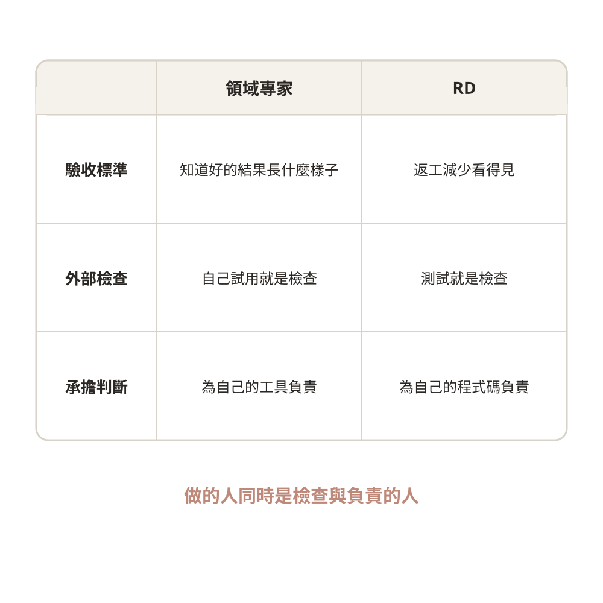
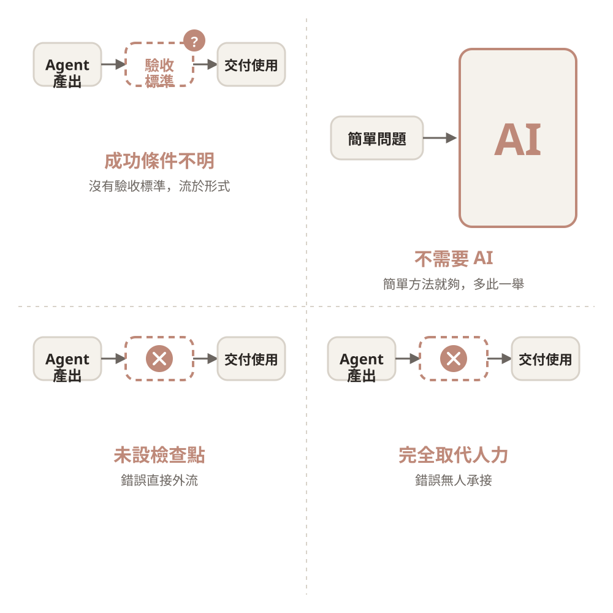
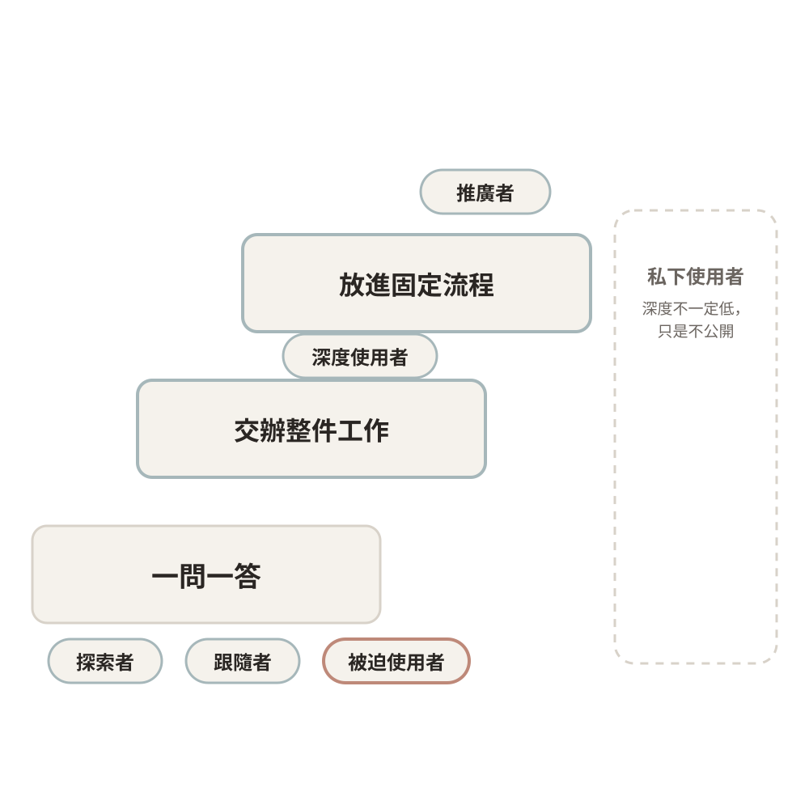
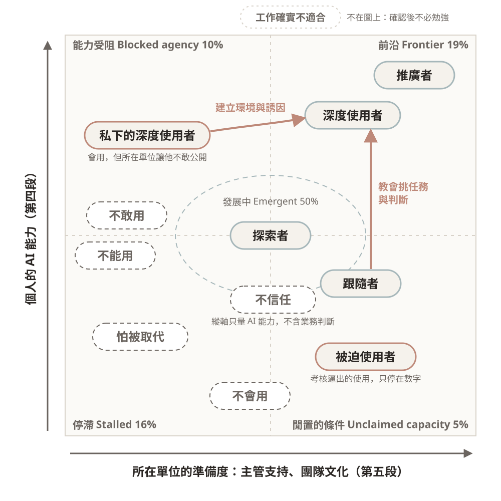
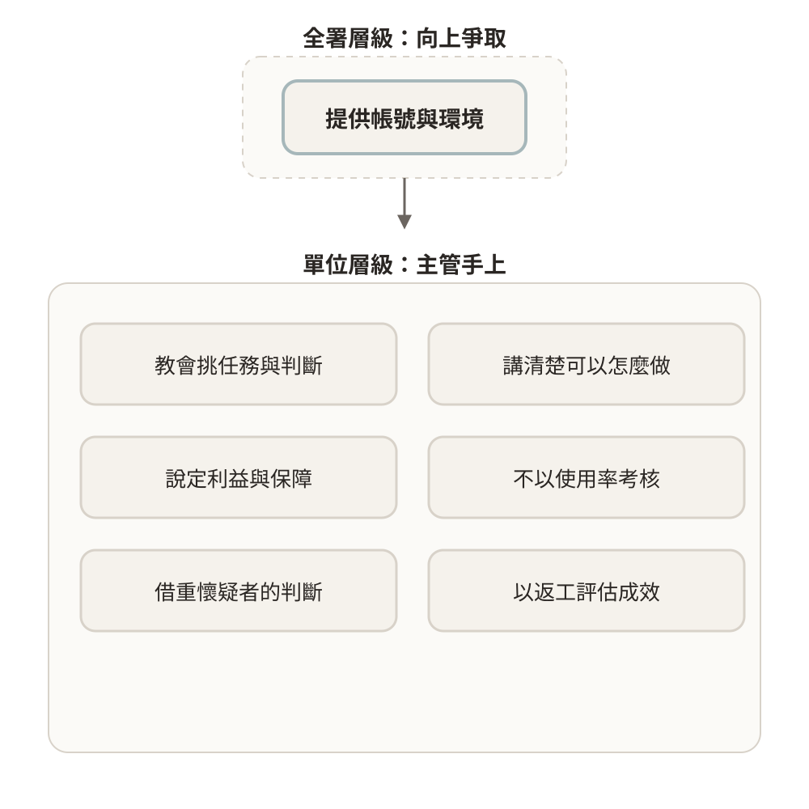

## 上週繪製 Story 圖的緣由

上週以 Domain Storytelling 畫出一件工作的現況，標出誰做什麼、交給誰，以及哪裡需要判斷。本週要說明的，是為什麼在導入 Agent 之前，需要先畫出這張圖。

把 Agent 導入流程，通常也是一個軟體開發的過程。軟體開發會依序經過需求、規格、設計、實作與驗證，如果沒有先釐清需求，即使後面做得再快，解決的也可能不是真正的問題。Agent 確實降低了撰寫規格與程式的成本，但要解決什麼問題、業務原本如何運作，仍然只有熟悉業務的人說得清楚，因此本週先處理最前面的需求階段。

## 成功案例與推廣

現在外面有很多成功的案例，也有很多人用 Agent 做出很酷的事。身邊用的人用得很兇，同溫層之外卻好像沒什麼動靜，難免讓人產生一些焦慮。上層甚至政府也都希望多多推廣 AI，讓大家都來嘗試，例如數位發展部推出的[政府 AI 應用平臺 TryAI](https://moda.gov.tw/press/press-releases/17952)。推廣的方向沒有錯，但在真正導入各個地方之前，需要先做評估。

### 兩種賦能

細看這些成功案例，成功的其實是兩種賦能：一種是讓人完成以前無法完成的事，另一種是讓人有時間處理以前無暇處理的事。

{width=70%}

以前不會寫程式的領域專家，許多想法只能等工程師排入開發，現在可以自己做出簡單的小工具，這類人也被稱為公民開發者。Anthropic 的法務與行銷人員就以 Claude Code 自行建立工作所需的工具（[How Anthropic teams use Claude Code](https://claude.com/blog/how-anthropic-teams-use-claude-code)，2025），也有產品經理教過五百多位 PM 以 AI 製作產品雛形（[How to get your entire team prototyping with AI](https://www.lennysnewsletter.com/p/how-to-get-your-entire-team-prototyping)，2025）。

另一方面，以前 RD 常因為趕工而沒有時間建置 CI/CD 與撰寫測試，現在終於有時間把這些原本就該做的事補齊。Airbnb 約 3,500 個測試檔的遷移，原本估計需要一年半，最後在六週內完成（[Accelerating Large-Scale Test Migration with LLMs](https://airbnb.tech/infrastructure/accelerating-large-scale-test-migration-with-llms/)，2025），SmartNews 也在 DevOpsDays Taipei 2025 分享如何以 LLM 補齊測試並提升覆蓋率（[Creating "Awesome Change" in SmartNews](https://speakerdeck.com/martin_lover/devopsdays-taipei-2025-creating-awesome-change-in-smartnews)）。

### 成功的三個條件

這些例子能夠成功，關鍵不在 AI 多強，而在結果不由 AI 自己判斷對錯，也就是要有標準、有檢查、有人負責。歸納起來，成功的導入需要三個條件：

1. **成效有明確的驗收標準**：事先說清楚要解決什麼、怎樣才算成功，衡量的是實際成效，而不是速度或使用量。
2. **產出在交付前經過外部檢查**：外部指的是不靠模型自己判斷，可以是測試、搜尋比對、規則，或由人實際試用。
3. **判斷與責任仍由熟悉業務的人承擔**：例外與個案有人處理，出錯有人負責，而且負荷得了。

前面兩個成功案例都符合這三個條件，這也說明了它們成功的原因：做的人同時就是檢查與負責的人。領域專家知道好的結果長什麼樣子，自己試用就是一次檢查，RD 補上的測試則讓程式有了固定的檢查方式，兩者也都為自己的成果負責。

{width=70%}

## 工作層面的失敗

實際推動時，多數導入並沒有達到預期，而且原因大多與模型能力無關。OECD 分析兩百個政府案例後發現，多數專案停留在試點階段（[Governing with Artificial Intelligence](https://www.oecd.org/en/publications/governing-with-artificial-intelligence_795de142-en.html)，2025）。推廣若沒有配上評估，也容易走向其中幾種失敗，例如以節省人力為目標，就走向完全取代，以推廣的進度為目標，就拿使用量當作成效。

失敗可以分成兩個層面。這一段先談一件工作怎麼沒做成，組織的文化與利益則留到後面。以下四種失敗依照軟體開發的順序排列，分別發生在定義需求、選擇解法、設計流程與安排人力的階段。

{width=70%}

### 需求的兩種落差

第一種失敗是成功條件不明而流於形式。先有了工具才開始尋找用途，由於事先沒有定義怎樣才算成功，試辦的效果無從判斷，也就無法決定要擴大還是停止，最後只停留在展示。英國政府推出多項 AI 試辦工具，數個月後陸續關閉（[Global Government Forum](https://www.globalgovernmentforum.com/uk-closes-ai-pilots-amid-strategic-changes-to-prioritise-legacy-tech-overhaul/)，2025），美國聯邦機關登記的生成式 AI 用例大幅增加，但多數仍停留在試辦（[The Register](https://www.theregister.com/2025/07/29/us_government_identified_ai_use/)，2025）。另一種情況更難察覺，就是有在測量，而且測得很準，但測的是使用量、token 數或用例數，而不是實際成效，這時報表上一切正常，費用卻持續增加。

第二種失敗是不需要 AI 而多此一舉。這種情況的需求其實很清楚，只是用簡單的方法就能完成，卻架上一套複雜又昂貴的 AI。RAND 訪談從業者後指出，AI 專案失敗的根因之一是為了用技術而用技術（[The Root Causes of Failure for AI Projects](https://www.rand.org/pubs/research_reports/RRA2680-1.html)，2024），Gartner 也指出，許多被定位為 Agent 的用例其實並不需要 Agent（[RCR Wireless 報導](https://www.rcrwireless.com/20250627/business/agentic-ai-gartner)，2025）。

這兩種失敗剛好形成對照。流於形式是不知道需求，多此一舉則是需求清楚卻過度設計，兩者都要回到需求本身，先知道要解決什麼、怎樣算成功，才能判斷解法是否合適。

### 流程未設檢查點而錯誤直接外流

第三種失敗是放任模型直接送出結果。AI 產生的文字由聊天機器人或服務直接送到使用者手上，送出前沒有任何檢查環節，錯誤只能等到被引用或被投訴之後才會發現，而這些錯誤的責任仍然由組織承擔。問題並不在於文字無法檢查，而在於送出前既沒有自動檢查，也沒有人確認。

- Deloitte 為澳洲政府撰寫的報告，被發現引用了不存在的文獻，最後退還部分費用（[OECD.AI 事件紀錄](https://oecd.ai/en/incidents/2025-10-05-be45)，2025）。文獻是否存在，其實是搜尋一次便能攔下的錯誤。
- 紐約市的聊天機器人曾建議店家做出違法的行為，運作近兩年後由新任市長決定關閉（[The Markup](https://themarkup.org/artificial-intelligence/2026/01/30/mamdani-to-kill-the-nyc-ai-chatbot-we-caught-telling-businesses-to-break-the-law)，2026）。建議是否合法，需要對照法規與個案判斷，只靠自動檢查難以完全攔下。

### 完全取代人力而錯誤無人承接

第四種失敗是以完全取代人力為目標，把流程中負責判斷與確認的人一併移除，出錯時便沒有人能夠承接，最後往往只能重新補回人力。這個問題與利益歸誰無關，即使省下的利益全部歸承辦人所有，承辦人若因此希望把工作完全交給 AI，同樣的問題仍會浮現。

世新大學自 2026 年起將各系秘書縮減為一人，行政詢問改由 AI 回覆，學生詢問選課與抵免規定時，機器人反覆回覆查無此題，需要個案判斷的事項也無人受理（[自由時報](https://news.ltn.com.tw/news/life/breakingnews/5582285)、[CTWANT](https://www.ctwant.com/article/499621/)）。校方說明，業務是依性質回歸教務、學務等專責單位，AI 只處理常見問題。從事件的經過來看，問題在於人力先調整了，資料與個案的承接卻還沒有準備好。Klarna 以 AI 取代約 700 名客服人力之後，執行長也承認調整過度，重新聘用客服人員。

綜合來看，這些失敗並不是因為 AI 的能力不足，而是破壞了成功所需要的條件。

## 導入應達到的標準

第一段的三個條件，也就是導入應達到的標準，相當於需求工程中判斷需求是否達成的驗收標準。以下前三節依序對應三個條件，也分別回應前一段的失敗，最後一節說明達到這些標準的代價。

### 以返工作為驗收標準

驗收一件工作，看的應該是返工與完整度，也就是把事情做好，而不是做快。如果只追求速度，返工的負擔往往會轉嫁給別人。一項調查指出，收到同事以 AI 產出的空洞文件後，收件者平均每次要花將近兩小時處理（[AI-Generated "Workslop" Is Destroying Productivity](https://hbr.org/2025/09/ai-generated-workslop-is-destroying-productivity)，2025）。以返工為標準時，最先受益的是做事的人自己，RD 補上測試之後，就不必一再處理同樣的錯誤，因此會自發地使用。

減少返工看的是品質，也就是有沒有把問題想得更全面，但只要達到標準即可，不必追求完美。以前常常是缺東缺西、來回修改好幾次才能通過，現在可以在送出之前先讓 Agent 看過可能的問題，也可以把過去收到的修改意見整理成檢查清單。本課程的語氣規則就是這樣累積出來的，每一次被修正的語句都記錄下來，之後先由 Agent 依照這些紀錄檢查。新加坡政府也把公文的格式與品質標準直接寫進會議紀錄工具，使一份紀錄的整理時間由四到六小時縮短為一小時以內（[GovTech Pair](https://www.tech.gov.sg/products-and-services/for-government-agencies/productivity-and-marketing/pair/)）。

### 設置外部檢查點

程式碼有一個特殊性，就是可以用測試來驗證，模型不必球員兼裁判，而且程式在測試與檢查之後才上線，上線後的行為也不會改變。聊天機器人則是在執行時直接產出文字並對外送出，兩者有本質上的不同。

不過文字並非完全無法檢查，檢查可以分成兩層。有外部依據可以對照的錯誤，可以交給 Agent 或分類器，例如引用的文獻是否存在，可以讓 Agent 搜尋確認，特定議題也可以在送出前由分類器攔截。但模型自帶的防護只涵蓋廠商定義的高風險議題，業務上的錯誤仍須由導入單位自行設定檢查。至於內容是否正確、是否適用個案，仍然很難寫成固定的檢查，需要由熟悉業務的人確認。

因此寫程式的成功案例不能直接類推到文書工作。能否找到不靠 AI 自己判斷的檢查方式，以及哪些部分仍須由人確認，是選擇導入方向的關鍵。

### 保留承擔判斷的人

外部驗證也有它的限度。數學是最容易驗證的領域之一，證明可以用形式化工具檢查，因此 AI 已經協助解決了約百題 Erdős 問題。但數學家指出，找到答案不等於推進理解，人寫出的證明往往更簡潔、更一般化，也更容易讓他人讀懂（[Why the Legendary Erdős Problems Are Falling to AI](https://www.quantamagazine.org/why-the-legendary-erdos-problems-are-falling-to-ai-20260803/)，2026）。工作也是如此，通過檢查代表結果正確，卻不代表人理解了問題，所以即使產出可以外部檢查，人仍然要留在流程中。

人要放在流程的哪個位置，可以對照上週的六種介入方式。交辦與製作工具，產出在使用或上線前都有人確認，流程指派 Agent 若在節點停下等人確認，性質就像預處理，真正的問題出在沒有確認節點、產出直接對外的流程。以世新大學為例，若由 Agent 先整理回覆草稿、查好相關規定，再由秘書確認後回覆，就從直接對外變成流程指派 Agent 加上人工確認。

當需要判斷的工作集中到少數人身上，確認的人雖然還在，負荷過重時卻只能照單核准，實際上等於被移除。因此人要留在流程中，也要負荷得了。決策疲勞可以連到認知負荷的觀念，判斷本身的難度是內在負荷，這正是人要保留的工作。冗長空洞的產出、同時切換多個 Agent 屬於外在負荷，應該讓 Agent 先整理成摘要、疑點與待決事項來減少。逐一分析、寫下判斷理由則是形成理解所需的增生負荷，這部分應該保留，否則就會像數學的例子一樣，只得到答案而沒有理解。

### 初期變慢而成果更完整

達到這些標準的代價是初期會變慢。一方面是一開始要熟悉新的工具，另一方面是以前沒有考慮到的東西會顯現出來，需要逐一分析判斷，並把這些觀點消化成自己的判斷。但做出來的東西會完整很多，時間從執行移到分析與判斷，換來後面較少的返工，熟悉之後也會變快。推廣前要先把這一點講清楚，效果看的是返工與完整度，而不是速度。

## 個人的使用與不使用

前三段談的是一件工作怎麼做好。但工作是人在做，接下來先從個人、再從組織的視角來看。

同一個組織裡，有人用得很兇、離不開，也有人幾乎不用。英國跨部會的 Copilot 試驗中，82% 的人不想回到沒有工具的狀態（[AI in Government: Cross Government Experiment Report](https://questions-statements.parliament.uk/written-statements/detail/2025-06-02/hlws667)，2025）。年輕人與學生沒有人可以問，反而大量使用 Agent，許多學生也拿 AI 寫作業，組織卻常說導入不足。用與不用的差別，主要不在工具，而在是否找到合適的任務。組織說導入不足時，也要先分清楚是真的不會，還是會用但在工作上沒用，因為不會的人要教，會但沒用的人則要找出擋住他的問題。

### 用的人的程度

用的人之間，最主要的差別是使用深度，從一問一答地查資料、改文字，到交辦整件工作並自己檢查結果，再到放進固定流程、做成工具或設置檢查點。越往深處走，越需要第一段的三個條件。依照使用深度，再加上是否公開、為什麼使用，用的人大致可以分成幾種類型。推廣者與深度使用者會交辦工作或把 AI 放進流程，推廣者還會帶別人一起用。探索者與跟隨者多半停在一問一答，跟隨者是組織要求才使用。私下使用者的深度不一定低，只是不公開。被迫使用者則是因為考核或強制規定，為了達到數字而使用，可以說是個人層次的做做樣子。

{width=70%}

從使用深度也看得出，用得多不等於用得深。學生用得很兇，但多半停在一問一答，也不清楚好的作業長什麼樣子，檢查與判斷都落在老師身上，這樣的使用者仍然需要學習挑任務與判斷結果。有些人在家用得很兇，在辦公室卻不用，原因則多半是下面幾節提到的情況。

### 用了之後的負擔

用了之後，也可能越來越忙，工作也失去意義。調查中近半數員工表示，主管加派工作時直接以「有 AI 可用」為由（[Allwork](https://allwork.space/2026/02/31-of-workers-say-ai-added-tasks-instead-of-saving-time-at-work)，2026）。省下的時間被更多工作吸收之後，員工沒有時間檢查、理解與除錯，只剩下反覆下指令，判斷也就無從累積。一位工程師在社群上自述，公司大量使用 Claude Code 之後，每天工作十二到十三小時，從初階到資深的工作方式幾乎沒有差別，「沒有人在思考了」（[ETtoday](https://ai.ettoday.net/news/3242616)，2026）。這是單一的匿名自述，只能作為現象的例子。至於負責確認的資深者，則可能被當成蓋章的人，要確認的東西越來越多。

### 用但不公開

有些人會用，也在用，但不讓別人知道，這多半是對前一節負擔的反應。公開使用經驗雖然可以促進知識傳承，員工卻可能覺得自己的稀缺性被稀釋。公部門更麻煩的是，技能一被別人知道，就會被攬上更多事情，多一事不如少一事。KPMG 與墨爾本大學的調查中，57% 的員工隱藏自己使用 AI（[Trust, attitudes and use of AI](https://kpmg.com/xx/en/our-insights/ai-and-technology/trust-attitudes-and-use-of-ai.html)，2025）。

### 不用的原因

不用的人可以分成五類，而且多數不是不會，而是卡在環境、界線與信任。

- **不會用**：不清楚與自己工作的關聯、用錯任務後放棄、缺乏學習時間，或只把 AI 當成問答視窗。Pew 的調查中，未使用者有 45% 認為自己的工作無法運用 AI（[Pew Research Center](https://www.pewresearch.org/short-reads/2025/10/06/about-1-in-5-us-workers-now-use-ai-in-their-job-up-since-last-year/)，2025）。
- **不能用**：機關不提供帳號，電腦不能安裝軟體、連外受限，署內資料也不能放進外部服務。
- **不敢用**：有工具也會用，但不知道怎麼用才不會踩線，例如哪些資料可以放、產出能不能直接用在公文、出錯時責任歸誰，於是寧可不用。英國 HMRC 的 Copilot 試驗中，沒有使用的人有 46% 是因為資安與隱私疑慮（[Evaluation report: phase 3 trial of Microsoft Copilot](https://www.gov.uk/government/publications/evaluation-report-phase-3-trial-of-microsoft-copilot)）。
- **怕被取代**：擔心會用 AI 之後，自己的位置被取代，因此抗拒。這是自利的考量，來自團隊文化缺乏安全感。
- **不信任**：原則上不信任 AI 的產出，多半是資深者，屬於價值判斷。他們的業務判斷最強，正好適合擔任檢查者。

另外還有一種情況是工作確實不適合，也就是找不到外部檢查的方式，確認之後就不必勉強。

### 放到矩陣上

Microsoft 的 2026 Work Trend Index 以兩個軸描述 AI 使用者，縱軸是個人的 AI 能力，橫軸是組織的準備度，包括文化、主管支持、治理與考核。報告的標題是「Workers are ready. Their organizations aren't.」，其中個人與組織互相強化的前沿只有 19%，個人已練出能力、組織卻沒有讓他發揮的能力受阻則有 10%，AI 效益的差異約 67% 來自組織因素（[2026 Work Trend Index Annual Report](https://assets-c4akfrf5b4d3f4b7.z01.azurefd.net/assets/2026/09/2026_Work_Trend_Index_Annual_Report_090326_6a99e3f096b6e.pdf)，第 12 頁）。

{width=80%}

把前面的各類型放到這個矩陣上會發現，同樣能力的人位置卻不同。私下的深度使用者與深度使用者能力相近，差別在於所在的單位。能力受阻的人，就是用得深卻不公開、在家用得很兇而在辦公室不用的人，能見度低是結果，單位準備度低才是原因。同一個署只有一個組織，但帳號、規定與考核雖然是大家共同的起點，主管支持與團隊文化卻因單位而不同，因此不同主管帶的小組，可以視為不同的組織。

## 組織層面的問題

前一段談的是個人的使用與不使用，這一段從組織的視角，看把很多人放在一起才會出現的模式。

### 上下層目標不一致

上層希望推廣 AI、提升效率，若以節省人力為目標，就容易走向完全取代人力，承辦人則擔心被加派工作或被取代，於是隱藏自己的使用方式。雙方的目標不一致，試點之後自然推不下去。若沒有事先與利害關係人充分說明，也可能讓導入受阻，司法院研發生成式 AI 產生判決書草稿時，技術已有雛形，卻因為說明與溝通不足而暫緩試辦（[未來城市](https://futurecity.cw.com.tw/article/3272)，2023）。

目標不一致不只會讓導入推不下去，也可能在組織看來導入成功，員工卻覺得工作失去意義。組織以產出速度衡量成果，會用的人被加派工作，省下的時間被更多工作吸收，個人的負擔加總起來，就成了能者多勞的常態。久而久之，會用的人選擇不公開，組織看到的使用率也就更低。

### 判斷的集中與傳承

取代確實正在發生，只是方式與過去一個人換一台機器不同。現在是執行的部分交給 AI，需要判斷的工作則集中到較少的人身上，因此組織仍然可能縮編。受影響最大的是新進人員，職缺減少的同時，練習判斷的機會也跟著減少（[Stanford Digital Economy Lab](https://digitaleconomy.stanford.edu/news/canariesaug26/)，2026）。判斷集中到少數資深者身上之後，確認者的負荷也跟著加重，確認就容易變成蓋章。

### 使用率不等於導入

組織常把使用率不足誤認為導入不足。不足的其實不是使用量，而是進入流程的需求。個人的使用屬於任務層次，由自己發起、自己交出，組織的導入則屬於流程層次，工具經過核准、放進固定流程，而且看得到成效。若組織因此以提高使用率為目標，就會出現灌用量的情況。Amazon 以 AI 開發平台的使用量替員工排名，員工被發現刻意灌用量之後，排行榜隨即關閉（[HRD](https://www.hcamag.com/us/specialization/hr-technology/amazon-shuts-down-ai-leaderboard-after-tokenmaxxing/577189)，2026）。多數人本來就不會最早採用新工具，不必急著讓每個人同時開始。

## 主管可採取的作為

前兩段的原因，多數可以由主管處理。團隊投入程度的差異約七成由主管決定（[State of the Global Workplace](https://www.gallup.com/workplace/349484/state-of-the-global-workplace.aspx)），DORA 也指出 AI 是放大器，組織體質決定放大的是優點還是缺點（[DORA 2025](https://dora.dev/dora-report-2025/)）。推動 Agent 時，若所有人都用同一套標準，可能不合適，反而會造成更多麻煩與反彈。以下七項作為依照改善方式排列，其中提供帳號與環境多屬全署層級，主管只能向上爭取或引用現有資源，其餘則在主管手上。

{width=70%}

### 教會挑任務與判斷

對真的不會的人，要教的不只是操作，還有怎麼挑任務、怎麼判斷結果，第一段的兩種賦能與三個條件，就是挑任務的依據。賓州政府的試辦讓 14 個機關、175 人分五個梯次導入，搭配現場教學並每週收集回饋，導入前有 48% 的人未曾使用，試辦後使用者平均每週省下約 8 小時（[Lessons from Pennsylvania's Generative AI Pilot with ChatGPT](https://www.pa.gov/content/dam/copapwp-pagov/en/oa/documents/programs/information-technology/documents/openai-pilot-report-2025.pdf)，2025）。安排順序時，也可以依受益的程度來排。做不到的事，適合清楚要什麼、只缺操作的領域專家，沒時間做的事，適合已有判斷、缺的是時間的資深者。新人尚未累積判斷，教的時候需要資深者提供範例與檢查，也要保留新人練習判斷的機會。

### 提供帳號與環境

環境應該由機關提供，而不是要求個人自己解決。新加坡、英國、美國都由政府提供合規的帳號與環境，數位發展部的 TryAI 平臺也提供符合政府資安規範的試用環境。機關開始提供工具之後，一線同仁做交辦與製作工具所需的工具也要跟上。

### 講清楚可以怎麼做

規則如果只說不能做什麼，同仁就不敢用，要補上的是可以怎麼做，包括哪些資料可以放、放進哪個工具、產出怎麼用在公文，以及出錯時怎麼處理。中央其實已有行政院的[生成式 AI 參考指引](https://www.ey.gov.tw/Page/448DE008087A1971/40c1a925-121d-4b6b-8f40-7e9e1a5401f2)與數位發展部的[公部門人工智慧應用參考手冊](https://moda.gov.tw/digital-affairs/digital-service/ai-resource/18248)，只是多數承辦人不知道，主管可以直接引用，不必從零開始。本課程第二週講清楚資安邊界，處理的也是這件事。

### 說定利益與保障

用 AI 或分享做法若只換來更多工作，或讓人擔心被取代，同仁就不會自發去做。省下的時間歸誰，應該在導入前與當事人說定，例如用來把原本的工作做好。國外也有先把規則說定的例子，賓州政府與代表公務員的工會簽署協議，成立勞資協作小組（[Partnership on AI](https://partnershiponai.org/these-3-agreements-secured-ai-protections-for-30000-union-workers/)），Bank of Ireland 與金融業工會的協議，則承諾人在決策核心、優先再訓練而非裁員（[FSU](https://www.fsunion.org/latest/news/fsu-and-bank-of-ireland-launch-ai-agreement/)，2025）。利益與保障先說定，承辦人才不必隱藏使用，也不必擔心被取代。

分享應該是自發的行為，好用的方法，同仁自己會推薦給其他人，組織不宜監督或干涉。主管的角色是不讓分享帶來懲罰，例如不因同仁會用而加派工作，讓自發的推薦得以發生。

### 不以使用率考核

做好工作讓當事人先受益，他們才會自發使用。如果改以考核指標來推動，大家便會朝指標調整做法，反而偏離原本要達成的目的，前面灌用量的例子就是如此。心理學的後設分析也顯示，預期中的獎勵會削弱內在動機，而讓對方知道自己哪裡做得好的回饋，則能提升內在動機（Deci、Koestner 與 Ryan，1999）。

### 借重懷疑者的判斷

原則上不信任 AI 的資深者不必說服，他們的業務判斷最強，正好適合擔任檢查者。主管自己的審閱意見，也可以整理成檢查的依據。主管可以從過去的修改意見累積出檢查清單，讓同仁送出前先檢查一遍，減少來回的次數，也可能加速新人的訓練，而審閱的負荷也會跟著減輕。清單會持續補齊，同仁照清單檢查後仍被退回的地方，就補進清單，因此會出現同仁自己的版本與主管的版本，兩者不需要強制同步。

{width=70%}

### 以返工評估成效

第三段看的是一件工作做得好不好，這裡看的則是單位整體的成效。目前雖然沒有公認的評估標準，但不該只看速度、使用率或產出量，已經有相當的共識。DORA 已將返工率列為核心指標，也有調查發現省下的時間約有四成又用於審查與重做。起步的做法是蒐集返工與修正紀錄，先作為當事人的回饋，再以個案訪談加上少量問卷了解效果，使用率只作管理參考而不列入考核，測不出來的地方就直接承認。

## 工作坊中的需求探索

工作坊中，學員各自選擇一件工作，講師逐一與學員交談。這次以討論為主，不必填寫學習單，也不需要寫完繳交。需求需要挖掘，提出者常常一開口就說出解法，也只看得到自己那一段，因此交談的目的不是當場設計解法，而是一起確認要解決的問題、判斷合適的導入方向，並收集下來作為下週延伸的材料。

交談時先分清楚對方是真的不會，還是會用但在工作上沒用。真的不會的人，重點放在找出適合的任務，會但沒用的人，則要找出擋住他的問題。接著依個人與組織兩組提問：

- **個人題**：要解決哪一件實際發生的事？做完之後怎樣算成功？不用 AI 做得到嗎？送出前由什麼檢查？判斷由誰承擔？何時停止，省下的時間用在哪裡？
- **組織題**：單位裡哪些工作重複最多？這件事影響誰？需要哪些帳號、環境與規定？確認節點在哪、由誰負責？省下的時間歸誰？怎麼評估、何時停止？卡住的是全署的條件，還是單位的條件？要自行試做、成立內部計畫，還是對外招標？

下週會依收集到的問題延伸，用真實的情境重新畫出 Story 圖，選出要交給 Agent 的一段，需要正式專案的，則從圖中選出一段補成規格、實作並驗證。
