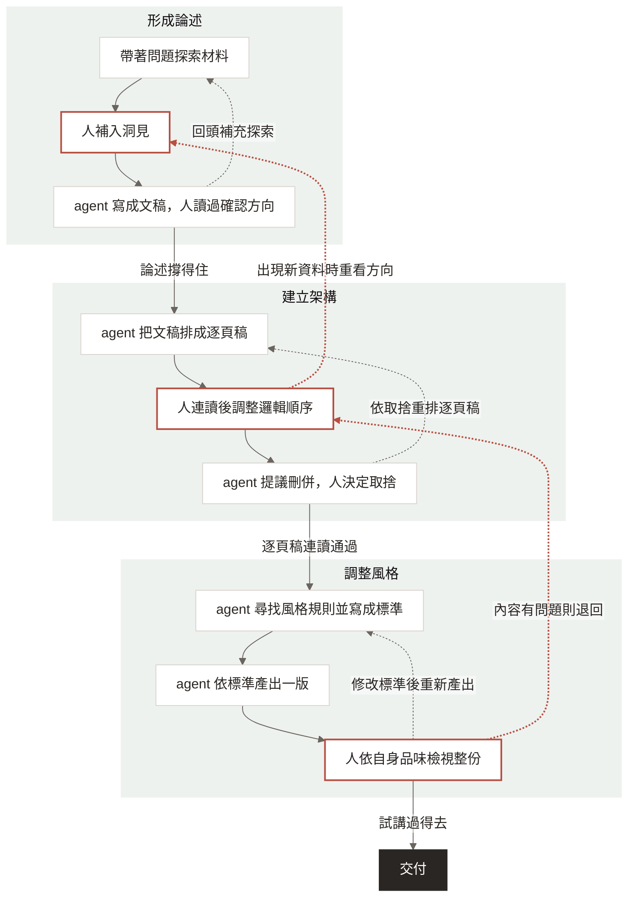

# 三個迴圈

> 正本。版本 v2，2026-09-09。流程圖來源在本檔「流程圖」一節。

## 一句話

內容不是一次寫成的，會走三個迴圈：先形成論述，再建立架構，最後調整風格。每一圈以自己的產物收尾，產物就是這一圈的檢驗。

## 三圈

| 圈 | 人做的事 | agent 做的事 | 產出物 | 通過標準 |
|---|---|---|---|---|
| 形成論述 | 定方向：通讀材料，補入洞見 | 探索材料，順著討論長成文稿 | 文稿 | 文稿讀過，論述撐得住 |
| 建立架構 | 順邏輯：連讀標題，決定刪併 | 把文稿排成逐頁稿，提刪併建議 | 逐頁稿 | 只讀標題連讀能講完 |
| 調整風格 | 看風格：依品味檢視整份 | 找規則寫成標準，依標準整份產出 | 成品 | 整份像自己，試講過得去 |

## 共同形狀

每圈同一個形狀：拿判準 → agent 產出 → 人檢查 → 通過，或改了再產，或退回前一圈。檢驗一道比一道具體、也一道比一道貴，所以便宜的先做：文稿與逐頁稿留在 Markdown，成品才進 PPTX。

## 流程圖

要出圖時把這段複製成 `.mmd` 再跑 `assets/week2-diagrams/build_three_loops_mermaid.sh` 的做法。

## 回頭的路

- 圈內：補充探索、重排逐頁稿、修改標準後重新產出。
- 跨圈：出現新資料時從建立架構退回形成論述；成品看到內容問題從調整風格退回建立架構。不在成品上手改。

## 版本紀錄

| 版本 | 日期 | 改了什麼 | 為什麼 |
|---|---|---|---|
| v1 | 2026-09-08 | 兩圈改三圈，定名確認方向、建立架構、調整風格；圖改 mermaid 直式 | 內容確定後還要讓交付物對齊自己的判準，成為第三圈 |
| v2 | 2026-09-09 | 第一圈改名形成論述；通過標準改「論述撐得住」 | 學員反映「方向」像想到的虛概念，但產出物文稿是有背景、邏輯與故事的具體東西；論述與文稿同物。第二週已發布的教材仍用確認方向，不回改 |

候選改動（未定，見 `工作紀錄.md` 待消化）：前加「累積」圈；回存作為每圈末步。
